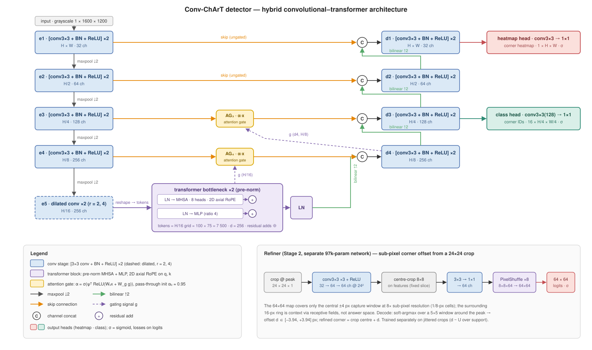

# Conv-ChArT architecture



Three stages. Stage 1 detects corners and reads identities from a single network. Stage 2 refines each corner to sub-pixel on the native sensor crop. Stage 3 turns detections into a pose through a lattice-consistency gate and classical PnP.

Stages 1 and 2 are the networks in the figure above; Stage 3 is the classical decode:

```
STAGE 3 — Inference pipeline (dcc/pipeline.py:detect) — pure functions, no training deps
──────────────────────────────────────────────────────────────────────────────────────────
  peaks (3x3 max-pool equality, tau_hm) -> merge_close (NMS radius 2 px)
    -> cut_crops (sensor frame, border peaks bypass Stage 2) -> Refiner -> soft_argmax -> xy_sensor
    -> read_ids (grid_sample on the class map, align_corners=False) -> per-corner index + confidence
    -> undistort (cv2.undistortPoints) -> pinhole-space corners
    -> lattice_gate (RANSAC-fit canonical-lattice -> image homography) -> inliers / demoted IDs
    -> recover (project the 16 canonical corners through H; ID-less detections within tol inherit)
    -> pnp (cv2.solvePnPGeneric, SOLVEPNP_IPPE) -> rvec, tvec, reprojection RMS, ambiguity flag
```

The refiner's soft-argmax readout follows integral pose regression [Sun2018]: a probability-weighted centroid over a small window around the hard argmax, not a hard argmax itself — a few lines of code, no reference implementation needed, chosen so the sub-pixel offset stays differentiable in training even though nothing downstream currently backpropagates through it.

**Why the hybrid trunk.** Convolutions ([Ronneberger2015]-style paired 3×3 blocks, with a dilated-convolution pair [Yu2016] added at the final encoder stage to cheaply widen its receptive field before the bottleneck) supply high-resolution, translation-equivariant features for localisation; the class head's identity read needs board-scale context (adjacent-marker radius ≈ 0.85$s$, full context propagation 1.85–2.85$s$, i.e. up to ≈ 365 px at $s=128$) that a conv-only stack cannot reach — its theoretical receptive field is ≈ 164 px and its *effective* RF is a Gaussian fraction of that ($\sigma \approx 31$ px, usable radius ~31–62 px) [Luo2016], further shrunk by skip dominance and ReLU. The two pre-norm MHSA blocks [Vaswani2017] at the H/16 bottleneck are the closure: after them, only three convolutions and one bilinear upsample separate attention output from class logits, none of which can destroy global content [Chen2021]. The decoder upsamples with bilinear interpolation + 3×3 conv at every stage, never a transposed convolution — stride-periodic checkerboard artifacts would beat directly against this system's own checkerboard target [Odena2016].

**Why two factorised heads.** [Hu2019]'s localisation/identity split is the organising idea this whole detector extends to a single-shot, board-scale-context-aware network: localisation reads skip-rich full-resolution features; identity reads globally-mixed context at H/4. "Corner present, ID unknown" stays expressible (heatmap high, all 16 class channels low) — essential in the dark/blur regime the system targets. Both heads use CornerNet/CenterNet-style penalty-reduced focal loss on Gaussian-splatted targets (max-combined across corners, never summed) [Law2018] [Zhou2019]:

$$
L = \underbrace{-\tfrac{1}{N}\sum_{xy}\Big[(1-\hat p)^{\alpha}\log \hat p\Big]_{Y=1} + \Big[(1-Y)^{\beta}\hat p^{\alpha}\log(1-\hat p)\Big]_{Y\neq 1}}_{L_{hm},\ \sigma_{hm}=2\text{ px}} \;+\; \lambda_{cls}\underbrace{\sum_{k} L_k}_{L_{cls},\ \sigma_{cls}=1\text{ cell (H/4)}}, \qquad \alpha=2,\ \beta=4
$$

$N$ is the batch-total count of visible corners, clamped $\geq 1$ (handles all-negative batches with no special case); $\hat p$ are predicted probabilities, $Y$ the rendered targets. The implementation computes this in **logit space** (`torch.nn.functional.logsigmoid`) so it is finite and NaN-free under bf16 near forced-1.0 peaks — `dcc/losses.py:focal`.

**2D axial RoPE** [Su2021] [Heo2024] rotates Q/K per head so the attention dot product depends only on content and relative offset $(\Delta\text{row}, \Delta\text{col})$ — translation-equivariant by construction. Per axis, $n = d_h/4 = 8$ frequencies are spaced **geometrically in wavelength**, not in the standard RoPE base-exponent form: $\omega_i = 2\pi/\lambda_i$, $\lambda_i$ geometric on $[2.5,\ 2\!\cdot\!\max(H',W')]$ cells ($H'\times W' = 75\times 100$ at native res, 16-px cells). This is a deliberate departure from a textbook `rope-vit` lift: standard RoPE's fastest wavelength is $2\pi\approx 6.28$ cells for *any* base, so the spec's own "span from 2 cells" requirement is unsatisfiable by the textbook parameterisation; wavelength-anchoring hits it directly (2.5 rather than exactly 2, to clear the Nyquist-degenerate sign-alternation at $\lambda=2$). The long end guarantees no aliasing: $\lambda_{\max}\geq 2\!\cdot\!\max(H',W')$ cells makes the slowest pair's phase injective over every in-frame offset, so the full 8-frequency phase code never repeats for two distinct in-grid positions (`dcc/model.py:AxialRoPE`, locked by `tests/test_model.py::test_rope_no_global_alias`).

**Attention-gated skips** [Oktay2018] gate only the H/4-and-coarser skips (`gate3`, `gate4`); the H/2 and full-resolution skips feeding the heatmap head are **always ungated**. Rationale: a corner whose identity is lost to a closed gate falls back to ID-less and is recovered by the Stage-3 lattice projection — recoverable. A corner vetoed at full resolution by a learned "looks like board" gate is gone before any recovery mechanism can see it — unrecoverable, and exactly where the 3–7 px motion/Gaussian-blur augmentation range hides junction energy at H/2 scale. Gates initialise to pass-through: `psi.weight = 0`, `psi.bias = +3.0` ⟹ $\alpha_0 = \sigma(3)\approx 0.953$ exactly constant at step 0 (the zero weight kills all input-dependence outright), yet `psi.weight` still receives gradient from the very first step (no dead-gate trap) — `dcc/model.py:AttnGate`, verified live at native resolution (`gate3_alpha_mean = gate4_alpha_mean = 0.953125` in `runs/smoke/metrics.jsonl`).

**No differentiable PnP.** Synthesis provides exact intermediate labels (corner position, index, visibility); pose supervision would be sparse and ill-conditioned at the planar two-fold ambiguity. Training stays modular on intermediates (heatmap, class map, refiner offset); PnP stays classical (`cv2.solvePnPGeneric`, `SOLVEPNP_IPPE` [Collins2014]) with intrinsics supplied only at inference.

**Deployment target**: NVIDIA Jetson AGX Orin, INT8/fp16 TensorRT engines exported from the fp32/bf16-trained checkpoint (a parity gate — corner error Δ < 0.05 px, ID accuracy Δ < 0.1 % on 1k val images — must pass before an exported engine is trusted). All development, training and evaluation run at full precision on an RTX 5090; no quantisation happens during development. At 15 Hz pose (a 66 ms/frame budget for one lit+dark differencing pair), a measured 833 GFLOPs/frame puts the Orin at 42–83 ms in fp16 (marginal) and 21–42 ms in INT8 (comfortable).
