# Conv-ChArT -- complete reference for the thesis (report branch)

Assembled by `tools/build_report_reference.py` on 2026-10-10 from `paper/results_rev6/`. **Part A** is the facts-of-record document verbatim (every number traceable to a file; Section 19 lists where older documents disagree). **Part B** holds every figure, table and record of the results tree, by study, with pre-release material labelled *historical*. **Part C** indexes every file. Every embedded figure is also a file in `figures/` (name = `<section>__<original>`), and the table under Part C maps each back to its source. Release models of record: `rel_w25_lam2_100k_rev6` (222k), `rel_w375_lam15_100k_rev6` (502k), `rel_w882_c2_100k_rev6` (882k), refiner `ref_s15_10k_rev6`.


## Part A -- Facts of record (verbatim, `00_FACTS_FOR_REPORT.md`, 2026-10-09)

<sub>included verbatim from `paper/results_rev6/00_FACTS_FOR_REPORT.md`</sub>


Compiled 2026-10-09 for Kaelin's honours report. **Everything here is what is true now**: every number was
read from the named file, config, checkpoint or code on the day of writing, and the release models are the
only source of headline numbers (`CLAUDE.md` pin of 2026-08-05). Where an older document, table or the
paper itself disagrees with the artefacts, that is listed in Section 20 rather than silently corrected.

Conventions: `px` are input pixels of the 640x480 frame; `s` is the board square's apparent size in px;
`pp` is percentage points; "full val" is the fixed 10,000-sample validation set; "B1" is the corrected
1000-frame pose benchmark `eval_pose_rev6_b1`. Paths are relative to `dense deep charuco/`; results live
under `paper/results_rev6/` (abbreviated `R6/`).

---

#### 1. What the system is, and what it is for

- **Task**: detect, identify and sub-pixel-localise the 16 inner corners of a 5x5 ChArUco board in one
  640x480 grayscale frame, then solve the board's pose or **refuse**. Output signature (paper eq. 1):
  a set of (position, identity-or-none) pairs plus a pose or an explicit refusal.
- **Target platform** (`docs/PROJECT_KNOWLEDGE.md` §1): a barrier-docking robot with a Jetson AGX Orin,
  an OV2311 global-shutter monochrome sensor and 940 nm active illumination. Deployment frames are
  **lit-minus-unlit differences**, so blur, glare, ghosting and heavy sensor noise are first-class
  conditions. Latency budget 66 ms per frame (15 Hz pose from 30 fps lit/dark pairs; `R6/15_cost`).
- **Three stages** (`docs/ARCHITECTURE.md`, `dcc/pipeline.py:detect`):
  1. detector network: corner heatmap at full resolution + 16-channel class map at H/4;
  2. refiner network: 24x24 crop around each coarse peak -> 64x64 logit map -> 5x5 soft-argmax;
  3. geometry: class-map readout at the coarse peaks, undistort, RANSAC lattice-homography gate,
     ID recovery, IPPE PnP; typed refusals.
- **Training is 100% synthetic**, generated on the fly; no real image is labelled (`README.md`, paper §4.1).

#### 2. The board

Source: `configs/abl_c2_wh_clsfocal_lam2.yaml` (`board:`), `dcc/board.py`, `R6/31_print_board/README.md`.

| fact | value |
|---|---|
| geometry | 5x5 squares, 16 inner corners (`(nx-1)^2`); square boards only (asserted) |
| markers | 12 ArUco markers from `DICT_5X5_50`, ids 0-11 in raster order, in the white squares |
| marker/square ratio | 0.7 |
| pattern | cv2 4.10 `CharucoBoard`, non-legacy pattern: top-left square black |
| physical size | **not fixed** (`square_length_m: null`); the detector works on apparent size `s` |
| apparent-size envelope | trained `s` in [12, 128] px, log-uniform; measured bands: core 32-128, usable 16-128, degraded 10-160 (`R6/17_range/working_range.json`) |
| range formula | `z = f_px * S / s` (S = square edge in metres, f_px at the 640x480 input) |
| print-ready file | `R6/31_print_board/DICT_5X5_50_5x5_24mm.pdf` (A4, 24 mm squares, 120 mm edge); `tools/print_board.py --square-mm` for other sizes; verified by detecting all 12 markers and 16 corners on the rasterised PDF, edge 120.02 mm |
| working range at 120 mm (core band, OV2311 at 640x480) | 3 mm lens 0.08-0.34 m; 4 mm 0.10-0.40; 6 mm 0.15-0.60; 8 mm 0.20-0.80; 12 mm 0.30-1.20 m; range scales linearly with the edge |
| other dictionaries | same-family `_100/_250/_1000` variants share their first 50 markers with `_50`, so they are the same board; a different family (e.g. `DICT_6X6_250`) is a new board (`R6/27`) |
| other corner counts | 4x4 (9), 6x6 (25), 7x7 (36) boards verified end to end: config change plus a fresh class head; render resolution must divide by the square count (`R6/30_REPORT…/REPORT.md` §5) |

#### 3. The release models

Source: `docs/TOOLING.md` (release table), checkpoints' own `cfg`, parameter counts recomputed from
`dcc/model.py` on 2026-10-09.

| tier | checkpoint | config | params | width_mult | XSA | heatmap loss | class loss | lambda_cls |
|---|---|---|---:|---|---|---|---|---|
| **882k (reference)** | `runs/rel_w882_c2_100k_rev6/ckpt_0100000.pt` | `configs/abl_c2_wh_clsfocal_lam2.yaml` | 882,402 | 0.5 | off | one-hot BCE | focal, Gaussian sigma_cls 1.0 | 2.0 |
| 502k | `runs/rel_w375_lam15_100k_rev6/ckpt_0100000.pt` | `configs/rel_w375_lam15.yaml` | 502,322 | 0.375 | off | one-hot BCE | one-hot BCE | 1.5 |
| 222k | `runs/rel_w25_lam2_100k_rev6/ckpt_0100000.pt` | `configs/rel_w25_lam2.yaml` | 222,138 | 0.25 | **on** | one-hot BCE | one-hot BCE | 2.0 |
| refiner (shared) | `runs/ref_s15_10k_rev6/ckpt_0010000.pt` | `refiner_train:` block of the same configs | 97,056 | — | — | focal, Gaussian sigma_ref 1.5 | — | — |

- The three detector configs differ in exactly four leaves: `width_mult`, `xsa`, `lambda_cls`,
  `loss_form_cls` (verified by flattening all three; everything else, generator included, is identical).
- The class head falls back to the heatmap form when `loss_form_cls` is absent (`dcc/losses.py:71`,
  `cls_form = loss_form_cls or loss_form`), which is why 222k and 502k are BCE on both heads.
- `e4_dilated: false`, `attend_div 8`, `attn_blocks 2`, `attn_heads 8`, `rope_lambda_min_cells 2.5`,
  `gates: true`, `sigma_hm 0.5`, `sigma_cls 1.0`, `tau_hm 0.3`, `tau_id 0.5`, `lattice_tol_px 3.0` in all three.
- Full pipelines (detector + refiner): 979,458 / 599,378 / 319,194 parameters.
- **Names**: the paper names tiers by parameter count. "Conv-ChArT" / "Conv-ChArT-FAST" in the conference
  material (`R6/15_cost`, `R6/03_robustness_FAST`) are the 882k-class and 222k-class architectures at
  ablation-era checkpoints (35k / 45k steps), **not** the release checkpoints.
- **The 4,698,034-parameter `rev640` model** (`runs/rev640_160k_rev6`, dilated e4 cascade, width 1.0,
  attention d = 256) is the pre-ablation predecessor. It appears in provenance and in explicitly historical
  comparisons (A1 conv-only, the loss decomposition, `R6/03_robustness`, `R6/06_tables`,
  `R6/07_introspection`) and must not be presented as the architecture.

##### 3.1 Parameter distribution of the 882k reference (recomputed; matches paper Table 1 exactly)

| module | params | share |
|---|---:|---:|
| `blocks` (2 transformer blocks) | 396,544 | 44.9% |
| `e4` | 221,696 | 25.1% |
| `d3` | 110,720 | 12.5% |
| `e3` | 55,552 | 6.3% |
| `cls` head | 37,968 | 4.3% |
| `d2` | 27,712 | 3.1% |
| `e2` | 13,952 | 1.6% |
| `d1` | 6,944 | 0.8% |
| `gate3` | 6,209 | 0.7% |
| `e1` | 2,512 | 0.3% |
| `hm` head | 2,337 | 0.3% |
| `norm` (final LayerNorm) | 256 | 0.0% |
| **total** | **882,402** | |

The bottleneck is 45% of the parameters; the two heads together are under 5%.

#### 4. Architecture, exactly as built at width 0.5 (882k)

Source: `dcc/model.py`, instantiated from the 882k config on 2026-10-09; `docs/ARCHITECTURE.md`;
`R6/10_receptive_field/receptive_field.md`; `R6/11_attention_gate/attention_gate.md`.

- **Input**: 1x480x640 grayscale. **Outputs**: heatmap logits 1x480x640, class logits 16x120x160 (H/4).
- **Encoder** (each stage two 3x3 Conv-BN-ReLU, 2x2 stride-2 pooling between stages):
  `e1` 1->16->16, `e2` 16->32->32, `e3` 32->64->64, `e4` 64->128->128 (plain convolutions; the dilated
  r=2,4 pair of the 4.7M design is removed). Channel widths at width 0.5: 16/32/64/128.
- **Attention bottleneck** on the H/8 map: 80x60 = 4,800 tokens, **d = 128**, 8 heads, **head_dim 16**,
  MLP 128->512->128 (ratio 4), pre-norm LayerNorm eps 1e-6, qkv bias on, no dropout, no class token, no
  patch embedding, no absolute position embedding. Two blocks.
- **Axial RoPE** (`dcc/model.py:AxialRoPE`): rotates Q and K only; per axis `n = head_dim // 4 = 4`
  frequencies (cos/sin buffers are 4800 x 8: 4 row + 4 col phases), wavelengths geometric from
  `lambda_min` 2.5 cells to `lambda_max = 2 * max(h, w) = 160` cells; the slowest pair cannot complete a
  half-cycle inside the grid, so the phase code is injective over all in-frame offsets
  (`tests/test_model.py::test_rope_no_global_alias`). Buffers are fp32 and not serialised.
- **XSA** (222k tier only): exclusive self-attention, a token is excluded from its own attention
  distribution; parameter-free (paper §3.2).
- **Attention gate** `gate3` on the H/4 skip only: `W_x` 1x1 stride-2 64->32 (no bias), `W_g` 1x1
  128->32, `psi` 1x1 32->1, sigmoid, bilinear upsample, broadcast over the skip's channels; 6,209 params
  at width 0.5. Initialised pass-through: `psi.weight = 0`, `psi.bias = +3.0`, alpha = sigmoid(3) = 0.9526
  everywhere at step 0. H/2 and full-resolution skips are never gated (a wrong veto there is unrecoverable).
- **Decoder**: bilinear upsample + 3x3 conv with skip concatenation: `d3` 192->64, `d2` 96->32, `d1` 48->16.
- **Heads**: `hm` 16->16 (3x3) -> 1 (1x1) at full resolution; `cls` 64->64 (3x3) -> 16 (1x1) at H/4.
  Final logit convolutions bias-initialised to -2.19 (CornerNet/CenterNet value; not re-derived for this
  task's 5.2e-5 positive rate, paper §3.2).
- **Receptive field** of the conv path to the bottleneck (kernel/stride structure is width-independent):
  theoretical 68 px without the dilated pair (release), 164 px with it (4.7M); Luo effective radius
  ~21 px / ~45 px. The adjacent marker sits ~0.85 s from a corner (10-109 px over the envelope), so at
  large `s` only the attention can supply identity (`R6/10_receptive_field`).
- **Refiner** (`dcc/model.py:Refiner`, 97,056 params): 3x3 conv 1->32, 32->64, 64->64 on the 24x24 crop,
  centre crop to 8x8, 3x3 64->64, 1x1 64->64 logits, PixelShuffle(8) -> 64x64 map over the central 8x8 px
  at 8x; decoded by a probability-weighted centroid over the 5x5 window around the argmax; no resize
  operator in the graph. Jitter range +/-4 px (`refiner_jitter_px 4`).
- **Not trained anywhere**: the `attend_div=16` native-resolution variant (1600x1200, `e5`, `gate4`, `d4`)
  described in `docs/ARCHITECTURE.md` and `configs/default.yaml`.

#### 5. Stage 3: from maps to a pose or a refusal

Source: `dcc/pipeline.py` (constants read 2026-10-09), `docs/ARCHITECTURE.md`, `CLAUDE.md` pins.

1. `peaks`: 3x3 max-pool equality and `hm >= tau_hm` (0.3), descending score, capped at `top_k` 64.
2. `merge_close`: drop any peak within 2.0 px of a kept higher-score peak.
3. `cut_crops`: 24x24 crops on the sensor frame; border peaks bypass the refiner.
4. Refiner + `soft_argmax` (5x5 window). **Confidence guard** `refine_min_peak` 0.3 on the refiner's own
   peak sigmoid: below it the coarse peak is kept. Measured (n = 6,421, `R6/02_refiner/guard_sweep.json`):
   the refiner is worse than the coarse peak on 16.3% of crops, 55% of those featureless (std < 15);
   the guard fires on 13.8%, is right 69.5% of the time, and takes refinement p95 from 3.011 to 0.761 px
   while the median moves 0.1014 -> 0.1026 px (coarse-only: 0.4244 / 0.8449). Image-statistic guards
   lost to it. Disabling the guard made fp16 divergence worse (3.35 vs 0.81 px max), so it also
   stabilises deployment.
5. `read_ids`: bilinear `grid_sample` on the class map at the **coarse** peak positions
   (`id_readout="coarse"`, +0.20 pp measured; one H/4 cell is 4 px so sub-pixel carries no identity);
   `tau_id` 0.5 for an identity to be accepted. The whole identity chain (gate and recovery) runs on the
   coarse coordinates, so refined and unrefined arms are bit-identical in identity (2054/2054 verified).
6. `undistort` (`cv2.undistortPoints`) with K and dist; with no intrinsics the pose is refused
   (`no_intrinsics`) rather than guessed.
7. `lattice_gate`: RANSAC homography from identified corners to the canonical lattice, tolerance
   `lattice_tol_px` 3.0. Guards: fewer than 4 identified -> `too_few`; collinear canonical points ->
   `collinear`; exactly 4 -> fit is `vacuous`; 5 or more -> dissenters demoted.
8. `recover`: project all 16 canonical corners through H; an ID-less detection within tolerance inherits
   the identity. A vacuous fit with no corroborating recovery is refused (`vacuous_uncorroborated`).
9. `pnp`: `cv2.solvePnPGeneric` with `SOLVEPNP_IPPE` on the refined, undistorted points; returns
   rvec, tvec, reprojection RMS, `ambiguous = err2 / err1 < 1.5` (the planar two-fold flip), `n_used`.
   Failure -> `pnp_solver_failed`; fewer than 4 correspondences -> `too_few_correspondences`.
- Refusal reasons seen on B1 (882k): `too_few` 60, `collinear` 2, `pnp_solver_failed` 2 of 1000; the
  ambiguity flag fires on 43 of 936 solved frames (4.6%); 502k: 38/923 (4.1%); 222k: 38/900 (4.2%).
- The pipeline is pure functions with no training dependencies; PnP stays classical (no differentiable PnP,
  by design: synthetic labels give exact intermediates, and pose supervision is ill-conditioned at the
  planar ambiguity).
- Known unguarded path: `recover` divides by the projected homogeneous coordinate without a guard; with the
  degenerate homographies a foreign board produces this emitted RuntimeWarnings (`R6/27` README). Not
  reachable with a sane H; surfaced, not fixed.

#### 6. Supervision

Source: `dcc/losses.py`, release configs, paper §3.3, `R6/12_loss/loss_formulation.md`.

- **Targets** (`dcc/targets.py` via `R6/12_loss`): per-corner Gaussians combined by **max** (never sum),
  peak pixel forced to exactly 1.0 at `rint(p_i)`; heatmap at full resolution with `sigma_hm` 0.5 px;
  class map at H/4 with `sigma_cls` 1.0 cell (cell coordinate `(x+0.5)/4 - 0.5`). Only visible corners
  are splatted; an illegible but visible corner keeps its true index (labelling is geometric).
- **Heatmap loss (all tiers)**: `strict_bce` = `binary_cross_entropy_with_logits` against `y == 1.0` as
  the positive set, every other pixel an equally-wrong negative. A BCE arm is therefore invariant to
  `sigma_hm` (only the forced peak pixel matters).
- **Class loss**: 882k uses the CornerNet penalty-reduced focal loss in logit space, alpha = 2, beta = 4,
  against the Gaussian class target; 502k and 222k use `strict_bce` on the class map too.
- **Total**: `(L_hm + lambda_cls * L_cls) / max(sum of visible corners in the batch, 1)`; one shared
  normaliser for both heads; sum reduction inside each head; all in fp32 logit space (the naive
  `log(1 - p)` form NaNs under bf16 near forced peaks).
- **Refiner loss**: focal (alpha 2, beta 4) on a 64x64 Gaussian target, `sigma_ref` 1.5, peak forced at
  `rint(u*)`, `u* = 31.5 + 8 d`, `d` in [-3.9375, 3.9375] px.
- `loss_kwargs(cfg)` is the single resolution point for form/alpha/beta (precedence `focal_beta` ->
  `beta` -> 4); an invalid form string asserts at step 0 (a `"bce"` typo once trained a full arm on the
  wrong loss).

#### 7. Training configuration

Source: the release checkpoints' embedded `cfg` (`train:` and `refiner_train:` blocks), `runs/*/metrics.jsonl`,
`tools/train_detector.py`, `docs/TOOLING.md`, paper §3.5 and Appendix A.

| setting | detector (all three tiers) | refiner |
|---|---|---|
| step budget | **100,000** (the checkpoints' own `train.steps` is 100000; the generic YAML default of 250000 was overridden at launch) | 10,000 |
| batch | 16 x accumulation 2 (effective 32) | 256 (checkpoint cfg; **the paper's Table 2 says 512**, see §20) |
| optimiser | AdamW, betas (0.9, 0.999), peak LR 3e-4, floor 3e-6, cosine anchored to the budget, 1000 warmup steps | AdamW, LR 1e-3 -> 1e-5, 200 warmup |
| weight decay | 1e-4, excluding biases and normalisation parameters (`dcc/trainutil.py:param_groups`) | 1e-4 |
| gradient clip | 5.0 | 5.0 |
| EMA | 0.999, the EMA weights are what is validated and shipped | 0.999 |
| precision | bf16 autocast, fp32 master weights, `channels_last` | same |
| loader | spawn context, 12 workers, prefetch factor 4, `cv2.setNumThreads(1)` per worker (fork measured 7x slower: 55 vs 404 samples/s) | 8 workers |
| validation | every 2,500 steps on a fixed 2,000-sample subset; every 25,000 steps on the full 10,000-sample set (`val_every`, `full_val_every`); checkpoints at the full-val cadence | every 1,000 steps |
| seeds | `train_seed` 2000, `val_seed` 1000, `pose_seed` 3000; stream seed = `train_seed*1000 + resume_count` | — |
| early stopping | config block present (`min_steps 162000`, patience 3, tail gate 0.01) but never reached: the runs ended at their 100k budget | — |
| wall time on the RTX 5090 (first to last `metrics.jsonl` stamp) | 882k 8.38 h, 502k 8.41 h, 222k 9.36 h (resumed once) | 1.75 h |
| git hash in the checkpoints | `7aea0d4` | — |
| software | PyTorch 2.8.0+cu129, OpenCV 4.10.0, onnxruntime 1.28.0 (MLWS env) | |
| hardware | RTX 5090 32 GB, Intel Core Ultra 9 285K (24 cores), 62 GB RAM | |

- Throughput is **generation-bound on the CPU**, not GPU-bound: `generate_sample` costs ~86.5 ms per
  sample per core (~11.6 samples/s per worker; `R6/08_ablations/00_QUEUE_AND_DECISION_RULE.md`); the
  reference run averaged 67 samples/s solo, two arms ~127 aggregate; 16 workers exhausted 62 GB RAM and
  hard-locked the machine twice, so 12 (or 8 per concurrent arm) is the standing limit.
- **The last 25k steps were not worth it**: 75k -> 100k moved p95 by -0.0019 px (882k, 0.95x its seed
  floor) and -0.0024 (502k, 0.4x); the tail moved the wrong way on 882k. Recorded as a stop-rule lesson
  (`PLAN_autonomous_campaign.md`, 2026-08-04).
- **Release-run full-val trajectory** (median / p95 px, M-04; `runs/*/metrics.jsonl`):

| step | 222k | 502k | 882k |
|---|---|---|---|
| 25,000 | 0.4162 / 0.7597, 97.66% | 0.4105 / 0.7144, 98.87% | 0.4085 / 0.6945, 99.29% |
| 50,000 | 0.4140 / 0.7431, 98.85% | 0.4088 / 0.6977, 99.25% | 0.4072 / 0.6829, 99.42% |
| 75,000 | 0.4131 / 0.7368, 99.01% | 0.4078 / 0.6909, 99.39% | 0.4066 / 0.6752, 99.54% |
| 100,000 | 0.4128 / 0.7337, 99.09% | 0.4077 / 0.6885, 99.41% | 0.4063 / 0.6733, 99.53% |

- **Resume semantics** (fixed 2026-08-04): resume diffs the checkpoint's own config against the live one
  and warns when the cosine budget moved (`warn_cfg_drift`); `resume_count` increments per resume;
  `save_ckpt` writes then renames. Deep ChArUco's trainer once saved `resume_count` as a literal 0 (latent,
  the shipped baseline resumed only once and is clean).
- **Generator fingerprint lock** (`tests/test_guards.py`): a content hash of the generator sources plus the
  config subset that shapes their output is recorded with every checkpoint; training refuses to start if
  either drifted since the last green `tools/audit.py` run. Preflight (`tools/preflight.py`) predicts the
  init loss analytically from the resolved loss form (fixed 2026-08-05: it used to hardcode focal and
  passed CE arms whose real init loss was 89x what it compared against).

#### 8. The synthetic data generator (rev-6)

Source: the 882k config's `synth:` block (identical in all tiers), `dcc/synth.py`, `R6/14_data/augmentations.txt`,
`docs/TOOLING.md`, paper Appendix B, `memory.md` (rev-6 entry, 2026-07-29).

- **Pipeline per sample**: render the board (`render_res` 480) -> sample a homography (affine: scale so
  `s` is log-uniform in [12, 128] px, in-plane rotation up to 180 deg, shear up to 35 deg, translation up
  to 0.45 of the frame; perspective with probability 0.8: tilt up to 60 deg about a random axis,
  `fov_scale` [0.7, 1.4]) -> warp onto a COCO train2017 background (118,287 images, random crop,
  horizontal flip p 0.5, rotation, reflect-pad) with histogram matching -> **scene integration**
  (relight by the background's blurred luminance, sigma 0.125 of min(w,h), clipped [0.45, 1.7]; edge
  feather 0.9 px; contact shadow offset [0.005, 0.03], strength [0.15, 0.5]) -> occluders (rectangles
  p 0.55, 1-6 holes of 16-64 px; SAM2 real-object cutouts p 0.5, up to 3, scale [0.08, 0.5] of the frame,
  from a bank of 14,721 RGBA cutouts cut from 3,000 COCO images) -> photometrics in a pinned order ->
  grayscale.
- **Corner labels are computed through the same homography**, never from pixels; visibility is geometric
  only (in frame and outside every occluder); photometric degradation never changes a label.
- **Negatives**: 5% of frames contain no board (`negative_p 0.05`).
- **Photometric stages and probabilities** (config values): specular lobe p 0.15 (strength 30-150,
  exponent 20-200); adherent droplets p 0.1 (1-4, refractive or bokeh mode); vignette p 0.5 (0.05-0.25);
  NIR ink-contrast jitter p 0.3 (scale 1.0-1.3); brightness p 0.5 (range -0.6..0.3, floor -0.58);
  contrast p 0.5 (0.8-1.2); glare p 0.25 (peak 30-130); ghosting p 0.25 (alpha 0.05-0.2, shift 1-4 px);
  RGB shift p 0.5 (limit 10); multiplicative field p 0.5 (0.98-1.02); motion blur p 0.5 (kernel up to 5);
  Gaussian blur p 0.25; Gaussian noise p 0.5 (std 3.2-7.1 DN); Poissonian-Gaussian sensor noise on
  (3-30 e-/DN, read noise 1-3 DN); fixed-pattern noise p 0.3 (column std 0.3-1.2) with PRNU p 0.5
  (0.005-0.015); speckle implemented but disabled (p 0); dark grey-out for deep-exposure frames.
- **Differencing domain** (`differencing_p 0.1`): a lit/unlit pair with daylight pedestal (ambient
  0.05-0.95), LED illumination lobe (peak 0.25-0.9, floor 0.05-0.3, sigma 0.25-0.45 of the frame),
  auto-exposure to target 250, inter-frame shift 0.2-3.0 px; the lit-minus-unlit difference is the frame.
  It fires on 10% of frames: it is the deployment domain, not the default one. Saturated lit regions
  produce physically-correct contrast-inverted residue (`dcc/synth.py`).
- **Severity calibration**: centred on an OV2311-class industrial camera (global shutter, monochrome,
  940 nm bandpass, no consumer ISP); the 2026-07-28 realism audit reduced several ranges (e.g.
  multiplicative noise from +/-5% to +/-2%, ghost alpha from 0.5 to 0.2).
- **Delivered SNR**: noise is drawn per BGR channel before the grayscale conversion, so the delivered
  frame carries 0.6686x the modelled sigma (measured 0.6676-0.6789): reported SNR is of the delivered
  frame and is 3.50 dB better than the per-channel formula implies. Documented and accepted, not changed
  (a change would be a generator revision requiring a full retrain).
- **Validation sets**: `SynthVal` = 10,000 samples from `val_seed` 1000, stratified by `s` octave;
  refiner val from `val_seed + 1`; bit-identical across processes for a fixed `{numpy, cv2, skimage}`
  version set (`tools/audit.py` gate 5).
- **Refiner stream**: 24x24 crops around corners jittered by +/-4 px; 92% of crops from a fast
  per-window render path matched to the full compositor, 8% (`refiner_full_frac 0.08`) from full
  composites; up to 8 corners per composite; `refiner_res_mult 2.5`; 1,250 validation composites.
- **Generator history** (what the results of record do NOT include): rev-2 augmentation pack (2026-07-28);
  rev-3 daylight differencing (retired and purged, "features nowhere"); rev-4 standard; rev-5 realism
  audit; **rev-6** (2026-07-29): the board is lit into the scene (relight, feather, shadow) and occlusion
  raised (p 0.40 -> 0.55, cutouts 0.35 -> 0.50). Every rev-5 number is stale; rev-5 was an *easier*
  distribution (the same model scored 0.7470 / 99.64% on rev-5 vs 0.8129 / 98.98% on rev-6), so nothing
  may be compared across generator revisions. `paper/results_rev5/` is kept for the record only.
- **Acceptance gates** (`tools/audit.py`, 7 gates): s-octave flatness within 20%, negative fraction within
  +/-0.005 of 0.05, occlusion incidence, warp round-trip < 0.01 px by an independently re-derived
  homography, subprocess byte-identical repeatability over 50 samples, refiner jitter histogram flat
  within 25%, refiner crops re-refined by `cv2.cornerSubPix` within median 0.10 / p90 0.50 px.

#### 9. Evaluation protocol

Source: paper §4.1, `tools/train_detector.py` (M-01..M-04), `tools/eval_pose_ours.py`, `tools/robustness_sweep.py`
provenance blocks, `tools/gen_eval_pose.py`, `R6/23_code_audit_FINDINGS.md`.

- **M-01** localisation error of matched corners, greedy nearest-neighbour matching within 8 px
  (`train.match_px`); median and p95. **Tail > 4 px**: fraction of matched corners outside the refiner's
  capture radius, the operational gate. **M-02** match ratio (recall) by `s` octave (12-16, 16-32, 32-64,
  64-128). **M-04** corner-ID accuracy **conditioned on detection**: always read it beside recall.
  **M-03** refiner error. **M-05 / M-06** pose rotation (geodesic, deg) and translation (board squares).
- The in-loop 2,000-sample validation reads ~0.1-0.2 pp optimistic against the full 10k set; all
  reported numbers are from the full set at step 100,000, EMA weights.
- **Pose benchmark B1** (`eval_pose_rev6_b1`): 1000 images from `tools/gen_eval_pose.py`, `pose_seed`
  3000, per image a pinhole with f ~ U(0.7, 1.4) x W, `s` log-uniform on [12, 128] (depth z = f/s),
  in-plane rotation, tilt up to 60 deg, accepted when at least 8 of 16 corners project in frame; the
  homography is asserted against `cv2.projectPoints` to < 1e-6 px on every image; `square_length_m`
  fixed at 1.0 (translation in board squares). **B1 is the corrected set**: the original pose generator
  omitted the board-anchored specular / ink-contrast / differencing steps and did not let droplets gate
  visibility (audit finding B1, 2026-08-05); the fix lowered every arm's solve rate (ours by 1.0 pp,
  Deep ChArUco 2.8, classical 6.9) and widened our margins. B1 still omits the SAM2 cutout occluders
  (object occlusion is measured on its own robustness axis). Use only `*_B1.json`.
- **Robustness sweep**: 20 factors, one at a time, on frames that are bit-identical across methods and
  steps (seed 20260728), match tolerance 4.0 px, refined and coarse arms both scored; release sweeps
  `R6/20_robustness_REL{222,502,882}` use n = 60 frames per step; the Deep ChArUco, classical and 4.7M
  sweeps (`R6/05_comparison`, `R6/03_robustness`) use n = 100. Ladders:

| factor | unit | steps |
|---|---|---|
| distance | board square s (px) | 12, 16, 24, 32, 48, 64, 96, 128 |
| distance_extrap | s (px), outside the trained 12-128 | 6, 8, 10, 12, 16, 64, 128, 160, 192, 256 |
| rotation | in-plane deg | 0, 30, 60, 90, 120, 150, 180 |
| tilt | out-of-plane deg | 0, 10, 20, 30, 40, 50, 60 |
| brightness | offset | -0.9, -0.7, -0.5, -0.25, 0.0, 0.35 |
| darkness | brightness rescale factor | 1.0, 0.6, 0.36, 0.216, 0.13, 0.078, 0.047, 0.028, 0.017, 0.01 |
| contrast | scale | 0.6, 0.8, 1.0, 1.2, 1.4 |
| ink_contrast | NIR ink contrast scale | 1.0, 1.15, 1.3, 1.45, 1.6 |
| vignette | strength | 0.0, 0.05, 0.12, 0.2, 0.25 |
| specular | lobe strength (DN) | 0, 60, 120, 180, 220 |
| droplets | adherent droplets (n) | 0, 1, 2, 4, 6 |
| sensor_noise_K | gain K (e-/DN; lower is noisier) | 30, 16, 8, 4, 2, 1, 0.5, 0.25, 0.1, 0.05, 0.02 |
| motion_blur | kernel (px) | 0, 3, 5, 7, 9 |
| defocus_blur | Gaussian kernel (px) | 0, 3, 5, 7, 9 |
| board_occlusion | board area occluded (%) | 0, 10, 20, 30, 40, 50 |
| object_occlusion | SAM2 object occluders (n) | 0, 1, 2, 3, 4 |
| occlusion | rectangular occluders (n) | 0, 2, 4, 6, 8, 10 |
| diff_ratio | LED peak vs ambient 0.45 | 0.9, 0.6, 0.4, 0.25, 0.15 |
| diff_ambient | daylight pedestal | 0.05, 0.2, 0.4, 0.6, 0.8, 0.95 |
| diff_ghosting | inter-frame shift (px) | 0.0, 0.5, 1.0, 2.0, 3.0 |

  The SNR axis for `sensor_noise_K` comes from `tools/snr_calibration.py` (delivered-frame SNR; the K = 0.02
  step is 8.13 dB, which the pre-correction figures reported as 4.63 dB).
- **Baselines**:
  - *Deep ChArUco* (Hu et al. 2019): the public PyTorch reference port (`tools/charuconet.py`,
    JunkyByte/deepcharuco, `dcModel`), identity head re-initialised for 16 ids + dustbin (17 outputs),
    initialised from the public checkpoint and fine-tuned on **our** rev-6 generator with the same
    early-stopping criterion as our arms, resumed once, terminated at 62,458 steps on convergence
    (`runs/charuconet_rev6_ft`, checkpoint step 62,000). Input 320x240 against our 640x480. Its RefineNet
    is **not run**, so every localisation comparison is coarse vs coarse. Its corners pass through our
    identical gate -> recovery -> PnP stage. Parameters: 1,242,259 trainable in the 17-output detector
    (plus 2,560 BatchNorm statistics); the paper quotes 1,244,572 + 1,001,420 (RefineNet) = 2,245,992 and
    the cost table 1,242,002 + 999,233 = 2,241,235 (a 16-output head, no buffers); the 2.3x / 7.0x ratios
    hold under either count.
  - *Classical*: the OpenCV ChArUco pipeline at default detector parameters (`tools/eval_classical.py`);
    it reports only corners it has already identified, so its ID accuracy is ~100% by construction and
    only its recall is informative.
- **Rule 4b**: a baseline is never stopped on a looser criterion than our own arms.

#### 10. Headline results (release models, 100,000 steps)

##### 10.1 Corner detection, full 10k validation (`runs/*/metrics.jsonl` step 100000; `PLAN…md` 2026-08-04)

| tier | params | p95 (px) | median (px) | M-04 | tail > 4 px | recall by octave 12-16 / 16-32 / 32-64 / 64-128 |
|---|---:|---:|---:|---:|---:|---|
| 222k | 222,138 | 0.7337 | 0.4128 | 99.09% | 0.0190% | 87.53 / 91.57 / 93.62 / 93.92 % |
| 502k | 502,322 | 0.6885 | 0.4077 | 99.41% | 0.0146% | 90.49 / 93.23 / 94.87 / 95.07 % |
| **882k** | 882,402 | **0.6733** | **0.4063** | **99.53%** | **0.0048%** | 91.74 / 94.02 / 95.31 / 95.61 % |

Across a 4x parameter range, in-envelope identity spans 0.44 pp and median localisation 0.0065 px; the
tiers separate on p95 (+0.060 px), tail (4.0x) and far-octave recall (-4.2 pp). The 222k tier also
differs architecturally (XSA), so the ladder is a comparison of released configurations, not a clean
capacity sweep.

##### 10.2 Pose, B1 (`R6/21_pose_REL*_B1.json`, `R6/13_pose/pose_release_vs_baselines_B1.json`)

All arms' corners go through the same `dcc.pipeline.pnp`; translation in board squares.

| arm | pipeline params | solve % | rot median / mean / p95 (deg) | trans median / mean / p95 (sq) |
|---|---:|---:|---|---|
| classical OpenCV | — | 54.4 | 0.1602 / 0.8690 / 2.3487 | 0.0200 / 0.0654 / 0.2236 |
| Deep ChArUco (fine-tuned) | 2,245,992 | 93.3 | 0.9131 / 10.6234 / **89.3603** | 0.0770 / 1.2636 / **7.2695** |
| 222k refined | 319,194 | 90.0 | 0.1269 / 0.6855 / 1.2261 | 0.0099 / 0.0691 / 0.1523 |
| 502k refined | 599,378 | 92.3 | 0.1295 / 0.5759 / 1.2297 | 0.0103 / 0.0604 / 0.1509 |
| **882k refined** | 979,458 | **93.6** | 0.1318 / **0.5368** / **1.1737** | 0.0104 / **0.0376** / **0.1282** |
| 882k coarse (no refiner) | 882,402 | 93.6 | 0.3744 / 1.1176 / 2.3424 | 0.0289 / 0.0739 / 0.2698 |
| 502k coarse | 502,322 | 92.3 | 0.3817 / 0.9507 / 2.1863 | 0.0268 / 0.0866 / 0.2577 |
| 222k coarse | 222,138 | 90.0 | 0.3762 / 1.0216 / 2.4357 | 0.0288 / 0.1006 / 0.2787 |

- Refusals (882k / 502k / 222k): `too_few` 60 / 66 / 93, `collinear` 2 / 3 / 2, `pnp_solver_failed` 2 / 3 / 2,
  `vacuous_uncorroborated` 0 / 5 / 3; ambiguous flags 43 / 38 / 38 of the solved frames.
- **Solve rate is not comparable across methods**: Deep ChArUco's 93.3% sits between our 502k and 882k, but
  its rotation p95 is 89.36 deg against 1.17-1.23 and its mean is 11.6x its median; it fails by emitting a
  confidently wrong pose where our gate refuses. Classical is accurate on what it solves and abstains on
  45.6% of frames. Even our coarse output (0.374-0.382 deg median) beats Deep ChArUco's 0.913.
- **Capacity buys the tail, not the median**: rotation median is flat (0.1269 / 0.1295 / 0.1318), the mean
  falls 0.6855 -> 0.5759 -> 0.5368 and mean translation falls 46% from 222k to 882k.
- Margins over the baselines: 882k reduces median rotation error 6.9x and p95 76x against Deep ChArUco
  with 2.3x fewer pipeline parameters; the 222k pipeline is 7.0x smaller and still better on every accuracy
  metric (paper abstract; the numbers above reproduce it).

##### 10.3 Robustness, 20 factors, identical frames (computed 2026-10-09 from the sweep JSONs; recall % / ID %)

Release tiers refined arm (n = 60/step); Deep ChArUco and classical (n = 100/step, same seed). Classical
ID is not comparable and is omitted. **A. At the final ladder step** (the most severe step for one-sided
factors; brightness and rotation sweep outward in both directions, so their final step is one end only):

| factor | final step | 882k | 502k | 222k | Deep ChArUco | classical |
|---|---|---|---|---|---|---|
| board_occlusion | 50% | 85.9 / 71.2 | 87.1 / 56.8 | 82.3 / 40.2 | 73.1 / 63.8 | 9.6 |
| brightness | +0.35 | 85.9 / 97.8 | 84.9 / 96.2 | 82.0 / 93.7 | 74.1 / 82.9 | 22.7 |
| contrast | 1.4 | 93.3 / 98.6 | 91.9 / 93.2 | 88.4 / 92.4 | 81.2 / 84.4 | 33.3 |
| darkness | 0.01 | 45.8 / 69.1 | 37.3 / 27.7 | **5.6** / 40.4 | 0.2 / 33.3 | 0.0 |
| defocus_blur | 9 px | 93.7 / 99.1 | 92.8 / 96.0 | 91.2 / 94.2 | 84.9 / 87.6 | 22.5 |
| diff_ambient | 0.95 | 92.0 / 96.9 | 88.8 / 88.7 | 82.8 / 85.1 | 83.1 / 74.2 | 21.2 |
| diff_ghosting | 3.0 px | 94.7 / 97.1 | 93.6 / 92.2 | 91.6 / 87.4 | 86.3 / 77.5 | 30.0 |
| diff_ratio | 0.15 | 90.1 / 91.7 | 82.6 / 83.7 | 80.0 / 80.9 | 75.7 / 66.5 | 9.8 |
| distance | s = 128 | 92.8 / 97.4 | 92.6 / 91.8 | 91.7 / 88.4 | 89.6 / 50.2 | 18.6 |
| distance_extrap | s = 256 | 67.5 / 2.7 | 54.9 / 7.2 | 76.5 / 1.4 | 74.4 / 6.6 | 2.2 |
| droplets | 6 | 95.4 / 98.6 | 95.3 / 96.6 | 93.6 / 96.3 | 85.5 / 85.6 | 36.6 |
| ink_contrast | 1.6 | 70.3 / 80.8 | 63.6 / 75.4 | 54.9 / 74.1 | 58.5 / 68.3 | 11.3 |
| motion_blur | 9 px | 72.8 / 98.0 | 75.3 / 86.5 | 63.6 / 82.0 | 76.8 / 78.8 | 12.5 |
| object_occlusion | 4 | 96.0 / 99.7 | 94.2 / 96.8 | 92.8 / 96.5 | 87.5 / 85.1 | 32.8 |
| occlusion | 10 | 95.4 / 99.4 | 95.4 / 97.8 | 94.8 / 97.5 | 84.7 / 82.5 | 25.1 |
| rotation | 180 deg | 95.8 / 98.9 | 94.5 / 96.4 | 92.6 / 96.4 | 89.5 / 91.9 | 48.8 |
| sensor_noise_K | 0.02 | 16.6 / 83.2 | 15.4 / 63.0 | 16.5 / 61.8 | 13.8 / 73.8 | 2.6 |
| specular | 220 | 90.6 / 99.2 | 90.2 / 97.8 | 87.7 / 94.7 | 84.0 / 83.5 | 34.1 |
| tilt | 60 deg | 92.7 / 99.4 | 91.9 / 99.4 | 91.5 / 96.6 | 90.0 / 92.8 | 51.6 |
| vignette | 0.25 | 94.2 / 97.7 | 93.9 / 96.6 | 91.8 / 94.0 | 86.1 / 86.2 | 37.1 |

**B. Mean over every ladder step:**

| factor | 882k | 502k | 222k | Deep ChArUco | classical |
|---|---|---|---|---|---|
| board_occlusion | 90.6 / 89.3 | 89.8 / 82.6 | 86.3 / 74.7 | 79.5 / 72.9 | 21.2 |
| brightness | 92.3 / 97.8 | 91.5 / 97.3 | 89.1 / 94.4 | 82.5 / 85.0 | 30.3 |
| contrast | 94.9 / 99.4 | 94.1 / 97.6 | 91.6 / 96.6 | 85.6 / 86.0 | 36.1 |
| darkness | 80.6 / 91.4 | 77.4 / 82.5 | 66.3 / 78.4 | 54.5 / 56.6 | 11.1 |
| defocus_blur | 94.0 / 99.0 | 93.5 / 97.3 | 91.8 / 96.3 | 86.8 / 87.0 | 32.8 |
| diff_ambient | 95.0 / 98.0 | 93.1 / 95.6 | 90.6 / 92.6 | 87.1 / 81.8 | 30.3 |
| diff_ghosting | 95.9 / 98.8 | 94.5 / 96.8 | 92.2 / 93.2 | 87.8 / 83.2 | 30.9 |
| diff_ratio | 94.4 / 97.1 | 91.3 / 93.6 | 89.2 / 92.0 | 85.1 / 78.9 | 27.7 |
| distance | 94.4 / 99.1 | 93.5 / 96.8 | 92.3 / 94.9 | 83.2 / 79.0 | 30.6 |
| distance_extrap | 73.1 / 58.5 | 72.5 / 56.0 | 70.9 / 49.4 | 55.3 / 32.9 | 9.3 |
| droplets | 94.7 / 98.8 | 94.2 / 98.0 | 92.9 / 97.6 | 85.4 / 86.7 | 36.8 |
| ink_contrast | 85.9 / 93.1 | 83.7 / 90.6 | 79.0 / 89.3 | 76.0 / 80.0 | 26.3 |
| motion_blur | 89.2 / 98.7 | 89.2 / 95.3 | 84.3 / 93.1 | 84.6 / 85.1 | 28.8 |
| object_occlusion | 93.8 / 98.9 | 93.2 / 97.8 | 91.5 / 96.4 | 86.3 / 87.3 | 35.5 |
| occlusion | 94.4 / 99.3 | 94.0 / 97.5 | 92.6 / 97.3 | 85.6 / 85.0 | 34.1 |
| rotation | 95.5 / 99.1 | 94.9 / 98.0 | 93.7 / 96.7 | 92.7 / 91.1 | 51.7 |
| sensor_noise_K | 78.3 / 92.9 | 76.3 / 89.7 | 74.5 / 87.4 | 67.7 / 81.7 | 25.9 |
| specular | 94.4 / 99.3 | 94.0 / 98.3 | 92.3 / 96.4 | 85.3 / 84.9 | 33.9 |
| tilt | 95.1 / 99.7 | 94.3 / 98.9 | 93.5 / 97.9 | 92.8 / 92.9 | 53.8 |
| vignette | 95.1 / 98.3 | 94.6 / 97.6 | 92.4 / 96.5 | 86.3 / 87.0 | 37.0 |

Readings of record (`PLAN…md` 2026-08-04, paper §4.4): recall is near-flat across 4x of parameters in
benign conditions; **capacity buys identity under degradation** (board occlusion ID 40.2 -> 56.8 ->
71.2%, a 31 pp spread where clean validation separates the tiers by 0.44 pp); **the 222k tier collapses
in the dark** (5.6% recall at darkness 0.01 against 37.3% and 45.8%), a cliff invisible in clean numbers
and a deployment warning for an active-illumination rig. Localisation per factor for the release tiers
is in the JSONs; the 4.7M-era per-factor localisation tables are `R6/06_tables/robustness_err_*.md`.

##### 10.4 Reproducibility floor (paper Table 4; `PLAN…md` 2026-08-02/03)

Seed-to-seed range of an identical configuration at the 35k ablation budget, full 10k val:

| width | seeds | M-04 range | p95 range | tail range |
|---|---|---|---|---|
| 222,138 | 4 | **6.18 pp** | 0.0231 px | 0.0100 pp |
| 502,322 | 4 | 0.09 pp | 0.0061 px | 0.0139 pp |
| 882,402 | 3 | 0.07 pp | 0.0020 px | 0.0049 pp |
| refiner 97,056 | 3 | median 0.0017 px | p95 0.0940 px | — |

Consequences: floors are per-width and per-metric (the 882k p95 floor is 11.6x tighter than 222k's; the
refiner's median is 55x more reproducible than its p95); mid-training deltas are convergence timing, not
quality (502k 4-seed M-04 range 35.39 pp at step 7,500 vs 0.09 pp at 35,000); the 222k rung was retired
as an ablation platform and five single-seed 222k findings did not survive; one 222k seed in four failed to
ignite identity within the cosine schedule (dead-ReLU explanation tested and falsified).

#### 11. Ablations (all at matched budget, one key per arm, verified programmatically before launch)

Source: paper §4.6 and Appendix C (tables), `R6/08_ablations/*/train_metrics.md`, `PLAN…md` Part 1 and
2026-08-01..03 entries, `docs/PROJECT_KNOWLEDGE.md` §3. Values are p95 px / M-04 % / tail %.
**Absolute ablation numbers are budget-limited (35k or 50k steps) and must not be compared with the
100k release numbers; the deltas stand.** The 502k release at 100k (0.6885 / 99.41) beats the 882k arm at
35k (0.6894 / 99.15) on both axes: budget was binding, not capacity.

##### 11.1 Attention bottleneck
- **A1 conv-only** (`attn_blocks 0`, 4.7M base, 50k vs 41k early-exit): aggregate 98.25% vs 98.80% ID,
  p95 unchanged (0.8114 vs 0.8149). Per regime (sweep, n = 100/step): FAR s = 12 **better** without
  attention (97.52 vs 96.19), s = 16 level (94.42 vs 93.98); VERY CLOSE s = 128 **-7.39 pp** (91.82 vs
  99.20), s = 160 beyond the envelope -30.6 pp (52.3 vs 82.9); occluded no effect (-0.32, -0.96 pp).
  Attention's entire contribution is board-scale context for identity at close range, where the conv
  receptive field is exhausted. Localisation identical to the fourth decimal.
- Bottleneck internals at 882k, 35k (control 0.7352 / 98.86 / 0.0849): 4 heads 0.7359 / 98.77 / 0.0746;
  attention at H/16 (+607k params) 0.7398 / 98.96 / 0.0586; 1 block 0.7398 / 98.51 / 0.0803; RoPE anchor
  lambda_min 5 cells 0.7400 / 98.89 / 0.0794. All within the 0.0020 px / 0.07 pp floor: the bottleneck is
  necessary and already at its smallest useful configuration.

##### 11.2 Supervision (the real levers)
- Heatmap target width ladder at 882k, 35k: Gaussian sigma 1.0 0.7781 / 98.90 / 0.1006; 0.5 0.7352 /
  98.86 / 0.0849; 0.25 0.7335 / 99.00 / 0.0803; **one-hot BCE 0.6970 / 99.29 / 0.0114**. Identity varies
  0.14 pp across the Gaussian rungs; the tail improves 8.8x at the one-hot limit.
- At 4.7M, 50k: sigma 2.0 focal 0.8149 / 98.80 / 0.1221; sigma 1.0 0.7430 / 99.06 / 0.0687; sigma 0.25
  0.7016 / 99.05 / 0.0392; **sigma 2.0 with beta = 0** 0.7032 / 98.87 / 0.0463; **one-hot BCE 0.6690 /
  99.62 / 0.0056** (the single largest effect in the campaign: -0.146 px, +0.82 pp, 22x smaller tail).
- **Mechanism, measured** (n = 830 corners): under Gaussian focal supervision the trained peak has RMS
  radius 1.0028 px with 26.1% of local mass on the peak pixel; under one-hot 0.2665 px and 93.5%. The
  graded target enters only through `(1-Y)^beta` on the negative branch; at sigma 2, beta 4 a pixel one px
  from the corner has Y = 0.8825 and weight 1.9e-4, so displaced mass is nearly free. beta = 0 recovers
  76.6% of the localisation gain but 8.5% of the identity gain: the proximity discount governs
  localisation, the focal easy-example modulation governs identity, hence per-head supervision.
- Per-head crossing, 35k (heatmap x class): at 882k focal/focal 0.7352 / 98.86 / 0.0849; focal/BCE 0.7572 /
  99.00 / 0.0931; **BCE/focal 0.6874 / 98.87 / 0.0081** (best p95 and tail, released); BCE/BCE 0.6970 /
  99.29 / 0.0114. At 222k: focal/focal 0.8096 / 94.87; focal/BCE 0.8222 / 96.71; **BCE/focal collapses
  identity to 58.54%**; BCE/BCE 0.7611 / 94.76, so the 882k combination is not carried to 222k.
- `lambda_cls`, 35k: 882k 1.5 0.7021 / 99.34; 2.0 0.7059 / 99.40; 4.0 0.7143 / 99.51 (a trade: ~0.06 px
  p95 per pp of identity); 502k 1.5 0.7122 / 98.98; 2.0 0.7208 / 99.09; 3.0 0.7234 / 99.12; 4.0 0.7262 /
  99.29 (1.5 is the only strictly free lever at 502k, hence the release value); 222k 0.5 0.7318 / 91.96;
  2.0 0.7580 / 97.80; 4.0 0.7703 / 97.78.
- **Why focal on the class head moves localisation** (measured 2026-10-09, `R6/12_loss/cls_form_gradient_share.md`):
  on the same frozen weights and frames, the class head's share of the shared trunk's gradient is 50% in the
  all-BCE 882k arm but 33-36% in the focal-class arms (on the attention blocks the class head goes from 1.29 : 1
  to 0.70-0.74 : 1 against the heatmap); scoring a focal-trained class head with BCE gives a class loss 14-20x the
  heatmap loss, because focal stops pushing the ~19,200 easy background cells per channel that `read_ids` never
  reads. The two heads' trunk gradients are nearly orthogonal (cosine 0.03-0.31). A snapshot consistent with the
  loss-balance mechanism, not a proof: AdamW normalises per parameter, and the identity cost of focal has no
  measured mechanism.
- `sigma_cls` is null in both directions at 502k (0.5 -> 0.7110 / 98.87; 2.0 -> 0.7104 / 98.80; control
  0.7139 / 98.80): one H/4 cell is four input px, so sub-pixel class-target structure is unrecoverable.
- `sigma_ref` (refiner target width) null: median 0.0937 vs 0.0969 px at 0.75 and 1.5, inside the median
  floor; the refiner's p95 floor (0.0940 px) cannot arbitrate its p95 column. BCE on the refiner: no, the
  detector's lever does not transfer (`PLAN…md` 2026-08-03).

##### 11.3 Structure (all null, within the floor)
- Skip gate off: p95 -0.0011 at 882k (0.6959 vs 0.6970), +0.0018 at 502k; a second gate on the H/8 skip
  at 502k 0.7063 / 98.89 vs 0.7139 / 98.80 (1.2x / 1.0x the ranges). Gating retained on H/4 only.
  gate_skips [3,2] had been called "the one unambiguous free win" from a 25k validation (+0.16 pp); at 35k
  it decayed to exactly 1.0x the range: null.
- At 4.7M, 50k: removing the dilated e4 cascade 0.8072 / 98.77 vs control 0.8149 / 98.80 for -25%
  parameters (adopted); adding cross-scale attention 0.8148 / 98.82; gates off 0.8134 / 98.88; halving the
  width with dilation kept 0.8605 / 98.67 (the one structural change clearly outside the range, a
  degradation).
- XSA at 222k: -0.0040 px p95 and +0.21 pp identity, both inside the 6.18 pp floor; adopted because it is
  free, stated as unresolved.
- Learning rate at 502k, 35k: 6e-4 gives 0.7100 / 99.30 vs 0.7238 / 98.10 at 1.5e-4; 3e-4 retained for the
  longer release schedule.
- Composites do not stack: C1 (two gates + lambda 2) at 222k 0.7624 / 97.25 is worse than lambda 2 alone
  (0.7580 / 97.80); same-axis levers stop adding identity while still delivering localisation. C2
  (one-hot heatmap + focal class + lambda 2) at 882k 0.6894 / 99.15 / 0.0065 is the released recipe.
- Null levers list: `attn_heads` 8 -> 4, `attend_div` 8 -> 16, gate topology, `gates_enabled`,
  `e4_dilated`, `xsa`, `sigma_cls` both directions, `sigma_ref`, width beyond 502k. The campaign's central
  finding: every real lever is in the loss and target representation; none is in the network.
- Deferred arms (built or specified, deliberately not run; `R6/08_ablations/00_BACK_POCKET_deferred_arms.md`):
  XSA on top of nodilate + half width; decoupled conv-width vs attention-width attribution (needs a
  3-line model change); A-BETA0 at 882k width.
- Arm inventory (run names under `R6/08_ablations/`): `abl_wh_ctrl35k`, `abl_wh_ce`, `abl_wh_s1`,
  `abl_wh_s025`, `abl_wh_heads4`, `abl_wh_attend16`, `abl_wh_attn1`, `abl_wh_rope5`, `abl_lx_wh_*` and
  `abl_lx_fast_*` (per-head crossings), `abl_c1..c5_*` (composites), `abl_hp_w25_*`, `abl_hp_w375_*`
  (lambda / sigma_cls), `abl_lam15/30/40_w375`, `abl_r502_*`, `abl_gs_*` and `abl_g_*` (gates),
  `abl_t_*` (tier ladder), `abl_seed200[1-3]_*` (noise floor), `abl_nodilate_width_{half,quarter}[_xsa]_s05`,
  `abl_width_half`, `abl_sigma025`, `abl_composite_s05`, `A1_conv_only`, `A_CE_one_hot`, `A_XSA`,
  `A_SIGMA05`, `A_SIGMA1`, `A_BETA0`, `A_GATES_OFF`, `A_NODILATE`. Each folder's `train_metrics.md` is the
  arm's own validation record.

#### 12. Efficiency and deployment

Source: `R6/24_export_parity/export_parity.json`, `R6/24_export_parity_detfp16`, `R6/23_code_audit_FINDINGS.md`
P15 section, `R6/25_runtime_latency/*.json`, `R6/15_cost/*`, `/home/kaelin/p4p/wireless_inference`.

- **ONNX export** (opset 17, `onnx.checker` clean, no Loop / If / Complex ops): detectors 284 / 263 / 263
  nodes at 2.05 / 3.70 / 5.74 MB (222k / 502k / 882k; the 222k's extra nodes are XSA); refiner 20 nodes,
  0.37 MB (ops Conv, Relu, Slice, DepthToSpace, Constant). Op-level agreement with PyTorch ~1e-4 in logit
  space once TF32 is disabled (TF32 is on by default for cuDNN and masquerades as a 6.9e-2 "disagreement").
- **fp16 parity gate** (P15, n = 1000, threshold: < 0.1% of corners displaced > 0.05 px, ID change < 0.1%):
  both nets in fp16 **fail on every tier** (107 / 101 / 104 corners displaced, 0.896 / 0.833 / 0.851%).
  Attribution by halving one net at a time (882k, n = 400): detector-only 3 corners (0.062%, each exactly
  one cell flip, all the ID change 0.0206%); refiner-only 41 (0.846%, max 3.589 px, zero ID change);
  additive (41 + 3 = 44). **Shippable policy: detector fp16 + refiner fp32**, certified at n = 1000:
  displaced corners 8 / 1 / 5 (0.067 / 0.008 / 0.041%), `d_max` exactly 1.000 px, ID diff 0.1005 / 0.0000 /
  0.0164%; 502k and 882k PASS; 222k fails the identity budget by 0.0005 pp (accepted and stated).
- **Measured latency on the RTX 5090** (`25_runtime_latency`, PyTorch 2.8.0+cu129, median of 30):
  detector forward 882k fp16 2.04 ms / fp32 4.49 ms; 222k 1.70 / 3.88 ms; refiner on 44 crops batched
  0.16 ms (CUDA fp32); onnxruntime CUDA EP fp32 (onnxruntime-gpu 1.30, incl. H2D/D2H) 5.54 / 5.25 ms;
  TensorRT fp32 4.81 / 4.49 ms, **TensorRT fp16 0.80 / 2.46 ms** with 0 threshold-pixel flips and 0 ID
  argmax flips on ~202 checked pixels; CPU onnxruntime 8 threads 151 / 130 ms. The Python `detect()` path
  totals 10.7 ms (882k), of which `peaks + merge` is 4.25 ms on the CPU (a threshold-first scan would
  remove most of it); every other post-processing stage is sub-millisecond.
- **Compute and memory** (`15_cost`): 52.0 GFLOPs per 640x480 frame for the 882k-class architecture,
  19.8 for the 222k-class (model-level counts, independent of checkpoint); at batch 1 fp16 the weights are
  1.68 / 0.42 MB and activations 122.4 / 61.5 MB (882k / 222k), so memory is activation-dominated and
  scales with resolution, not width. **The Orin figures in `cost_table.md` (5.0 / 1.9 ms, 198 / 522 fps)
  are datasheet rooflines at 15% of fp16 peak, not measurements; no Orin hardware has run anything.**
- **Deployment code** (`/home/kaelin/p4p/wireless_inference`): onnxruntime sessions with the CUDA
  execution provider, static shapes asserted, IO binding to pre-allocated GPU buffers; `cfg/cfg.yaml`
  points at `checkpoints/detector_882k.onnx` and `checkpoints/refiner.onnx` (a `detector_222k.onnx` is also
  present). The config carries no board size or camera intrinsics yet.

#### 13. Measurement noise for a Kalman filter (`R6/26_pose_error_variance`)

Ensemble statistics of the 882k pipeline's accepted (unambiguous) poses on B1, n = 893; camera frame;
error 6-vector [drot_x, drot_y, drot_z (rad); dt_x, dt_y, dt_z (board squares)].

| component | robust std (1.4826 MAD) | sample std |
|---|---|---|
| rot x / y / z | 0.091 / 0.088 / 0.037 deg | 0.276 / 0.290 / 0.093 deg |
| trans x / y / z | 0.0029 / 0.0027 / 0.0116 sq | 0.0127 / 0.0086 / 0.0433 sq |

- Means are negligible (<= 3e-4 rad, <= 3e-3 sq). Heavy tails: sample variance 9-14x the robust variance;
  33.6% of accepted solves have a component beyond 3 robust sigma, 20.9% beyond 5. Off-diagonals weak
  (|rho| <= 0.23): a diagonal R is defensible. Including the 43 ambiguous solves inflates every std ~10x.
- **A constant R is wrong by up to 7x across the range**: median |e|/sigma is 2.0-7.4 at the far octave and
  0.28-0.49 at the near one. Robust sigma follows a power law in range z = f/s (board squares):
  exponents 0.97 / 0.81 / 1.02 (rotation), 1.50 / 1.49 / 1.73 (translation x, y, depth); under that model
  median |e|/sigma is within 0.83-1.24 in every octave; fitted span z = 3.9-70.7. Constants:
  `kalman_R_REL882.json` -> `range_scaled_R`.
- Recommendation of record: R_k = diag(a^2 z_k^(2k)); skip the update on refusal, on the ambiguous flag, and
  on PnP residual `rms_px > 0.15` (rejects 15.8% of accepted frames, removes 51% of the > 5 sigma tail);
  chi-square innovation gate at the 95% bound for 6 dof (12.59). 13.5% of frames still exceed 5 sigma
  under the range-scaled model, so the gate is required regardless of R.
- **Not usable as R**: the network's own `pose_cov` (NEES mean 11.2 against 6 expected; it does not rank
  frames) and `sigma_px` (an ordering signal: rank correlation +0.633 with error, 12x separation between
  the lowest and highest deciles, but not a variance). Calibration of either is parked by decision
  (`paper/results_rev5/10_uncertainty/NOTES_what_didnt_work.md`); no inflation factor may be fitted.
- Multiply translation variances by `square_length_m^2`; if the filter tracks in the board frame invert the
  pose first (the translation error then picks up a rotation-error coupling).

#### 14. Board transfer and minimal fine-tuning (`R6/27`, `R6/28`, `R6/29`, `R6/30`)

- **Zero-shot to `DICT_6X6_250`** (same geometry, unseen marker family, 882k untouched): localisation and
  recall unchanged (median 0.4063 both; p95 0.6733 vs 0.6754; recall 94.2 vs 94.3%); ID 99.53% -> 13.36%
  (chance 6.25%); poses: correct 89.1% -> 1.8%, **wrong-but-accepted 0.2% -> 22.0%**, refused 6.4% -> 73.3%.
  Of 267 zero-shot solves, 197 are ~90 deg wrong with translation error exactly one board side and 39 are
  ~180 deg wrong: lattice-symmetric relabellings pass the lattice gate with a normal residual (median
  0.098 vs 0.088 px) and IPPE's ambiguity test does not cover them. Across the 20-factor sweep: recall
  91.1 vs 91.1%, ID 95.3 vs 3.9%.
- **Minimal fine-tuning** (21 arms, 5,000 steps = 1/20 of the release budget unless stated, batch 16 x 2,
  AdamW 3e-4 cosine, EMA 0.99, from the 882k EMA checkpoint; `finetune.lr_mult` per fnmatch group, unmatched
  parameters frozen with their BatchNorm in eval): the attention bottleneck's learning rate is the lever.
  ID head only 57.4% (re-initialised 58.9, 3x LR 59.7, 20k steps 61.8); head + gate 57.4; head + d3 61.3;
  BitFit 73.3; post-bottleneck (gate, decoder, both heads) 72.3; head + bottleneck + corner head at 0.01x
  69.3, 0.1x 90.5 (96.0 at 20k), 0.3x 93.5, 1x 97.1, **3x 98.2% ID / 86.2% poses, 95% ID by step 1,000**,
  **20k steps 99.1% / 87.6%**; whole model 1x 98.4 / 86.9, 3x 98.9 / 88.3 (p95 0.682, the only arm that
  moves localisation). Trainable set 437,105 params (50%) for the minimal recipe; peak VRAM 3.5 GB at
  batch 16, 0.9 GB at batch 4, ~48 ms/step on the 5090 (~1 GPU-minute to 95%, ~14 to 99%); memory follows
  gradient depth, not parameter count (BitFit 42k params, 4.6 GB). Wall time was the CPU generator
  (76 samples/s per lane). Wrong-accepted poses stay at 0.0-0.5% for every fine-tuned arm.
- **Robustness of the 20k fine-tune** (same 20 factors): recall 89.8 vs 89.6% and localisation equal to
  the trained board; ID 91.1 vs 93.9% mean, the gap concentrated at the hardest darkness (24 vs 69%) and
  noise (52 vs 72%) steps. Clean-condition identity transfers; identity under heavy degradation only partly.
- **Multi-board pretraining does not help at these budgets**: a 15-family base (two boards per family via
  `marker_id_offset`, 50k budget) stayed at the 25% lattice-symmetry floor for 25k steps and was stopped;
  a 3-family base transitioned after 15k steps to 82.58% at 30k but scores 80.60% ID / 62.9% poses on the
  original board and is a worse base for a fourth family at every trainable set (head 51.0 vs 57.4;
  bottleneck 0.1x 72.5 vs 90.5; 1x 86.7 vs 97.1; post-bottleneck 67.3 vs 72.3; from the 15-family base
  28.4 / 30.0). Caveat: the 15-family stop may have been premature; a 100k-step 15-family base is untested.

#### 15. Introspection (measured on the 4.7M `rev640_160k_rev6` model unless stated; `R6/07_introspection`, `R6/11_attention_gate`)

- Attention entropy at initialisation equals ln(T) (8.92 nats at T = 7,500; the 882k grid has T = 4,800);
  trained bottleneck entropy fell to ~7.0 nats (reference) and 4.96 with XSA at step 5k, i.e. attention
  concentrates rather than collapses (`R6/08_ablations/00_BACK_POCKET…`).
- Head roles (40 frames, `attention_head_roles.json`): `tools/attention_head_roles.py` flags block-1 heads 3,
  5 and 7 as marker readers; heads 3 and 5 put 0.53 / 0.44 of their median attention mass on marker
  interiors (lift 22 / 20 over uniform). Block-0 heads concentrate on corners (median corner mass 0.32-0.58
  for six of the eight heads).
- Gate alpha on trained weights: median 0.444 inside the board region, 0.559 outside (ratio 0.79, sign not
  stable across frames): content-conditioned, not a fixed spatial prior; it selects where, never which
  feature.
- The effective-receptive-field probe (`tools/introspect.py --panels erf`, M-07) shows frame-spanning reach
  for the hybrid and a bounded local footprint for the conv-only ablation.

#### 16. Testing and verification

- **Unit and conventions tests** (`tests/`, 16 files, 137 test functions, 142 tests collected with
  parametrisation; **all 142 pass on 2026-10-09**, 7 min 48 s on the 5090, 8 deprecation warnings from the
  legacy ONNX exporter; run with `PYTHONPATH=` cleared and pytest plugin autoload disabled because a ROS
  install and a `detectron2` checkout shadow imports):
  `test_synth.py` (corner formula, marker identity, targets), `test_generator.py` (warp round trip,
  perspective calibration, visibility truth table, index under rotation, negatives, record schema,
  determinism, val stratification, cutout visibility and determinism, prefilter), `test_augmentations.py`
  (determinism, label preservation, droplet hole registration, differencing and its noise scaling,
  Poisson-Gaussian noise, vignette, ink contrast, FPN, config keys), `test_model.py` (shapes, parameter
  count, bias inits, stable parameter names, RoPE no-global-alias, loss finite at N = 0, XSA properties,
  ONNX export, gradient flow through gates and attention, refiner loss), `test_variant640.py`
  (`attend_div` 8/16 construction, RoPE anchor adaptation, early-stop rule, preflight, grad groups, wandb
  wiring), `test_pipeline.py` (readout convention, peaks/merge, border bypass, soft-argmax, undistort,
  lattice gate, IPPE PnP, empty solver result, `detect` contract), `test_board_adapt.py` (4x4 / n9 boards,
  rectangular boards rejected, retarget load, class-head-only optimisation), `test_trainutil.py` (cosine
  LR, EMA, checkpoint round trip, parameter groups incl. frozen), `test_guards.py` (generator fingerprint
  lock), `test_refiner_fast.py` (fast crop path equivalence, jitter flatness), `test_audit_parallel.py`,
  `test_eval_classical.py`, `test_factor_sweep.py`, `test_cross_eval.py`, `test_plot_figures.py`,
  `test_viz.py` (per-panel figure export).
- **Data acceptance**: `tools/audit.py` seven gates (Section 8); the generator fingerprint lock blocks
  training after an un-audited generator change.
- **Pre-training**: `tools/preflight.py` (analytic init-loss prediction against the measured first batch,
  resolved through the same `loss_kwargs`), `tools/cut_ablation.py` (refuses any arm that differs from its
  base in anything but the named keys; the loader is a bare `yaml.safe_load`, so configs are full copies
  and a hand-cut arm once differed in ten keys and trained on the easier rev-5 stream).
- **Release gates**: P15 fp16 export parity (Section 12), the B1 reproduction gate (regenerated pose set
  reproduces the banked JSON exactly), byte-identical figure regeneration as proof of dead code.
- **Gates that were found vacuous and fixed** (`R6/23_code_audit_FINDINGS.md`): the preflight loss check
  (hardcoded focal), fp16 parity v1 (compared integer peaks against a 0.05 px threshold), fp16 parity v2
  (judged on p95 while the mean exceeded the p95), `--freeze-trunk` (once applied unconditionally, so a
  smoke run trained 2.1% of the network).
- Code audit of 2026-08-05 (`ast` sweep): 31 assigned-never-read hits, 0 defects; 14 duplicate top-level
  names, 0 defects (the two `score_frame` implementations both match at 4.0 px); 7 unused imports removed;
  one dead block removed with byte-identical regeneration.

#### 17. Known issues and open items

- `dcc/pipeline.py:recover` has no guard on its homogeneous divide (Section 5).
- Noise is drawn per channel (delivered SNR 3.50 dB better than modelled); documented, not changed.
- The 222k tier exceeds the fp16 identity budget by 0.0005 pp; accepted and stated. Its real constraint is
  the darkness cliff.
- B1 omits SAM2 object occluders (deliberate; measured on its own axis).
- Uncertainty calibration is parked; `pose_cov` ~6x over-confident, `sigma_px` ordering-only.
- The plotting tool's per-factor darkness override leaked into the ID and localisation grids until
  2026-10-09 (fixed; `fig2a`, `fig6b`, `fig6c` and the two zero-shot panel figures regenerated; no table
  number was affected). Two layout demo grids in `R6/05_comparison/figures_L_demo/` still carry it.
- Self-supervised fine-tuning from robot video is designed, not built (`R6/16_future_work/ssl_from_video.md`).
- A 100k-step 15-family multi-board base is untested.
- `tools/eval.py` and `tools/curves.py` named in `docs/TOOLING.md` do not exist.

#### 18. Errata: things once believed and now known false (keep out of the report)

From `docs/PROJECT_KNOWLEDGE.md` §8 and the campaign log:
1. "The refiner guard causes the fp16 jumps": disabling it made the max worse (3.35 vs 0.81 px).
2. "Dead ReLUs explain the 222k collapse": zero hard-dead units in any seed.
3. "gate_skips [3,2] is a free win": 1.0x the range at 35k.
4. "conv-only tests the loss": it removes the transformer and leaves the loss alone.
5. "rev-5 results are comparable": rev-5 was easier by an order of magnitude more than the seed floor.
6. "The 4.7M model's marginal 15 Hz budget applies": measured on a model 5.3x larger than what ships.
7. "A permissive Gaussian target improves stability and expressiveness" (the original main claim): the
   one-hot arm beat every Gaussian rung on localisation, identity and tail; the shipped models use one-hot
   BCE on the heatmap.
8. "The refiner guard is abandoned" (2026-07-28): reversed 2026-07-29 on new evidence; the guard is in.
9. "The 150k -> 160k rev-5 refinement helps": rejected, no accuracy gain, attention board-mass worse.
10. Pre-B1 pose numbers (solve 92.9 / 95.2 / 95.5%) are superseded by B1 (90.0 / 92.3 / 93.6%).

#### 19. Where the paper and the older documents disagree with the artefacts

Checked 2026-10-09 against the checkpoints, configs and code:
1. **Paper Appendix A, architecture**: "embedding dimension 256 with 8 heads" and "8 frequencies per axis
   over 16 dimensions per axis" describe the width-1.0 model. The 882k release has **d = 128, head_dim 16,
   4 RoPE frequencies per axis over 8 dimensions per axis** (MLP ratio 4, LayerNorm eps 1e-6 and qkv bias
   are correct as stated; encoder widths 16/32/64/128 are correct).
2. **Paper Table 2**: refiner batch 512; the release refiner checkpoint's own config says **256**.
3. **Paper §4.1 and Table 3**: Deep ChArUco parameter counts 1,244,572 + 1,001,420; the local port with the
   17-output head counts 1,242,259 trainable (+2,560 BN statistics), and `R6/15_cost` quotes 1,242,002 +
   999,233. Ratios unaffected.
4. **`docs/ARCHITECTURE.md`** (loss paragraph): one focal loss on both heads with `sigma_hm` 2 px; the
   dilated e4 pair described as present. **`README.md`** lines 35 and 118: "penalty-reduced focal losses"
   and focal exponents "shared by heatmap, class and refiner". **`paper/conference/SLIDES.md`** line 133:
   "both heads share one penalty-reduced focal loss". **`R6/12_loss/loss_formulation.md`**: lambda_cls 1.0,
   sigma_hm 2.0, focal on both heads. All describe the pre-ablation 4.7M model.
5. **`R6/06_tables/*.md`** and **`R6/15_cost/cost_table.md`**: "Ours" is the 4.7M `rev640_160k_rev6`
   (sweep provenance) and the cost table's ID columns are 35k / 45k ablation checkpoints, not the release
   models; its GFLOPs are valid architecture-level numbers.
6. **`R6/11_attention_gate/attention_gate.md`**: gate dimensions and 24,705 params are the 4.7M model's; at
   width 0.5 the gate is 64->32 / 128->32 / 32->1 with 6,209 params.
7. **`R6/07_introspection`** head-role and gate-alpha measurements are on the 4.7M model.
8. **`docs/TOOLING.md`** says seven tools ship; the local `tools/` directory holds 59 scripts (listed on the
   `report` branch), and `tools/eval.py` / `tools/curves.py` do not exist.

#### 20. Result directories (`paper/results_rev6/`) and what each is

| directory | status | holds |
|---|---|---|
| `02_refiner` | of record (refiner, 4.7M-era detector crops) | guard sweep, tail composition, saturation attribution, failure gallery |
| `03_robustness`, `_PREGUARD`, `_L`, `_FAST`, `_ConvChArT`, `_L_tau015` | **historical** (4.7M and ablation-era checkpoints) | 20-factor sweeps |
| `05_comparison` | of record for the baselines | Deep ChArUco and classical sweeps (n = 100), figures |
| `06_tables` | historical ("Ours" = 4.7M) | inter-method tables |
| `07_introspection`, `_L` | historical | attention, gates, ERF, feature panels |
| `08_ablations` | of record (matched-budget deltas) | per-arm folders, reference sweeps, queue and decision notes |
| `10_receptive_field`, `11_attention_gate`, `12_loss` | explanatory (4.7M constants) | formulations as PDFs |
| `13_pose` | of record: `pose_release_vs_baselines_B1.json`; the rest historical | pose tables |
| `14_data` | of record | augmentation list, training-sample sheet |
| `15_cost` | mixed (see §19) | cost table, MACs, VRAM |
| `16_future_work` | design note | SSL from video |
| `17_range` | of record | working range vs lens and board size |
| `20_robustness_REL{222,502,882}` | **of record** | release-tier sweeps (n = 60) |
| `21_pose_REL*_B1.json` | **of record** (the non-B1 files are superseded) | pose per tier |
| `22_fourway_RELEASE`, `_882_vs_222` | of record | per-factor comparison figures and the 2x2 panel |
| `23_code_audit_FINDINGS.md` | of record | audit, P15 gate, B1 correction |
| `24_export_parity`, `_detfp16` | of record | ONNX files (local only), parity JSON |
| `25_runtime_latency` | of record | 5090 latency: torch, onnxruntime, TensorRT, stage timings |
| `26_pose_error_variance` | of record | Kalman R, per-frame errors, range fits |
| `27_transfer_zeroshot`, `28_finetune_minimal`, `29_multiboard_base`, `30_REPORT_transfer_finetune` | of record | transfer and fine-tuning studies, report figures (every panel also as its own file) |
| `31_print_board` | of record | print-ready board |
| `PLAN_autonomous_campaign.md` | the dated campaign log | decisions and their evidence |
| `paper/results_rev5/` | superseded generator revision | do not quote |


## Part B -- Figures, tables and records by study


### B1. Paper figures and conference deliverables

Paper source `paper/conv_chart.tex` (PDF `paper/conv_chart.pdf`); conference deck `paper/conference/`.

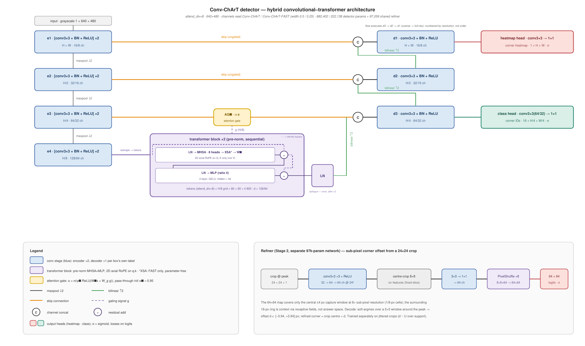
<sub>architecture -- source `paper/figs/architecture.pdf`</sub>


<sub>fourway_PANEL_recallrelease -- source `paper/figs/fourway_PANEL_recallrelease.png`</sub>


<sub>fourway_board_occlusion -- source `paper/figs/fourway_board_occlusion.png`</sub>


<sub>fourway_darkness -- source `paper/figs/fourway_darkness.png`</sub>

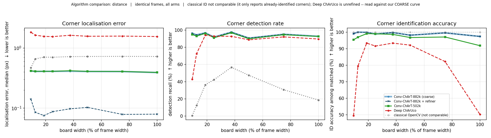
<sub>fourway_distance -- source `paper/figs/fourway_distance.png`</sub>


<sub>fourway_ink_contrast -- source `paper/figs/fourway_ink_contrast.png`</sub>

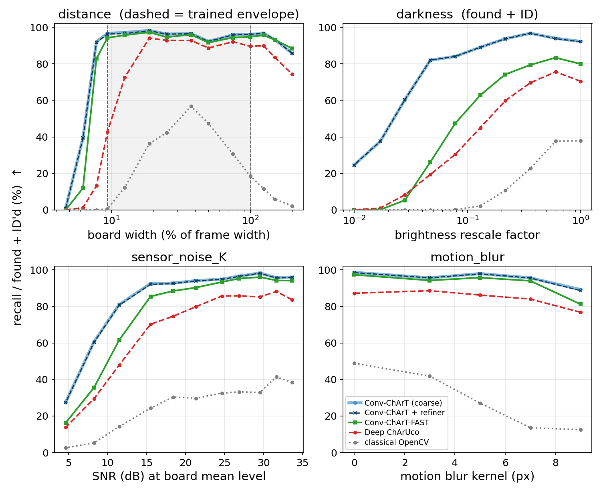
<sub>headline_panel_ConvChArT -- source `figures/headline_panel_ConvChArT.png`</sub>

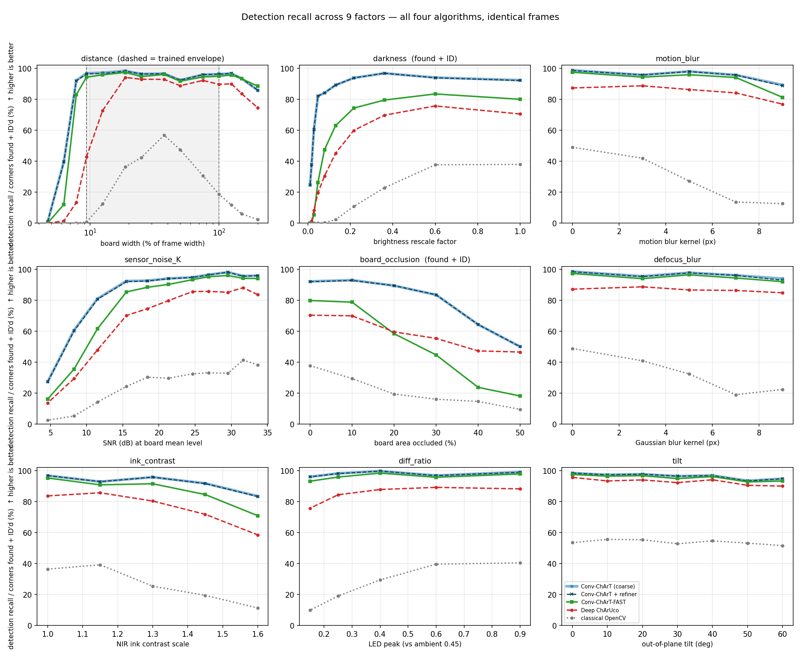
<sub>headline_panel_v2 -- source `figures/headline_panel_v2.png`</sub>


<sub>cost_table -- source `figures/cost_table.pdf`</sub>

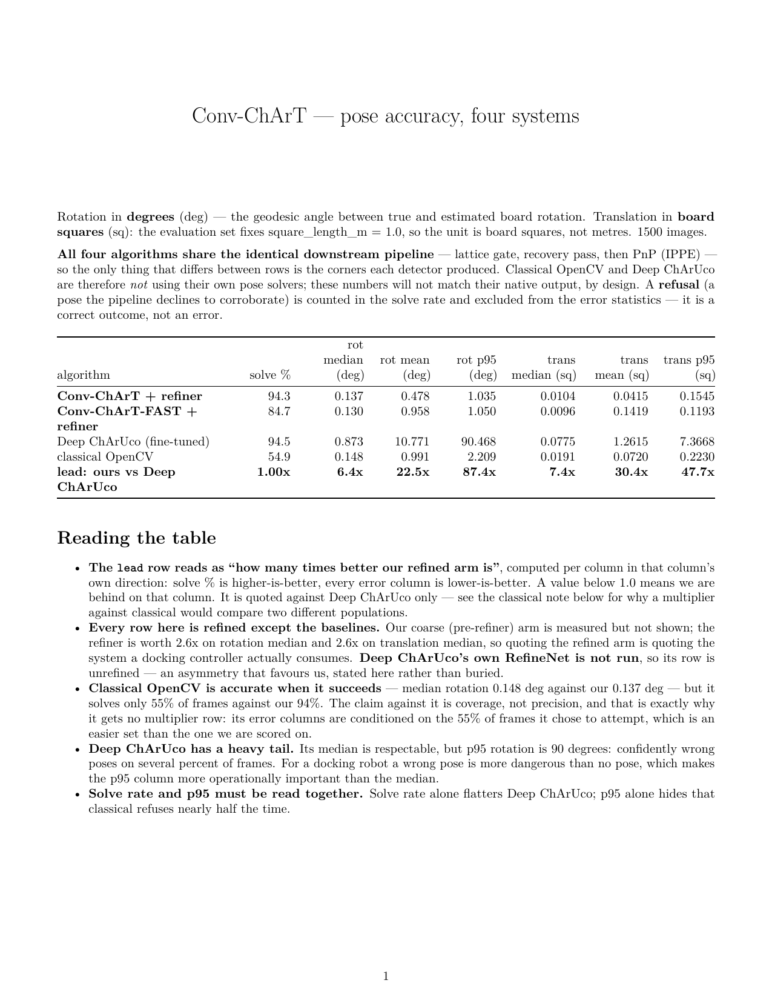
<sub>pose_table_ConvChArT -- source `figures/pose_table_ConvChArT.pdf`</sub>


<sub>pose_table_v2 -- source `figures/pose_table_v2.pdf`</sub>

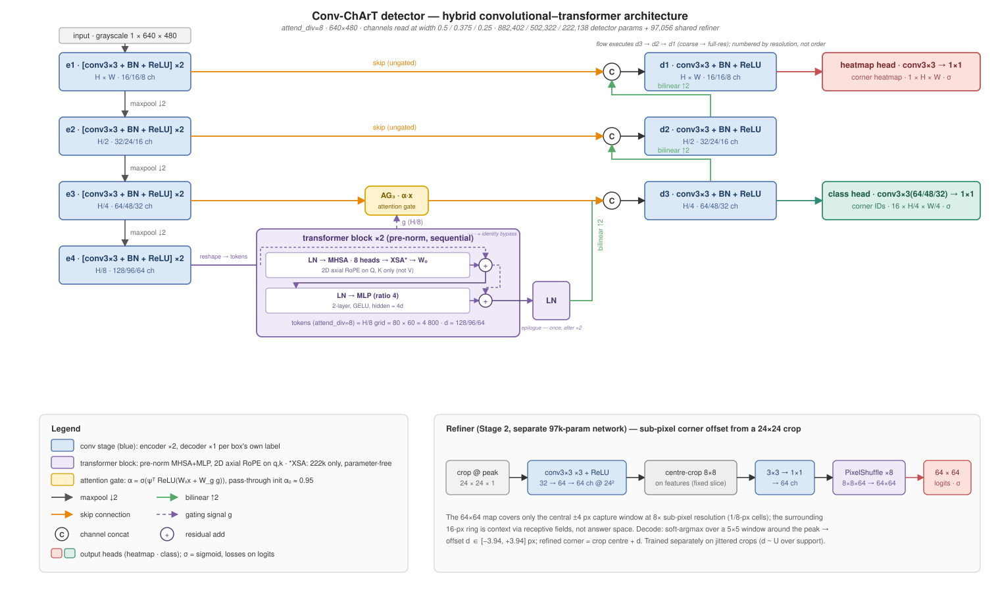
<sub>architecture -- source `figures/architecture.svg`</sub>


### B2. Release-run learning curves (generated from the training logs)

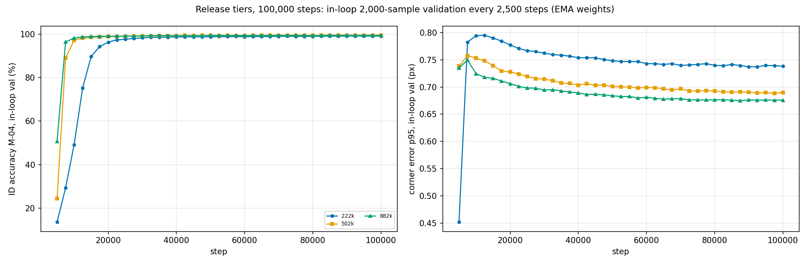
<sub>generated by this builder from `runs/rel_*/metrics.jsonl`; full 10k validation values are in Part A, Section 7</sub>


### B3. Release detector validation records

Full 10,000-sample validations at every 25,000 steps (`runs/rel_*/metrics.jsonl`, EMA weights):

| tier | step | M-01 median px | p95 px | tail > 4 px | M-04 | M-02 recall 12-16 / 16-32 / 32-64 / 64-128 | matched corners |
|---|---|---|---|---|---|---|---|
| 882k | 25000 | 0.4085 | 0.6945 | 0.01% | 99.29% | 90.32% / 93.06% / 94.60% / 94.75% | 122644 |
| 882k | 50000 | 0.4072 | 0.6829 | 0.01% | 99.42% | 91.14% / 93.79% / 95.09% / 95.34% | 123477 |
| 882k | 75000 | 0.4066 | 0.6752 | 0.00% | 99.54% | 91.46% / 94.00% / 95.23% / 95.62% | 123771 |
| 882k | 100000 | 0.4063 | 0.6733 | 0.00% | 99.53% | 91.74% / 94.02% / 95.31% / 95.61% | 123856 |
| 502k | 25000 | 0.4105 | 0.7144 | 0.02% | 98.87% | 89.30% / 92.46% / 94.12% / 94.44% | 121928 |
| 502k | 50000 | 0.4088 | 0.6977 | 0.02% | 99.25% | 89.94% / 93.01% / 94.69% / 94.89% | 122640 |
| 502k | 75000 | 0.4078 | 0.6909 | 0.02% | 99.39% | 90.27% / 93.20% / 94.81% / 94.97% | 122850 |
| 502k | 100000 | 0.4077 | 0.6885 | 0.01% | 99.41% | 90.49% / 93.23% / 94.87% / 95.07% | 122954 |
| 222k | 25000 | 0.4162 | 0.7597 | 0.02% | 97.66% | 85.33% / 90.34% / 92.69% / 92.81% | 119247 |
| 222k | 50000 | 0.4140 | 0.7431 | 0.02% | 98.85% | 86.98% / 91.13% / 93.32% / 93.64% | 120384 |
| 222k | 75000 | 0.4131 | 0.7368 | 0.02% | 99.01% | 87.51% / 91.49% / 93.59% / 93.91% | 120817 |
| 222k | 100000 | 0.4128 | 0.7337 | 0.02% | 99.09% | 87.53% / 91.57% / 93.62% / 93.92% | 120870 |

Control and zero-shot full validations of the 882k model (`27_transfer_zeroshot/fullval_*.json`, `tools/eval_checkpoint.py`):

| model / board | median px | p95 px | tail > 4 px | M-04 | M-04 by octave | M-02 by octave |
|---|---|---|---|---|---|---|
| 882k, trained board DICT_5X5_50 | 0.4063 | 0.6733 | 0.00% | 99.53% | 98.71% / 99.44% / 99.80% / 99.76% | 91.74% / 94.02% / 95.31% / 95.61% |
| 882k, zero-shot DICT_6X6_250 | 0.4063 | 0.6754 | 0.01% | 13.36% | 9.47% / 15.02% / 14.34% / 12.05% | 91.94% / 93.97% / 95.47% / 95.71% |
| fine-tuned 5k, head+bneck 3x (ft18) | 0.4061 | 0.6739 | 0.01% | 98.22% | 93.29% / 98.67% / 99.41% / 98.80% | 91.83% / 93.91% / 95.37% / 95.61% |
| fine-tuned 20k, head+bneck 3x (ft21) | 0.4058 | 0.6719 | 0.00% | 99.06% | 96.21% / 99.26% / 99.70% / 99.54% | 91.95% / 93.90% / 95.41% / 95.61% |
| fine-tuned 5k, whole model 3x (ft20) | 0.4071 | 0.6818 | 0.01% | 98.88% | 96.66% / 98.86% / 99.52% / 99.32% | 91.63% / 93.75% / 95.32% / 95.48% |
| 3-family base, original board | 0.4094 | 0.6996 | 0.01% | 80.60% | 31.39% / 77.69% / 94.96% / 92.74% | 89.89% / 92.90% / 94.49% / 94.78% |
| 3-family base, zero-shot DICT_6X6_250 | 0.4092 | 0.6998 | 0.01% | 17.73% | 31.59% / 22.89% / 12.04% / 10.65% | 90.40% / 93.07% / 94.70% / 94.83% |


### B4. Robustness: release tiers vs Deep ChArUco vs classical, identical frames

Per-factor figures (`tools/plot_four_way.py`): 882k vs 502k, and 882k vs 222k, each against the fine-tuned Deep ChArUco and classical OpenCV arms. Our coarse and refined arms are both drawn; Deep ChArUco is unrefined (read against our coarse arm); classical ID is not comparable (reports only identified corners).

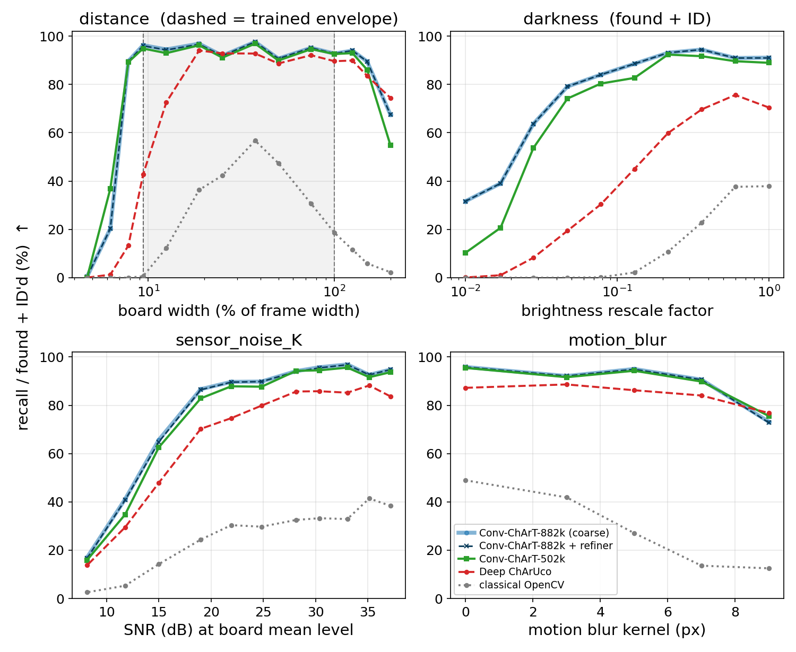
<sub>fourway_PANEL_recallrelease -- source `paper/results_rev6/22_fourway_RELEASE/fourway_PANEL_recallrelease.png`</sub>

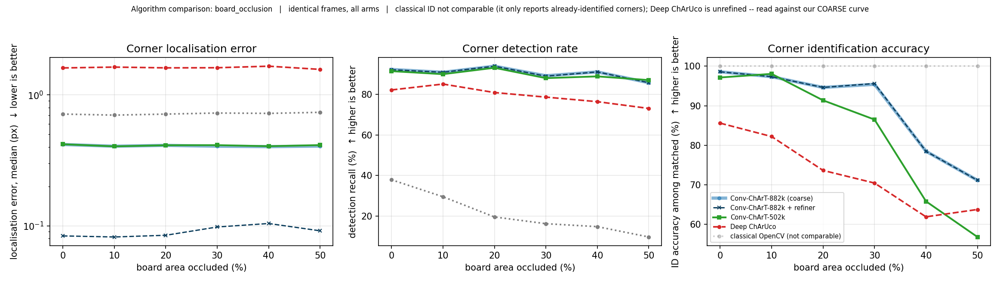
<sub>fourway_board_occlusion -- source `paper/results_rev6/22_fourway_RELEASE/fourway_board_occlusion.png`</sub>

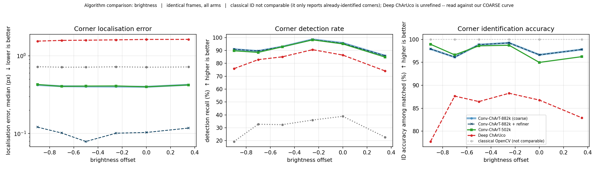
<sub>fourway_brightness -- source `paper/results_rev6/22_fourway_RELEASE/fourway_brightness.png`</sub>

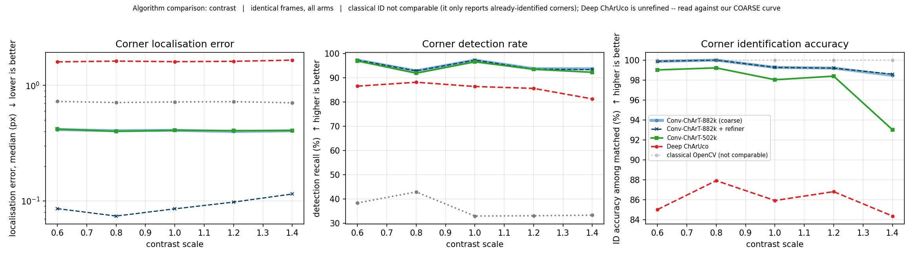
<sub>fourway_contrast -- source `paper/results_rev6/22_fourway_RELEASE/fourway_contrast.png`</sub>

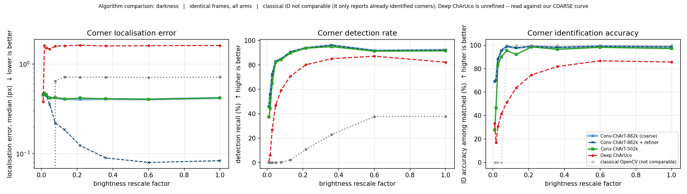
<sub>fourway_darkness -- source `paper/results_rev6/22_fourway_RELEASE/fourway_darkness.png`</sub>

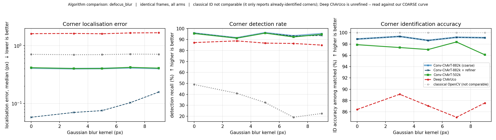
<sub>fourway_defocus_blur -- source `paper/results_rev6/22_fourway_RELEASE/fourway_defocus_blur.png`</sub>

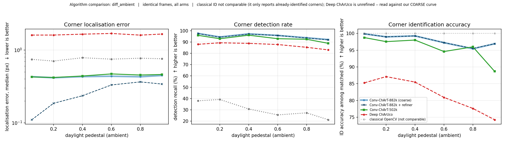
<sub>fourway_diff_ambient -- source `paper/results_rev6/22_fourway_RELEASE/fourway_diff_ambient.png`</sub>

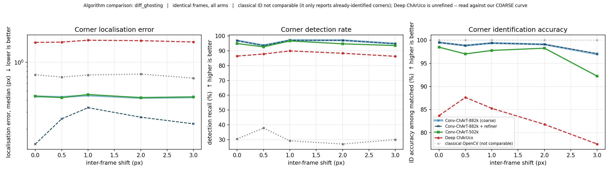
<sub>fourway_diff_ghosting -- source `paper/results_rev6/22_fourway_RELEASE/fourway_diff_ghosting.png`</sub>

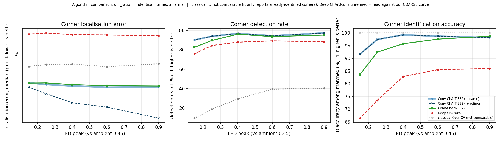
<sub>fourway_diff_ratio -- source `paper/results_rev6/22_fourway_RELEASE/fourway_diff_ratio.png`</sub>


<sub>fourway_distance -- source `paper/results_rev6/22_fourway_RELEASE/fourway_distance.png`</sub>

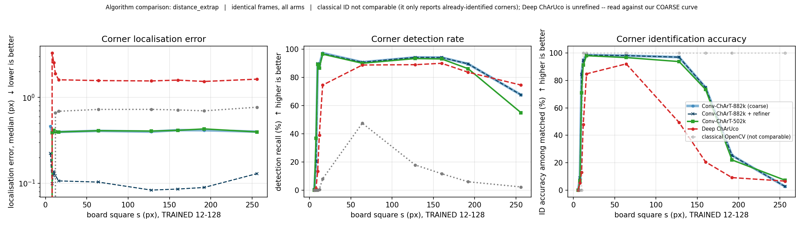
<sub>fourway_distance_extrap -- source `paper/results_rev6/22_fourway_RELEASE/fourway_distance_extrap.png`</sub>

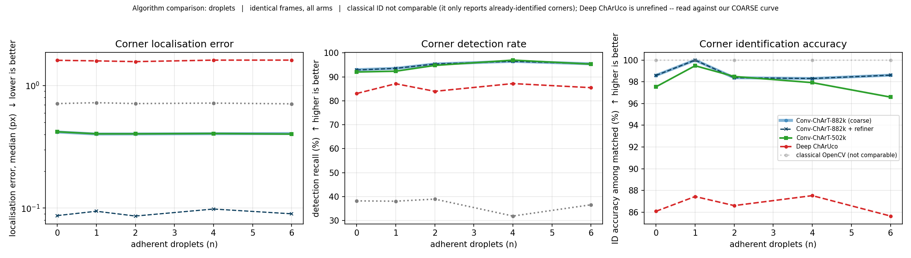
<sub>fourway_droplets -- source `paper/results_rev6/22_fourway_RELEASE/fourway_droplets.png`</sub>

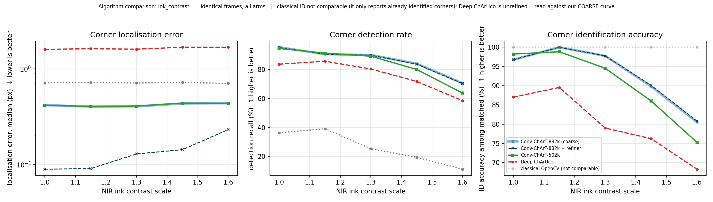
<sub>fourway_ink_contrast -- source `paper/results_rev6/22_fourway_RELEASE/fourway_ink_contrast.png`</sub>

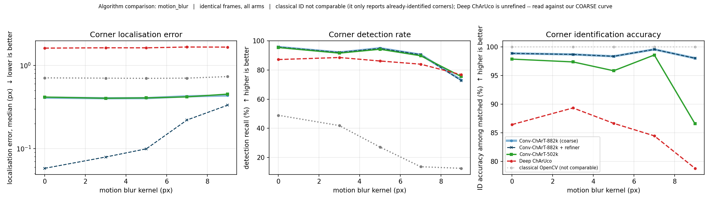
<sub>fourway_motion_blur -- source `paper/results_rev6/22_fourway_RELEASE/fourway_motion_blur.png`</sub>

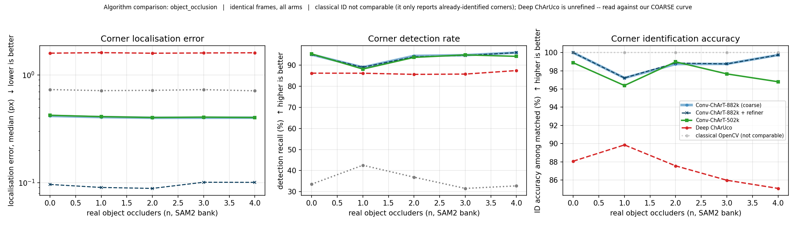
<sub>fourway_object_occlusion -- source `paper/results_rev6/22_fourway_RELEASE/fourway_object_occlusion.png`</sub>

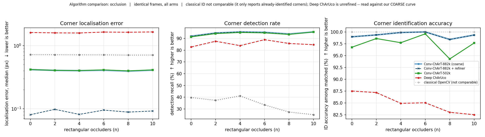
<sub>fourway_occlusion -- source `paper/results_rev6/22_fourway_RELEASE/fourway_occlusion.png`</sub>

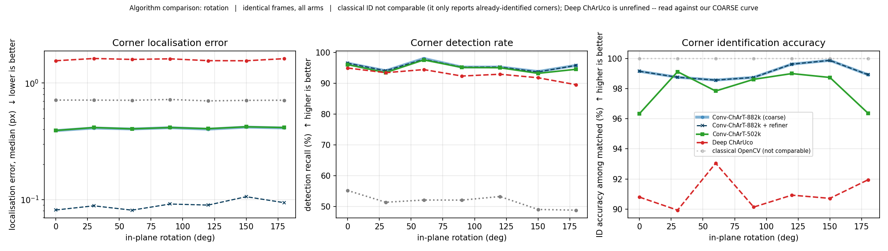
<sub>fourway_rotation -- source `paper/results_rev6/22_fourway_RELEASE/fourway_rotation.png`</sub>

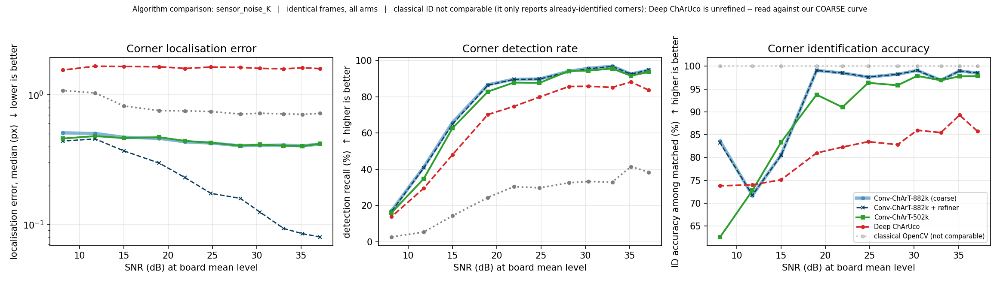
<sub>fourway_sensor_noise_K -- source `paper/results_rev6/22_fourway_RELEASE/fourway_sensor_noise_K.png`</sub>

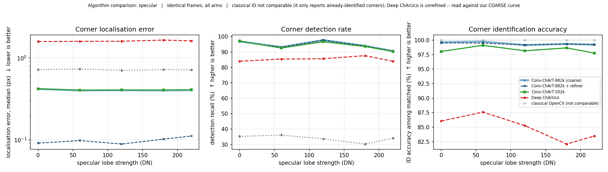
<sub>fourway_specular -- source `paper/results_rev6/22_fourway_RELEASE/fourway_specular.png`</sub>

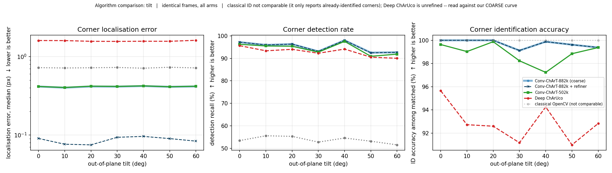
<sub>fourway_tilt -- source `paper/results_rev6/22_fourway_RELEASE/fourway_tilt.png`</sub>

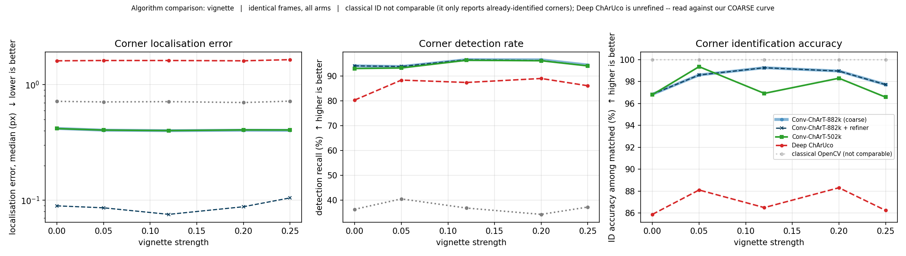
<sub>fourway_vignette -- source `paper/results_rev6/22_fourway_RELEASE/fourway_vignette.png`</sub>

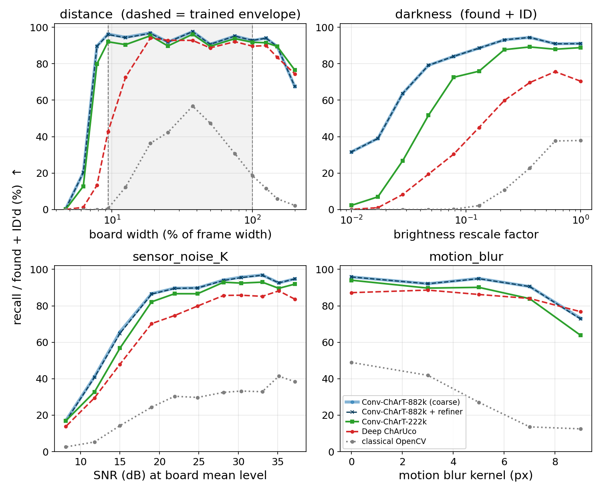
<sub>fourway_PANEL_recalltiers -- source `paper/results_rev6/22_fourway_RELEASE_882_vs_222/fourway_PANEL_recalltiers.png`</sub>

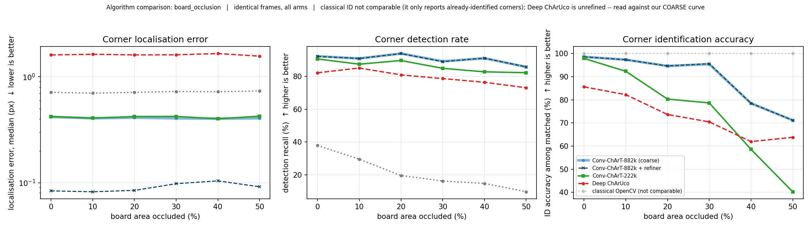
<sub>fourway_board_occlusion -- source `paper/results_rev6/22_fourway_RELEASE_882_vs_222/fourway_board_occlusion.png`</sub>

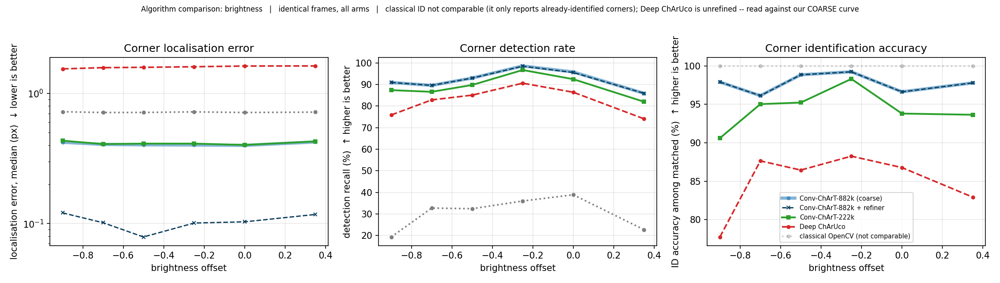
<sub>fourway_brightness -- source `paper/results_rev6/22_fourway_RELEASE_882_vs_222/fourway_brightness.png`</sub>

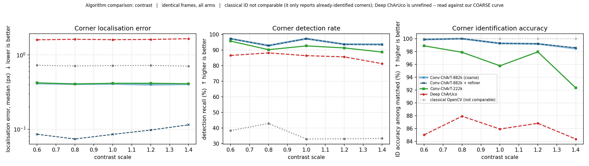
<sub>fourway_contrast -- source `paper/results_rev6/22_fourway_RELEASE_882_vs_222/fourway_contrast.png`</sub>

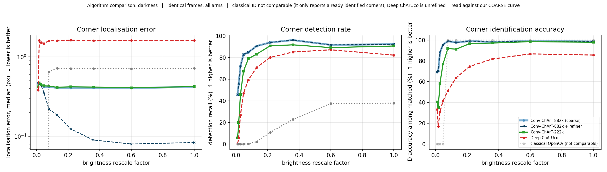
<sub>fourway_darkness -- source `paper/results_rev6/22_fourway_RELEASE_882_vs_222/fourway_darkness.png`</sub>

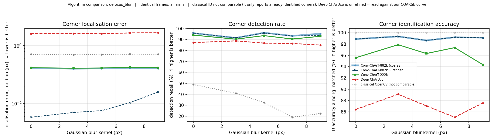
<sub>fourway_defocus_blur -- source `paper/results_rev6/22_fourway_RELEASE_882_vs_222/fourway_defocus_blur.png`</sub>

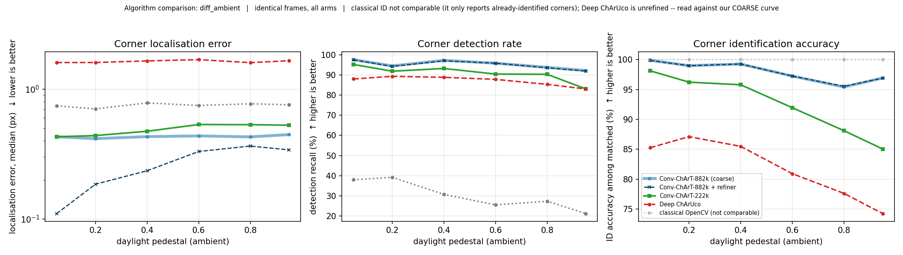
<sub>fourway_diff_ambient -- source `paper/results_rev6/22_fourway_RELEASE_882_vs_222/fourway_diff_ambient.png`</sub>

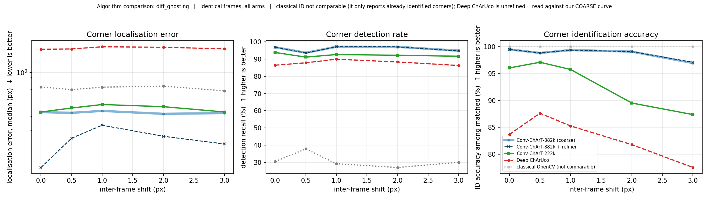
<sub>fourway_diff_ghosting -- source `paper/results_rev6/22_fourway_RELEASE_882_vs_222/fourway_diff_ghosting.png`</sub>

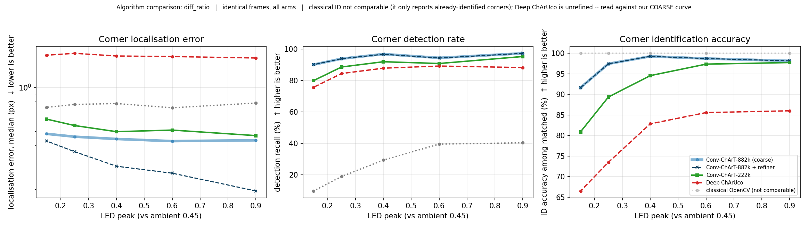
<sub>fourway_diff_ratio -- source `paper/results_rev6/22_fourway_RELEASE_882_vs_222/fourway_diff_ratio.png`</sub>

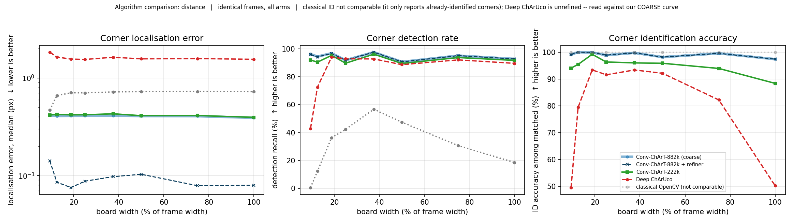
<sub>fourway_distance -- source `paper/results_rev6/22_fourway_RELEASE_882_vs_222/fourway_distance.png`</sub>

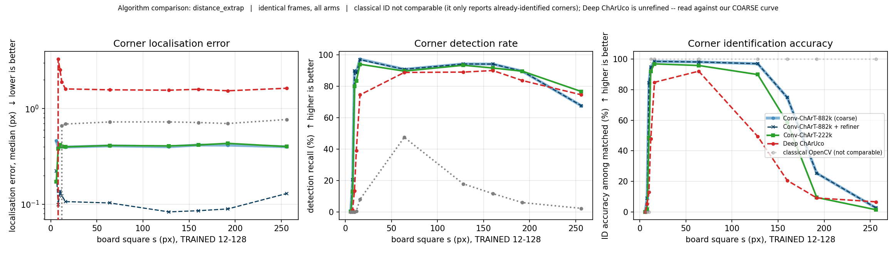
<sub>fourway_distance_extrap -- source `paper/results_rev6/22_fourway_RELEASE_882_vs_222/fourway_distance_extrap.png`</sub>

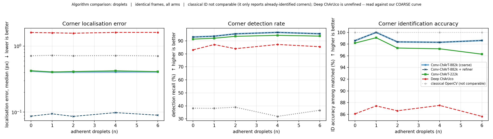
<sub>fourway_droplets -- source `paper/results_rev6/22_fourway_RELEASE_882_vs_222/fourway_droplets.png`</sub>

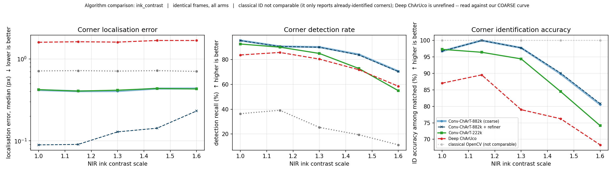
<sub>fourway_ink_contrast -- source `paper/results_rev6/22_fourway_RELEASE_882_vs_222/fourway_ink_contrast.png`</sub>

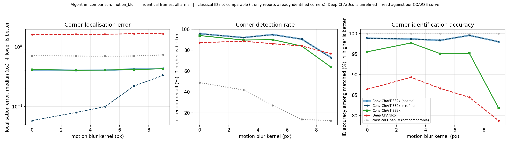
<sub>fourway_motion_blur -- source `paper/results_rev6/22_fourway_RELEASE_882_vs_222/fourway_motion_blur.png`</sub>

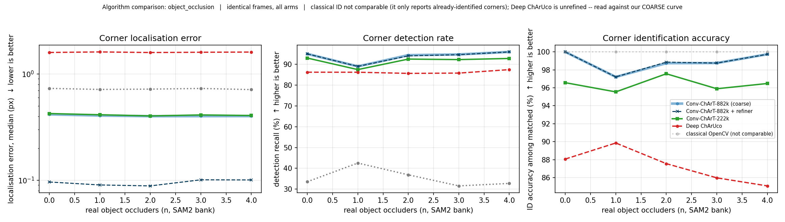
<sub>fourway_object_occlusion -- source `paper/results_rev6/22_fourway_RELEASE_882_vs_222/fourway_object_occlusion.png`</sub>

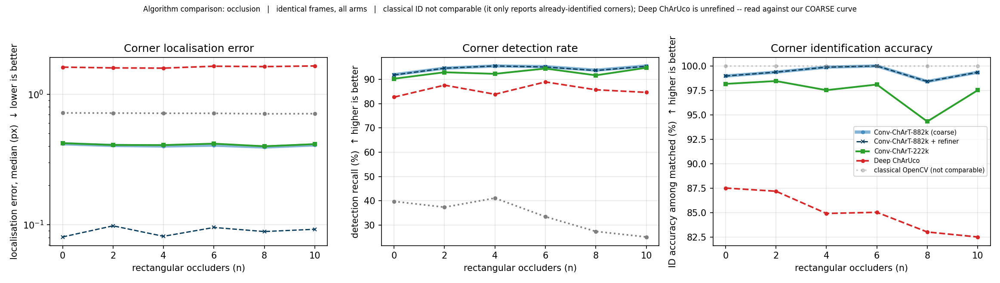
<sub>fourway_occlusion -- source `paper/results_rev6/22_fourway_RELEASE_882_vs_222/fourway_occlusion.png`</sub>

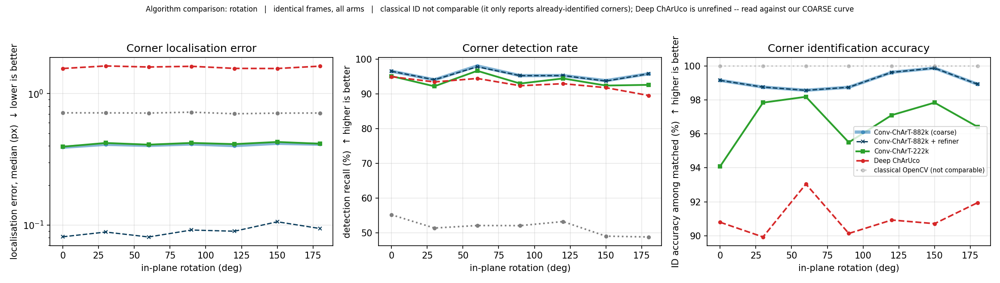
<sub>fourway_rotation -- source `paper/results_rev6/22_fourway_RELEASE_882_vs_222/fourway_rotation.png`</sub>

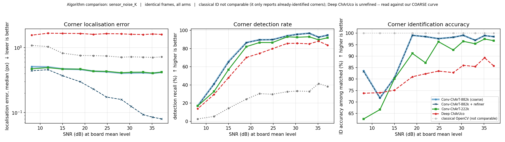
<sub>fourway_sensor_noise_K -- source `paper/results_rev6/22_fourway_RELEASE_882_vs_222/fourway_sensor_noise_K.png`</sub>

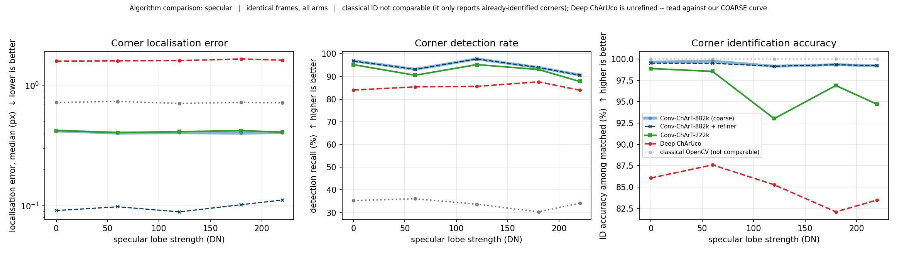
<sub>fourway_specular -- source `paper/results_rev6/22_fourway_RELEASE_882_vs_222/fourway_specular.png`</sub>

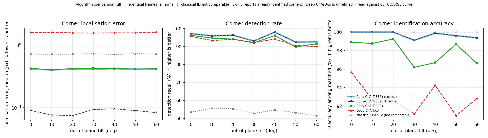
<sub>fourway_tilt -- source `paper/results_rev6/22_fourway_RELEASE_882_vs_222/fourway_tilt.png`</sub>

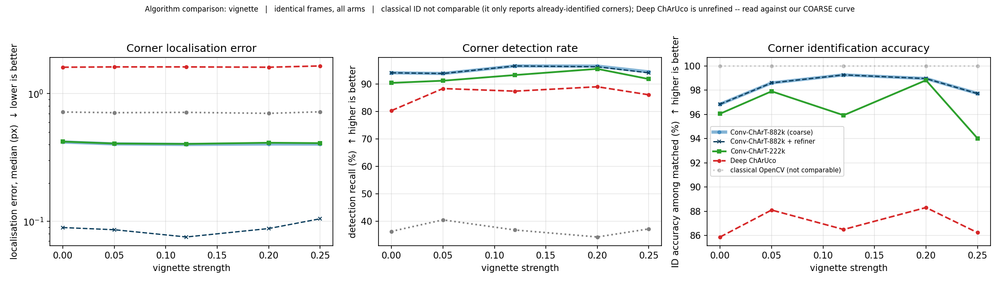
<sub>fourway_vignette -- source `paper/results_rev6/22_fourway_RELEASE_882_vs_222/fourway_vignette.png`</sub>


**Per-step tables** (refined arm for ours, n = 60 frames per step; Deep ChArUco and classical n = 100, same seed 20260728, match 4.0 px). Columns: 882k | 502k | 222k | Deep ChArUco | classical. Localisation is the median error of matched corners in px (refined for ours, unrefined for the baselines).


**board_occlusion** -- unit: board area occluded (%); steps: [0, 10, 20, 30, 40, 50]

| step | recall % (882k / 502k / 222k / DC / classical) | ID % among matched | localisation median px |
|---|---|---|---|
| 0 | 92.3 / 91.4 / 90.5 / 82.3 / 37.9 | 98.6 / 97.1 / 97.9 / 85.6 / n/c | 0.084 / 0.083 / 0.083 / 1.606 / 0.713 |
| 10 | 91.0 / 90.1 / 87.4 / 85.2 / 29.5 | 97.3 / 98.1 / 92.5 / 82.2 / n/c | 0.082 / 0.081 / 0.078 / 1.630 / 0.700 |
| 20 | 94.0 / 93.2 / 89.7 / 81.0 / 19.5 | 94.6 / 91.4 / 80.3 / 73.7 / n/c | 0.085 / 0.084 / 0.083 / 1.608 / 0.713 |
| 30 | 89.1 / 88.1 / 84.8 / 78.7 / 16.2 | 95.6 / 86.5 / 78.9 / 70.5 / n/c | 0.098 / 0.097 / 0.095 / 1.612 / 0.726 |
| 40 | 91.2 / 89.0 / 82.8 / 76.5 / 14.7 | 78.5 / 65.8 / 58.6 / 61.9 / n/c | 0.104 / 0.102 / 0.098 / 1.656 / 0.722 |
| 50 | 85.9 / 87.1 / 82.3 / 73.1 / 9.6 | 71.2 / 56.8 / 40.2 / 63.8 / n/c | 0.092 / 0.092 / 0.089 / 1.565 / 0.735 |


**brightness** -- unit: brightness offset; steps: [-0.9, -0.7, -0.5, -0.25, 0.0, 0.35]

| step | recall % (882k / 502k / 222k / DC / classical) | ID % among matched | localisation median px |
|---|---|---|---|
| -0.9 | 91.0 / 89.8 / 87.4 / 75.9 / 19.3 | 97.9 / 98.9 / 90.6 / 77.8 / n/c | 0.121 / 0.116 / 0.113 / 1.546 / 0.724 |
| -0.7 | 89.6 / 88.5 / 86.6 / 82.9 / 32.7 | 96.1 / 96.6 / 95.0 / 87.7 / n/c | 0.102 / 0.099 / 0.098 / 1.579 / 0.714 |
| -0.5 | 93.0 / 92.9 / 89.8 / 85.1 / 32.4 | 98.9 / 98.6 / 95.2 / 86.5 / n/c | 0.079 / 0.079 / 0.077 / 1.589 / 0.715 |
| -0.25 | 98.5 / 98.1 / 96.7 / 90.6 / 36.0 | 99.2 / 98.7 / 98.3 / 88.3 / n/c | 0.101 / 0.100 / 0.100 / 1.605 / 0.722 |
| 0.0 | 95.6 / 94.9 / 92.2 / 86.4 / 38.9 | 96.6 / 95.0 / 93.8 / 86.8 / n/c | 0.103 / 0.103 / 0.099 / 1.625 / 0.714 |
| 0.35 | 85.9 / 84.9 / 82.0 / 74.1 / 22.7 | 97.8 / 96.2 / 93.7 / 82.9 / n/c | 0.118 / 0.117 / 0.113 / 1.628 / 0.719 |


**contrast** -- unit: contrast scale; steps: [0.6, 0.8, 1.0, 1.2, 1.4]

| step | recall % (882k / 502k / 222k / DC / classical) | ID % among matched | localisation median px |
|---|---|---|---|
| 0.6 | 97.3 / 96.9 / 95.6 / 86.5 / 38.3 | 99.9 / 99.0 / 98.9 / 85.0 / n/c | 0.086 / 0.085 / 0.084 / 1.593 / 0.725 |
| 0.8 | 92.8 / 91.9 / 90.1 / 88.1 / 42.9 | 100.0 / 99.2 / 97.9 / 87.9 / n/c | 0.074 / 0.074 / 0.072 / 1.618 / 0.709 |
| 1.0 | 97.3 / 96.6 / 92.6 / 86.4 / 32.9 | 99.3 / 98.0 / 95.8 / 85.9 / n/c | 0.085 / 0.085 / 0.083 / 1.600 / 0.717 |
| 1.2 | 93.6 / 93.5 / 91.3 / 85.6 / 33.0 | 99.2 / 98.4 / 97.9 / 86.8 / n/c | 0.098 / 0.097 / 0.096 / 1.611 / 0.721 |
| 1.4 | 93.3 / 91.9 / 88.4 / 81.2 / 33.3 | 98.6 / 93.2 / 92.4 / 84.4 / n/c | 0.115 / 0.114 / 0.110 / 1.650 / 0.706 |


**darkness** -- unit: brightness rescale factor; steps: [1.0, 0.6, 0.36, 0.216, 0.13, 0.078, 0.047, 0.028, 0.017, 0.01]

| step | recall % (882k / 502k / 222k / DC / classical) | ID % among matched | localisation median px |
|---|---|---|---|
| 1.0 | 92.3 / 91.4 / 90.5 / 82.3 / 37.9 | 98.6 / 97.1 / 97.9 / 85.6 / n/c | 0.084 / 0.083 / 0.083 / 1.606 / 0.713 |
| 0.6 | 91.8 / 91.2 / 89.1 / 87.2 / 37.6 | 99.1 / 98.2 / 98.5 / 86.7 / n/c | 0.080 / 0.079 / 0.077 / 1.596 / 0.707 |
| 0.36 | 96.2 / 95.0 / 91.8 / 85.1 / 22.8 | 98.1 / 96.5 / 97.2 / 81.8 / n/c | 0.090 / 0.089 / 0.088 / 1.584 / 0.711 |
| 0.216 | 94.0 / 93.7 / 90.8 / 80.1 / 10.7 | 99.1 / 98.5 / 96.5 / 74.7 / n/c | 0.124 / 0.124 / 0.121 / 1.616 / 0.709 |
| 0.13 | 90.7 / 89.7 / 83.2 / 70.8 / 2.2 | 97.6 / 92.2 / 91.2 / 63.7 / n/c | 0.185 / 0.181 / 0.166 / 1.591 / 0.716 |
| 0.078 | 84.9 / 84.3 / 78.9 / 59.3 / 0.1 | 99.0 / 95.4 / 91.9 / 51.2 / n/c | 0.220 / 0.214 / 0.207 / 1.581 / 0.643 |
| 0.047 | 82.9 / 82.2 / 67.4 / 46.9 / 0.0 | 95.5 / 90.3 / 76.8 / 41.4 / n/c | 0.353 / 0.364 / 0.331 / 1.468 / 0.000 |
| 0.028 | 72.3 / 64.7 / 45.9 / 26.9 / 0.0 | 88.1 / 82.9 / 58.4 / 30.6 / n/c | 0.440 / 0.453 / 0.444 / 1.505 / 0.000 |
| 0.017 | 55.7 / 44.3 / 19.9 / 5.9 / 0.0 | 70.1 / 46.5 / 35.0 / 17.1 / n/c | 0.456 / 0.471 / 0.471 / 1.597 / 0.000 |
| 0.01 | 45.8 / 37.3 / 5.6 / 0.2 / 0.0 | 69.1 / 27.7 / 40.4 / 33.3 / n/c | 0.463 / 0.451 / 0.419 / 0.380 / 0.000 |


**defocus_blur** -- unit: Gaussian blur kernel (px); steps: [0, 3, 5, 7, 9]

| step | recall % (882k / 502k / 222k / DC / classical) | ID % among matched | localisation median px |
|---|---|---|---|
| 0 | 95.8 / 95.5 / 94.1 / 87.2 / 48.9 | 98.9 / 97.9 / 95.6 / 86.4 / n/c | 0.058 / 0.058 / 0.058 / 1.614 / 0.708 |
| 3 | 91.5 / 91.2 / 90.3 / 88.8 / 40.9 | 99.3 / 97.4 / 97.9 / 89.1 / n/c | 0.070 / 0.069 / 0.068 / 1.629 / 0.698 |
| 5 | 96.0 / 95.6 / 93.5 / 86.7 / 32.5 | 98.6 / 97.0 / 96.3 / 87.1 / n/c | 0.075 / 0.075 / 0.074 / 1.608 / 0.701 |
| 7 | 93.2 / 92.2 / 90.2 / 86.4 / 19.1 | 99.2 / 98.4 / 97.4 / 85.0 / n/c | 0.104 / 0.102 / 0.102 / 1.663 / 0.716 |
| 9 | 93.7 / 92.8 / 91.2 / 84.9 / 22.5 | 99.1 / 96.0 / 94.2 / 87.6 / n/c | 0.158 / 0.156 / 0.149 / 1.674 / 0.711 |


**diff_ambient** -- unit: daylight pedestal (ambient); steps: [0.05, 0.2, 0.4, 0.6, 0.8, 0.95]

| step | recall % (882k / 502k / 222k / DC / classical) | ID % among matched | localisation median px |
|---|---|---|---|
| 0.05 | 97.5 / 95.8 / 95.0 / 88.0 / 37.9 | 99.9 / 98.8 / 98.1 / 85.3 / n/c | 0.110 / 0.108 / 0.107 / 1.602 / 0.744 |
| 0.2 | 94.3 / 92.8 / 91.6 / 89.3 / 39.2 | 99.0 / 97.6 / 96.2 / 87.1 / n/c | 0.185 / 0.184 / 0.185 / 1.603 / 0.704 |
| 0.4 | 97.0 / 96.0 / 93.2 / 88.8 / 30.7 | 99.3 / 98.0 / 95.8 / 85.5 / n/c | 0.235 / 0.235 / 0.230 / 1.649 / 0.783 |
| 0.6 | 95.9 / 93.0 / 90.5 / 87.8 / 25.5 | 97.3 / 94.6 / 92.0 / 80.9 / n/c | 0.331 / 0.336 / 0.339 / 1.687 / 0.748 |
| 0.8 | 93.6 / 92.4 / 90.2 / 85.3 / 27.3 | 95.5 / 96.1 / 88.1 / 77.6 / n/c | 0.365 / 0.370 / 0.383 / 1.599 / 0.771 |
| 0.95 | 92.0 / 88.8 / 82.8 / 83.1 / 21.2 | 96.9 / 88.7 / 85.1 / 74.2 / n/c | 0.340 / 0.344 / 0.349 / 1.655 / 0.758 |


**diff_ghosting** -- unit: inter-frame shift (px); steps: [0.0, 0.5, 1.0, 2.0, 3.0]

| step | recall % (882k / 502k / 222k / DC / classical) | ID % among matched | localisation median px |
|---|---|---|---|
| 0.0 | 96.9 / 94.9 / 93.7 / 86.5 / 30.5 | 99.5 / 98.5 / 96.1 / 83.7 / n/c | 0.139 / 0.137 / 0.133 / 1.611 / 0.739 |
| 0.5 | 93.5 / 92.6 / 91.0 / 87.8 / 37.8 | 98.9 / 97.0 / 97.1 / 87.6 / n/c | 0.255 / 0.253 / 0.252 / 1.623 / 0.698 |
| 1.0 | 97.1 / 96.7 / 92.6 / 89.9 / 29.2 | 99.4 / 97.8 / 95.8 / 85.3 / n/c | 0.334 / 0.340 / 0.332 / 1.697 / 0.735 |
| 2.0 | 97.1 / 94.7 / 92.2 / 88.3 / 27.0 | 99.1 / 98.3 / 89.5 / 81.8 / n/c | 0.265 / 0.258 / 0.266 / 1.680 / 0.750 |
| 3.0 | 94.7 / 93.6 / 91.6 / 86.3 / 30.0 | 97.1 / 92.2 / 87.4 / 77.5 / n/c | 0.226 / 0.222 / 0.218 / 1.627 / 0.681 |


**diff_ratio** -- unit: LED peak (vs ambient 0.45); steps: [0.9, 0.6, 0.4, 0.25, 0.15]

| step | recall % (882k / 502k / 222k / DC / classical) | ID % among matched | localisation median px |
|---|---|---|---|
| 0.9 | 97.3 / 95.1 / 95.1 / 88.2 / 40.4 | 98.2 / 98.8 / 97.8 / 86.0 / n/c | 0.195 / 0.194 / 0.194 / 1.592 / 0.781 |
| 0.6 | 94.3 / 93.3 / 90.6 / 89.2 / 39.6 | 98.7 / 97.6 / 97.4 / 85.6 / n/c | 0.258 / 0.257 / 0.256 / 1.629 / 0.725 |
| 0.4 | 96.7 / 95.8 / 91.9 / 87.8 / 29.4 | 99.3 / 95.8 / 94.6 / 82.8 / n/c | 0.288 / 0.289 / 0.287 / 1.643 / 0.775 |
| 0.25 | 93.9 / 89.6 / 88.5 / 84.4 / 19.0 | 97.5 / 92.4 / 89.5 / 73.5 / n/c | 0.362 / 0.350 / 0.389 / 1.714 / 0.764 |
| 0.15 | 90.1 / 82.6 / 80.0 / 75.7 / 9.8 | 91.7 / 83.7 / 80.9 / 66.5 / n/c | 0.428 / 0.429 / 0.476 / 1.664 / 0.730 |


**distance** -- unit: board square s (px); steps: [12, 16, 24, 32, 48, 64, 96, 128]

| step | recall % (882k / 502k / 222k / DC / classical) | ID % among matched | localisation median px |
|---|---|---|---|
| 12 | 96.0 / 94.7 / 91.9 / 42.7 / 0.6 | 99.1 / 95.3 / 94.1 / 49.5 / n/c | 0.141 / 0.137 / 0.135 / 1.841 / 0.469 |
| 16 | 94.3 / 92.7 / 90.2 / 72.6 / 12.3 | 100.0 / 97.0 / 95.4 / 79.4 / n/c | 0.085 / 0.084 / 0.081 / 1.642 / 0.661 |
| 24 | 96.6 / 96.0 / 95.2 / 94.0 / 36.3 | 99.9 / 99.1 / 99.2 / 93.4 / n/c | 0.075 / 0.075 / 0.075 / 1.566 / 0.706 |
| 32 | 91.9 / 91.1 / 89.7 / 92.9 / 42.3 | 98.9 / 99.0 / 96.4 / 91.6 / n/c | 0.088 / 0.087 / 0.086 / 1.552 / 0.705 |
| 48 | 97.6 / 96.9 / 96.2 / 92.8 / 56.7 | 99.8 / 98.6 / 96.0 / 93.4 / n/c | 0.097 / 0.096 / 0.095 / 1.634 / 0.721 |
| 64 | 90.7 / 89.8 / 89.4 / 88.7 / 47.4 | 98.2 / 96.7 / 95.9 / 92.1 / n/c | 0.103 / 0.102 / 0.102 / 1.573 / 0.725 |
| 96 | 95.1 / 94.6 / 93.8 / 92.1 / 30.6 | 99.6 / 97.1 / 93.9 / 82.2 / n/c | 0.079 / 0.079 / 0.078 / 1.584 / 0.728 |
| 128 | 92.8 / 92.6 / 91.7 / 89.6 / 18.6 | 97.4 / 91.8 / 88.4 / 50.2 / n/c | 0.079 / 0.079 / 0.079 / 1.557 / 0.724 |


**distance_extrap** -- unit: board square s (px), TRAINED 12-128; steps: [6, 8, 10, 12, 16, 64, 128, 160, 192, 256]

| step | recall % (882k / 502k / 222k / DC / classical) | ID % among matched | localisation median px |
|---|---|---|---|
| 6 | 0.4 / 0.0 / 0.1 / 0.0 / 0.0 | 0.0 / 0.0 / 0.0 / 0.0 / n/c | 0.222 / 0.000 / 0.165 / 0.000 / 0.000 |
| 8 | 20.3 / 36.8 / 12.7 / 1.2 / 0.0 | 9.0 / 6.7 / 1.7 / 5.3 / n/c | 0.099 / 0.098 / 0.104 / 3.290 / 0.000 |
| 10 | 89.6 / 89.1 / 79.7 / 13.3 / 0.0 | 84.6 / 70.8 / 48.5 / 12.9 / n/c | 0.137 / 0.137 / 0.127 / 2.546 / 0.000 |
| 12 | 88.3 / 85.6 / 82.5 / 39.0 / 0.5 | 94.8 / 91.1 / 92.0 / 47.8 / n/c | 0.122 / 0.119 / 0.113 / 1.888 / 0.660 |
| 16 | 96.8 / 96.0 / 93.7 / 74.4 / 8.0 | 98.6 / 98.1 / 96.9 / 84.9 / n/c | 0.106 / 0.106 / 0.103 / 1.607 / 0.690 |
| 64 | 90.7 / 89.8 / 89.4 / 88.7 / 47.4 | 98.2 / 96.7 / 95.9 / 92.1 / n/c | 0.103 / 0.102 / 0.102 / 1.573 / 0.725 |
| 128 | 94.1 / 93.2 / 93.2 / 88.9 / 17.8 | 97.0 / 93.8 / 89.9 / 49.4 / n/c | 0.083 / 0.083 / 0.082 / 1.558 / 0.726 |
| 160 | 94.0 / 93.0 / 91.5 / 89.9 / 11.6 | 74.9 / 73.5 / 58.6 / 20.6 / n/c | 0.085 / 0.085 / 0.084 / 1.593 / 0.715 |
| 192 | 89.5 / 86.1 / 89.5 / 83.5 / 5.9 | 25.3 / 22.0 / 9.4 / 9.1 / n/c | 0.089 / 0.085 / 0.089 / 1.537 / 0.698 |
| 256 | 67.5 / 54.9 / 76.5 / 74.4 / 2.2 | 2.7 / 7.2 / 1.4 / 6.6 / n/c | 0.129 / 0.120 / 0.117 / 1.634 / 0.769 |


**droplets** -- unit: adherent droplets (n); steps: [0, 1, 2, 4, 6]

| step | recall % (882k / 502k / 222k / DC / classical) | ID % among matched | localisation median px |
|---|---|---|---|
| 0 | 92.9 / 91.9 / 91.1 / 83.0 / 38.2 | 98.6 / 97.5 / 98.2 / 86.1 / n/c | 0.087 / 0.085 / 0.085 / 1.610 / 0.714 |
| 1 | 93.5 / 92.4 / 92.0 / 87.1 / 38.1 | 100.0 / 99.5 / 99.1 / 87.4 / n/c | 0.094 / 0.093 / 0.093 / 1.594 / 0.726 |
| 2 | 95.4 / 94.6 / 93.5 / 84.0 / 39.0 | 98.4 / 98.5 / 97.3 / 86.6 / n/c | 0.086 / 0.086 / 0.085 / 1.571 / 0.714 |
| 4 | 96.5 / 97.0 / 94.2 / 87.2 / 31.9 | 98.3 / 97.9 / 97.2 / 87.5 / n/c | 0.098 / 0.098 / 0.095 / 1.616 / 0.720 |
| 6 | 95.4 / 95.3 / 93.6 / 85.5 / 36.6 | 98.6 / 96.6 / 96.3 / 85.6 / n/c | 0.090 / 0.090 / 0.088 / 1.616 / 0.710 |


**ink_contrast** -- unit: NIR ink contrast scale; steps: [1.0, 1.15, 1.3, 1.45, 1.6]

| step | recall % (882k / 502k / 222k / DC / classical) | ID % among matched | localisation median px |
|---|---|---|---|
| 1.0 | 95.2 / 94.4 / 92.4 / 83.7 / 36.4 | 96.8 / 98.2 / 97.3 / 87.0 / n/c | 0.089 / 0.088 / 0.086 / 1.599 / 0.714 |
| 1.15 | 90.6 / 91.3 / 90.0 / 85.7 / 39.2 | 100.0 / 98.8 / 96.4 / 89.6 / n/c | 0.090 / 0.091 / 0.090 / 1.622 / 0.720 |
| 1.3 | 89.9 / 89.1 / 84.9 / 80.4 / 25.4 | 97.8 / 94.5 / 94.4 / 79.0 / n/c | 0.129 / 0.125 / 0.123 / 1.606 / 0.711 |
| 1.45 | 83.7 / 80.1 / 72.8 / 71.8 / 19.4 | 90.1 / 86.1 / 84.5 / 76.2 / n/c | 0.143 / 0.133 / 0.126 / 1.682 / 0.720 |
| 1.6 | 70.3 / 63.6 / 54.9 / 58.5 / 11.3 | 80.8 / 75.4 / 74.1 / 68.3 / n/c | 0.232 / 0.211 / 0.192 / 1.680 / 0.705 |


**motion_blur** -- unit: motion blur kernel (px); steps: [0, 3, 5, 7, 9]

| step | recall % (882k / 502k / 222k / DC / classical) | ID % among matched | localisation median px |
|---|---|---|---|
| 0 | 95.8 / 95.5 / 94.1 / 87.2 / 48.9 | 98.9 / 97.9 / 95.6 / 86.4 / n/c | 0.058 / 0.058 / 0.058 / 1.614 / 0.708 |
| 3 | 92.1 / 91.6 / 89.7 / 88.6 / 41.9 | 98.7 / 97.4 / 97.7 / 89.3 / n/c | 0.079 / 0.079 / 0.078 / 1.628 / 0.703 |
| 5 | 94.9 / 94.1 / 90.1 / 86.2 / 27.1 | 98.4 / 96.1 / 95.1 / 86.6 / n/c | 0.099 / 0.098 / 0.097 / 1.627 / 0.699 |
| 7 | 90.6 / 89.7 / 83.9 / 84.0 / 13.6 | 99.6 / 98.6 / 95.2 / 84.4 / n/c | 0.221 / 0.214 / 0.204 / 1.664 / 0.703 |
| 9 | 72.8 / 75.3 / 63.6 / 76.8 / 12.5 | 98.0 / 86.5 / 82.0 / 78.8 / n/c | 0.333 / 0.368 / 0.323 / 1.660 / 0.734 |


**object_occlusion** -- unit: real object occluders (n, SAM2 bank); steps: [0, 1, 2, 3, 4]

| step | recall % (882k / 502k / 222k / DC / classical) | ID % among matched | localisation median px |
|---|---|---|---|
| 0 | 95.0 / 95.4 / 93.0 / 86.2 / 33.6 | 100.0 / 98.9 / 96.6 / 88.1 / n/c | 0.096 / 0.097 / 0.093 / 1.593 / 0.732 |
| 1 | 89.0 / 88.2 / 87.5 / 86.2 / 42.5 | 97.2 / 96.4 / 95.5 / 89.9 / n/c | 0.090 / 0.088 / 0.088 / 1.611 / 0.715 |
| 2 | 94.1 / 93.2 / 92.2 / 85.7 / 36.9 | 98.9 / 99.1 / 97.6 / 87.6 / n/c | 0.089 / 0.088 / 0.088 / 1.591 / 0.720 |
| 3 | 94.6 / 94.9 / 92.2 / 85.8 / 31.6 | 98.8 / 97.7 / 95.9 / 86.0 / n/c | 0.101 / 0.100 / 0.098 / 1.600 / 0.731 |
| 4 | 96.0 / 94.2 / 92.8 / 87.5 / 32.8 | 99.7 / 96.8 / 96.5 / 85.1 / n/c | 0.101 / 0.099 / 0.097 / 1.606 / 0.713 |


**occlusion** -- unit: rectangular occluders (n); steps: [0, 2, 4, 6, 8, 10]

| step | recall % (882k / 502k / 222k / DC / classical) | ID % among matched | localisation median px |
|---|---|---|---|
| 0 | 91.8 / 91.2 / 90.1 / 82.7 / 39.8 | 99.0 / 96.8 / 98.2 / 87.5 / n/c | 0.081 / 0.080 / 0.078 / 1.612 / 0.719 |
| 2 | 94.6 / 94.1 / 92.8 / 87.6 / 37.4 | 99.4 / 98.6 / 98.5 / 87.2 / n/c | 0.098 / 0.098 / 0.097 / 1.591 / 0.717 |
| 4 | 95.5 / 95.1 / 92.3 / 83.9 / 41.1 | 99.9 / 97.7 / 97.5 / 84.9 / n/c | 0.082 / 0.080 / 0.078 / 1.584 / 0.714 |
| 6 | 95.1 / 94.6 / 94.4 / 89.0 / 33.5 | 100.0 / 99.6 / 98.1 / 85.0 / n/c | 0.095 / 0.095 / 0.095 / 1.639 / 0.714 |
| 8 | 93.7 / 93.3 / 91.6 / 85.7 / 27.4 | 98.4 / 94.3 / 94.3 / 83.0 / n/c | 0.089 / 0.087 / 0.084 / 1.628 / 0.707 |
| 10 | 95.4 / 95.4 / 94.8 / 84.7 / 25.1 | 99.4 / 97.8 / 97.5 / 82.5 / n/c | 0.092 / 0.093 / 0.091 / 1.646 / 0.709 |


**rotation** -- unit: in-plane rotation (deg); steps: [0, 30, 60, 90, 120, 150, 180]

| step | recall % (882k / 502k / 222k / DC / classical) | ID % among matched | localisation median px |
|---|---|---|---|
| 0 | 96.5 / 95.9 / 95.0 / 94.9 / 55.2 | 99.2 / 96.3 / 94.2 / 90.8 / n/c | 0.081 / 0.081 / 0.080 / 1.552 / 0.714 |
| 30 | 94.0 / 93.4 / 92.2 / 93.4 / 51.4 | 98.8 / 99.1 / 97.8 / 89.9 / n/c | 0.088 / 0.088 / 0.087 / 1.623 / 0.713 |
| 60 | 97.8 / 97.3 / 96.5 / 94.4 / 52.1 | 98.6 / 97.8 / 98.2 / 93.0 / n/c | 0.081 / 0.081 / 0.080 / 1.593 / 0.711 |
| 90 | 95.2 / 95.1 / 93.0 / 92.3 / 52.1 | 98.7 / 98.6 / 95.5 / 90.1 / n/c | 0.092 / 0.091 / 0.090 / 1.613 / 0.722 |
| 120 | 95.2 / 95.0 / 94.4 / 92.9 / 53.2 | 99.6 / 99.0 / 97.1 / 90.9 / n/c | 0.090 / 0.089 / 0.088 / 1.555 / 0.702 |
| 150 | 93.7 / 93.1 / 92.1 / 91.8 / 49.0 | 99.9 / 98.7 / 97.8 / 90.7 / n/c | 0.106 / 0.106 / 0.105 / 1.552 / 0.710 |
| 180 | 95.8 / 94.5 / 92.6 / 89.5 / 48.8 | 98.9 / 96.4 / 96.4 / 91.9 / n/c | 0.094 / 0.093 / 0.091 / 1.618 / 0.712 |


**sensor_noise_K** -- unit: sensor gain K (e-/DN, lower = noisier); steps: [30, 16, 8, 4, 2, 1, 0.5, 0.25, 0.1, 0.05, 0.02]

| step | recall % (882k / 502k / 222k / DC / classical) | ID % among matched | localisation median px |
|---|---|---|---|
| 30 | 94.8 / 93.7 / 91.8 / 83.7 / 38.4 | 98.5 / 97.8 / 96.8 / 85.8 / n/c | 0.080 / 0.080 / 0.079 / 1.598 / 0.721 |
| 16 | 92.6 / 91.6 / 89.6 / 88.2 / 41.4 | 99.0 / 97.8 / 97.5 / 89.3 / n/c | 0.085 / 0.084 / 0.081 / 1.622 / 0.708 |
| 8 | 96.8 / 95.5 / 92.9 / 85.2 / 32.9 | 96.9 / 96.9 / 95.4 / 85.5 / n/c | 0.093 / 0.091 / 0.089 / 1.591 / 0.715 |
| 4 | 95.5 / 94.2 / 92.2 / 85.8 / 33.2 | 99.1 / 97.9 / 96.5 / 86.0 / n/c | 0.125 / 0.124 / 0.122 / 1.605 / 0.723 |
| 2 | 93.9 / 94.2 / 92.8 / 85.7 / 32.5 | 98.2 / 95.8 / 92.8 / 82.8 / n/c | 0.159 / 0.161 / 0.158 / 1.632 / 0.713 |
| 1 | 89.8 / 87.7 / 86.6 / 79.9 / 29.7 | 97.6 / 96.4 / 96.3 / 83.5 / n/c | 0.174 / 0.167 / 0.164 / 1.643 / 0.745 |
| 0.5 | 89.6 / 87.7 / 86.5 / 74.7 / 30.4 | 98.5 / 91.0 / 87.1 / 82.3 / n/c | 0.230 / 0.219 / 0.216 / 1.603 / 0.754 |
| 0.25 | 86.4 / 82.6 / 81.8 / 70.2 / 24.4 | 99.1 / 93.7 / 91.2 / 81.0 / n/c | 0.298 / 0.296 / 0.287 / 1.651 / 0.757 |
| 0.1 | 64.8 / 61.9 / 56.3 / 47.9 / 14.2 | 80.5 / 83.5 / 80.1 / 75.1 / n/c | 0.370 / 0.348 / 0.335 / 1.659 / 0.823 |
| 0.05 | 40.8 / 34.4 / 32.5 / 29.5 / 5.3 | 71.8 / 72.8 / 66.4 / 74.0 / n/c | 0.458 / 0.429 / 0.437 / 1.668 / 1.037 |
| 0.02 | 16.6 / 15.4 / 16.5 / 13.8 / 2.6 | 83.2 / 63.0 / 61.8 / 73.8 / n/c | 0.441 / 0.409 / 0.438 / 1.557 / 1.083 |


**specular** -- unit: specular lobe strength (DN); steps: [0, 60, 120, 180, 220]

| step | recall % (882k / 502k / 222k / DC / classical) | ID % among matched | localisation median px |
|---|---|---|---|
| 0 | 96.8 / 97.1 / 95.1 / 84.0 / 35.3 | 99.5 / 98.0 / 98.9 / 86.1 / n/c | 0.091 / 0.092 / 0.089 / 1.586 / 0.719 |
| 60 | 93.2 / 92.6 / 90.6 / 85.4 / 36.1 | 99.5 / 99.1 / 98.5 / 87.6 / n/c | 0.098 / 0.098 / 0.094 / 1.593 / 0.734 |
| 120 | 97.7 / 96.6 / 95.2 / 85.7 / 33.7 | 99.1 / 98.2 / 93.0 / 85.3 / n/c | 0.089 / 0.088 / 0.086 / 1.600 / 0.706 |
| 180 | 94.0 / 93.6 / 93.1 / 87.6 / 30.3 | 99.3 / 98.7 / 96.9 / 82.1 / n/c | 0.102 / 0.102 / 0.101 / 1.652 / 0.720 |
| 220 | 90.6 / 90.2 / 87.7 / 84.0 / 34.1 | 99.2 / 97.8 / 94.7 / 83.5 / n/c | 0.111 / 0.112 / 0.109 / 1.616 / 0.715 |


**tilt** -- unit: out-of-plane tilt (deg); steps: [0, 10, 20, 30, 40, 50, 60]

| step | recall % (882k / 502k / 222k / DC / classical) | ID % among matched | localisation median px |
|---|---|---|---|
| 0 | 97.2 / 96.3 / 96.3 / 95.6 / 53.5 | 100.0 / 99.6 / 98.9 / 95.6 / n/c | 0.090 / 0.090 / 0.090 / 1.599 / 0.721 |
| 10 | 96.0 / 95.5 / 94.7 / 93.3 / 55.6 | 100.0 / 99.0 / 98.8 / 92.7 / n/c | 0.076 / 0.076 / 0.075 / 1.595 / 0.714 |
| 20 | 96.3 / 95.4 / 94.1 / 94.0 / 55.3 | 100.0 / 99.9 / 99.3 / 92.6 / n/c | 0.075 / 0.075 / 0.073 / 1.562 / 0.719 |
| 30 | 93.1 / 92.7 / 92.0 / 92.3 / 52.8 | 99.1 / 98.2 / 96.2 / 91.2 / n/c | 0.093 / 0.093 / 0.092 / 1.558 / 0.725 |
| 40 | 98.0 / 97.5 / 96.1 / 94.1 / 54.6 | 99.9 / 97.2 / 96.7 / 94.3 / n/c | 0.096 / 0.095 / 0.094 / 1.565 / 0.709 |
| 50 | 92.4 / 90.8 / 89.4 / 90.5 / 53.2 | 99.6 / 98.8 / 98.7 / 91.0 / n/c | 0.090 / 0.087 / 0.086 / 1.563 / 0.730 |
| 60 | 92.7 / 91.9 / 91.5 / 90.0 / 51.6 | 99.4 / 99.4 / 96.6 / 92.8 / n/c | 0.083 / 0.081 / 0.081 / 1.608 / 0.715 |


**vignette** -- unit: vignette strength; steps: [0.0, 0.05, 0.12, 0.2, 0.25]

| step | recall % (882k / 502k / 222k / DC / classical) | ID % among matched | localisation median px |
|---|---|---|---|
| 0.0 | 94.2 / 93.1 / 90.4 / 80.4 / 36.2 | 96.8 / 96.8 / 96.1 / 85.9 / n/c | 0.089 / 0.088 / 0.086 / 1.612 / 0.718 |
| 0.05 | 93.9 / 93.3 / 91.2 / 88.4 / 40.4 | 98.6 / 99.4 / 97.9 / 88.1 / n/c | 0.086 / 0.085 / 0.082 / 1.622 / 0.710 |
| 0.12 | 96.7 / 96.4 / 93.3 / 87.5 / 36.7 | 99.3 / 96.9 / 95.9 / 86.5 / n/c | 0.075 / 0.075 / 0.074 / 1.622 / 0.714 |
| 0.2 | 96.4 / 96.1 / 95.5 / 89.1 / 34.2 | 99.0 / 98.3 / 98.8 / 88.3 / n/c | 0.088 / 0.088 / 0.087 / 1.612 / 0.701 |
| 0.25 | 94.2 / 93.9 / 91.8 / 86.1 / 37.1 | 97.7 / 96.6 / 94.0 / 86.2 / n/c | 0.105 / 0.105 / 0.102 / 1.650 / 0.721 |


### B5. Pose benchmark B1 (1000 frames, corrected set)

| tier | solved | solve rate | ambiguous | refusal reasons | rot deg median / mean / p95 | trans sq median / mean / p95 | NEES (pose_cov; not a filter input) |
|---|---|---|---|---|---|---|---|
| 882k | 936 | 93.60% | 43 | {"too_few": 60, "collinear": 2, "pnp_solver_failed": 2} | 0.1318 / 0.5368 / 1.1737 | 0.0104 / 0.0376 / 0.1282 | {"expected_chi2_dof": 6, "n_unambiguous": 557, "n_ambiguous": 20, "mean_unambiguous": 11.234093027513063, "median_unambi |
| 502k | 923 | 92.30% | 38 | {"too_few": 66, "vacuous_uncorroborated": 5, "pnp_solver_failed": 3, "collinear": 3} | 0.1295 / 0.5759 / 1.2297 | 0.0103 / 0.0604 / 0.1509 | {"expected_chi2_dof": 6, "n_unambiguous": 556, "n_ambiguous": 19, "mean_unambiguous": 11.027918387265434, "median_unambi |
| 222k | 900 | 90.00% | 38 | {"too_few": 93, "pnp_solver_failed": 2, "vacuous_uncorroborated": 3, "collinear": 2} | 0.1269 / 0.6855 / 1.2261 | 0.0099 / 0.0691 / 0.1523 | {"expected_chi2_dof": 6, "n_unambiguous": 557, "n_ambiguous": 20, "mean_unambiguous": 11.39024526853643, "median_unambig |

All eight arms through the same PnP (`13_pose/pose_release_vs_baselines_B1.json`):

| arm | solved | solve rate | rot deg median / mean / p95 | trans squares median / mean / p95 |
|---|---|---|---|---|
| rel222_coarse | 900 | 90.00% | 0.3762 / 1.0216 / 2.4357 | 0.0288 / 0.1006 / 0.2787 |
| rel222_refined | 900 | 90.00% | 0.1269 / 0.6855 / 1.2261 | 0.0099 / 0.0691 / 0.1523 |
| rel502_coarse | 923 | 92.30% | 0.3817 / 0.9507 / 2.1863 | 0.0268 / 0.0866 / 0.2577 |
| rel502_refined | 923 | 92.30% | 0.1295 / 0.5759 / 1.2297 | 0.0103 / 0.0604 / 0.1509 |
| rel882_coarse | 936 | 93.60% | 0.3744 / 1.1176 / 2.3424 | 0.0289 / 0.0739 / 0.2698 |
| rel882_refined | 936 | 93.60% | 0.1318 / 0.5368 / 1.1737 | 0.0104 / 0.0376 / 0.1282 |
| deep_charuco | 933 | 93.30% | 0.9131 / 10.6234 / 89.3603 | 0.0770 / 1.2636 / 7.2695 |
| classical | 544 | 54.40% | 0.1602 / 0.8690 / 2.3487 | 0.0200 / 0.0654 / 0.2236 |

Baseline deltas file (`13_pose/pose_fourway_B1.json`; its `ours_*` rows are the 4.7M model and must not be quoted):

| arm | solved | solve rate | rot deg median / mean / p95 | trans squares median / mean / p95 |
|---|---|---|---|---|
| ours_coarse | 960 | 96.00% | 0.3971 / 1.0661 / 2.3629 | 0.0306 / 0.0861 / 0.3209 |
| ours_refined | 960 | 96.00% | 0.1379 / 0.5575 / 1.3455 | 0.0106 / 0.0462 / 0.1841 |
| deep_charuco | 933 | 93.30% | 0.9131 / 10.6234 / 89.3603 | 0.0770 / 1.2636 / 7.2695 |
| classical | 544 | 54.40% | 0.1602 / 0.8690 / 2.3487 | 0.0200 / 0.0654 / 0.2236 |

**Historical, not a release model.** The figures/tables in this subsection were produced with the pre-ablation 4,698,034-parameter `rev640` model or ablation-era checkpoints; they document the campaign and must not be quoted as results of the released tiers (see Part A, Section 19). The pose-table PDFs below are the conference-era tables.


<sub>pose_tables -- source `paper/results_rev6/13_pose/pose_tables.pdf`</sub>

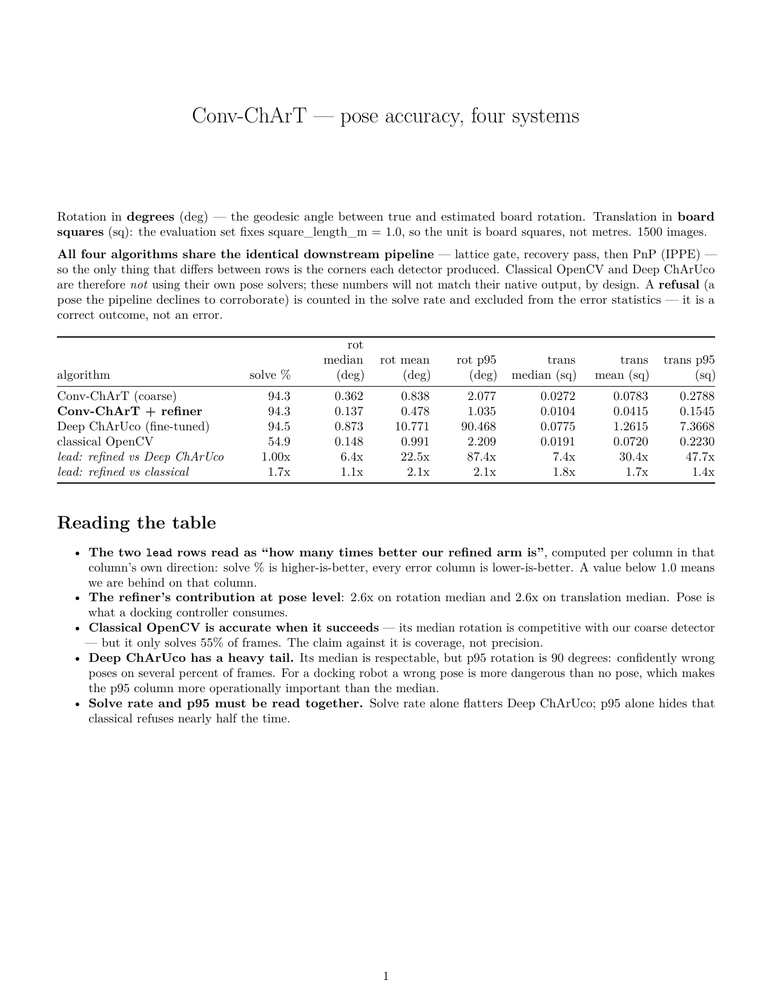
<sub>pose_tables_ConvChArT -- source `paper/results_rev6/13_pose/pose_tables_ConvChArT.pdf`</sub>


<sub>pose_tables_L -- source `paper/results_rev6/13_pose/pose_tables_L.pdf`</sub>

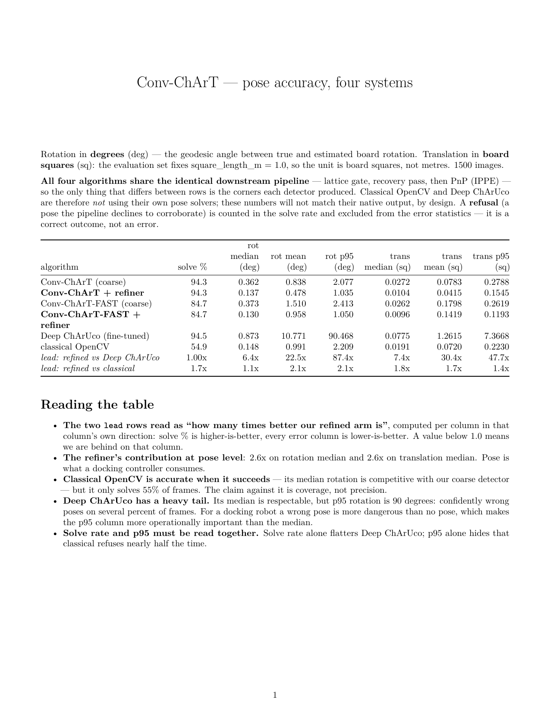
<sub>pose_tables_v2 -- source `paper/results_rev6/13_pose/pose_tables_v2.pdf`</sub>

> historical pose table (pre-release models)

<sub>included verbatim from `paper/results_rev6/13_pose/pose_tables.md`</sub>

 pose accuracy, four systems"
geometry: margin=1.6cm
fontsize: 10pt
---

Rotation in **degrees** (deg) --- the geodesic angle between true and estimated board
rotation. Translation in **board squares** (sq): the evaluation set fixes
square\_length\_m = 1.0, so the unit is board squares, not metres. 1500 images.

**All four algorithms share the identical downstream pipeline** --- lattice gate, recovery
pass, then PnP (IPPE) --- so the only thing that differs between rows is the corners
each detector produced. Classical OpenCV and Deep ChArUco are therefore *not* using
their own pose solvers; these numbers will not match their native output, by design.
A **refusal** (a pose the pipeline declines to corroborate) is counted in the solve
rate and excluded from the error statistics --- it is a correct outcome, not an error.

| algorithm | solve % | rot median (deg) | rot mean (deg) | rot p95 (deg) | trans median (sq) | trans mean (sq) | trans p95 (sq) |
|:-------------------------|-------:|--------:|-------:|-------:|---------:|--------:|-------:|
| **Conv-ChArT + refiner** | 94.3 | 0.137 | 0.478 | 1.035 | 0.0104 | 0.0415 | 0.1545 |
| **Conv-ChArT-FAST + refiner** | 84.7 | 0.130 | 0.958 | 1.050 | 0.0096 | 0.1419 | 0.1193 |
| Deep ChArUco (fine-tuned) | 94.5 | 0.873 | 10.771 | 90.468 | 0.0775 | 1.2615 | 7.3668 |
| classical OpenCV | 54.9 | 0.148 | 0.991 | 2.209 | 0.0191 | 0.0720 | 0.2230 |
| **lead: ours vs Deep ChArUco** | **1.00x** | **6.4x** | **22.5x** | **87.4x** | **7.4x** | **30.4x** | **47.7x** |


- **The `lead` row reads as "how many times better our refined arm is"**, computed
  per column in that column's own direction: solve % is higher-is-better, every error
  column is lower-is-better. A value below 1.0 means we are behind on that column.
  It is quoted against Deep ChArUco only --- see the classical note below for why a
  multiplier against classical would compare two different populations.
- **Every row here is refined except the baselines.** Our coarse (pre-refiner) arm is
  measured but not shown; the refiner is worth 2.6x on rotation median and
  2.6x on translation median, so quoting the refined arm is quoting the system a
  docking controller actually consumes. **Deep ChArUco's own RefineNet is not run**, so its
  row is unrefined --- an asymmetry that favours us, stated here rather than buried.
- **Classical OpenCV is accurate when it succeeds** --- median rotation
  0.148 deg against our 0.137 deg --- but it solves only
  55% of frames against our 94%. The claim against it is coverage, not precision,
  and that is exactly why it gets no multiplier row: its error columns are conditioned on
  the 55% of frames it chose to attempt, which is an easier set than the one we are
  scored on.
- **Deep ChArUco has a heavy tail.** Its median is respectable, but p95 rotation is
  90 degrees: confidently wrong poses on several percent of frames. For a
  docking robot a wrong pose is more dangerous than no pose, which makes the p95
  column more operationally important than the median.
- **Solve rate and p95 must be read together.** Solve rate alone flatters Deep
  ChArUco; p95 alone hides that classical refuses nearly half the time.

> historical pose table (pre-release models)

<sub>included verbatim from `paper/results_rev6/13_pose/pose_tables_ConvChArT.md`</sub>

 pose accuracy, four systems"
geometry: margin=1.6cm
fontsize: 10pt
---

Rotation in **degrees** (deg) --- the geodesic angle between true and estimated board
rotation. Translation in **board squares** (sq): the evaluation set fixes
square\_length\_m = 1.0, so the unit is board squares, not metres. 1500 images.

**All four algorithms share the identical downstream pipeline** --- lattice gate, recovery
pass, then PnP (IPPE) --- so the only thing that differs between rows is the corners
each detector produced. Classical OpenCV and Deep ChArUco are therefore *not* using
their own pose solvers; these numbers will not match their native output, by design.
A **refusal** (a pose the pipeline declines to corroborate) is counted in the solve
rate and excluded from the error statistics --- it is a correct outcome, not an error.

| algorithm | solve % | rot median (deg) | rot mean (deg) | rot p95 (deg) | trans median (sq) | trans mean (sq) | trans p95 (sq) |
|:-------------------------|-------:|--------:|-------:|-------:|---------:|--------:|-------:|
| Conv-ChArT (coarse) | 94.3 | 0.362 | 0.838 | 2.077 | 0.0272 | 0.0783 | 0.2788 |
| **Conv-ChArT + refiner** | 94.3 | 0.137 | 0.478 | 1.035 | 0.0104 | 0.0415 | 0.1545 |
| Deep ChArUco (fine-tuned) | 94.5 | 0.873 | 10.771 | 90.468 | 0.0775 | 1.2615 | 7.3668 |
| classical OpenCV | 54.9 | 0.148 | 0.991 | 2.209 | 0.0191 | 0.0720 | 0.2230 |
| *lead: refined vs Deep ChArUco* | 1.00x | 6.4x | 22.5x | 87.4x | 7.4x | 30.4x | 47.7x |
| *lead: refined vs classical* | 1.7x | 1.1x | 2.1x | 2.1x | 1.8x | 1.7x | 1.4x |


- **The two `lead` rows read as "how many times better our refined arm is"**, computed
  per column in that column's own direction: solve % is higher-is-better, every error
  column is lower-is-better. A value below 1.0 means we are behind on that column.
- **The refiner's contribution at pose level**: 2.6x on rotation median and
  2.6x on translation median. Pose is what a docking controller consumes.
- **Classical OpenCV is accurate when it succeeds** --- its median rotation is
  competitive with our coarse detector --- but it only solves 55% of frames. The
  claim against it is coverage, not precision.
- **Deep ChArUco has a heavy tail.** Its median is respectable, but p95 rotation is
  90 degrees: confidently wrong poses on several percent of frames. For a
  docking robot a wrong pose is more dangerous than no pose, which makes the p95
  column more operationally important than the median.
- **Solve rate and p95 must be read together.** Solve rate alone flatters Deep
  ChArUco; p95 alone hides that classical refuses nearly half the time.

> historical pose table (pre-release models)

<sub>included verbatim from `paper/results_rev6/13_pose/pose_tables_L.md`</sub>

 pose accuracy, four systems"
geometry: margin=1.6cm
fontsize: 10pt
---

Rotation in **degrees** (deg) --- the geodesic angle between true and estimated board
rotation. Translation in **board squares** (sq): the evaluation set fixes
square\_length\_m = 1.0, so the unit is board squares, not metres. 1500 images.

**All four algorithms share the identical downstream pipeline** --- lattice gate, recovery
pass, then PnP (IPPE) --- so the only thing that differs between rows is the corners
each detector produced. Classical OpenCV and Deep ChArUco are therefore *not* using
their own pose solvers; these numbers will not match their native output, by design.
A **refusal** (a pose the pipeline declines to corroborate) is counted in the solve
rate and excluded from the error statistics --- it is a correct outcome, not an error.

| algorithm | solve % | rot median (deg) | rot mean (deg) | rot p95 (deg) | trans median (sq) | trans mean (sq) | trans p95 (sq) |
|:-------------------------|-------:|--------:|-------:|-------:|---------:|--------:|-------:|
| Conv-ChArT (coarse) | 95.5 | 0.362 | 0.902 | 2.311 | 0.0289 | 0.0746 | 0.2722 |
| **Conv-ChArT + refiner** | 95.5 | 0.133 | 0.380 | 1.035 | 0.0101 | 0.0347 | 0.1448 |
| Deep ChArUco (fine-tuned) | 94.5 | 0.873 | 10.771 | 90.468 | 0.0775 | 1.2615 | 7.3668 |
| classical OpenCV | 54.9 | 0.148 | 0.991 | 2.209 | 0.0191 | 0.0720 | 0.2230 |
| *lead: refined vs Deep ChArUco* | 1.0x | 6.5x | 28.4x | 87.4x | 7.7x | 36.3x | 50.9x |
| *lead: refined vs classical* | 1.7x | 1.1x | 2.6x | 2.1x | 1.9x | 2.1x | 1.5x |


- **The two `lead` rows read as "how many times better our refined arm is"**, computed
  per column in that column's own direction: solve % is higher-is-better, every error
  column is lower-is-better. A value below 1.0 means we are behind on that column.
- **The refiner's contribution at pose level**: 2.7x on rotation median and
  2.9x on translation median. Pose is what a docking controller consumes.
- **Classical OpenCV is accurate when it succeeds** --- its median rotation is
  competitive with our coarse detector --- but it only solves 55% of frames. The
  claim against it is coverage, not precision.
- **Deep ChArUco has a heavy tail.** Its median is respectable, but p95 rotation is
  90 degrees: confidently wrong poses on several percent of frames. For a
  docking robot a wrong pose is more dangerous than no pose, which makes the p95
  column more operationally important than the median.
- **Solve rate and p95 must be read together.** Solve rate alone flatters Deep
  ChArUco; p95 alone hides that classical refuses nearly half the time.

> historical pose table (pre-release models)

<sub>included verbatim from `paper/results_rev6/13_pose/pose_tables_v2.md`</sub>

 pose accuracy, four systems"
geometry: margin=1.6cm
fontsize: 10pt
---

Rotation in **degrees** (deg) --- the geodesic angle between true and estimated board
rotation. Translation in **board squares** (sq): the evaluation set fixes
square\_length\_m = 1.0, so the unit is board squares, not metres. 1500 images.

**All four algorithms share the identical downstream pipeline** --- lattice gate, recovery
pass, then PnP (IPPE) --- so the only thing that differs between rows is the corners
each detector produced. Classical OpenCV and Deep ChArUco are therefore *not* using
their own pose solvers; these numbers will not match their native output, by design.
A **refusal** (a pose the pipeline declines to corroborate) is counted in the solve
rate and excluded from the error statistics --- it is a correct outcome, not an error.

| algorithm | solve % | rot median (deg) | rot mean (deg) | rot p95 (deg) | trans median (sq) | trans mean (sq) | trans p95 (sq) |
|:-------------------------|-------:|--------:|-------:|-------:|---------:|--------:|-------:|
| Conv-ChArT (coarse) | 94.3 | 0.362 | 0.838 | 2.077 | 0.0272 | 0.0783 | 0.2788 |
| **Conv-ChArT + refiner** | 94.3 | 0.137 | 0.478 | 1.035 | 0.0104 | 0.0415 | 0.1545 |
| Conv-ChArT-FAST (coarse) | 84.7 | 0.373 | 1.510 | 2.413 | 0.0262 | 0.1798 | 0.2619 |
| **Conv-ChArT-FAST + refiner** | 84.7 | 0.130 | 0.958 | 1.050 | 0.0096 | 0.1419 | 0.1193 |
| Deep ChArUco (fine-tuned) | 94.5 | 0.873 | 10.771 | 90.468 | 0.0775 | 1.2615 | 7.3668 |
| classical OpenCV | 54.9 | 0.148 | 0.991 | 2.209 | 0.0191 | 0.0720 | 0.2230 |
| *lead: refined vs Deep ChArUco* | 1.00x | 6.4x | 22.5x | 87.4x | 7.4x | 30.4x | 47.7x |
| *lead: refined vs classical* | 1.7x | 1.1x | 2.1x | 2.1x | 1.8x | 1.7x | 1.4x |


- **The two `lead` rows read as "how many times better our refined arm is"**, computed
  per column in that column's own direction: solve % is higher-is-better, every error
  column is lower-is-better. A value below 1.0 means we are behind on that column.
- **The refiner's contribution at pose level**: 2.6x on rotation median and
  2.6x on translation median. Pose is what a docking controller consumes.
- **Classical OpenCV is accurate when it succeeds** --- its median rotation is
  competitive with our coarse detector --- but it only solves 55% of frames. The
  claim against it is coverage, not precision.
- **Deep ChArUco has a heavy tail.** Its median is respectable, but p95 rotation is
  90 degrees: confidently wrong poses on several percent of frames. For a
  docking robot a wrong pose is more dangerous than no pose, which makes the p95
  column more operationally important than the median.
- **Solve rate and p95 must be read together.** Solve rate alone flatters Deep
  ChArUco; p95 alone hides that classical refuses nearly half the time.


### B6. Ablations: every arm's own record

All arms at a matched budget (35k unless the name says otherwise), one key changed per arm, verified before launch. Values are the arm's final in-loop and full validations as banked by `tools/ablation_summary.py`. Deltas are valid at matched budget; absolute values are budget-limited (Part A, Section 11).

**Summary of all 61 banked arms** (final validation; `08_ablations/<arm>/train_metrics.json`):

| arm | steps | n val | M-01 median px | p95 px | tail > 4 px | M-04 | M-04 by octave | val loss |
|---|---|---|---|---|---|---|---|---|
| A1_conv_only | 41658 | 16 | 0.4232 | 0.8141 | 0.11% | 98.46% | 97.06% / 98.38% / 99.63% / 97.90% | 0.2070 |
| A_BETA0 | 50000 | 20 | 0.4099 | 0.6981 | 0.04% | 99.08% | 97.19% / 98.62% / 99.91% / 99.71% | 0.3495 |
| A_CE_one_hot | 50000 | 20 | 0.4065 | 0.6723 | 0.01% | 99.62% | 98.68% / 99.51% / 99.93% / 99.87% | 1.2425 |
| A_GATES_OFF | 50000 | 20 | 0.4233 | 0.8216 | 0.12% | 99.03% | 97.25% / 98.25% / 99.91% / 99.95% | 0.1471 |
| A_NODILATE | 50000 | 20 | 0.4234 | 0.8030 | 0.14% | 99.01% | 96.96% / 98.34% / 99.96% / 99.86% | 0.1518 |
| A_SIGMA05 | 36487 | 14 | 0.4109 | 0.7070 | 0.06% | 99.05% | 96.34% / 98.81% / 99.95% / 99.74% | 0.2284 |
| A_SIGMA1 | 50000 | 20 | 0.4141 | 0.7366 | 0.07% | 99.20% | 97.69% / 98.62% / 99.95% / 99.87% | 0.1612 |
| A_XSA | 24026 | 9 | 0.4251 | 0.8277 | 0.13% | 98.99% | 96.83% / 98.51% / 99.93% / 99.63% | 0.1670 |
| A_XSA_NODILATE | 32051 | 12 | 0.4234 | 0.8148 | 0.13% | 99.01% | 96.66% / 98.57% / 99.92% / 99.74% | 0.1689 |
| _reference_50k | 50000 | 20 | 0.4234 | 0.8170 | 0.07% | 99.05% | 97.10% / 98.40% / 99.91% / 99.90% | 0.1401 |
| abl_c1_fast_g32_lam2_35k_rev6 | 35000 | 14 | 0.4156 | 0.7704 | 0.03% | 97.15% | 92.91% / 97.45% / 98.85% / 96.79% | 3.1754 |
| abl_c2_wh_clsfocal_lam2_35k_rev6 | 35000 | 14 | 0.4093 | 0.6976 | 0.01% | 99.13% | 97.52% / 99.19% / 99.84% / 98.99% | 1.2887 |
| abl_c3_wh_lam2_35k_rev6 | 35000 | 14 | 0.4109 | 0.7121 | 0.01% | 99.45% | 98.25% / 99.63% / 99.81% / 99.39% | 2.2100 |
| abl_c4_fast_g32_lam2_scls05_35k_rev6 | 35000 | 14 | 0.4156 | 0.7634 | 0.00% | 97.80% | 94.17% / 98.13% / 99.02% / 97.67% | 3.1117 |
| abl_c5_w375_g32_lam2_scls05_35k_rev6 | 35000 | 14 | 0.4114 | 0.7154 | 0.01% | 99.12% | 98.17% / 98.92% / 99.74% / 99.08% | 2.4241 |
| abl_composite_s05_50k_rev6 | 32288 | 12 | 0.4106 | 0.7064 | 0.09% | 99.36% | 97.09% / 99.37% / 99.93% / 99.84% | 0.2406 |
| abl_fast_ce_35k_rev6 | 35000 | 14 | 0.4180 | 0.7721 | 0.03% | 94.53% | 88.28% / 95.12% / 97.05% / 93.79% | 2.4804 |
| abl_fast_ctrl35k_rev6 | 35000 | 14 | 0.4233 | 0.8210 | 0.11% | 94.63% | 88.32% / 95.38% / 96.96% / 94.09% | 0.5306 |
| abl_g_w25_a2_ce_nogate_35k_rev6 | 35000 | 14 | 0.4152 | 0.7587 | 0.02% | 93.71% | 85.09% / 94.97% / 96.95% / 92.42% | 2.4749 |
| abl_g_w375_a2_ce_nogate_35k_rev6 | 35000 | 14 | 0.4109 | 0.7139 | 0.02% | 99.03% | 97.70% / 99.16% / 99.51% / 98.94% | 1.7820 |
| abl_g_w50_a2_ce_nogate_35k_rev6 | 35000 | 14 | 0.4096 | 0.6967 | 0.00% | 99.34% | 97.95% / 99.35% / 99.81% / 99.47% | 1.6388 |
| abl_gs_w25_g321_35k_rev6 | 35000 | 14 | 0.4148 | 0.7532 | 0.00% | 95.83% | 90.93% / 96.49% / 97.63% / 95.18% | 2.3446 |
| abl_gs_w25_g32_35k_rev6 | 35000 | 14 | 0.4145 | 0.7614 | 0.03% | 96.54% | 92.33% / 97.33% / 98.24% / 95.51% | 2.2629 |
| abl_gs_w375_g321_35k_rev6 | 35000 | 14 | 0.4106 | 0.7097 | 0.01% | 98.88% | 96.79% / 99.05% / 99.74% / 98.67% | 1.7836 |
| abl_hp_w25_lam05_35k_rev6 | 35000 | 14 | 0.4133 | 0.7437 | 0.03% | 91.88% | 81.35% / 93.20% / 95.33% / 91.19% | 1.8835 |
| abl_hp_w25_lam2_35k_rev6 | 35000 | 14 | 0.4156 | 0.7649 | 0.01% | 97.77% | 95.27% / 97.79% / 99.17% / 97.28% | 3.0897 |
| abl_hp_w25_lam4_35k_rev6 | 35000 | 14 | 0.4181 | 0.7840 | 0.01% | 98.11% | 95.73% / 98.10% / 99.19% / 97.97% | 4.7847 |
| abl_hp_w25_scls05_35k_rev6 | 35000 | 14 | 0.4150 | 0.7585 | 0.01% | 96.34% | 93.28% / 96.75% / 98.14% / 95.15% | 2.2948 |
| abl_hp_w25_scls2_35k_rev6 | 35000 | 14 | 0.4147 | 0.7600 | 0.02% | 95.29% | 91.80% / 95.61% / 97.48% / 93.97% | 2.3605 |
| abl_hp_w375_scls05_35k_rev6 | 35000 | 14 | 0.4113 | 0.7190 | 0.02% | 98.90% | 97.80% / 98.90% / 99.57% / 98.64% | 1.7906 |
| abl_hp_w375_scls2_35k_rev6 | 35000 | 14 | 0.4112 | 0.7147 | 0.01% | 98.87% | 97.06% / 98.80% / 99.62% / 98.95% | 1.8016 |
| abl_lx_fast_hmce_clsfocal_35k_rev6 | 35000 | 14 | 0.4147 | 0.7443 | 0.02% | 58.43% | 46.37% / 60.14% / 70.51% / 47.49% | 1.9219 |
| abl_lx_fast_hmfocal_clsce_35k_rev6 | 35000 | 14 | 0.4243 | 0.8358 | 0.12% | 96.49% | 90.74% / 96.95% / 98.55% / 96.37% | 1.1785 |
| abl_lx_wh_hmce_clsfocal_35k_rev6 | 35000 | 14 | 0.4090 | 0.6893 | 0.02% | 98.93% | 97.21% / 98.95% / 99.58% / 98.99% | 1.1447 |
| abl_lx_wh_hmfocal_clsce_35k_rev6 | 35000 | 14 | 0.4151 | 0.7571 | 0.11% | 99.14% | 96.82% / 99.15% / 99.81% / 99.53% | 0.7719 |
| abl_nodilate_width_half_s05_50k_rev6 | 35000 | 14 | 0.4135 | 0.7399 | 0.08% | 99.04% | 96.57% / 99.11% / 99.78% / 99.35% | 0.3041 |
| abl_nodilate_width_half_xsa_s05_50k_rev6 | 24866 | 9 | 0.4145 | 0.7523 | 0.11% | 98.68% | 94.82% / 98.82% / 99.68% / 99.30% | 0.3282 |
| abl_nodilate_width_quarter_s05_30k_rev6 | 45000 | 19 | 0.4231 | 0.8224 | 0.11% | 90.73% | 78.39% / 92.08% / 94.83% / 90.35% | 0.5854 |
| abl_nodilate_width_quarter_xsa_s05_30k_rev6 | 45000 | 18 | 0.4226 | 0.8207 | 0.11% | 90.91% | 81.13% / 92.20% / 95.12% / 89.23% | 0.5742 |
| abl_r502_g32_35k_rev6 | 35000 | 14 | 0.4108 | 0.7138 | 0.01% | 98.87% | 96.56% / 98.87% / 99.68% / 99.08% | 1.7699 |
| abl_r502_lam2_35k_rev6 | 35000 | 14 | 0.4118 | 0.7235 | 0.00% | 99.18% | 97.26% / 99.38% / 99.73% / 99.22% | 2.4334 |
| abl_seed2001_fast_ce_35k_rev6 | 35000 | 14 | 0.4136 | 0.7526 | 0.00% | 95.70% | 90.61% / 96.41% / 97.72% / 94.87% | 2.3107 |
| abl_seed2001_w375_ce_35k_rev6 | 35000 | 14 | 0.4112 | 0.7139 | 0.01% | 99.05% | 97.61% / 99.04% / 99.70% / 99.02% | 1.8067 |
| abl_seed2002_fast_ce_35k_rev6 | 35000 | 14 | 0.4160 | 0.7658 | 0.01% | 95.61% | 90.81% / 95.79% / 97.86% / 94.96% | 2.4443 |
| abl_seed2002_w375_ce_35k_rev6 | 35000 | 14 | 0.4114 | 0.7194 | 0.02% | 98.69% | 96.09% / 98.93% / 99.53% / 98.69% | 1.8238 |
| abl_seed2003_fast_ce_35k_rev6 | 35000 | 14 | 0.4155 | 0.7631 | 0.02% | 90.10% | 81.19% / 91.75% / 93.21% / 88.58% | 2.6279 |
| abl_seed2003_w375_ce_35k_rev6 | 35000 | 14 | 0.4115 | 0.7183 | 0.02% | 98.75% | 96.92% / 98.69% / 99.43% / 98.90% | 1.8365 |
| abl_sigma025_50k_rev6 | 50000 | 20 | 0.4099 | 0.6968 | 0.06% | 99.29% | 97.47% / 98.94% / 99.96% / 99.94% | 0.2891 |
| abl_t_w25_a1_xsa_ce_35k_rev6 | 35000 | 14 | 0.4178 | 0.7773 | 0.03% | 83.69% | 75.96% / 88.08% / 88.46% / 75.96% | 3.0975 |
| abl_t_w375_a1_ce_35k_rev6 | 35000 | 14 | 0.4112 | 0.7195 | 0.02% | 98.11% | 96.03% / 98.72% / 98.99% / 97.30% | 1.8999 |
| abl_t_w375_a2_ce_35k_rev6 | 35000 | 14 | 0.4115 | 0.7219 | 0.01% | 98.90% | 97.46% / 98.86% / 99.48% / 98.95% | 1.7951 |
| abl_t_w50_a1_ce_35k_rev6 | 35000 | 14 | 0.4101 | 0.7012 | 0.02% | 98.91% | 97.41% / 99.02% / 99.47% / 98.84% | 1.7212 |
| abl_wh_attend16_35k_rev6 | 35000 | 14 | 0.4143 | 0.7456 | 0.08% | 99.08% | 96.84% / 99.08% / 99.66% / 99.55% | 0.2953 |
| abl_wh_attn1_35k_rev6 | 35000 | 14 | 0.4145 | 0.7441 | 0.06% | 98.53% | 95.78% / 98.81% / 99.50% / 98.43% | 0.3437 |
| abl_wh_ce_35k_rev6 | 35000 | 14 | 0.4104 | 0.6983 | 0.01% | 99.31% | 98.12% / 99.34% / 99.74% / 99.34% | 1.6372 |
| abl_wh_ctrl35k_rev6 | 35000 | 14 | 0.4132 | 0.7336 | 0.10% | 98.92% | 96.04% / 98.88% / 99.85% / 99.35% | 0.3110 |
| abl_wh_heads4_35k_rev6 | 35000 | 14 | 0.4142 | 0.7422 | 0.14% | 98.87% | 95.82% / 99.03% / 99.67% / 99.29% | 0.3171 |
| abl_wh_rope5_35k_rev6 | 35000 | 14 | 0.4141 | 0.7449 | 0.07% | 99.01% | 95.78% / 99.13% / 99.87% / 99.51% | 0.3162 |
| abl_wh_s025_35k_rev6 | 35000 | 14 | 0.4135 | 0.7388 | 0.09% | 98.95% | 96.55% / 99.03% / 99.79% / 99.09% | 0.4024 |
| abl_wh_s1_35k_rev6 | 9199 | 4 | 0.4248 | 0.8253 | 0.09% | 96.84% | 92.18% / 97.52% / 98.49% / 96.36% | 0.3826 |
| abl_width_half_50k_rev6 | 50000 | 20 | 0.4289 | 0.8574 | 0.12% | 98.94% | 96.27% / 98.71% / 99.86% / 99.58% | 0.1769 |

**Learning curves by width group** (in-loop validation of every banked arm):


<sub>generated by this builder from each arm's `train_metrics.json` (in-loop 2,000-sample validation)</sub>


<sub>generated by this builder from each arm's `train_metrics.json` (in-loop 2,000-sample validation)</sub>


<sub>generated by this builder from each arm's `train_metrics.json` (in-loop 2,000-sample validation)</sub>


<sub>generated by this builder from each arm's `train_metrics.json` (in-loop 2,000-sample validation)</sub>


<sub>generated by this builder from each arm's `train_metrics.json` (in-loop 2,000-sample validation)</sub>


**Per-arm records** (each arm's `train_metrics.md`, verbatim):

<sub>included verbatim from `paper/results_rev6/08_ablations/A1_conv_only/train_metrics.md`</sub>

##### abl_convonly_50k_rev6

Trained 41,658 steps, 16 validations. Checkpoints: 2 in `runs/abl_convonly_50k_rev6/`.

| | step | m01 mean | m01 median | m01 p95 | tail>4px | M-04 | val loss |
|---|---:|---:|---:|---:|---:|---:|---:|
| best M-04 | 40,000 | 0.4543 | 0.4232 | 0.8141 | 0.110% | 98.46% | 0.2070 |
| final | 40,000 | 0.4543 | 0.4232 | 0.8141 | 0.110% | 98.46% | 0.2070 |

Full curve and per-octave breakdown in `train_metrics.json`.

<sub>included verbatim from `paper/results_rev6/08_ablations/A_BETA0/train_metrics.md`</sub>

##### abl_beta0_50k_rev6

Trained 50,000 steps, 20 validations. Checkpoints: 3 in `runs/abl_beta0_50k_rev6/`.

| | step | m01 mean | m01 median | m01 p95 | tail>4px | M-04 | val loss |
|---|---:|---:|---:|---:|---:|---:|---:|
| best M-04 | 15,000 | 0.4285 | 0.4121 | 0.7232 | 0.064% | 99.17% | 0.4256 |
| final | 50,000 | 0.4202 | 0.4099 | 0.6981 | 0.036% | 99.08% | 0.3495 |

Full curve and per-octave breakdown in `train_metrics.json`.

<sub>included verbatim from `paper/results_rev6/08_ablations/A_CE_one_hot/train_metrics.md`</sub>

##### abl_ce_50k_rev6

Trained 50,000 steps, 20 validations. Checkpoints: 3 in `runs/abl_ce_50k_rev6/`.

| | step | m01 mean | m01 median | m01 p95 | tail>4px | M-04 | val loss |
|---|---:|---:|---:|---:|---:|---:|---:|
| best M-04 | 27,500 | 0.4094 | 0.4079 | 0.6812 | 0.008% | 99.66% | 1.3332 |
| final | 50,000 | 0.4062 | 0.4065 | 0.6723 | 0.008% | 99.62% | 1.2425 |

Full curve and per-octave breakdown in `train_metrics.json`.

<sub>included verbatim from `paper/results_rev6/08_ablations/A_GATES_OFF/train_metrics.md`</sub>

##### abl_gates_off_50k_rev6

Trained 50,000 steps, 20 validations. Checkpoints: 3 in `runs/abl_gates_off_50k_rev6/`.

| | step | m01 mean | m01 median | m01 p95 | tail>4px | M-04 | val loss |
|---|---:|---:|---:|---:|---:|---:|---:|
| best M-04 | 45,000 | 0.4572 | 0.4233 | 0.8192 | 0.129% | 99.07% | 0.1491 |
| final | 50,000 | 0.4582 | 0.4233 | 0.8216 | 0.117% | 99.03% | 0.1471 |

Full curve and per-octave breakdown in `train_metrics.json`.

<sub>included verbatim from `paper/results_rev6/08_ablations/A_NODILATE/train_metrics.md`</sub>

##### abl_nodilate_50k_rev6

Trained 50,000 steps, 20 validations. Checkpoints: 3 in `runs/abl_nodilate_50k_rev6/`.

| | step | m01 mean | m01 median | m01 p95 | tail>4px | M-04 | val loss |
|---|---:|---:|---:|---:|---:|---:|---:|
| best M-04 | 20,000 | 0.4588 | 0.4247 | 0.8156 | 0.158% | 99.11% | 0.1892 |
| final | 50,000 | 0.4562 | 0.4234 | 0.8030 | 0.137% | 99.01% | 0.1518 |

Full curve and per-octave breakdown in `train_metrics.json`.

<sub>included verbatim from `paper/results_rev6/08_ablations/A_SIGMA05/train_metrics.md`</sub>

##### abl_sigma05_50k_rev6

Trained 36,487 steps, 14 validations. Checkpoints: 2 in `runs/abl_sigma05_50k_rev6/`.

| | step | m01 mean | m01 median | m01 p95 | tail>4px | M-04 | val loss |
|---|---:|---:|---:|---:|---:|---:|---:|
| best M-04 | 20,000 | 0.4265 | 0.4115 | 0.7157 | 0.075% | 99.18% | 0.2608 |
| final | 35,000 | 0.4241 | 0.4109 | 0.7070 | 0.059% | 99.05% | 0.2284 |

Full curve and per-octave breakdown in `train_metrics.json`.

<sub>included verbatim from `paper/results_rev6/08_ablations/A_SIGMA1/train_metrics.md`</sub>

##### abl_sigma1_50k_rev6

Trained 50,000 steps, 20 validations. Checkpoints: 3 in `runs/abl_sigma1_50k_rev6/`.

| | step | m01 mean | m01 median | m01 p95 | tail>4px | M-04 | val loss |
|---|---:|---:|---:|---:|---:|---:|---:|
| best M-04 | 45,000 | 0.4339 | 0.4148 | 0.7383 | 0.071% | 99.25% | 0.1625 |
| final | 50,000 | 0.4335 | 0.4141 | 0.7366 | 0.067% | 99.20% | 0.1612 |

Full curve and per-octave breakdown in `train_metrics.json`.

<sub>included verbatim from `paper/results_rev6/08_ablations/A_XSA/train_metrics.md`</sub>

##### abl_xsa_50k_rev6

Trained 24,026 steps, 9 validations. Checkpoints: 1 in `runs/abl_xsa_50k_rev6/`.

| | step | m01 mean | m01 median | m01 p95 | tail>4px | M-04 | val loss |
|---|---:|---:|---:|---:|---:|---:|---:|
| best M-04 | 22,500 | 0.4595 | 0.4251 | 0.8277 | 0.130% | 98.99% | 0.1670 |
| final | 22,500 | 0.4595 | 0.4251 | 0.8277 | 0.130% | 98.99% | 0.1670 |

Full curve and per-octave breakdown in `train_metrics.json`.

<sub>included verbatim from `paper/results_rev6/08_ablations/A_XSA_NODILATE/train_metrics.md`</sub>

##### abl_xsa_nodilate_50k_rev6

Trained 32,051 steps, 12 validations. Checkpoints: 2 in `runs/abl_xsa_nodilate_50k_rev6/`.

| | step | m01 mean | m01 median | m01 p95 | tail>4px | M-04 | val loss |
|---|---:|---:|---:|---:|---:|---:|---:|
| best M-04 | 17,500 | 0.4581 | 0.4246 | 0.8218 | 0.150% | 99.08% | 0.1954 |
| final | 30,000 | 0.4563 | 0.4234 | 0.8148 | 0.126% | 99.01% | 0.1689 |

Full curve and per-octave breakdown in `train_metrics.json`.

<sub>included verbatim from `paper/results_rev6/08_ablations/_reference_50k/train_metrics.md`</sub>

##### abl_reference_50k_rev6

Trained 50,000 steps, 20 validations. Checkpoints: 3 in `runs/abl_reference_50k_rev6/`.

| | step | m01 mean | m01 median | m01 p95 | tail>4px | M-04 | val loss |
|---|---:|---:|---:|---:|---:|---:|---:|
| best M-04 | 45,000 | 0.4559 | 0.4232 | 0.8189 | 0.074% | 99.14% | 0.1413 |
| final | 50,000 | 0.4547 | 0.4234 | 0.8170 | 0.066% | 99.05% | 0.1401 |

Full curve and per-octave breakdown in `train_metrics.json`.

<sub>included verbatim from `paper/results_rev6/08_ablations/abl_c1_fast_g32_lam2_35k_rev6/train_metrics.md`</sub>

##### abl_c1_fast_g32_lam2_35k_rev6

Trained 35,000 steps, 14 validations. Checkpoints: 3 in `runs/abl_c1_fast_g32_lam2_35k_rev6/`.

| | step | m01 mean | m01 median | m01 p95 | tail>4px | M-04 | val loss |
|---|---:|---:|---:|---:|---:|---:|---:|
| best M-04 | 35,000 | 0.4321 | 0.4156 | 0.7704 | 0.029% | 97.15% | 3.1754 |
| final | 35,000 | 0.4321 | 0.4156 | 0.7704 | 0.029% | 97.15% | 3.1754 |

Full curve and per-octave breakdown in `train_metrics.json`.

<sub>included verbatim from `paper/results_rev6/08_ablations/abl_c2_wh_clsfocal_lam2_35k_rev6/train_metrics.md`</sub>

##### abl_c2_wh_clsfocal_lam2_35k_rev6

Trained 35,000 steps, 14 validations. Checkpoints: 3 in `runs/abl_c2_wh_clsfocal_lam2_35k_rev6/`.

| | step | m01 mean | m01 median | m01 p95 | tail>4px | M-04 | val loss |
|---|---:|---:|---:|---:|---:|---:|---:|
| best M-04 | 30,000 | 0.4129 | 0.4094 | 0.6970 | 0.008% | 99.15% | 1.2959 |
| final | 35,000 | 0.4130 | 0.4093 | 0.6976 | 0.008% | 99.13% | 1.2887 |

Full curve and per-octave breakdown in `train_metrics.json`.

<sub>included verbatim from `paper/results_rev6/08_ablations/abl_c3_wh_lam2_35k_rev6/train_metrics.md`</sub>

##### abl_c3_wh_lam2_35k_rev6

Trained 35,000 steps, 14 validations. Checkpoints: 3 in `runs/abl_c3_wh_lam2_35k_rev6/`.

| | step | m01 mean | m01 median | m01 p95 | tail>4px | M-04 | val loss |
|---|---:|---:|---:|---:|---:|---:|---:|
| best M-04 | 35,000 | 0.4171 | 0.4109 | 0.7121 | 0.008% | 99.45% | 2.2100 |
| final | 35,000 | 0.4171 | 0.4109 | 0.7121 | 0.008% | 99.45% | 2.2100 |

Full curve and per-octave breakdown in `train_metrics.json`.

<sub>included verbatim from `paper/results_rev6/08_ablations/abl_c4_fast_g32_lam2_scls05_35k_rev6/train_metrics.md`</sub>

##### abl_c4_fast_g32_lam2_scls05_35k_rev6

Trained 35,000 steps, 14 validations. Checkpoints: 3 in `runs/abl_c4_fast_g32_lam2_scls05_35k_rev6/`.

| | step | m01 mean | m01 median | m01 p95 | tail>4px | M-04 | val loss |
|---|---:|---:|---:|---:|---:|---:|---:|
| best M-04 | 35,000 | 0.4291 | 0.4156 | 0.7634 | 0.004% | 97.80% | 3.1117 |
| final | 35,000 | 0.4291 | 0.4156 | 0.7634 | 0.004% | 97.80% | 3.1117 |

Full curve and per-octave breakdown in `train_metrics.json`.

<sub>included verbatim from `paper/results_rev6/08_ablations/abl_c5_w375_g32_lam2_scls05_35k_rev6/train_metrics.md`</sub>

##### abl_c5_w375_g32_lam2_scls05_35k_rev6

Trained 35,000 steps, 14 validations. Checkpoints: 3 in `runs/abl_c5_w375_g32_lam2_scls05_35k_rev6/`.

| | step | m01 mean | m01 median | m01 p95 | tail>4px | M-04 | val loss |
|---|---:|---:|---:|---:|---:|---:|---:|
| best M-04 | 35,000 | 0.4184 | 0.4114 | 0.7154 | 0.008% | 99.12% | 2.4241 |
| final | 35,000 | 0.4184 | 0.4114 | 0.7154 | 0.008% | 99.12% | 2.4241 |

Full curve and per-octave breakdown in `train_metrics.json`.

<sub>included verbatim from `paper/results_rev6/08_ablations/abl_composite_s05_50k_rev6/train_metrics.md`</sub>

##### abl_composite_s05_50k_rev6

Trained 32,288 steps, 12 validations. Checkpoints: 2 in `runs/abl_composite_s05_50k_rev6/`.

| | step | m01 mean | m01 median | m01 p95 | tail>4px | M-04 | val loss |
|---|---:|---:|---:|---:|---:|---:|---:|
| best M-04 | 22,500 | 0.4228 | 0.4109 | 0.7049 | 0.059% | 99.39% | 0.2541 |
| final | 30,000 | 0.4234 | 0.4106 | 0.7064 | 0.087% | 99.36% | 0.2406 |

Full curve and per-octave breakdown in `train_metrics.json`.

<sub>included verbatim from `paper/results_rev6/08_ablations/abl_fast_ce_35k_rev6/train_metrics.md`</sub>

##### abl_fast_ce_35k_rev6

Trained 35,000 steps, 14 validations. Checkpoints: 3 in `runs/abl_fast_ce_35k_rev6/`.

| | step | m01 mean | m01 median | m01 p95 | tail>4px | M-04 | val loss |
|---|---:|---:|---:|---:|---:|---:|---:|
| best M-04 | 35,000 | 0.4337 | 0.4180 | 0.7721 | 0.029% | 94.53% | 2.4804 |
| final | 35,000 | 0.4337 | 0.4180 | 0.7721 | 0.029% | 94.53% | 2.4804 |

Full curve and per-octave breakdown in `train_metrics.json`.

<sub>included verbatim from `paper/results_rev6/08_ablations/abl_fast_ctrl35k_rev6/train_metrics.md`</sub>

##### abl_fast_ctrl35k_rev6

Trained 35,000 steps, 14 validations. Checkpoints: 3 in `runs/abl_fast_ctrl35k_rev6/`.

| | step | m01 mean | m01 median | m01 p95 | tail>4px | M-04 | val loss |
|---|---:|---:|---:|---:|---:|---:|---:|
| best M-04 | 35,000 | 0.4526 | 0.4233 | 0.8210 | 0.113% | 94.63% | 0.5306 |
| final | 35,000 | 0.4526 | 0.4233 | 0.8210 | 0.113% | 94.63% | 0.5306 |

Full curve and per-octave breakdown in `train_metrics.json`.

<sub>included verbatim from `paper/results_rev6/08_ablations/abl_g_w25_a2_ce_nogate_35k_rev6/train_metrics.md`</sub>

##### abl_g_w25_a2_ce_nogate_35k_rev6

Trained 35,000 steps, 14 validations. Checkpoints: 3 in `runs/abl_g_w25_a2_ce_nogate_35k_rev6/`.

| | step | m01 mean | m01 median | m01 p95 | tail>4px | M-04 | val loss |
|---|---:|---:|---:|---:|---:|---:|---:|
| best M-04 | 35,000 | 0.4287 | 0.4152 | 0.7587 | 0.017% | 93.71% | 2.4749 |
| final | 35,000 | 0.4287 | 0.4152 | 0.7587 | 0.017% | 93.71% | 2.4749 |

Full curve and per-octave breakdown in `train_metrics.json`.

<sub>included verbatim from `paper/results_rev6/08_ablations/abl_g_w375_a2_ce_nogate_35k_rev6/train_metrics.md`</sub>

##### abl_g_w375_a2_ce_nogate_35k_rev6

Trained 35,000 steps, 14 validations. Checkpoints: 3 in `runs/abl_g_w375_a2_ce_nogate_35k_rev6/`.

| | step | m01 mean | m01 median | m01 p95 | tail>4px | M-04 | val loss |
|---|---:|---:|---:|---:|---:|---:|---:|
| best M-04 | 35,000 | 0.4180 | 0.4109 | 0.7139 | 0.021% | 99.03% | 1.7820 |
| final | 35,000 | 0.4180 | 0.4109 | 0.7139 | 0.021% | 99.03% | 1.7820 |

Full curve and per-octave breakdown in `train_metrics.json`.

<sub>included verbatim from `paper/results_rev6/08_ablations/abl_g_w50_a2_ce_nogate_35k_rev6/train_metrics.md`</sub>

##### abl_g_w50_a2_ce_nogate_35k_rev6

Trained 35,000 steps, 14 validations. Checkpoints: 3 in `runs/abl_g_w50_a2_ce_nogate_35k_rev6/`.

| | step | m01 mean | m01 median | m01 p95 | tail>4px | M-04 | val loss |
|---|---:|---:|---:|---:|---:|---:|---:|
| best M-04 | 30,000 | 0.4137 | 0.4098 | 0.6965 | 0.008% | 99.38% | 1.6467 |
| final | 35,000 | 0.4135 | 0.4096 | 0.6967 | 0.004% | 99.34% | 1.6388 |

Full curve and per-octave breakdown in `train_metrics.json`.

<sub>included verbatim from `paper/results_rev6/08_ablations/abl_gs_w25_g321_35k_rev6/train_metrics.md`</sub>

##### abl_gs_w25_g321_35k_rev6

Trained 35,000 steps, 14 validations. Checkpoints: 3 in `runs/abl_gs_w25_g321_35k_rev6/`.

| | step | m01 mean | m01 median | m01 p95 | tail>4px | M-04 | val loss |
|---|---:|---:|---:|---:|---:|---:|---:|
| best M-04 | 35,000 | 0.4262 | 0.4148 | 0.7532 | 0.004% | 95.83% | 2.3446 |
| final | 35,000 | 0.4262 | 0.4148 | 0.7532 | 0.004% | 95.83% | 2.3446 |

Full curve and per-octave breakdown in `train_metrics.json`.

<sub>included verbatim from `paper/results_rev6/08_ablations/abl_gs_w25_g32_35k_rev6/train_metrics.md`</sub>

##### abl_gs_w25_g32_35k_rev6

Trained 35,000 steps, 14 validations. Checkpoints: 3 in `runs/abl_gs_w25_g32_35k_rev6/`.

| | step | m01 mean | m01 median | m01 p95 | tail>4px | M-04 | val loss |
|---|---:|---:|---:|---:|---:|---:|---:|
| best M-04 | 35,000 | 0.4294 | 0.4145 | 0.7614 | 0.034% | 96.54% | 2.2629 |
| final | 35,000 | 0.4294 | 0.4145 | 0.7614 | 0.034% | 96.54% | 2.2629 |

Full curve and per-octave breakdown in `train_metrics.json`.

<sub>included verbatim from `paper/results_rev6/08_ablations/abl_gs_w375_g321_35k_rev6/train_metrics.md`</sub>

##### abl_gs_w375_g321_35k_rev6

Trained 35,000 steps, 14 validations. Checkpoints: 3 in `runs/abl_gs_w375_g321_35k_rev6/`.

| | step | m01 mean | m01 median | m01 p95 | tail>4px | M-04 | val loss |
|---|---:|---:|---:|---:|---:|---:|---:|
| best M-04 | 32,500 | 0.4167 | 0.4106 | 0.7100 | 0.008% | 98.89% | 1.7863 |
| final | 35,000 | 0.4162 | 0.4106 | 0.7097 | 0.008% | 98.88% | 1.7836 |

Full curve and per-octave breakdown in `train_metrics.json`.

<sub>included verbatim from `paper/results_rev6/08_ablations/abl_hp_w25_lam05_35k_rev6/train_metrics.md`</sub>

##### abl_hp_w25_lam05_35k_rev6

Trained 35,000 steps, 14 validations. Checkpoints: 3 in `runs/abl_hp_w25_lam05_35k_rev6/`.

| | step | m01 mean | m01 median | m01 p95 | tail>4px | M-04 | val loss |
|---|---:|---:|---:|---:|---:|---:|---:|
| best M-04 | 35,000 | 0.4256 | 0.4133 | 0.7437 | 0.033% | 91.88% | 1.8835 |
| final | 35,000 | 0.4256 | 0.4133 | 0.7437 | 0.033% | 91.88% | 1.8835 |

Full curve and per-octave breakdown in `train_metrics.json`.

<sub>included verbatim from `paper/results_rev6/08_ablations/abl_hp_w25_lam2_35k_rev6/train_metrics.md`</sub>

##### abl_hp_w25_lam2_35k_rev6

Trained 35,000 steps, 14 validations. Checkpoints: 3 in `runs/abl_hp_w25_lam2_35k_rev6/`.

| | step | m01 mean | m01 median | m01 p95 | tail>4px | M-04 | val loss |
|---|---:|---:|---:|---:|---:|---:|---:|
| best M-04 | 32,500 | 0.4301 | 0.4157 | 0.7661 | 0.008% | 97.82% | 3.0977 |
| final | 35,000 | 0.4297 | 0.4156 | 0.7649 | 0.008% | 97.77% | 3.0897 |

Full curve and per-octave breakdown in `train_metrics.json`.

<sub>included verbatim from `paper/results_rev6/08_ablations/abl_hp_w25_lam4_35k_rev6/train_metrics.md`</sub>

##### abl_hp_w25_lam4_35k_rev6

Trained 35,000 steps, 14 validations. Checkpoints: 3 in `runs/abl_hp_w25_lam4_35k_rev6/`.

| | step | m01 mean | m01 median | m01 p95 | tail>4px | M-04 | val loss |
|---|---:|---:|---:|---:|---:|---:|---:|
| best M-04 | 35,000 | 0.4354 | 0.4181 | 0.7840 | 0.008% | 98.11% | 4.7847 |
| final | 35,000 | 0.4354 | 0.4181 | 0.7840 | 0.008% | 98.11% | 4.7847 |

Full curve and per-octave breakdown in `train_metrics.json`.

<sub>included verbatim from `paper/results_rev6/08_ablations/abl_hp_w25_scls05_35k_rev6/train_metrics.md`</sub>

##### abl_hp_w25_scls05_35k_rev6

Trained 35,000 steps, 14 validations. Checkpoints: 3 in `runs/abl_hp_w25_scls05_35k_rev6/`.

| | step | m01 mean | m01 median | m01 p95 | tail>4px | M-04 | val loss |
|---|---:|---:|---:|---:|---:|---:|---:|
| best M-04 | 32,500 | 0.4292 | 0.4149 | 0.7582 | 0.004% | 96.35% | 2.2993 |
| final | 35,000 | 0.4292 | 0.4150 | 0.7585 | 0.008% | 96.34% | 2.2948 |

Full curve and per-octave breakdown in `train_metrics.json`.

<sub>included verbatim from `paper/results_rev6/08_ablations/abl_hp_w25_scls2_35k_rev6/train_metrics.md`</sub>

##### abl_hp_w25_scls2_35k_rev6

Trained 35,000 steps, 14 validations. Checkpoints: 3 in `runs/abl_hp_w25_scls2_35k_rev6/`.

| | step | m01 mean | m01 median | m01 p95 | tail>4px | M-04 | val loss |
|---|---:|---:|---:|---:|---:|---:|---:|
| best M-04 | 35,000 | 0.4281 | 0.4147 | 0.7600 | 0.017% | 95.29% | 2.3605 |
| final | 35,000 | 0.4281 | 0.4147 | 0.7600 | 0.017% | 95.29% | 2.3605 |

Full curve and per-octave breakdown in `train_metrics.json`.

<sub>included verbatim from `paper/results_rev6/08_ablations/abl_hp_w375_scls05_35k_rev6/train_metrics.md`</sub>

##### abl_hp_w375_scls05_35k_rev6

Trained 35,000 steps, 14 validations. Checkpoints: 3 in `runs/abl_hp_w375_scls05_35k_rev6/`.

| | step | m01 mean | m01 median | m01 p95 | tail>4px | M-04 | val loss |
|---|---:|---:|---:|---:|---:|---:|---:|
| best M-04 | 35,000 | 0.4188 | 0.4113 | 0.7190 | 0.016% | 98.90% | 1.7906 |
| final | 35,000 | 0.4188 | 0.4113 | 0.7190 | 0.016% | 98.90% | 1.7906 |

Full curve and per-octave breakdown in `train_metrics.json`.

<sub>included verbatim from `paper/results_rev6/08_ablations/abl_hp_w375_scls2_35k_rev6/train_metrics.md`</sub>

##### abl_hp_w375_scls2_35k_rev6

Trained 35,000 steps, 14 validations. Checkpoints: 3 in `runs/abl_hp_w375_scls2_35k_rev6/`.

| | step | m01 mean | m01 median | m01 p95 | tail>4px | M-04 | val loss |
|---|---:|---:|---:|---:|---:|---:|---:|
| best M-04 | 35,000 | 0.4181 | 0.4112 | 0.7147 | 0.008% | 98.87% | 1.8016 |
| final | 35,000 | 0.4181 | 0.4112 | 0.7147 | 0.008% | 98.87% | 1.8016 |

Full curve and per-octave breakdown in `train_metrics.json`.

<sub>included verbatim from `paper/results_rev6/08_ablations/abl_lx_fast_hmce_clsfocal_35k_rev6/train_metrics.md`</sub>

##### abl_lx_fast_hmce_clsfocal_35k_rev6

Trained 35,000 steps, 14 validations. Checkpoints: 3 in `runs/abl_lx_fast_hmce_clsfocal_35k_rev6/`.

| | step | m01 mean | m01 median | m01 p95 | tail>4px | M-04 | val loss |
|---|---:|---:|---:|---:|---:|---:|---:|
| best M-04 | 35,000 | 0.4259 | 0.4147 | 0.7443 | 0.017% | 58.43% | 1.9219 |
| final | 35,000 | 0.4259 | 0.4147 | 0.7443 | 0.017% | 58.43% | 1.9219 |

Full curve and per-octave breakdown in `train_metrics.json`.

<sub>included verbatim from `paper/results_rev6/08_ablations/abl_lx_fast_hmfocal_clsce_35k_rev6/train_metrics.md`</sub>

##### abl_lx_fast_hmfocal_clsce_35k_rev6

Trained 35,000 steps, 14 validations. Checkpoints: 3 in `runs/abl_lx_fast_hmfocal_clsce_35k_rev6/`.

| | step | m01 mean | m01 median | m01 p95 | tail>4px | M-04 | val loss |
|---|---:|---:|---:|---:|---:|---:|---:|
| best M-04 | 35,000 | 0.4579 | 0.4243 | 0.8358 | 0.121% | 96.49% | 1.1785 |
| final | 35,000 | 0.4579 | 0.4243 | 0.8358 | 0.121% | 96.49% | 1.1785 |

Full curve and per-octave breakdown in `train_metrics.json`.

<sub>included verbatim from `paper/results_rev6/08_ablations/abl_lx_wh_hmce_clsfocal_35k_rev6/train_metrics.md`</sub>

##### abl_lx_wh_hmce_clsfocal_35k_rev6

Trained 35,000 steps, 14 validations. Checkpoints: 3 in `runs/abl_lx_wh_hmce_clsfocal_35k_rev6/`.

| | step | m01 mean | m01 median | m01 p95 | tail>4px | M-04 | val loss |
|---|---:|---:|---:|---:|---:|---:|---:|
| best M-04 | 30,000 | 0.4124 | 0.4091 | 0.6910 | 0.016% | 98.93% | 1.1510 |
| final | 35,000 | 0.4118 | 0.4090 | 0.6893 | 0.016% | 98.93% | 1.1447 |

Full curve and per-octave breakdown in `train_metrics.json`.

<sub>included verbatim from `paper/results_rev6/08_ablations/abl_lx_wh_hmfocal_clsce_35k_rev6/train_metrics.md`</sub>

##### abl_lx_wh_hmfocal_clsce_35k_rev6

Trained 35,000 steps, 14 validations. Checkpoints: 3 in `runs/abl_lx_wh_hmfocal_clsce_35k_rev6/`.

| | step | m01 mean | m01 median | m01 p95 | tail>4px | M-04 | val loss |
|---|---:|---:|---:|---:|---:|---:|---:|
| best M-04 | 35,000 | 0.4392 | 0.4151 | 0.7571 | 0.112% | 99.14% | 0.7719 |
| final | 35,000 | 0.4392 | 0.4151 | 0.7571 | 0.112% | 99.14% | 0.7719 |

Full curve and per-octave breakdown in `train_metrics.json`.

<sub>included verbatim from `paper/results_rev6/08_ablations/abl_nodilate_width_half_s05_50k_rev6/train_metrics.md`</sub>

##### abl_nodilate_width_half_s05_50k_rev6

Trained 35,000 steps, 14 validations. Checkpoints: 3 in `runs/abl_nodilate_width_half_s05_50k_rev6/`.

| | step | m01 mean | m01 median | m01 p95 | tail>4px | M-04 | val loss |
|---|---:|---:|---:|---:|---:|---:|---:|
| best M-04 | 35,000 | 0.4332 | 0.4135 | 0.7399 | 0.084% | 99.04% | 0.3041 |
| final | 35,000 | 0.4332 | 0.4135 | 0.7399 | 0.084% | 99.04% | 0.3041 |

Full curve and per-octave breakdown in `train_metrics.json`.

<sub>included verbatim from `paper/results_rev6/08_ablations/abl_nodilate_width_half_xsa_s05_50k_rev6/train_metrics.md`</sub>

##### abl_nodilate_width_half_xsa_s05_50k_rev6

Trained 24,866 steps, 9 validations. Checkpoints: 1 in `runs/abl_nodilate_width_half_xsa_s05_50k_rev6/`.

| | step | m01 mean | m01 median | m01 p95 | tail>4px | M-04 | val loss |
|---|---:|---:|---:|---:|---:|---:|---:|
| best M-04 | 22,500 | 0.4359 | 0.4145 | 0.7523 | 0.108% | 98.68% | 0.3282 |
| final | 22,500 | 0.4359 | 0.4145 | 0.7523 | 0.108% | 98.68% | 0.3282 |

Full curve and per-octave breakdown in `train_metrics.json`.

<sub>included verbatim from `paper/results_rev6/08_ablations/abl_nodilate_width_quarter_s05_30k_rev6/train_metrics.md`</sub>

##### abl_nodilate_width_quarter_s05_30k_rev6

Trained 45,000 steps, 19 validations. Checkpoints: 4 in `runs/abl_nodilate_width_quarter_s05_30k_rev6/`.

| | step | m01 mean | m01 median | m01 p95 | tail>4px | M-04 | val loss |
|---|---:|---:|---:|---:|---:|---:|---:|
| best M-04 | 45,000 | 0.4543 | 0.4231 | 0.8224 | 0.109% | 90.73% | 0.5854 |
| final | 45,000 | 0.4543 | 0.4231 | 0.8224 | 0.109% | 90.73% | 0.5854 |

Full curve and per-octave breakdown in `train_metrics.json`.

<sub>included verbatim from `paper/results_rev6/08_ablations/abl_nodilate_width_quarter_xsa_s05_30k_rev6/train_metrics.md`</sub>

##### abl_nodilate_width_quarter_xsa_s05_30k_rev6

Trained 45,000 steps, 18 validations. Checkpoints: 4 in `runs/abl_nodilate_width_quarter_xsa_s05_30k_rev6/`.

| | step | m01 mean | m01 median | m01 p95 | tail>4px | M-04 | val loss |
|---|---:|---:|---:|---:|---:|---:|---:|
| best M-04 | 45,000 | 0.4539 | 0.4226 | 0.8207 | 0.113% | 90.91% | 0.5742 |
| final | 45,000 | 0.4539 | 0.4226 | 0.8207 | 0.113% | 90.91% | 0.5742 |

Full curve and per-octave breakdown in `train_metrics.json`.

<sub>included verbatim from `paper/results_rev6/08_ablations/abl_r502_g32_35k_rev6/train_metrics.md`</sub>

##### abl_r502_g32_35k_rev6

Trained 35,000 steps, 14 validations. Checkpoints: 3 in `runs/abl_r502_g32_35k_rev6/`.

| | step | m01 mean | m01 median | m01 p95 | tail>4px | M-04 | val loss |
|---|---:|---:|---:|---:|---:|---:|---:|
| best M-04 | 35,000 | 0.4172 | 0.4108 | 0.7138 | 0.012% | 98.87% | 1.7699 |
| final | 35,000 | 0.4172 | 0.4108 | 0.7138 | 0.012% | 98.87% | 1.7699 |

Full curve and per-octave breakdown in `train_metrics.json`.

<sub>included verbatim from `paper/results_rev6/08_ablations/abl_r502_lam2_35k_rev6/train_metrics.md`</sub>

##### abl_r502_lam2_35k_rev6

Trained 35,000 steps, 14 validations. Checkpoints: 3 in `runs/abl_r502_lam2_35k_rev6/`.

| | step | m01 mean | m01 median | m01 p95 | tail>4px | M-04 | val loss |
|---|---:|---:|---:|---:|---:|---:|---:|
| best M-04 | 32,500 | 0.4194 | 0.4117 | 0.7230 | 0.004% | 99.21% | 2.4396 |
| final | 35,000 | 0.4199 | 0.4118 | 0.7235 | 0.004% | 99.18% | 2.4334 |

Full curve and per-octave breakdown in `train_metrics.json`.

<sub>included verbatim from `paper/results_rev6/08_ablations/abl_seed2001_fast_ce_35k_rev6/train_metrics.md`</sub>

##### abl_seed2001_fast_ce_35k_rev6

Trained 35,000 steps, 14 validations. Checkpoints: 3 in `runs/abl_seed2001_fast_ce_35k_rev6/`.

| | step | m01 mean | m01 median | m01 p95 | tail>4px | M-04 | val loss |
|---|---:|---:|---:|---:|---:|---:|---:|
| best M-04 | 35,000 | 0.4251 | 0.4136 | 0.7526 | 0.004% | 95.70% | 2.3107 |
| final | 35,000 | 0.4251 | 0.4136 | 0.7526 | 0.004% | 95.70% | 2.3107 |

Full curve and per-octave breakdown in `train_metrics.json`.

<sub>included verbatim from `paper/results_rev6/08_ablations/abl_seed2001_w375_ce_35k_rev6/train_metrics.md`</sub>

##### abl_seed2001_w375_ce_35k_rev6

Trained 35,000 steps, 14 validations. Checkpoints: 3 in `runs/abl_seed2001_w375_ce_35k_rev6/`.

| | step | m01 mean | m01 median | m01 p95 | tail>4px | M-04 | val loss |
|---|---:|---:|---:|---:|---:|---:|---:|
| best M-04 | 35,000 | 0.4171 | 0.4112 | 0.7139 | 0.008% | 99.05% | 1.8067 |
| final | 35,000 | 0.4171 | 0.4112 | 0.7139 | 0.008% | 99.05% | 1.8067 |

Full curve and per-octave breakdown in `train_metrics.json`.

<sub>included verbatim from `paper/results_rev6/08_ablations/abl_seed2002_fast_ce_35k_rev6/train_metrics.md`</sub>

##### abl_seed2002_fast_ce_35k_rev6

Trained 35,000 steps, 14 validations. Checkpoints: 3 in `runs/abl_seed2002_fast_ce_35k_rev6/`.

| | step | m01 mean | m01 median | m01 p95 | tail>4px | M-04 | val loss |
|---|---:|---:|---:|---:|---:|---:|---:|
| best M-04 | 35,000 | 0.4299 | 0.4160 | 0.7658 | 0.008% | 95.61% | 2.4443 |
| final | 35,000 | 0.4299 | 0.4160 | 0.7658 | 0.008% | 95.61% | 2.4443 |

Full curve and per-octave breakdown in `train_metrics.json`.

<sub>included verbatim from `paper/results_rev6/08_ablations/abl_seed2002_w375_ce_35k_rev6/train_metrics.md`</sub>

##### abl_seed2002_w375_ce_35k_rev6

Trained 35,000 steps, 14 validations. Checkpoints: 3 in `runs/abl_seed2002_w375_ce_35k_rev6/`.

| | step | m01 mean | m01 median | m01 p95 | tail>4px | M-04 | val loss |
|---|---:|---:|---:|---:|---:|---:|---:|
| best M-04 | 25,000 | 0.4211 | 0.4119 | 0.7273 | 0.021% | 98.70% | 1.8572 |
| final | 35,000 | 0.4194 | 0.4114 | 0.7194 | 0.021% | 98.69% | 1.8238 |

Full curve and per-octave breakdown in `train_metrics.json`.

<sub>included verbatim from `paper/results_rev6/08_ablations/abl_seed2003_fast_ce_35k_rev6/train_metrics.md`</sub>

##### abl_seed2003_fast_ce_35k_rev6

Trained 35,000 steps, 14 validations. Checkpoints: 3 in `runs/abl_seed2003_fast_ce_35k_rev6/`.

| | step | m01 mean | m01 median | m01 p95 | tail>4px | M-04 | val loss |
|---|---:|---:|---:|---:|---:|---:|---:|
| best M-04 | 35,000 | 0.4304 | 0.4155 | 0.7631 | 0.021% | 90.10% | 2.6279 |
| final | 35,000 | 0.4304 | 0.4155 | 0.7631 | 0.021% | 90.10% | 2.6279 |

Full curve and per-octave breakdown in `train_metrics.json`.

<sub>included verbatim from `paper/results_rev6/08_ablations/abl_seed2003_w375_ce_35k_rev6/train_metrics.md`</sub>

##### abl_seed2003_w375_ce_35k_rev6

Trained 35,000 steps, 14 validations. Checkpoints: 3 in `runs/abl_seed2003_w375_ce_35k_rev6/`.

| | step | m01 mean | m01 median | m01 p95 | tail>4px | M-04 | val loss |
|---|---:|---:|---:|---:|---:|---:|---:|
| best M-04 | 32,500 | 0.4196 | 0.4115 | 0.7183 | 0.021% | 98.76% | 1.8376 |
| final | 35,000 | 0.4195 | 0.4115 | 0.7183 | 0.021% | 98.75% | 1.8365 |

Full curve and per-octave breakdown in `train_metrics.json`.

<sub>included verbatim from `paper/results_rev6/08_ablations/abl_sigma025_50k_rev6/train_metrics.md`</sub>

##### abl_sigma025_50k_rev6

Trained 50,000 steps, 20 validations. Checkpoints: 3 in `runs/abl_sigma025_50k_rev6/`.

| | step | m01 mean | m01 median | m01 p95 | tail>4px | M-04 | val loss |
|---|---:|---:|---:|---:|---:|---:|---:|
| best M-04 | 45,000 | 0.4220 | 0.4098 | 0.6973 | 0.063% | 99.35% | 0.2907 |
| final | 50,000 | 0.4214 | 0.4099 | 0.6968 | 0.063% | 99.29% | 0.2891 |

Full curve and per-octave breakdown in `train_metrics.json`.

<sub>included verbatim from `paper/results_rev6/08_ablations/abl_t_w25_a1_xsa_ce_35k_rev6/train_metrics.md`</sub>

##### abl_t_w25_a1_xsa_ce_35k_rev6

Trained 35,000 steps, 14 validations. Checkpoints: 3 in `runs/abl_t_w25_a1_xsa_ce_35k_rev6/`.

| | step | m01 mean | m01 median | m01 p95 | tail>4px | M-04 | val loss |
|---|---:|---:|---:|---:|---:|---:|---:|
| best M-04 | 35,000 | 0.4338 | 0.4178 | 0.7773 | 0.030% | 83.69% | 3.0975 |
| final | 35,000 | 0.4338 | 0.4178 | 0.7773 | 0.030% | 83.69% | 3.0975 |

Full curve and per-octave breakdown in `train_metrics.json`.

<sub>included verbatim from `paper/results_rev6/08_ablations/abl_t_w375_a1_ce_35k_rev6/train_metrics.md`</sub>

##### abl_t_w375_a1_ce_35k_rev6

Trained 35,000 steps, 14 validations. Checkpoints: 3 in `runs/abl_t_w375_a1_ce_35k_rev6/`.

| | step | m01 mean | m01 median | m01 p95 | tail>4px | M-04 | val loss |
|---|---:|---:|---:|---:|---:|---:|---:|
| best M-04 | 35,000 | 0.4188 | 0.4112 | 0.7195 | 0.021% | 98.11% | 1.8999 |
| final | 35,000 | 0.4188 | 0.4112 | 0.7195 | 0.021% | 98.11% | 1.8999 |

Full curve and per-octave breakdown in `train_metrics.json`.

<sub>included verbatim from `paper/results_rev6/08_ablations/abl_t_w375_a2_ce_35k_rev6/train_metrics.md`</sub>

##### abl_t_w375_a2_ce_35k_rev6

Trained 35,000 steps, 14 validations. Checkpoints: 3 in `runs/abl_t_w375_a2_ce_35k_rev6/`.

| | step | m01 mean | m01 median | m01 p95 | tail>4px | M-04 | val loss |
|---|---:|---:|---:|---:|---:|---:|---:|
| best M-04 | 32,500 | 0.4189 | 0.4115 | 0.7214 | 0.008% | 98.90% | 1.7984 |
| final | 35,000 | 0.4189 | 0.4115 | 0.7219 | 0.008% | 98.90% | 1.7951 |

Full curve and per-octave breakdown in `train_metrics.json`.

<sub>included verbatim from `paper/results_rev6/08_ablations/abl_t_w50_a1_ce_35k_rev6/train_metrics.md`</sub>

##### abl_t_w50_a1_ce_35k_rev6

Trained 35,000 steps, 14 validations. Checkpoints: 3 in `runs/abl_t_w50_a1_ce_35k_rev6/`.

| | step | m01 mean | m01 median | m01 p95 | tail>4px | M-04 | val loss |
|---|---:|---:|---:|---:|---:|---:|---:|
| best M-04 | 35,000 | 0.4153 | 0.4101 | 0.7012 | 0.016% | 98.91% | 1.7212 |
| final | 35,000 | 0.4153 | 0.4101 | 0.7012 | 0.016% | 98.91% | 1.7212 |

Full curve and per-octave breakdown in `train_metrics.json`.

<sub>included verbatim from `paper/results_rev6/08_ablations/abl_wh_attend16_35k_rev6/train_metrics.md`</sub>

##### abl_wh_attend16_35k_rev6

Trained 35,000 steps, 14 validations. Checkpoints: 3 in `runs/abl_wh_attend16_35k_rev6/`.

| | step | m01 mean | m01 median | m01 p95 | tail>4px | M-04 | val loss |
|---|---:|---:|---:|---:|---:|---:|---:|
| best M-04 | 32,500 | 0.4345 | 0.4142 | 0.7440 | 0.084% | 99.12% | 0.2965 |
| final | 35,000 | 0.4345 | 0.4143 | 0.7456 | 0.076% | 99.08% | 0.2953 |

Full curve and per-octave breakdown in `train_metrics.json`.

<sub>included verbatim from `paper/results_rev6/08_ablations/abl_wh_attn1_35k_rev6/train_metrics.md`</sub>

##### abl_wh_attn1_35k_rev6

Trained 35,000 steps, 14 validations. Checkpoints: 3 in `runs/abl_wh_attn1_35k_rev6/`.

| | step | m01 mean | m01 median | m01 p95 | tail>4px | M-04 | val loss |
|---|---:|---:|---:|---:|---:|---:|---:|
| best M-04 | 32,500 | 0.4339 | 0.4145 | 0.7475 | 0.064% | 98.54% | 0.3446 |
| final | 35,000 | 0.4336 | 0.4145 | 0.7441 | 0.060% | 98.53% | 0.3437 |

Full curve and per-octave breakdown in `train_metrics.json`.

<sub>included verbatim from `paper/results_rev6/08_ablations/abl_wh_ce_35k_rev6/train_metrics.md`</sub>

##### abl_wh_ce_35k_rev6

Trained 35,000 steps, 14 validations. Checkpoints: 3 in `runs/abl_wh_ce_35k_rev6/`.

| | step | m01 mean | m01 median | m01 p95 | tail>4px | M-04 | val loss |
|---|---:|---:|---:|---:|---:|---:|---:|
| best M-04 | 35,000 | 0.4143 | 0.4104 | 0.6983 | 0.008% | 99.31% | 1.6372 |
| final | 35,000 | 0.4143 | 0.4104 | 0.6983 | 0.008% | 99.31% | 1.6372 |

Full curve and per-octave breakdown in `train_metrics.json`.

<sub>included verbatim from `paper/results_rev6/08_ablations/abl_wh_ctrl35k_rev6/train_metrics.md`</sub>

##### abl_wh_ctrl35k_rev6

Trained 35,000 steps, 14 validations. Checkpoints: 3 in `runs/abl_wh_ctrl35k_rev6/`.

| | step | m01 mean | m01 median | m01 p95 | tail>4px | M-04 | val loss |
|---|---:|---:|---:|---:|---:|---:|---:|
| best M-04 | 35,000 | 0.4319 | 0.4132 | 0.7336 | 0.104% | 98.92% | 0.3110 |
| final | 35,000 | 0.4319 | 0.4132 | 0.7336 | 0.104% | 98.92% | 0.3110 |

Full curve and per-octave breakdown in `train_metrics.json`.

<sub>included verbatim from `paper/results_rev6/08_ablations/abl_wh_heads4_35k_rev6/train_metrics.md`</sub>

##### abl_wh_heads4_35k_rev6

Trained 35,000 steps, 14 validations. Checkpoints: 3 in `runs/abl_wh_heads4_35k_rev6/`.

| | step | m01 mean | m01 median | m01 p95 | tail>4px | M-04 | val loss |
|---|---:|---:|---:|---:|---:|---:|---:|
| best M-04 | 35,000 | 0.4355 | 0.4142 | 0.7422 | 0.135% | 98.87% | 0.3171 |
| final | 35,000 | 0.4355 | 0.4142 | 0.7422 | 0.135% | 98.87% | 0.3171 |

Full curve and per-octave breakdown in `train_metrics.json`.

<sub>included verbatim from `paper/results_rev6/08_ablations/abl_wh_rope5_35k_rev6/train_metrics.md`</sub>

##### abl_wh_rope5_35k_rev6

Trained 35,000 steps, 14 validations. Checkpoints: 3 in `runs/abl_wh_rope5_35k_rev6/`.

| | step | m01 mean | m01 median | m01 p95 | tail>4px | M-04 | val loss |
|---|---:|---:|---:|---:|---:|---:|---:|
| best M-04 | 35,000 | 0.4336 | 0.4141 | 0.7449 | 0.072% | 99.01% | 0.3162 |
| final | 35,000 | 0.4336 | 0.4141 | 0.7449 | 0.072% | 99.01% | 0.3162 |

Full curve and per-octave breakdown in `train_metrics.json`.

<sub>included verbatim from `paper/results_rev6/08_ablations/abl_wh_s025_35k_rev6/train_metrics.md`</sub>

##### abl_wh_s025_35k_rev6

Trained 35,000 steps, 14 validations. Checkpoints: 3 in `runs/abl_wh_s025_35k_rev6/`.

| | step | m01 mean | m01 median | m01 p95 | tail>4px | M-04 | val loss |
|---|---:|---:|---:|---:|---:|---:|---:|
| best M-04 | 30,000 | 0.4316 | 0.4138 | 0.7398 | 0.076% | 98.99% | 0.4050 |
| final | 35,000 | 0.4321 | 0.4135 | 0.7388 | 0.088% | 98.95% | 0.4024 |

Full curve and per-octave breakdown in `train_metrics.json`.

<sub>included verbatim from `paper/results_rev6/08_ablations/abl_wh_s1_35k_rev6/train_metrics.md`</sub>

##### abl_wh_s1_35k_rev6

Trained 9,199 steps, 4 validations. Checkpoints: 1 in `runs/abl_wh_s1_35k_rev6/`.

| | step | m01 mean | m01 median | m01 p95 | tail>4px | M-04 | val loss |
|---|---:|---:|---:|---:|---:|---:|---:|
| best M-04 | 7,500 | 0.4546 | 0.4248 | 0.8253 | 0.093% | 96.84% | 0.3826 |
| final | 7,500 | 0.4546 | 0.4248 | 0.8253 | 0.093% | 96.84% | 0.3826 |

Full curve and per-octave breakdown in `train_metrics.json`.

<sub>included verbatim from `paper/results_rev6/08_ablations/abl_width_half_50k_rev6/train_metrics.md`</sub>

##### abl_width_half_50k_rev6

Trained 50,000 steps, 20 validations. Checkpoints: 3 in `runs/abl_width_half_50k_rev6/`.

| | step | m01 mean | m01 median | m01 p95 | tail>4px | M-04 | val loss |
|---|---:|---:|---:|---:|---:|---:|---:|
| best M-04 | 47,500 | 0.4681 | 0.4297 | 0.8620 | 0.130% | 98.96% | 0.1776 |
| final | 50,000 | 0.4675 | 0.4289 | 0.8574 | 0.118% | 98.94% | 0.1769 |

Full curve and per-octave breakdown in `train_metrics.json`.


**Per-regime ablations on the 4.7M base** (A1 conv-only, A-CE one-hot, A-XSA; sweeps on identical frames, n = 100/step, coarse arm; the reference is `abl_reference_50k_rev6`):


#### A1_conv_only

<sub>included verbatim from `paper/results_rev6/08_ablations/A1_conv_only/README.md`</sub>


**One key:** `configs/abl_convonly.yaml` sets `attn_blocks: 0` (vs 2). Verified
programmatically against `configs/rev640.yaml` before launch — one key, nothing else.

**Arms**, both on identical frames (seed 20260729, n=100/step), coarse arm:

| arm | run | step | note |
|---|---|---|---|
| reference | `abl_reference_50k_rev6` | 50,000 | full budget |
| conv-only | `abl_convonly_50k_rev6` | 41,000 | **early exit on demonstrated convergence** |

Conv-only stopped at 41,630 (final checkpoint 41,000) with six consecutive vals
inside ±0.14 pp against the 0.4 pp criterion, and m01 flat in the fourth decimal
across 15k steps. Stated here so the stop step is never mistaken for a converged
50k number. A matched-step reading at 40,000 exists independently in both runs'
trainer val and agrees with the sweep below.

###### Verdict — attention's entire contribution is at CLOSE range

Per-regime ID accuracy (%), delta vs reference:

| Regime | reference | conv-only |
|---|---|---|
| FAR (s=12) | 96.19 | **97.52 (+1.34)** |
| FAR (s=16) | 93.98 | **94.42 (+0.44)** |
| VERY CLOSE (s=96) | 99.73 | 98.91 (−0.82) |
| **VERY CLOSE (s=128)** | **99.20** | **91.82 (−7.39)** |
| OCCLUDED (max holes) | 96.64 | 96.32 (−0.32) |
| OCCLUDED (max objects) | 96.88 | 95.92 (−0.96) |

Out of envelope (`distance_extrap`) the gap widens sharply:

| s (px) | reference | conv-only |
|---|---|---|
| 128 (trained ceiling) | 99.3 | 96.7 (−2.6) |
| **160** | **82.9** | **52.3 (−30.6)** |
| 192 | 33.6 | 20.0 (−13.6) |

**Hypothesis scored one-for-three, and the one it gets is decisive.** The original
prediction was "better at FAR, VERY CLOSE and OCCLUDED".

- **VERY CLOSE — confirmed.** −7.39 pp at s=128 in envelope, −30.6 pp at s=160
  beyond it. Corroborated independently by trainer val at matched step 40,000
  (−1.98 pp on the 64–128 octave).
- **FAR — refuted, and it reverses.** Conv-only is *better* at both far steps.
  Matched-step val agrees (−0.03 pp, i.e. level).
- **OCCLUDED — no effect.** −0.32 and −0.96 pp, within noise at this n.

Localisation is untouched: m01 identical to the fourth decimal (0.4232 vs 0.4234 at
matched step). Attention sits at the bottleneck and the heatmap decodes at full
resolution, so this is the expected shape.

###### Why this is the right result

It is what the receptive-field argument predicts, which is why it is worth more than
a diffuse aggregate. At s=128 the board spans 640 px of a 640 px frame; the dilated
cascade's RF (~180 px theoretical, effective radius well below) cannot reach an
adjacent marker, so the identity read has no local evidence and must come from
board-scale context. At s=12 the whole board fits inside the RF and the convs need
no help — hence no gain, and a marginal loss from spending capacity on attention.

**Claim to make:** *the bottleneck attention supplies board-scale context for the
identity read; ablating it localises the entire cost to the close-range regime where
the convolutional receptive field is exhausted — 99.20% vs 91.82% ID accuracy at
s=128, widening to 82.9% vs 52.3% at s=160 beyond the trained envelope.*

###### Caveat

The s=128 gap is large enough to be worth a second seed if it needs to be
bulletproof. Conv-only's near-range m04 was oscillating (97.90 / 97.70 / 97.78 over
its last vals) rather than trending, so the effect looks stable — but this is one
seed and it should be stated as such.

<sub>included verbatim from `paper/results_rev6/08_ablations/A1_conv_only/ablation_distance.md`</sub>

##### A1: bottleneck attention (reference) vs conv-only (attn_blocks=0) — distance (board square s (px))

Cells are `recall% / ID% / median err px`. Identical frames across arms; coarse arm only (the refiner is shared, so a refined comparison would re-measure the refiner rather than the architecture).

| board square s (px) | reference           | conv-only            |
|---------------------|---------------------|----------------------|
| 12                  | 99.7 / 96.2 / 0.429 | 98.9 / 97.5 / 0.429  |
| 16                  | 99.5 / 94.0 / 0.429 | 99.3 / 94.4 / 0.430  |
| 24                  | 99.7 / 97.7 / 0.415 | 98.4 / 98.7 / 0.415  |
| 32                  | 95.4 / 97.6 / 0.430 | 91.8 / 99.6 / 0.419  |
| 48                  | 97.6 / 99.9 / 0.423 | 97.4 / 99.9 / 0.420  |
| 64                  | 97.8 / 99.9 / 0.425 | 97.6 / 100.0 / 0.427 |
| 96                  | 96.8 / 99.7 / 0.415 | 96.7 / 98.9 / 0.418  |
| 128                 | 95.7 / 99.2 / 0.403 | 95.7 / 91.8 / 0.402  |

<sub>included verbatim from `paper/results_rev6/08_ablations/A1_conv_only/ablation_distance_extrap.md`</sub>

##### A1: bottleneck attention (reference) vs conv-only (attn_blocks=0) — distance_extrap (board square s (px), TRAINED 12-128)

Cells are `recall% / ID% / median err px`. Identical frames across arms; coarse arm only (the refiner is shared, so a refined comparison would re-measure the refiner rather than the architecture).

| board square s (px), TRAINED 12-128 | reference           | conv-only            |
|-------------------------------------|---------------------|----------------------|
| 6                                   | 0.6 / 0.0 / 0.732   | 0.1 / 0.0 / 0.461    |
| 8                                   | 34.6 / 14.3 / 0.451 | 34.0 / 7.2 / 0.440   |
| 10                                  | 96.3 / 81.0 / 0.454 | 93.7 / 80.3 / 0.453  |
| 12                                  | 98.9 / 86.9 / 0.442 | 98.1 / 88.2 / 0.448  |
| 16                                  | 99.0 / 95.2 / 0.422 | 99.0 / 95.2 / 0.420  |
| 64                                  | 97.8 / 99.9 / 0.425 | 97.6 / 100.0 / 0.427 |
| 128                                 | 96.0 / 99.3 / 0.417 | 96.0 / 96.7 / 0.419  |
| 160                                 | 95.9 / 82.9 / 0.432 | 95.4 / 52.3 / 0.432  |
| 192                                 | 97.7 / 33.6 / 0.414 | 97.6 / 20.0 / 0.418  |
| 256                                 | 92.7 / 1.2 / 0.416  | 95.2 / 2.6 / 0.420   |

<sub>included verbatim from `paper/results_rev6/08_ablations/A1_conv_only/ablation_object_occlusion.md`</sub>

##### A1: bottleneck attention (reference) vs conv-only (attn_blocks=0) — object_occlusion (real object occluders (n, SAM2 bank))

Cells are `recall% / ID% / median err px`. Identical frames across arms; coarse arm only (the refiner is shared, so a refined comparison would re-measure the refiner rather than the architecture).

| real object occluders (n, SAM2 bank) | reference           | conv-only            |
|--------------------------------------|---------------------|----------------------|
| 0                                    | 97.0 / 99.8 / 0.421 | 96.7 / 99.9 / 0.419  |
| 1                                    | 98.3 / 98.8 / 0.416 | 98.3 / 100.0 / 0.413 |
| 2                                    | 97.9 / 96.9 / 0.429 | 97.6 / 95.9 / 0.430  |
| 3                                    | 98.8 / 96.9 / 0.418 | 97.9 / 97.4 / 0.416  |
| 4                                    | 99.1 / 98.1 / 0.425 | 98.9 / 97.8 / 0.423  |

<sub>included verbatim from `paper/results_rev6/08_ablations/A1_conv_only/ablation_occlusion.md`</sub>

##### A1: bottleneck attention (reference) vs conv-only (attn_blocks=0) — occlusion (rectangular occluders (n))

Cells are `recall% / ID% / median err px`. Identical frames across arms; coarse arm only (the refiner is shared, so a refined comparison would re-measure the refiner rather than the architecture).

| rectangular occluders (n) | reference           | conv-only           |
|---------------------------|---------------------|---------------------|
| 0                         | 98.1 / 99.9 / 0.419 | 97.9 / 99.0 / 0.415 |
| 2                         | 97.2 / 96.6 / 0.417 | 96.7 / 96.3 / 0.422 |
| 4                         | 96.0 / 98.5 / 0.420 | 95.9 / 98.0 / 0.425 |
| 6                         | 97.2 / 97.3 / 0.416 | 97.0 / 96.8 / 0.419 |
| 8                         | 99.8 / 99.5 / 0.422 | 99.6 / 98.3 / 0.427 |
| 10                        | 95.7 / 99.3 / 0.421 | 95.5 / 97.6 / 0.424 |

<sub>included verbatim from `paper/results_rev6/08_ablations/A1_conv_only/ablation_regimes.md`</sub>

##### A1: bottleneck attention (reference) vs conv-only (attn_blocks=0) — per-regime ID accuracy (%), deltas vs `reference`

**Judged per regime, not on aggregate.** The aggregate averages away exactly the structure the hypothesis names. Distance regimes are read at their named `s`; the occlusion regimes are read at each arm's WORST step, since that is where an occlusion claim lives.

Identical frames across arms; coarse arm only.

| Regime                  | reference | conv-only      |
|-------------------------|-----------|----------------|
| FAR  (s=12)             | 96.19     | 97.52  (+1.34) |
| FAR  (s=16)             | 93.98     | 94.42  (+0.44) |
| VERY CLOSE  (s=96)      | 99.73     | 98.91  (-0.82) |
| VERY CLOSE  (s=128)     | 99.20     | 91.82  (-7.39) |
| OCCLUDED  (max holes)   | 96.64     | 96.32  (-0.32) |
| OCCLUDED  (max objects) | 96.88     | 95.92  (-0.96) |


<sub>ablation_distance -- source `paper/results_rev6/08_ablations/A1_conv_only/ablation_distance.png`</sub>


<sub>ablation_distance_extrap -- source `paper/results_rev6/08_ablations/A1_conv_only/ablation_distance_extrap.png`</sub>


<sub>ablation_object_occlusion -- source `paper/results_rev6/08_ablations/A1_conv_only/ablation_object_occlusion.png`</sub>


<sub>ablation_occlusion -- source `paper/results_rev6/08_ablations/A1_conv_only/ablation_occlusion.png`</sub>


#### A_CE_one_hot

<sub>included verbatim from `paper/results_rev6/08_ablations/A_CE_one_hot/ablation_distance.md`</sub>

##### A-CE: Gaussian target (reference) vs strict one-hot BCE — distance (board square s (px))

Cells are `recall% / ID% / median err px`. Identical frames across arms; coarse arm only (the refiner is shared, so a refined comparison would re-measure the refiner rather than the architecture).

| board square s (px) | reference           | A-CE                |
|---------------------|---------------------|---------------------|
| 12                  | 99.7 / 96.2 / 0.429 | 96.5 / 96.9 / 0.410 |
| 16                  | 99.5 / 94.0 / 0.429 | 91.7 / 98.7 / 0.407 |
| 24                  | 99.7 / 97.7 / 0.415 | 95.6 / 97.3 / 0.400 |
| 32                  | 95.4 / 97.6 / 0.430 | 90.1 / 99.5 / 0.409 |
| 48                  | 97.6 / 99.9 / 0.423 | 96.3 / 99.5 / 0.409 |
| 64                  | 97.8 / 99.9 / 0.425 | 96.2 / 99.3 / 0.415 |
| 96                  | 96.8 / 99.7 / 0.415 | 95.8 / 99.2 / 0.412 |
| 128                 | 95.7 / 99.2 / 0.403 | 94.0 / 95.1 / 0.397 |

<sub>included verbatim from `paper/results_rev6/08_ablations/A_CE_one_hot/ablation_distance_extrap.md`</sub>

##### A-CE: Gaussian target (reference) vs strict one-hot BCE — distance_extrap (board square s (px), TRAINED 12-128)

Cells are `recall% / ID% / median err px`. Identical frames across arms; coarse arm only (the refiner is shared, so a refined comparison would re-measure the refiner rather than the architecture).

| board square s (px), TRAINED 12-128 | reference           | A-CE                |
|-------------------------------------|---------------------|---------------------|
| 6                                   | 0.6 / 0.0 / 0.732   | 0.0 / 0.0 / 0.000   |
| 8                                   | 34.6 / 14.3 / 0.451 | 39.1 / 9.1 / 0.388  |
| 10                                  | 96.3 / 81.0 / 0.454 | 84.3 / 86.1 / 0.412 |
| 12                                  | 98.9 / 86.9 / 0.442 | 89.1 / 94.7 / 0.409 |
| 16                                  | 99.0 / 95.2 / 0.422 | 94.8 / 96.5 / 0.407 |
| 64                                  | 97.8 / 99.9 / 0.425 | 96.2 / 99.3 / 0.415 |
| 128                                 | 96.0 / 99.3 / 0.417 | 95.1 / 94.6 / 0.406 |
| 160                                 | 95.9 / 82.9 / 0.432 | 93.7 / 69.9 / 0.416 |
| 192                                 | 97.7 / 33.6 / 0.414 | 95.0 / 38.4 / 0.405 |
| 256                                 | 92.7 / 1.2 / 0.416  | 85.6 / 1.3 / 0.383  |

<sub>included verbatim from `paper/results_rev6/08_ablations/A_CE_one_hot/ablation_object_occlusion.md`</sub>

##### A-CE: Gaussian target (reference) vs strict one-hot BCE — object_occlusion (real object occluders (n, SAM2 bank))

Cells are `recall% / ID% / median err px`. Identical frames across arms; coarse arm only (the refiner is shared, so a refined comparison would re-measure the refiner rather than the architecture).

| real object occluders (n, SAM2 bank) | reference           | A-CE                |
|--------------------------------------|---------------------|---------------------|
| 0                                    | 97.0 / 99.8 / 0.421 | 95.7 / 99.3 / 0.405 |
| 1                                    | 98.3 / 98.8 / 0.416 | 96.7 / 97.7 / 0.402 |
| 2                                    | 97.9 / 96.9 / 0.429 | 93.9 / 95.2 / 0.412 |
| 3                                    | 98.8 / 96.9 / 0.418 | 93.9 / 97.9 / 0.402 |
| 4                                    | 99.1 / 98.1 / 0.425 | 96.2 / 98.2 / 0.409 |

<sub>included verbatim from `paper/results_rev6/08_ablations/A_CE_one_hot/ablation_occlusion.md`</sub>

##### A-CE: Gaussian target (reference) vs strict one-hot BCE — occlusion (rectangular occluders (n))

Cells are `recall% / ID% / median err px`. Identical frames across arms; coarse arm only (the refiner is shared, so a refined comparison would re-measure the refiner rather than the architecture).

| rectangular occluders (n) | reference           | A-CE                |
|---------------------------|---------------------|---------------------|
| 0                         | 98.1 / 99.9 / 0.419 | 96.1 / 98.7 / 0.403 |
| 2                         | 97.2 / 96.6 / 0.417 | 92.2 / 97.0 / 0.399 |
| 4                         | 96.0 / 98.5 / 0.420 | 93.0 / 98.6 / 0.410 |
| 6                         | 97.2 / 97.3 / 0.416 | 94.9 / 95.7 / 0.403 |
| 8                         | 99.8 / 99.5 / 0.422 | 97.3 / 97.3 / 0.410 |
| 10                        | 95.7 / 99.3 / 0.421 | 93.6 / 96.2 / 0.414 |

<sub>included verbatim from `paper/results_rev6/08_ablations/A_CE_one_hot/ablation_regimes.md`</sub>

##### A-CE: Gaussian target (reference) vs strict one-hot BCE — per-regime ID accuracy (%), deltas vs `reference`

**Judged per regime, not on aggregate.** The aggregate averages away exactly the structure the hypothesis names. Distance regimes are read at their named `s`; the occlusion regimes are read at each arm's WORST step, since that is where an occlusion claim lives.

Identical frames across arms; coarse arm only.

| Regime                  | reference | A-CE           |
|-------------------------|-----------|----------------|
| FAR  (s=12)             | 96.19     | 96.86  (+0.68) |
| FAR  (s=16)             | 93.98     | 98.72  (+4.74) |
| VERY CLOSE  (s=96)      | 99.73     | 99.17  (-0.55) |
| VERY CLOSE  (s=128)     | 99.20     | 95.14  (-4.06) |
| OCCLUDED  (max holes)   | 96.64     | 95.69  (-0.96) |
| OCCLUDED  (max objects) | 96.88     | 95.16  (-1.72) |


<sub>ablation_distance -- source `paper/results_rev6/08_ablations/A_CE_one_hot/ablation_distance.png`</sub>


<sub>ablation_distance_extrap -- source `paper/results_rev6/08_ablations/A_CE_one_hot/ablation_distance_extrap.png`</sub>


<sub>ablation_object_occlusion -- source `paper/results_rev6/08_ablations/A_CE_one_hot/ablation_object_occlusion.png`</sub>


<sub>ablation_occlusion -- source `paper/results_rev6/08_ablations/A_CE_one_hot/ablation_occlusion.png`</sub>


#### A_XSA

<sub>included verbatim from `paper/results_rev6/08_ablations/A_XSA/ablation_distance.md`</sub>

##### A-XSA: standard MHSA (reference) vs exclusive self-attention — distance (board square s (px))

Cells are `recall% / ID% / median err px`. Identical frames across arms; coarse arm only (the refiner is shared, so a refined comparison would re-measure the refiner rather than the architecture).

| board square s (px) | reference           | XSA                 |
|---------------------|---------------------|---------------------|
| 12                  | 99.7 / 96.2 / 0.429 | 98.8 / 96.3 / 0.420 |
| 16                  | 99.5 / 94.0 / 0.429 | 99.2 / 94.3 / 0.429 |
| 24                  | 99.7 / 97.7 / 0.415 | 99.4 / 97.9 / 0.413 |
| 32                  | 95.4 / 97.6 / 0.430 | 92.6 / 99.0 / 0.425 |
| 48                  | 97.6 / 99.9 / 0.423 | 97.6 / 99.9 / 0.422 |
| 64                  | 97.8 / 99.9 / 0.425 | 97.7 / 99.9 / 0.424 |
| 96                  | 96.8 / 99.7 / 0.415 | 96.7 / 99.9 / 0.424 |
| 128                 | 95.7 / 99.2 / 0.403 | 95.9 / 98.8 / 0.401 |

<sub>included verbatim from `paper/results_rev6/08_ablations/A_XSA/ablation_distance_extrap.md`</sub>

##### A-XSA: standard MHSA (reference) vs exclusive self-attention — distance_extrap (board square s (px), TRAINED 12-128)

Cells are `recall% / ID% / median err px`. Identical frames across arms; coarse arm only (the refiner is shared, so a refined comparison would re-measure the refiner rather than the architecture).

| board square s (px), TRAINED 12-128 | reference           | XSA                 |
|-------------------------------------|---------------------|---------------------|
| 6                                   | 0.6 / 0.0 / 0.732   | 2.5 / 0.0 / 0.588   |
| 8                                   | 34.6 / 14.3 / 0.451 | 44.0 / 7.2 / 0.463  |
| 10                                  | 96.3 / 81.0 / 0.454 | 95.2 / 77.1 / 0.453 |
| 12                                  | 98.9 / 86.9 / 0.442 | 98.1 / 88.4 / 0.450 |
| 16                                  | 99.0 / 95.2 / 0.422 | 98.9 / 94.6 / 0.422 |
| 64                                  | 97.8 / 99.9 / 0.425 | 97.7 / 99.9 / 0.424 |
| 128                                 | 96.0 / 99.3 / 0.417 | 96.1 / 99.2 / 0.416 |
| 160                                 | 95.9 / 82.9 / 0.432 | 95.4 / 76.2 / 0.431 |
| 192                                 | 97.7 / 33.6 / 0.414 | 97.1 / 28.1 / 0.415 |
| 256                                 | 92.7 / 1.2 / 0.416  | 92.0 / 1.0 / 0.420  |

<sub>included verbatim from `paper/results_rev6/08_ablations/A_XSA/ablation_object_occlusion.md`</sub>

##### A-XSA: standard MHSA (reference) vs exclusive self-attention — object_occlusion (real object occluders (n, SAM2 bank))

Cells are `recall% / ID% / median err px`. Identical frames across arms; coarse arm only (the refiner is shared, so a refined comparison would re-measure the refiner rather than the architecture).

| real object occluders (n, SAM2 bank) | reference           | XSA                 |
|--------------------------------------|---------------------|---------------------|
| 0                                    | 97.0 / 99.8 / 0.421 | 96.9 / 99.9 / 0.414 |
| 1                                    | 98.3 / 98.8 / 0.416 | 98.3 / 99.9 / 0.413 |
| 2                                    | 97.9 / 96.9 / 0.429 | 97.7 / 96.1 / 0.430 |
| 3                                    | 98.8 / 96.9 / 0.418 | 98.1 / 97.1 / 0.419 |
| 4                                    | 99.1 / 98.1 / 0.425 | 98.8 / 98.0 / 0.423 |

<sub>included verbatim from `paper/results_rev6/08_ablations/A_XSA/ablation_occlusion.md`</sub>

##### A-XSA: standard MHSA (reference) vs exclusive self-attention — occlusion (rectangular occluders (n))

Cells are `recall% / ID% / median err px`. Identical frames across arms; coarse arm only (the refiner is shared, so a refined comparison would re-measure the refiner rather than the architecture).

| rectangular occluders (n) | reference           | XSA                 |
|---------------------------|---------------------|---------------------|
| 0                         | 98.1 / 99.9 / 0.419 | 98.0 / 98.7 / 0.418 |
| 2                         | 97.2 / 96.6 / 0.417 | 96.7 / 97.0 / 0.421 |
| 4                         | 96.0 / 98.5 / 0.420 | 96.0 / 98.3 / 0.428 |
| 6                         | 97.2 / 97.3 / 0.416 | 96.9 / 96.6 / 0.414 |
| 8                         | 99.8 / 99.5 / 0.422 | 99.7 / 98.4 / 0.431 |
| 10                        | 95.7 / 99.3 / 0.421 | 95.5 / 98.7 / 0.424 |

<sub>included verbatim from `paper/results_rev6/08_ablations/A_XSA/ablation_regimes.md`</sub>

##### A-XSA: standard MHSA (reference) vs exclusive self-attention — per-regime ID accuracy (%), deltas vs `reference`

**Judged per regime, not on aggregate.** The aggregate averages away exactly the structure the hypothesis names. Distance regimes are read at their named `s`; the occlusion regimes are read at each arm's WORST step, since that is where an occlusion claim lives.

Identical frames across arms; coarse arm only.

| Regime                  | reference | XSA            |
|-------------------------|-----------|----------------|
| FAR  (s=12)             | 96.19     | 96.28  (+0.10) |
| FAR  (s=16)             | 93.98     | 94.28  (+0.31) |
| VERY CLOSE  (s=96)      | 99.73     | 99.91  (+0.18) |
| VERY CLOSE  (s=128)     | 99.20     | 98.75  (-0.45) |
| OCCLUDED  (max holes)   | 96.64     | 96.62  (-0.02) |
| OCCLUDED  (max objects) | 96.88     | 96.07  (-0.80) |


<sub>ablation_distance -- source `paper/results_rev6/08_ablations/A_XSA/ablation_distance.png`</sub>


<sub>ablation_distance_extrap -- source `paper/results_rev6/08_ablations/A_XSA/ablation_distance_extrap.png`</sub>


<sub>ablation_object_occlusion -- source `paper/results_rev6/08_ablations/A_XSA/ablation_object_occlusion.png`</sub>


<sub>ablation_occlusion -- source `paper/results_rev6/08_ablations/A_XSA/ablation_occlusion.png`</sub>


**Peak sharpness** (`08_ablations_peak_sharpness.json`; the mechanism behind the one-hot heatmap result, 4.7M base):

| arm | step | n | spread median px | spread mean px | peak median | concentration median |
|---|---|---|---|---|---|---|
| reference (Gaussian, 50k) | 50000 | 830 | 1.0028 | 1.0818 | 0.9836 | 0.2609 |
| A-CE (one-hot, latest) | 9000 | 830 | 0.2665 | 0.4587 | 0.9215 | 0.9349 |

Notes of record (links): `08_ablations_NOTE_sigma_justification.md`, `08_ablations/00_QUEUE_AND_DECISION_RULE.md`, `08_ablations/00_BACK_POCKET_deferred_arms.md`, `08_ablations/00_README_LAYOUT.md`, `08_ablations/HEAD_TO_HEAD.md`.

<sub>included verbatim from `paper/results_rev6/08_ablations/HEAD_TO_HEAD.md`</sub>


Control: **abl_reference_50k_rev6**. Deltas are vs that control **at its own final step**;
arms still training are marked, and their deltas are provisional.
M-01 is coarse localisation error in input px (lower better); M-04 is ID accuracy.
No robustness sweeps here — this is each model's own validation performance.

| arm | steps | m01 mean | m01 median | m01 p95 | tail>4px | M-04 | ΔM-04 |
|---|---:|---:|---:|---:|---:|---:|---:|
| abl_ce_50k_rev6 | 50,000 | 0.4094 | 0.4079 | 0.6812 | 0.008% | 99.66% | +0.52 pp |
| abl_c3_wh_lam2_35k_rev6 *(running/stopped early)* | 35,000 | 0.4171 | 0.4109 | 0.7121 | 0.008% | 99.45% | +0.31 pp |
| abl_composite_s05_50k_rev6 *(running/stopped early)* | 32,288 | 0.4228 | 0.4109 | 0.7049 | 0.059% | 99.39% | +0.25 pp |
| abl_g_w50_a2_ce_nogate_35k_rev6 *(running/stopped early)* | 35,000 | 0.4137 | 0.4098 | 0.6965 | 0.008% | 99.38% | +0.23 pp |
| abl_sigma025_50k_rev6 | 50,000 | 0.4220 | 0.4098 | 0.6973 | 0.063% | 99.35% | +0.21 pp |
| abl_wh_ce_35k_rev6 *(running/stopped early)* | 35,000 | 0.4143 | 0.4104 | 0.6983 | 0.008% | 99.31% | +0.16 pp |
| abl_sigma1_50k_rev6 | 50,000 | 0.4339 | 0.4148 | 0.7383 | 0.071% | 99.25% | +0.11 pp |
| abl_r502_lam2_35k_rev6 *(running/stopped early)* | 35,000 | 0.4194 | 0.4117 | 0.7230 | 0.004% | 99.21% | +0.06 pp |
| abl_sigma05_50k_rev6 *(running/stopped early)* | 36,487 | 0.4265 | 0.4115 | 0.7157 | 0.075% | 99.18% | +0.04 pp |
| abl_beta0_50k_rev6 | 50,000 | 0.4285 | 0.4121 | 0.7232 | 0.064% | 99.17% | +0.03 pp |
| abl_c2_wh_clsfocal_lam2_35k_rev6 *(running/stopped early)* | 35,000 | 0.4129 | 0.4094 | 0.6970 | 0.008% | 99.15% | +0.01 pp |
| abl_reference_50k_rev6 | 50,000 | 0.4559 | 0.4232 | 0.8189 | 0.074% | 99.14% |  |
| abl_lx_wh_hmfocal_clsce_35k_rev6 *(running/stopped early)* | 35,000 | 0.4392 | 0.4151 | 0.7571 | 0.112% | 99.14% | -0.00 pp |
| abl_wh_attend16_35k_rev6 *(running/stopped early)* | 35,000 | 0.4345 | 0.4142 | 0.7440 | 0.084% | 99.12% | -0.02 pp |
| abl_c5_w375_g32_lam2_scls05_35k_rev6 *(running/stopped early)* | 35,000 | 0.4184 | 0.4114 | 0.7154 | 0.008% | 99.12% | -0.03 pp |
| abl_nodilate_50k_rev6 | 50,000 | 0.4588 | 0.4247 | 0.8156 | 0.158% | 99.11% | -0.03 pp |
| abl_xsa_nodilate_50k_rev6 *(running/stopped early)* | 32,051 | 0.4581 | 0.4246 | 0.8218 | 0.150% | 99.08% | -0.06 pp |
| abl_gates_off_50k_rev6 | 50,000 | 0.4572 | 0.4233 | 0.8192 | 0.129% | 99.07% | -0.08 pp |
| abl_seed2001_w375_ce_35k_rev6 *(running/stopped early)* | 35,000 | 0.4171 | 0.4112 | 0.7139 | 0.008% | 99.05% | -0.09 pp |
| abl_nodilate_width_half_s05_50k_rev6 *(running/stopped early)* | 35,000 | 0.4332 | 0.4135 | 0.7399 | 0.084% | 99.04% | -0.11 pp |
| abl_g_w375_a2_ce_nogate_35k_rev6 *(running/stopped early)* | 35,000 | 0.4180 | 0.4109 | 0.7139 | 0.021% | 99.03% | -0.12 pp |
| abl_wh_rope5_35k_rev6 *(running/stopped early)* | 35,000 | 0.4336 | 0.4141 | 0.7449 | 0.072% | 99.01% | -0.14 pp |
| abl_wh_s025_35k_rev6 *(running/stopped early)* | 35,000 | 0.4316 | 0.4138 | 0.7398 | 0.076% | 98.99% | -0.15 pp |
| abl_xsa_50k_rev6 *(running/stopped early)* | 24,026 | 0.4595 | 0.4251 | 0.8277 | 0.130% | 98.99% | -0.16 pp |
| abl_width_half_50k_rev6 | 50,000 | 0.4681 | 0.4297 | 0.8620 | 0.130% | 98.96% | -0.19 pp |
| abl_lx_wh_hmce_clsfocal_35k_rev6 *(running/stopped early)* | 35,000 | 0.4124 | 0.4091 | 0.6910 | 0.016% | 98.93% | -0.21 pp |
| abl_wh_ctrl35k_rev6 *(running/stopped early)* | 35,000 | 0.4319 | 0.4132 | 0.7336 | 0.104% | 98.92% | -0.22 pp |
| abl_t_w50_a1_ce_35k_rev6 *(running/stopped early)* | 35,000 | 0.4153 | 0.4101 | 0.7012 | 0.016% | 98.91% | -0.23 pp |
| abl_t_w375_a2_ce_35k_rev6 *(running/stopped early)* | 35,000 | 0.4189 | 0.4115 | 0.7214 | 0.008% | 98.90% | -0.24 pp |
| abl_hp_w375_scls05_35k_rev6 *(running/stopped early)* | 35,000 | 0.4188 | 0.4113 | 0.7190 | 0.016% | 98.90% | -0.24 pp |
| abl_gs_w375_g321_35k_rev6 *(running/stopped early)* | 35,000 | 0.4167 | 0.4106 | 0.7100 | 0.008% | 98.89% | -0.25 pp |
| abl_r502_g32_35k_rev6 *(running/stopped early)* | 35,000 | 0.4172 | 0.4108 | 0.7138 | 0.012% | 98.87% | -0.27 pp |
| abl_hp_w375_scls2_35k_rev6 *(running/stopped early)* | 35,000 | 0.4181 | 0.4112 | 0.7147 | 0.008% | 98.87% | -0.28 pp |
| abl_wh_heads4_35k_rev6 *(running/stopped early)* | 35,000 | 0.4355 | 0.4142 | 0.7422 | 0.135% | 98.87% | -0.28 pp |
| abl_seed2003_w375_ce_35k_rev6 *(running/stopped early)* | 35,000 | 0.4196 | 0.4115 | 0.7183 | 0.021% | 98.76% | -0.38 pp |
| abl_seed2002_w375_ce_35k_rev6 *(running/stopped early)* | 35,000 | 0.4211 | 0.4119 | 0.7273 | 0.021% | 98.70% | -0.44 pp |
| abl_nodilate_width_half_xsa_s05_50k_rev6 *(running/stopped early)* | 24,866 | 0.4359 | 0.4145 | 0.7523 | 0.108% | 98.68% | -0.47 pp |
| abl_wh_attn1_35k_rev6 *(running/stopped early)* | 35,000 | 0.4339 | 0.4145 | 0.7475 | 0.064% | 98.54% | -0.60 pp |
| abl_convonly_50k_rev6 *(running/stopped early)* | 41,658 | 0.4543 | 0.4232 | 0.8141 | 0.110% | 98.46% | -0.68 pp |
| abl_t_w375_a1_ce_35k_rev6 *(running/stopped early)* | 35,000 | 0.4188 | 0.4112 | 0.7195 | 0.021% | 98.11% | -1.03 pp |
| abl_hp_w25_lam4_35k_rev6 *(running/stopped early)* | 35,000 | 0.4354 | 0.4181 | 0.7840 | 0.008% | 98.11% | -1.04 pp |
| abl_hp_w25_lam2_35k_rev6 *(running/stopped early)* | 35,000 | 0.4301 | 0.4157 | 0.7661 | 0.008% | 97.82% | -1.33 pp |
| abl_c4_fast_g32_lam2_scls05_35k_rev6 *(running/stopped early)* | 35,000 | 0.4291 | 0.4156 | 0.7634 | 0.004% | 97.80% | -1.34 pp |
| abl_c1_fast_g32_lam2_35k_rev6 *(running/stopped early)* | 35,000 | 0.4321 | 0.4156 | 0.7704 | 0.029% | 97.15% | -1.99 pp |
| abl_wh_s1_35k_rev6 *(running/stopped early)* | 9,199 | 0.4546 | 0.4248 | 0.8253 | 0.093% | 96.84% | -2.31 pp |
| abl_gs_w25_g32_35k_rev6 *(running/stopped early)* | 35,000 | 0.4294 | 0.4145 | 0.7614 | 0.034% | 96.54% | -2.61 pp |
| abl_lx_fast_hmfocal_clsce_35k_rev6 *(running/stopped early)* | 35,000 | 0.4579 | 0.4243 | 0.8358 | 0.121% | 96.49% | -2.65 pp |
| abl_hp_w25_scls05_35k_rev6 *(running/stopped early)* | 35,000 | 0.4292 | 0.4149 | 0.7582 | 0.004% | 96.35% | -2.79 pp |
| abl_gs_w25_g321_35k_rev6 *(running/stopped early)* | 35,000 | 0.4262 | 0.4148 | 0.7532 | 0.004% | 95.83% | -3.32 pp |
| abl_seed2001_fast_ce_35k_rev6 *(running/stopped early)* | 35,000 | 0.4251 | 0.4136 | 0.7526 | 0.004% | 95.70% | -3.44 pp |
| abl_seed2002_fast_ce_35k_rev6 *(running/stopped early)* | 35,000 | 0.4299 | 0.4160 | 0.7658 | 0.008% | 95.61% | -3.54 pp |
| abl_hp_w25_scls2_35k_rev6 *(running/stopped early)* | 35,000 | 0.4281 | 0.4147 | 0.7600 | 0.017% | 95.29% | -3.85 pp |
| abl_fast_ctrl35k_rev6 *(running/stopped early)* | 35,000 | 0.4526 | 0.4233 | 0.8210 | 0.113% | 94.63% | -4.51 pp |
| abl_fast_ce_35k_rev6 *(running/stopped early)* | 35,000 | 0.4337 | 0.4180 | 0.7721 | 0.029% | 94.53% | -4.61 pp |
| abl_g_w25_a2_ce_nogate_35k_rev6 *(running/stopped early)* | 35,000 | 0.4287 | 0.4152 | 0.7587 | 0.017% | 93.71% | -5.43 pp |
| abl_hp_w25_lam05_35k_rev6 *(running/stopped early)* | 35,000 | 0.4256 | 0.4133 | 0.7437 | 0.033% | 91.88% | -7.27 pp |
| abl_nodilate_width_quarter_xsa_s05_30k_rev6 *(running/stopped early)* | 45,000 | 0.4539 | 0.4226 | 0.8207 | 0.113% | 90.91% | -8.23 pp |
| abl_nodilate_width_quarter_s05_30k_rev6 *(running/stopped early)* | 45,000 | 0.4543 | 0.4231 | 0.8224 | 0.109% | 90.73% | -8.42 pp |
| abl_seed2003_fast_ce_35k_rev6 *(running/stopped early)* | 35,000 | 0.4304 | 0.4155 | 0.7631 | 0.021% | 90.10% | -9.04 pp |
| abl_t_w25_a1_xsa_ce_35k_rev6 *(running/stopped early)* | 35,000 | 0.4338 | 0.4178 | 0.7773 | 0.030% | 83.69% | -15.46 pp |
| abl_lx_fast_hmce_clsfocal_35k_rev6 *(running/stopped early)* | 35,000 | 0.4259 | 0.4147 | 0.7443 | 0.017% | 58.43% | -40.71 pp |

Rows are each arm's BEST validation by M-04, not necessarily its last.
Arms below 50,000 steps were stopped early or are still training — a
best-so-far number from a short run is not comparable to a converged one.


### B7. Refiner (`02_refiner`)

Guard-sweep numbers of record are in Part A, Section 5 (n = 6,421 crops). Raw per-crop records: `guard_sweep.json`, `tail_composition.json`.

Capture clipping per apparent scale (`capture_clipping.json`):

| s | n | frac_outside | d_p50 | d_p95 | ref_med_inside | cor_med_inside | ref_med_outside | cor_med_outside | ref_p95_all | cor_p95_all |
|---|---|---|---|---|---|---|---|---|---|---|
| 12 | 1339 | 0.0007 | 0.3742 | 0.8043 | 0.1512 | 0.4189 | 6.1021 | 4.9668 | 2.6853 | 0.9094 |
| 16 | 1330 | 0.0000 | 0.3704 | 0.7100 | 0.1163 | 0.4203 | None | None | 2.3427 | 0.8251 |
| 24 | 1290 | 0.0008 | 0.3831 | 0.7396 | 0.1635 | 0.4287 | 4.7694 | 4.9367 | 2.1590 | 0.8462 |
| 32 | 1334 | 0.0000 | 0.3751 | 0.6928 | 0.1467 | 0.4183 | None | None | 1.7528 | 0.8170 |
| 64 | 1134 | 0.0009 | 0.3700 | 0.7127 | 0.1056 | 0.4161 | 10.4677 | 6.8369 | 0.6299 | 0.8010 |
| 128 | 830 | 0.0012 | 0.3560 | 0.6965 | 0.0885 | 0.4059 | 8.9026 | 5.9411 | 0.6922 | 0.7893 |

Crop-extent sweep (`crop_scale.json`; NO retraining -- current weights, crops resized to 24x24, offsets scaled by E/24):

| extent | n | median | p95 | frac_lt_0p25 | frac_lt_1 |
|---|---|---|---|---|---|
| 12 | 441 | 1.2446 | 5.7268 | 0.0476 | 0.4308 |
| 16 | 441 | 0.4968 | 5.9537 | 0.2540 | 0.7098 |
| 20 | 440 | 0.2001 | 2.6424 | 0.5795 | 0.9182 |
| 24 | 439 | 0.1013 | 2.5206 | 0.7904 | 0.9294 |
| 32 | 439 | 0.2563 | 3.0520 | 0.4624 | 0.9294 |
| 40 | 437 | 0.4743 | 3.4181 | 0.0229 | 0.9222 |
| 48 | 434 | 0.7241 | 4.9529 | 0.0046 | 0.8825 |

Saturation attribution (`saturation_attribution.json`; fractions of crops blown out / crushed / blank per generator variant):

| variant | n | blown | crushed | blank |
|---|---|---|---|---|
| baseline | 2077 | 0.1541 | 0.0318 | 0.2889 |
| glare off | 2077 | 0.1488 | 0.0318 | 0.2889 |
| specular off | 2077 | 0.1478 | 0.0313 | 0.2687 |
| brightness off | 2077 | 0.1541 | 0.0000 | 0.2499 |
| ae_target 250->220 | 2077 | 0.1541 | 0.0318 | 0.2985 |
| glare+specular off | 2077 | 0.1396 | 0.0313 | 0.2653 |


<sub>refiner failure gallery: crops where the refiner is worse than the coarse peak -- source `paper/results_rev6/02_refiner/failure_gallery.png`</sub>


### B8. Loss and supervision records (`12_loss`)

<sub>included verbatim from `paper/results_rev6/12_loss/cls_form_gradient_share.md`</sub>


Kaelin, 2026-10-09: "so there's no good explanation for why focal loss helps for the lower resolution class head?"

The record established *that* `hm=BCE, cls=focal` gives the best p95 and tail at 882k (0.6874 / 0.0081% vs
0.6970 / 0.0114% for all-BCE, 35k; `PLAN_autonomous_campaign.md` 2026-08-01/02) and that the two heads are
driven by different mechanisms (beta = 0 decomposition), but never measured *why a class-head loss form moves
the heatmap's localisation*. The candidate mechanism is loss balance through the shared trunk: on a dense
16-channel map at ~0.005% positives, plain BCE spends most of its gradient driving ~19,200 easy background
cells per channel toward zero (cells `read_ids` never reads: identity is read only at detected peaks, at
`tau_id` 0.5), whereas focal's `p^alpha` factor discounts them once they are easy. If so, the class head's
claim on the shared trunk's gradient should be smaller under focal, leaving the trunk tuned more by the heatmap.

##### Method (`cls_form_gradient_share.json`; script in the session scratchpad, reproduced below)

Same 128 `SynthVal` frames (indices stratified over the 10k set, so over `s`), batches of 16, bf16 autocast
forward as in training, fp32 losses: `L_hm = BCE(hm)/N`, `L_cls = lambda * form(cls)/N`. For each term alone,
the L2 norm of its gradient over every trunk parameter (everything except `hm.*` and `cls.*`, 842,097 params),
and over the attention blocks only; plus the cosine between the two trunk gradients. **The class form is
swapped on the same frozen weights**, so the form's effect is separated from the training trajectory.

##### Result

| checkpoint (trained with) | class form evaluated | L_cls / L_hm | trunk grad cls : hm | cls share of trunk grad | on attention blocks cls : hm | cos(g_hm, g_cls) |
|---|---|---:|---:|---:|---:|---:|
| `abl_wh_ce_35k` (BCE / BCE, lambda 1.0) | BCE (own) | 0.53 | 0.98 | 50% | 1.29 | +0.29 |
| same weights | focal | 0.30 | 0.88 | 47% | 1.51 | +0.29 |
| `abl_lx_wh_hmce_clsfocal_35k` (BCE / focal, lambda 1.0) | focal (own) | 0.13 | 0.50 | 33% | 0.74 | +0.16 |
| same weights | BCE | 14.3 | 38.9 | 97% | 234 | +0.03 |
| `rel_w882_c2_100k` (BCE / focal, lambda 2.0, release) | focal (own) | 0.19 | 0.57 | 36% | 0.70 | +0.31 |
| same weights | BCE | 19.7 | 39.0 | 97% | 203 | +0.11 |

##### Reading

- **At the end of training, the focal-class models give the heatmap a larger share of the trunk's gradient**:
  the class head's share is 33-36% against 50% in the all-BCE model, and on the attention blocks the class
  head goes from dominating (1.29 : 1) to minority (0.70-0.74 : 1). This is the direction the loss-balance
  mechanism predicts, and it is the first measurement behind the campaign's "cls=focal is a localisation
  lever" reading.
- **A focal-trained class head leaves its easy negatives un-crushed**: scoring it with BCE gives a class loss
  14-20x the heatmap loss and a trunk gradient 39x the heatmap's. Focal stopped pushing those cells once they
  were easy; BCE never does. On the all-BCE model the swap barely matters (0.98 -> 0.88) because its background
  is already near zero. So the form's effect is cumulative over training, not a property of one gradient step.
- **The heads are not in conflict**: the two trunk gradients are nearly orthogonal (cosine 0.03-0.31). The
  mechanism is about which head's update dominates the shared parameters, not about the heads pulling against
  each other.

##### Caveats, stated

- A snapshot at the end of training on 128 frames, not the training trajectory; AdamW's per-parameter
  normalisation weakens any argument made from raw gradient magnitudes, so this is consistent with the
  mechanism rather than a proof of it.
- The localisation effect it would explain is small in absolute terms (p95 -0.0096 px, 4.8x the 882k floor; tail
  0.70x), and the identity cost of focal at 882k (-0.42 pp at 35k, recovered to -0.14 pp by lambda 2.0, inside
  1.4x the floor) has no measured mechanism either; the natural hypothesis (less-suppressed off-channel
  probabilities near `tau_id` 0.5) is untested.
- The standard argument for focal on a dense, extremely imbalanced one-vs-rest map (Lin et al. 2017) applies
  to the class head as written in `dcc/losses.py`; what this note adds is the measured consequence for the
  shared trunk.

##### Reproduce

```
P="env PYTHONPATH= /home/kaelin/anaconda3/envs/MLWS/bin/python"
$P tools/cls_form_gradient_share.py
```

> HISTORICAL formulation note: written for the 4.7M model with focal on both heads, sigma_hm 2.0 and lambda_cls 1.0; the released supervision is in Part A, Section 6. Kept for the target construction, which is unchanged.

<sub>included verbatim from `paper/results_rev6/12_loss/loss_formulation.md`</sub>

 loss formulation"
subtitle: "Penalty-reduced focal on a Gaussian target, shared across both heads"
geometry: margin=2.2cm
fontsize: 10pt
---


Per-corner Gaussians on the full-resolution grid, **combined by max** (never sum, per
CornerNet), with the peak pixel forced to exactly 1.0:

$$\boxed{\;Y(u) \;=\; \max_{i \in \text{visible}} \exp\!\left(-\frac{\lVert u - p_i\rVert^2}{2\sigma^2}\right),
\qquad Y\big(\mathrm{rint}(p_i)\big) \equiv 1 \;}$$

- $p_i$ --- the $i$-th ground-truth corner, at **sub-pixel** float precision.
- $\sigma_{\text{hm}} = 2.0$ px at full resolution; $\sigma_{\text{cls}} = 1.0$ at H/4,
  where the cell coordinate is $x_c = (x+0.5)/4 - 0.5$.
- **Max, not sum**: two nearby corners must remain two peaks. Summing would merge them
  into one taller blob and destroy the very separation the decoder is asked to find.
- **Forcing the peak to 1.0** matters: without it the $Y=1$ branch of the loss below is
  never reachable, because a Gaussian sampled at a non-integer centre never attains 1.
- The target is **not one-hot**. A near-miss is scored by how near it is.


Penalty-reduced focal (CornerNet), evaluated in **logit space** --- the naive
$\log(1-\hat p)$ form NaNs under bf16 near the forced peaks. With $\hat p_u = \sigma(z_u)$:

$$\boxed{\;\mathcal{L} \;=\; -\sum_{u} \begin{cases} (1-\hat p_u)^{\alpha}\,\log \hat p_u & Y_u = 1 \\[4pt]
(1-Y_u)^{\beta}\;\hat p_u^{\alpha}\,\log(1-\hat p_u) & \text{otherwise}\end{cases}\;}$$

$$\boxed{\;\mathcal{L}_{\text{total}} \;=\; \frac{\mathcal{L}_{\text{hm}} + \lambda_{\text{cls}}\,\mathcal{L}_{\text{cls}}}
{\max\big(\textstyle\sum_{\text{batch}} N_{\text{vis}},\,1\big)}\;}$$

##### Parameters

- $\boldsymbol{\alpha = 2}$ --- the **focal** term. On a $640\times480$ map with 16
  positives, 0.005% of pixels are positive; without it the loss is dominated by
  already-correct background and collapses to predicting "no corner" everywhere.
- $\boldsymbol{\beta = 4}$ --- the **penalty reduction**. A negative adjacent to a
  corner has $Y \approx 0.88$, so $(1-Y)^4 \approx 2\times10^{-4}$: it is barely
  punished. **This is the only place the Gaussian's graded values enter the loss** ---
  the positive set is $Y = 1$ exactly, identical to a one-hot target's.
- $\boldsymbol{\lambda_{\text{cls}} = 1.0}$ --- both heads carry exactly 307,200
  elements at the trained variant, so equal weighting is derived, not tuned.
- $\boldsymbol{N_{\text{vis}}}$ --- **one shared normaliser** across both heads: the
  batch total of visible corners. A per-channel $N \in \{0,1\}$ would inflate
  $\mathcal{L}_{\text{cls}}$ by roughly $16\times$. Clamped at 1 so an all-negative
  batch ($N = 0$) needs no special case --- CornerNet's own convention.
- Final logit-conv biases initialise to $-2.19$ ($\pi = 0.1$), so training starts from
  "probably not a corner" rather than from an uninformative 0.5.


Same functional form on a $64\times64$ target at $8\times$ over the crop's central
$8\times8$ px, $\sigma = 1.5$, peak forced at $\mathrm{rint}(u^\ast)$:

$$u^\ast = 31.5 + 8d, \qquad d \in [-3.9375,\ 3.9375]\ \text{px}$$

Decoding is a $5\times5$ soft-argmax around the hard argmax, border-clamped and
renormalised --- in pipeline code, deliberately outside the exported graph.


The A-CE ablation replaces the graded target with strict one-hot BCE. It did **not**
fail --- it **beat** the reference on aggregate (99.66% vs 98.96% m04 at matched
steps), and the per-regime sweep shows the trade:

| regime | reference (Gaussian) | A-CE (one-hot) |
|---|---|---|
| FAR ($s=16$) | 93.98 | **98.72 (+4.74)** |
| VERY CLOSE ($s=128$) | **99.20** | 95.14 (-4.06) |

The mechanism was measured directly (n=830 corners): at $\sigma = 2$, $\beta = 4$ the
trained peaks have RMS radius **1.0028 px** with only **26.1%** of local probability
mass on the peak pixel, against **0.2665 px** and **93.5%** for the one-hot arm --- and
the one-hot arm reaches that at 9k steps against a fully-trained 50k reference.

**So the loss is asking for a blurry peak and getting one.** The defensible claim is
not "the Gaussian target is better", but that **$\sigma$ and $\beta$ are
task-appropriate hyperparameters that were inherited untuned** --- $\beta = 4$ is
CornerNet's value for sparse object centres, not for a dense regular lattice. The
`abl_sigma1` arm ($\sigma_{\text{hm}} = 1.0$, one key) tests whether tightening the
target recovers the sharpness while keeping the graded target's advantages.


<sub>loss_explained -- source `paper/results_rev6/12_loss/loss_explained.pdf`</sub>


<sub>loss_formulation -- source `paper/results_rev6/12_loss/loss_formulation.pdf`</sub>


<sub>rendered heatmap and class targets for one frame -- source `paper/results_rev6/07_introspection/loss_target.png`</sub>

Long-form explanation: `12_loss/loss_explained.md` (440 lines) and the interactive `12_loss/focal_target_explorer.html`.


### B9. Receptive field and attention gate (`10_receptive_field`, `11_attention_gate`)

> Constants are the 4.7M model's (dilated pair present); the release model is the 'without the pair' column: 68 px theoretical, ~21 px effective.

<sub>included verbatim from `paper/results_rev6/10_receptive_field/receptive_field.md`</sub>

 receptive field of the bottleneck"
subtitle: "Computed from the live module list, not a hand-written layer table"
geometry: margin=2.2cm
fontsize: 10pt
---


For a stack of $L$ layers, layer $l$ having kernel $k_l$, stride $s_l$ and dilation
$d_l$, the receptive field $r$ of one output unit measured in **input pixels**, and
the jump $j$ (input pixels per output step), are

$$\boxed{\;r \;=\; 1 \;+\; \sum_{l=1}^{L} \Big( d_l\,(k_l - 1) \prod_{i=1}^{l-1} s_i \Big), \qquad j \;=\; \prod_{l=1}^{L} s_l \;}$$

Read it as: each layer contributes its own **dilated** kernel extent $d_l(k_l-1)$,
magnified by the total downsampling **accumulated before it**, $\prod_{i<l} s_i$.
A layer late in the stack is worth far more reach than an early one, which is why
dilating at the deepest stage is the cheap way to buy receptive field --- and why a
stride-2 pool doubles the value of every layer that follows it.

Equivalently, as the recursion actually evaluated below (Dumoulin \& Visin 2016),
starting from $r = 1$, $j = 1$:

$$k_{\text{eff}} = d\,(k-1) + 1, \qquad r \leftarrow r + (k_{\text{eff}}-1)\,j,
\qquad j \leftarrow j \cdot s$$

Dilation inflates the kernel **without adding parameters** --- that is the whole
appeal, and the reason the pair was cheap enough to leave in.

##### Worked, for the deepest stage

Every conv here is $k=3$, $s=1$; the three pools are $k=2$, $s=2$. By the time the
signal reaches `e4` the accumulated stride is $\prod_{i<l} s_i = 8$, so each `e4`
layer contributes $8\,d_l(k_l-1) = 16\,d_l$ input pixels:

$$\underbrace{16 \times 1}_{\text{e4 conv 1}} + \underbrace{16 \times 1}_{\text{e4 conv 2}}
+ \underbrace{16 \times 2}_{\text{dilated } d=2} + \underbrace{16 \times 4}_{\text{dilated } d=4}
\;=\; 32 + 96 \;\text{px}$$

The undilated pair of `e4` buys 32 px; **the dilated pair buys the other 96 px** ---
which is exactly the difference in the table below, and what 1,180,672 parameters
are being spent on.


| | theoretical $r$ | jump $j$ | Luo effective radius |
|---|---|---|---|
| **with** dilated (2, 4) pair | **164 px** | 8 | ~45 px |
| **without** the pair | **68 px** | 8 | ~21 px |
| difference | 96 px | -- | ~25 px |

**Theoretical $r$ is an upper bound**, not what the network uses. Luo et al. (2016)
show the influence of input pixels on an output is approximately Gaussian, and that
for a stack of $n$ layers the effective radius grows as $O(\sqrt{n})$ rather than
linearly with depth --- so the usable extent is a shrinking fraction of $r$. With
$n = 13$ layers to the bottleneck, the effective radius is roughly
$r/\sqrt{n} \approx 45$ px.


The identity read needs to see an **adjacent marker**: the marker centre nearest a
given inner corner sits about $0.85\,s$ away, where $s$ is the board square size.
Over the trained envelope $s \in [12, 128]$ px that distance is
**10 to 109 px**.

- At $s = 12$ px the neighbour is 10 px away --- comfortably inside
  even the effective radius. Convolutions alone suffice, which is exactly what the A1
  ablation measured: conv-only is *equal or better* at far range.
- At $s = 128$ px the neighbour is 109 px away --- outside the
  effective radius (45 px) and, without the pair, outside it by a wide margin.
  Local evidence cannot answer the question, and the bottleneck attention (global by
  construction) is the only mechanism that can. A1 measures the cost of removing it:
  **99.20% vs 91.82% ID accuracy at $s=128$**.


The dilated pair buys **96 px of theoretical reach for 1,180,672 parameters**
--- 25.1% of the detector, 0.75x the cost of the attention that superseded it. It is
inherited from the pre-transformer design (Rev B / DS-02), where the dilated cascade
*was* the board-scale context mechanism; the Rev G review marked it moot once the MHSA
bottleneck landed, and it was never removed.

Two readings, and the ablation `configs/abl_nodilate.yaml` decides between them:

1. **Redundant** --- attention already provides unbounded reach, so the extra
   96 px is paid for and unused.
2. **Actively harmful** --- RoPE attention discriminates tokens by content *and*
   relative position; a wide dilated aggregation makes neighbouring tokens more alike
   and erodes the local distinctiveness the attention depends on.

Note that even *with* the pair the effective radius (45 px) does not reach an
adjacent marker at large $s$ --- so the dilation does not solve the close-range problem
either. That is the argument for its removal being free.


| layer | k | s | d | k_eff | r (px) | j |
|---|---|---|---|---|---|---|
| `e1.0.0 k3` | 3 | 1 | 1 | 3 | **3** | 1 |
| `e1.1.0 k3` | 3 | 1 | 1 | 3 | **5** | 1 |
| `pool -> e2` | 2 | 2 | 1 | 2 | **6** | 2 |
| `e2.0.0 k3` | 3 | 1 | 1 | 3 | **10** | 2 |
| `e2.1.0 k3` | 3 | 1 | 1 | 3 | **14** | 2 |
| `pool -> e3` | 2 | 2 | 1 | 2 | **16** | 4 |
| `e3.0.0 k3` | 3 | 1 | 1 | 3 | **24** | 4 |
| `e3.1.0 k3` | 3 | 1 | 1 | 3 | **32** | 4 |
| `pool -> e4` | 2 | 2 | 1 | 2 | **36** | 8 |
| `e4.0.0.0 k3` | 3 | 1 | 1 | 3 | **52** | 8 |
| `e4.0.1.0 k3` | 3 | 1 | 1 | 3 | **68** | 8 |
| `e4.1.0 k3 d2` | 3 | 1 | 2 | 5 | **100** | 8 |
| `e4.2.0 k3 d4` | 3 | 1 | 4 | 9 | **164** | 8 |


| layer | k | s | d | k_eff | r (px) | j |
|---|---|---|---|---|---|---|
| `e1.0.0 k3` | 3 | 1 | 1 | 3 | **3** | 1 |
| `e1.1.0 k3` | 3 | 1 | 1 | 3 | **5** | 1 |
| `pool -> e2` | 2 | 2 | 1 | 2 | **6** | 2 |
| `e2.0.0 k3` | 3 | 1 | 1 | 3 | **10** | 2 |
| `e2.1.0 k3` | 3 | 1 | 1 | 3 | **14** | 2 |
| `pool -> e3` | 2 | 2 | 1 | 2 | **16** | 4 |
| `e3.0.0 k3` | 3 | 1 | 1 | 3 | **24** | 4 |
| `e3.1.0 k3` | 3 | 1 | 1 | 3 | **32** | 4 |
| `pool -> e4` | 2 | 2 | 1 | 2 | **36** | 8 |
| `e4.0.0 k3` | 3 | 1 | 1 | 3 | **52** | 8 |
| `e4.1.0 k3` | 3 | 1 | 1 | 3 | **68** | 8 |


<sub>receptive_field_overlay -- source `paper/results_rev6/10_receptive_field/receptive_field_overlay.png`</sub>


<sub>receptive_field_overlay_nodilate -- source `paper/results_rev6/10_receptive_field/receptive_field_overlay_nodilate.png`</sub>

> Gate dimensions and the 24,705-parameter count are the 4.7M model's; at width 0.5 the gate is 64->32 / 128->32 / 32->1 with 6,209 parameters (Part A, Section 4). Formulation, initialisation and the measured alpha statistics are as stated.

<sub>included verbatim from `paper/results_rev6/11_attention_gate/attention_gate.md`</sub>

 the attention gate"
subtitle: "Read from the live module; every constant below is the one in dcc/model.py"
geometry: margin=2.2cm
fontsize: 10pt
---


Additive attention gate (Oktay et al., *Attention U-Net*, eq. 1--2), applied to the
decoder's H/4 skip connection and conditioned on the post-attention bottleneck.
Writing $s$ for the encoder skip and $g$ for the gating signal:

$$\boxed{\;\alpha \;=\; \sigma\Big(\psi\big(\mathrm{ReLU}(W_x * s_{\downarrow 2} \;+\; W_g * g)\big)\Big),
\qquad \tilde{s} \;=\; s \odot \mathrm{up}_{\text{bilinear}}(\alpha) \;}$$

- $W_x$: $1\times1$ conv, stride 2, **no bias** --- $128 \to 64$ channels.
  The stride is what brings the skip down to the gating signal's resolution.
- $W_g$: $1\times1$ conv --- $256 \to 64$ channels.
- $\psi$: $1\times1$ conv --- $64 \to 1$ channel. Collapses to a **single
  spatial map**, not a per-channel mask.
- $\sigma$: logistic sigmoid, so $\alpha \in (0,1)$ per spatial position.
- $\mathrm{up}$: bilinear, `align_corners=False`, back to the skip's resolution.
- $\odot$: elementwise, broadcast across all $128 skip channels.

Total: **24,705 parameters** (0.5% of the 4,698,034-parameter detector).
The gate is nearly free; what it costs is a design commitment, not compute.


$\psi$'s **weight is zeroed** and its **bias set to $+3.0$**, so at step 0

$$\alpha \;\equiv\; \sigma(3.0) \;=\; 0.9526 \qquad \text{exactly constant, everywhere.}$$

Verified on the constructed module: $\max|\psi_W| = 0.0$, $\psi_b = 3.0$.

**Why zero the weight rather than just bias it high.** A large bias alone
(say $+5$, giving $\alpha \approx 0.993$) would leave $\alpha$ *technically*
input-dependent from the first step --- the network would begin by fighting a small,
arbitrary gating signal it never asked for. Zeroing $W_\psi$ makes the gate a **true
no-op** at initialisation: the skip passes through scaled by a constant, and training
decides if and when gating should begin. The Oktay reference implementation's TORR
variant uses exactly $\psi_b = +3.0$; the zeroed weight is our strengthening of it.


At `attend_div = 8` the gate sits on the **H/4 skip only**. The H/2 and full-resolution
skips are ungated by design.

The rule is: gate only where a wrong veto can be **undone downstream**. The H/4 skip
feeds the class head, and the Stage-3 lattice gate plus recovery pass can repair a
corner whose identity was lost. The full-resolution skip feeds the heatmap head, where
a suppressed corner is simply gone --- there is no recovery mechanism for a detection
that was never made. Gating the high-resolution skips would put an unrecoverable
failure mode behind a learned sigmoid, for no compensating benefit.


`gates_enabled: false` (`configs/abl_gates_off.yaml`) bypasses the gate --- $\tilde{s} = s$
--- but still **constructs** the module, so the `state_dict` shape is unchanged and a
gated checkpoint stays loadable. Ablation by bypass, not deletion, keeps parameter
counts comparable between arms. (Contrast `abl_nodilate.yaml`, which *deletes*, because
there the parameter saving is the hypothesis.)


| | median $\alpha$ |
|---|---|
| inside the board region | **0.444** |
| outside it | **0.559** |
| whole map | 0.553 |
| ratio inside/outside | **0.79** |

$\alpha$ has moved well away from its pass-through initialisation of 0.9526, so the
gate is doing something rather than passing the skip through untouched. It is
**content-conditioned, not a fixed spatial prior** --- swapping the conditioning
signal $g$ for another frame's changes $\alpha$ materially.

Two cautions worth carrying into any claim about this. The inside/outside ratio is
**not stable in sign across frames** --- it has been measured both above and below 1
on different samples --- so the honest statement is "content-conditioned", not "the
gate suppresses/passes the board". And $\alpha$ is a per-pixel scalar broadcast over
all 128 skip channels, so it selects *where*, never *which feature*.


<sub>attention_gate -- source `paper/results_rev6/11_attention_gate/attention_gate.pdf`</sub>


### B10. Introspection (`07_introspection`, `07_introspection_L`) -- historical models

**Historical, not a release model.** The figures/tables in this subsection were produced with the pre-ablation 4,698,034-parameter `rev640` model or ablation-era checkpoints; they document the campaign and must not be quoted as results of the released tiers (see Part A, Section 19). Attention, gate and feature panels were rendered on `rev640_160k_rev6` (4.7M) and the composite `L` checkpoint; `width_half_s05_step7000/` is an early 882k-class checkpoint at step 7,000.

Attention statistics over 113 validation frames (`attention_frames.json`, runs/rev640_160k_rev6/ckpt_0160000.pt step 160000; uniform entropy ln T = 8.476 nats):

| block | median entropy (nats) | min | max | median board mass | min | max |
|---|---|---|---|---|---|---|
| 0 | 5.4581 | 4.4186 | 7.0942 | 0.4220 | 0.0713 | 0.7125 |
| 1 | 5.6871 | 4.1546 | 6.7840 | 0.6143 | 0.2179 | 0.7581 |

Attention head roles (`attention_head_roles.json`, runs/rev640_160k_rev6/ckpt_0160000.pt, 40 frames; median attention mass on corners / markers / elsewhere per head, and lift over uniform):

| block 0 head | mass corner | mass marker | mass off | lift corner | lift marker | lift off | marker reader |
|---|---|---|---|---|---|---|---|
| 0 | 0.4924 | 0.2114 | 0.2689 | 23.6545 | 7.1550 | 0.2805 | False |
| 1 | 0.4155 | 0.1585 | 0.3968 | 11.2737 | 10.8290 | 0.4412 | False |
| 2 | 0.4181 | 0.2745 | 0.4294 | 17.3264 | 9.0612 | 0.4440 | False |
| 3 | 0.3170 | 0.2733 | 0.3205 | 13.0461 | 10.3867 | 0.3568 | False |
| 4 | 0.5798 | 0.1289 | 0.3687 | 34.1450 | 3.0120 | 0.3910 | False |
| 5 | 0.4757 | 0.1830 | 0.4465 | 24.1229 | 5.9612 | 0.4693 | False |
| 6 | 0.1704 | 0.1213 | 0.7213 | 5.5957 | 3.7272 | 0.8353 | False |
| 7 | 0.0811 | 0.0916 | 0.8229 | 3.9310 | 2.3581 | 0.9000 | False |

| block 1 head | mass corner | mass marker | mass off | lift corner | lift marker | lift off | marker reader |
|---|---|---|---|---|---|---|---|
| 0 | 0.3041 | 0.1690 | 0.3837 | 22.7993 | 7.9375 | 0.3905 | False |
| 1 | 0.3139 | 0.1593 | 0.5249 | 17.2808 | 7.5038 | 0.5410 | False |
| 2 | 0.4069 | 0.2392 | 0.4029 | 21.0769 | 10.7054 | 0.4146 | False |
| 3 | 0.4434 | 0.5301 | 0.0777 | 14.0609 | 21.9612 | 0.0806 | True |
| 4 | 0.5032 | 0.2094 | 0.3834 | 19.0824 | 9.8100 | 0.4535 | False |
| 5 | 0.5031 | 0.4361 | 0.0433 | 19.9085 | 20.0191 | 0.0461 | True |
| 6 | 0.5780 | 0.1303 | 0.4165 | 23.8426 | 4.3306 | 0.4200 | False |
| 7 | 0.2125 | 0.1122 | 0.6833 | 7.7668 | 8.2191 | 0.7532 | True |


<sub>attention_val2650 -- source `paper/results_rev6/07_introspection/attention_val2650.png`</sub>


<sub>attention_val5965 -- source `paper/results_rev6/07_introspection/attention_val5965.png`</sub>


<sub>easy_frame_candidates -- source `paper/results_rev6/07_introspection/easy_frame_candidates.png`</sub>


<sub>features_slide_val2650 -- source `paper/results_rev6/07_introspection/features_slide_val2650.png`</sub>


<sub>features_val2650 -- source `paper/results_rev6/07_introspection/features_val2650.png`</sub>


<sub>features_val5965 -- source `paper/results_rev6/07_introspection/features_val5965.png`</sub>


<sub>gateflow_gate3_val2650 -- source `paper/results_rev6/07_introspection/gateflow_gate3_val2650.png`</sub>


<sub>gateflow_gate3_val5965 -- source `paper/results_rev6/07_introspection/gateflow_gate3_val5965.png`</sub>


<sub>gateflow_slide_gate3_val2650 -- source `paper/results_rev6/07_introspection/gateflow_slide_gate3_val2650.png`</sub>


<sub>gateprobe_gate3_val2650 -- source `paper/results_rev6/07_introspection/gateprobe_gate3_val2650.png`</sub>


<sub>gateprobe_gate3_val5965 -- source `paper/results_rev6/07_introspection/gateprobe_gate3_val5965.png`</sub>


<sub>gates_val2650 -- source `paper/results_rev6/07_introspection/gates_val2650.png`</sub>


<sub>gates_val5965 -- source `paper/results_rev6/07_introspection/gates_val5965.png`</sub>


<sub>attention_val2650 -- source `paper/results_rev6/07_introspection/width_half_s05_step7000/attention_val2650.png`</sub>


<sub>features_slide_val2650 -- source `paper/results_rev6/07_introspection/width_half_s05_step7000/features_slide_val2650.png`</sub>


<sub>features_val2650 -- source `paper/results_rev6/07_introspection/width_half_s05_step7000/features_val2650.png`</sub>


<sub>heatmap3d_val2650 -- source `paper/results_rev6/07_introspection/width_half_s05_step7000/heatmap3d_val2650.png`</sub>


<sub>pipeline_val2650 -- source `paper/results_rev6/07_introspection/width_half_s05_step7000/pipeline_val2650.png`</sub>


<sub>attention_val2650 -- source `paper/results_rev6/07_introspection_L/attention_val2650.png`</sub>


<sub>features_slide_val2650 -- source `paper/results_rev6/07_introspection_L/features_slide_val2650.png`</sub>


<sub>features_val2650 -- source `paper/results_rev6/07_introspection_L/features_val2650.png`</sub>


<sub>gateflow_gate3_val2650 -- source `paper/results_rev6/07_introspection_L/gateflow_gate3_val2650.png`</sub>


<sub>gateflow_slide_gate3_val2650 -- source `paper/results_rev6/07_introspection_L/gateflow_slide_gate3_val2650.png`</sub>


### B11. Training data (`14_data`)


<sub>nine deliberately contrasted training samples (tools/sample_board.py) -- source `paper/results_rev6/14_data/training_samples_3x3.png`</sub>

```
CONV-CHART -- SYNTHETIC DATA AUGMENTATIONS
Read from configs/rev640.yaml and dcc/synth.py, 2026-07-29.
Every training and validation frame is generated on the fly; there is no fixed
training set.


GEOMETRIC / SCENE
    Random background photograph (COCO train2017)
    Background horizontal flip
    Background rotation
    Background reflect-pad and random crop
    Board affine placement -- scale, in-plane rotation, shear, translation
    Board perspective -- out-of-plane tilt, azimuth, field-of-view scale
    Histogram matching of the board render to the background
    Scene integration -- relight by local background luminance, edge feather,
        contact shadow
    Rectangular occluders
    Real-object occluders (SAM2-segmented cutout bank)
    Negative frames -- no board present


PHOTOMETRIC / OPTICAL
    Board specular highlight (Blinn-Phong lobe)
    Adherent water droplets on the lens
    Vignetting
    NIR ink-contrast jitter
    Brightness (multiplicative or additive)
    Contrast
    Glare patches
    Ghosting
    RGB channel shift
    Multiplicative illumination field


BLUR
    Motion blur (directional)
    Defocus blur (Gaussian)


SENSOR
    Lit-minus-unlit differencing pair -- daylight pedestal, LED illumination
        lobe, auto-exposure, inter-frame shift
    Poissonian-Gaussian sensor noise -- photon shot noise and read noise,
        applied independently to each captured frame
    Fixed-pattern noise -- column and row banding, PRNU
    Dark grey-out for deep-exposure frames


NOTES
    24 augmentations in total.
    Severities are centred on an OV2311-class industrial camera: global shutter,
        monochrome, 940 nm bandpass, no artistic ISP.
    Speckle noise is implemented but disabled.
    The differencing pair fires on 10% of frames; it is the deployment domain,
        not the default one.
    Occlusion affects labels: a corner hidden by an occluder is marked
        not-visible rather than silently kept.
```


<sub>16 generator samples from the 15-board pool (multi-board pretraining) -- source `paper/results_rev6/29_multiboard_base/pool_sheet.png`</sub>


### B12. Cost, memory, latency and export (`15_cost`, `24_export_parity*`, `25_runtime_latency`)

VRAM at batch 1 (`vram_report_tiers.json`; activations = max_memory_allocated minus weights, fp16 autocast, channels_last, no_grad. reserved = caching-allocator high-water mark, which is what nvidia-smi reflects. onnx_estimate is a MODEL not a...):

| variant | params | weights fp32 MB | weights fp16 MB | activations MB | torch reserved MB | onnx estimate MB |
|---|---|---|---|---|---|---|
| abl_composite_s05@B1 | 3517362 | 14.03 | 6.71 | 254.4 | 454.0 | 96-261 |
| abl_nodilate_width_half_s05@B1 | 882402 | 3.69 | 1.68 | 122.4 | 210.0 | 45-124 |
| abl_nodilate_width_quarter_s05@B1 | 222138 | 1.03 | 0.42 | 61.5 | 112.0 | 22-62 |

`model_cost.json` (4.7M model, historical; MACs 84.3 G, 168.7 GFLOPs/frame; measured 5090 fp16 10.59 ms, contended; Orin figures are datasheet rooflines).

> HISTORICAL cost table: the ID columns are 35k / 45k ablation checkpoints, the Orin columns are rooflines, not measurements; GFLOPs (52.0 / 19.8) are architecture-level and valid.

<sub>included verbatim from `paper/results_rev6/15_cost/cost_table.md`</sub>

 deployment cost"
geometry: margin=1.6cm
fontsize: 10pt
---

**One architecture, two deployment points.** `width_mult` scales every convolution channel
**and** the attention dimension together, so the conv:attention split is preserved exactly as
the model shrinks --- these are a self-similar rescaling of one design, not two separately
tuned networks. Both are smaller than the baseline they are measured against.

| model | detector | + refiner | vs Deep ChArUco | corner ID | loc. coarse (px) | loc. **refined** (px) | GFLOPs / frame | Orin fp16 | fps | headroom |
|:--|--:|--:|--:|--:|--:|--:|--:|--:|--:|--:|
| **Conv-ChArT** | 882,402 | **979,458** | 0.44x | **98.95%** | 0.455 | **0.242** | 52.0 | 5.0 ms | **198** | 13x |
| **Conv-ChArT-FAST** | 222,138 | **319,194** | 0.14x | **90.93%** | 0.475 | **0.238** | 19.8 | 1.9 ms | **522** | 34x |

**Reference:** Deep ChArUco totals **2,241,235** parameters (ChArUcoNet 1,242,002 +
RefineNet 999,233, counted from their source) at a converged **85.44%** corner-ID
accuracy. The `vs Deep ChArUco` column compares *totals* against *total*, which is the
only like-for-like reading --- our detector alone against their detector-plus-refiner
would flatter us.


- **The refiner is a fixed 97,056 parameters, shared unchanged by both models.** It is
  9.9% of Conv-ChArT
  but 30.4% of Conv-ChArT-FAST,
  so at the small end it is the dominant remaining cost --- the cheapest further saving there is
  a narrower refiner, not a narrower detector.
- **`corner ID` is the final 10,000-sample validation**, not the 2,000-sample one that runs
  every 2,500 steps: the small val reads ~0.1--0.2 pp optimistic (Conv-ChArT 99.04% on 2k vs
  98.95% on 10k). It is M-04, directly comparable to Deep ChArUco's 85.44%.
- **The two localisation columns are MEAN error, pooled over every factor and step of the
  robustness sweep** --- across the whole tested envelope, not a benign nominal condition.
  They come from the sweep rather than the training validation because `run_validation`
  scores the COARSE peaks only and never runs the refiner, so no with-refiner number exists
  there. On the same pooled basis Deep ChArUco is **1.591 px** and classical **0.741 px**;
  both are unrefined, and Deep ChArUco's own RefineNet is not run, so their column belongs
  against our COARSE one.
- **Localisation is conditioned on detection** (matched pairs within 4 px), so a detector that
  finds only its easiest corners looks precise. Read it beside recall, never alone.
- **`headroom` is against the 66 ms frame budget** (15 Hz pose = 30 fps of
  lit/dark differencing pairs). Both models clear it comfortably.
- **FAST is a COST argument, not a speed one.** Conv-ChArT already clears the latency target
  with room to spare, so what FAST buys is reach: at 19.8
  GFLOPs it opens Orin NX- and Nano-class modules, plus lower energy per frame and more SoC
  left for planning and control.
- **The Orin column is a datasheet roofline, not a measurement.** GFLOPs/frame at
  15% of the module's fp16 peak; at an optimistic 30% the
  same graphs give Conv-ChArT 396, Conv-ChArT-FAST 1043 fps. No TensorRT engine has been built and nothing has run on
  Orin hardware --- these bound the compute, not the latency.
- **Parameter count is the size axis, not the memory axis.** Measured at batch 1, weights are
  1.0--3.7 MB across these two while activations are 61.5--122.4 MB, so memory is dominated by
  activations, which scale with input resolution rather than width.

`tau_sweep_L_composite_s05.json` (L_composite_s05, runs/abl_composite_s05_50k_rev6/ckpt_latest.pt step 32000, n 400): heatmap threshold sweep

| tau | recall | precision | f1 | id_acc | err_median | err_p95 | n_gt | n_det | n_match |
|---|---|---|---|---|---|---|---|---|---|
| 0.0500 | 0.9901 | 0.8411 | 0.9095 | 0.9833 | 0.4186 | 0.7886 | 5133 | 6042 | 5082 |
| 0.1000 | 0.9881 | 0.9257 | 0.9559 | 0.9838 | 0.4181 | 0.7741 | 5133 | 5479 | 5072 |
| 0.1500 | 0.9850 | 0.9587 | 0.9717 | 0.9854 | 0.4176 | 0.7562 | 5133 | 5274 | 5056 |
| 0.2000 | 0.9799 | 0.9780 | 0.9790 | 0.9867 | 0.4164 | 0.7327 | 5133 | 5143 | 5030 |
| 0.2500 | 0.9764 | 0.9872 | 0.9818 | 0.9882 | 0.4148 | 0.7231 | 5133 | 5077 | 5012 |
| 0.3000 | 0.9721 | 0.9944 | 0.9832 | 0.9898 | 0.4142 | 0.7140 | 5133 | 5018 | 4990 |
| 0.4000 | 0.9632 | 0.9986 | 0.9806 | 0.9919 | 0.4132 | 0.7007 | 5133 | 4951 | 4944 |
| 0.5000 | 0.9507 | 0.9994 | 0.9744 | 0.9947 | 0.4112 | 0.6878 | 5133 | 4883 | 4880 |

`tau_sweep_smoke.json` (smoke, runs/abl_composite_s05_50k_rev6/ckpt_latest.pt step 32000, n 32): heatmap threshold sweep

| tau | recall | precision | f1 | id_acc | err_median | err_p95 | n_gt | n_det | n_match |
|---|---|---|---|---|---|---|---|---|---|
| 0.1500 | 0.9497 | 0.9373 | 0.9435 | 0.9916 | 0.4311 | 0.8193 | 378 | 383 | 359 |
| 0.3000 | 0.9471 | 0.9808 | 0.9637 | 0.9916 | 0.4309 | 0.8026 | 378 | 365 | 358 |

P15 export parity, both networks fp16 (`24_export_parity/export_parity.json`, n = 1000, thresholds {'d_corner_px': 0.05, 'id_diff_pct': 0.1}):

parity record, 222k: `{"step": 100000, "n_params": 222138, "parity_fp16": {"n_images": 1000, "n_corners_fp32": 11949, "n_corners_fp16": 11948, "n_matched": 11943, "unmatched_fp32": 6, "unidentified_fp32": 424, "unidentified_fp16": 427, "n_gt_0p05px": 107, "n_gt_1px": 3, "frac_gt_0p05px_pct": 0.8959222975801725, "d_corner_mean": 0.0028155701499260467, "d_corner_p95": 0.00156037602310434, "d_corner_max": 4.020603640637703, "id_diff_pct": 0.1004772670183371, "corner_count_delta_pct": -0.008368901163277261}, "verdict": "FAIL", "failures": ["0.8959% of corners exceed 0.05 px (n=107, max 4.021 px)", "ID 0.1005% >= 0.1%"]}`

parity record, 502k: `{"step": 100000, "n_params": 502322, "parity_fp16": {"n_images": 1000, "n_corners_fp32": 12130, "n_corners_fp16": 12132, "n_matched": 12130, "unmatched_fp32": 0, "unidentified_fp32": 269, "unidentified_fp16": 269, "n_gt_0p05px": 101, "n_gt_1px": 3, "frac_gt_0p05px_pct": 0.832646331409728, "d_corner_mean": 0.0022472979194528182, "d_corner_p95": 0.001559941861287052, "d_corner_max": 3.8777182465611664, "id_diff_pct": 0.0, "corner_count_delta_pct": 0.016488046166529265}, "verdict": "FAIL", "failures": ["0.8326% of corners exceed 0.05 px (n=101, max 3.878 px)"]}`

parity record, 882k: `{"step": 100000, "n_params": 882402, "parity_fp16": {"n_images": 1000, "n_corners_fp32": 12222, "n_corners_fp16": 12222, "n_matched": 12222, "unmatched_fp32": 0, "unidentified_fp32": 101, "unidentified_fp16": 103, "n_gt_0p05px": 104, "n_gt_1px": 2, "frac_gt_0p05px_pct": 0.8509245622647684, "d_corner_mean": 0.002432971313276223, "d_corner_p95": 0.0015593045427214655, "d_corner_max": 3.8777182465611664, "id_diff_pct": 0.016363933889707086, "corner_count_delta_pct": 0.0}, "verdict": "FAIL", "failures": ["0.8509% of corners exceed 0.05 px (n=104, max 3.878 px)"]}`

| tier | params | ONNX nodes | MB | ops |
|---|---|---|---|---|
| 222k | 222138 | 284 | 2.05 | Add, Cast, Clip, Concat, Constant, Conv, Div, Erf, Expand, Gather, LayerNormalization, MatMul, MaxPool, Mul, ReduceL2, ReduceSum, Relu, Reshape, Resize, Shape, Sigmoid, Slice, Softmax, Sqrt, Sub, Transpose |
| 502k | 502322 | 263 | 3.7 | Add, Cast, Concat, Constant, Conv, Div, Erf, Gather, LayerNormalization, MatMul, MaxPool, Mul, Relu, Reshape, Resize, Shape, Sigmoid, Slice, Softmax, Sqrt, Sub, Transpose |
| 882k | 882402 | 263 | 5.74 | Add, Cast, Concat, Constant, Conv, Div, Erf, Gather, LayerNormalization, MatMul, MaxPool, Mul, Relu, Reshape, Resize, Shape, Sigmoid, Slice, Softmax, Sqrt, Sub, Transpose |

refiner ONNX: {"path": "paper/results_rev6/24_export_parity/refiner.onnx", "opset": 17, "n_nodes": 20, "ops": ["Constant", "Conv", "DepthToSpace", "Relu", "Slice"], "banned_ops_present": [], "checker": "PASS", "size_mb": 0.37}

P15 export parity, detector fp16, refiner fp32 (`24_export_parity_detfp16/export_parity.json`, n = 1000, thresholds {'d_corner_px': 0.05, 'id_diff_pct': 0.1}):

parity record, 222k: `{"step": 100000, "n_params": 222138, "parity_fp16": {"n_images": 1000, "n_corners_fp32": 11949, "n_corners_fp16": 11948, "n_matched": 11943, "unmatched_fp32": 6, "unidentified_fp32": 424, "unidentified_fp16": 427, "n_gt_0p05px": 8, "n_gt_1px": 0, "frac_gt_0p05px_pct": 0.0669848446788914, "d_corner_mean": 0.000669848738360109, "d_corner_p95": 0.0, "d_corner_max": 1.0, "id_diff_pct": 0.1004772670183371, "corner_count_delta_pct": -0.008368901163277261}, "verdict": "FAIL", "failures": ["ID 0.1005% >= 0.1%"]}`

parity record, 502k: `{"step": 100000, "n_params": 502322, "parity_fp16": {"n_images": 1000, "n_corners_fp32": 12130, "n_corners_fp16": 12132, "n_matched": 12130, "unmatched_fp32": 0, "unidentified_fp32": 269, "unidentified_fp16": 269, "n_gt_0p05px": 1, "n_gt_1px": 0, "frac_gt_0p05px_pct": 0.008244023083264633, "d_corner_mean": 8.244058462773486e-05, "d_corner_p95": 0.0, "d_corner_max": 1.0, "id_diff_pct": 0.0, "corner_count_delta_pct": 0.016488046166529265}, "verdict": "PASS", "failures": []}`

parity record, 882k: `{"step": 100000, "n_params": 882402, "parity_fp16": {"n_images": 1000, "n_corners_fp32": 12222, "n_corners_fp16": 12222, "n_matched": 12222, "unmatched_fp32": 0, "unidentified_fp32": 101, "unidentified_fp16": 103, "n_gt_0p05px": 5, "n_gt_1px": 0, "frac_gt_0p05px_pct": 0.040909834724267714, "d_corner_mean": 0.0004090987403735427, "d_corner_p95": 0.0, "d_corner_max": 1.0, "id_diff_pct": 0.016363933889707086, "corner_count_delta_pct": 0.0}, "verdict": "PASS", "failures": []}`

| tier | params | ONNX nodes | MB | ops |
|---|---|---|---|---|
| 222k | 222138 | None | None |  |
| 502k | 502322 | None | None |  |
| 882k | 882402 | None | None |  |

`25_runtime_latency/runtime_latency.json`:
```json
{
 "cpu": "Intel(R) Core(TM) Ultra 9 285K",
 "gpu": "NVIDIA GeForce RTX 5090",
 "ort": "1.28.0",
 "ort_providers": [
  "AzureExecutionProvider",
  "CPUExecutionProvider"
 ],
 "torch": "2.8.0+cu129",
 "n_runs": 30,
 "ort_cpu_4thr_detector_222k_ms": 152.59,
 "ort_cpu_8thr_detector_222k_ms": 129.87,
 "torch_cuda_fp16_detector_222k_ms": 1.7,
 "torch_cuda_fp32_detector_222k_ms": 3.88,
 "ort_cpu_4thr_detector_882k_ms": 191.78,
 "ort_cpu_8thr_detector_882k_ms": 151.22,
 "torch_cuda_fp16_detector_882k_ms": 2.04,
 "torch_cuda_fp32_detector_882k_ms": 4.49,
 "ort_cpu_4thr_refiner_44crops_sequential_batch1_ms": 6.45,
 "torch_cpu_4thr_refiner_44crops_batched_ms": 5.56,
 "torch_cuda_fp32_refiner_44crops_batched_ms": 0.16,
 "ort_cuda_ep": {
  "env": "conda wireless_inference, onnxruntime-gpu 1.30.0 CUDA 13 build, CUDAExecutionProvider, fp32, RTX 5090, median of 30 incl. H2D/D2H",
  "detector_222k_ms": 5.25,
  "detector_882k_ms": 5.54,
  "refiner_44crops_batched_ms": 0.26
 }
}
```

`25_runtime_latency/trt_vs_cuda_ep.json`:
```json
{
 "882k CUDA EP fp32": {
  "ms": 6.4
 },
 "882k TRT fp32": {
  "ms": 4.81,
  "engine_build_s": 5.6,
  "max|dhm logit|": 1.3,
  "max|dcls logit|": 0.298,
  "thr_pixels": 202,
  "thr_pixel_flips": 0,
  "id_argmax_flips": "0/202"
 },
 "882k TRT fp16": {
  "ms": 0.8,
  "engine_build_s": 9.4,
  "max|dhm logit|": 1.76,
  "max|dcls logit|": 0.395,
  "thr_pixels": 202,
  "thr_pixel_flips": 0,
  "id_argmax_flips": "0/202"
 },
 "222k CUDA EP fp32": {
  "ms": 5.39
 },
 "222k TRT fp32": {
  "ms": 4.49,
  "engine_build_s": 3.9,
  "max|dhm logit|": 0.685,
  "max|dcls logit|": 0.633,
  "thr_pixels": 203,
  "thr_pixel_flips": 0,
  "id_argmax_flips": "0/203"
 },
 "222k TRT fp16": {
  "ms": 2.46,
  "engine_build_s": 5.2,
  "max|dhm logit|": 0.889,
  "max|dcls logit|": 1.22,
  "thr_pixels": 203,
  "thr_pixel_flips": 0,
  "id_argmax_flips": "0/203"
 }
}
```

`25_runtime_latency/python_detect_stages.json`:
```json
{
 "what": "per-stage wall time of the Python dcc.pipeline.detect() path, release checkpoints from deploy/, detector+refiner on CUDA fp32, post-processing on CPU (torch threads 4)",
 "machine": {
  "cpu": "Intel Core Ultra 9 285K",
  "gpu": "NVIDIA GeForce RTX 5090",
  "torch": "2.8.0+cu129"
 },
 "frames": "12 frames rendered by tools/gen_eval_pose.py --config configs/rev640.yaml (scratchpad, 640x480), median 16 peaks/frame, 12/12 poses accepted",
 "unit": "ms, median over 12 frames [max in brackets]",
 "222k": {
  "forward+sigmoid+D2H": [
   4.4,
   5.86
  ],
  "peaks+merge": [
   4.37,
   4.77
  ],
  "cut_crops": [
   0.06,
   0.06
  ],
  "refiner_fwd": [
   0.35,
   1.82
  ],
  "soft_argmax": [
   0.48,
   0.52
  ],
  "read_ids": [
   0.09,
   0.22
  ],
  "undistort+gate+recover+pnp": [
   0.27,
   1.1
  ],
  "detect_total": [
   10.32,
   11.33
  ]
 },
 "882k": {
  "forward+sigmoid+D2H": [
   4.95,
   5.91
  ],
  "peaks+merge": [
   4.25,
   4.84
  ],
  "cut_crops": [
   0.06,
   0.06
  ],
  "refiner_fwd": [
   0.35,
   1.67
  ],
  "soft_argmax": [
   0.48,
   0.53
  ],
  "read_ids": [
   0.09,
   0.24
  ],
  "undistort+gate+recover+pnp": [
   0.25,
   0.28
  ],
  "detect_total": [
   10.71,
   11.73
  ]
 },
 "note": "peaks+merge is a full-map torch max_pool2d + nonzero on CPU; a threshold-first scan removes most of it. All other post-processing stages are sub-millisecond."
}
```


### B13. Working range (`17_range/working_range.json`)

Board 120.0 mm (24.0 mm squares), OV2311 pitch 3.0 um, rho 2.5 (1600x1200 -> 640x480), bands from measured ID/recall: {"core": [32, 128], "usable": [16, 128], "degraded": [10, 160]}

| lens | f_px at input | HFOV deg | core m | usable m | degraded m |
|---|---|---|---|---|---|
| 3mm | 453 | 70.4 | 0.08-0.34 | 0.08-0.68 | 0.07-1.09 |
| 4mm | 533 | 61.9 | 0.10-0.40 | 0.10-0.80 | 0.08-1.28 |
| 5mm | 667 | 51.3 | 0.13-0.50 | 0.13-1.00 | 0.10-1.60 |
| 6mm | 800 | 43.6 | 0.15-0.60 | 0.15-1.20 | 0.12-1.92 |
| 7mm | 893 | 39.4 | 0.17-0.67 | 0.17-1.34 | 0.13-2.14 |
| 8mm | 1067 | 33.4 | 0.20-0.80 | 0.20-1.60 | 0.16-2.56 |
| 12mm | 1600 | 22.6 | 0.30-1.20 | 0.30-2.40 | 0.24-3.84 |

| s px | ID | recall |
|---|---|---|
| 6 | 0.00% | 0.00% |
| 8 | 60.00% | 2.90% |
| 10 | 80.89% | 92.48% |
| 12 | 90.47% | 97.72% |
| 16 | 96.52% | 98.35% |
| 24 | 98.96% | 99.68% |
| 32 | 99.72% | 98.23% |
| 48 | 99.71% | 97.88% |
| 64 | 99.44% | 93.47% |
| 96 | 99.91% | 96.51% |
| 128 | 99.04% | 96.14% |
| 160 | 86.52% | 95.62% |
| 192 | 37.85% | 97.42% |
| 256 | 5.60% | 85.62% |


### B14. SNR calibration of the sensor-noise axis (`03_robustness/snr_calibration.json`)

sigma_DN^2 = S/K + sigma_read^2 (Poissonian-Gaussian); gray attenuation 0.6686; snr_db_* = DELIVERED grayscale frame (per-channel sigma x 0.6686, audit A3); snr_db_*_modelled = per-channel formula

| K | S_mean | S_white | snr_db_mean | snr_db_white | snr_db_mean_lo | snr_db_mean_hi | snr_db_mean_modelled | snr_db_white_modelled |
|---|---|---|---|---|---|---|---|---|
| 30 | 142.566 | 202.958 | 37.156 | 39.325 | 35.194 | 38.979 | 33.659 | 35.828 |
| 16 | 134.464 | 202.133 | 35.134 | 37.400 | 33.663 | 36.336 | 31.637 | 33.903 |
| 8 | 138.412 | 203.067 | 33.037 | 34.969 | 32.121 | 33.696 | 29.539 | 31.472 |
| 4 | 135.710 | 196.876 | 30.360 | 32.120 | 29.822 | 30.718 | 26.863 | 28.623 |
| 2 | 153.420 | 209.905 | 28.146 | 29.565 | 27.885 | 28.310 | 24.648 | 26.068 |
| 1 | 139.831 | 201.035 | 24.831 | 26.444 | 24.682 | 24.922 | 21.334 | 22.947 |
| 0.500 | 141.136 | 204.099 | 21.922 | 23.543 | 21.847 | 21.968 | 18.425 | 20.046 |
| 0.250 | 143.180 | 201.388 | 19.005 | 20.495 | 18.968 | 19.028 | 15.508 | 16.998 |
| 0.100 | 141.625 | 203.977 | 14.996 | 16.585 | 14.981 | 15.006 | 11.499 | 13.087 |
| 0.050 | 134.450 | 198.812 | 11.766 | 13.467 | 11.758 | 11.771 | 8.269 | 9.970 |
| 0.020 | 145.230 | 213.333 | 8.126 | 9.797 | 8.123 | 8.128 | 4.628 | 6.299 |


### B15. Measurement noise for the Kalman filter (`26_pose_error_variance`)


<sub>pose error vs range: robust sigma per octave with power-law fits; constant vs range-scaled R -- source `paper/results_rev6/26_pose_error_variance/pose_error_vs_range.png`</sub>

<sub>included verbatim from `paper/results_rev6/26_pose_error_variance/README.md`</sub>


Kaelin, 2026-10-08: "We are using the 882k model for inference - I need the variance of the error
for a kalman filter."

**What this is.** The ENSEMBLE error statistics of the poses `dcc.pipeline.detect()` returns, over
the 1000-frame B1 pose benchmark, for the 882k release detector + shared refiner. This is the
constant measurement-noise covariance a Kalman filter can use. It is NOT the parked per-frame
`pose_cov` / `sigma_px` (CLAUDE.md: "Uncertainty calibration is PARKED"; `pose_cov` is ~6x
over-confident, NEES 11.2 against the chi-square-6 expectation of 6.0 on this very run). Those
remain forbidden as R. An ensemble variance over frames is a different object and is what was asked.

##### Files

| file | what |
|---|---|
| `pose_REL882_B1.json` | `tools/eval_pose_ours.py` output; `error_cov` block holds the statistics below |
| `pose_REL882_B1_per_image.jsonl` | per solved frame: `drot_rad[3]`, `dt_sq[3]` (camera frame), `s_px`, `f_px`, `n_used`, `rms_px`, `ambiguous` |
| `kalman_R_REL882.json` | the R values extracted for the filter, with notes |
| `KALMAN_COVARIANCE_HOWTO.md` | how the live ROS node publishes R and what the filter must do with it (2026-10-10) |
| `logs/gen_eval_pose_rev6_b1.log` | pose-set regeneration (the gitignored set had to be rebuilt; it is seed-deterministic) |

**Reproduction gate passed.** The regenerated `eval_pose_rev6_b1` reproduces the banked
`21_pose_REL882_B1.json` exactly: 936/1000 solved, 64 refused (too_few 60, collinear 2,
pnp_solver_failed 2), 43 ambiguous, rotation median 0.1318 / mean 0.5368 / p95 1.1737 deg,
translation median 0.0104 / mean 0.0376 / p95 0.1282 squares. So the statistics below are on the
same frames as every other release number.

##### Convention

Error 6-vector `e = [drot_x, drot_y, drot_z, dt_x, dt_y, dt_z]`, **camera frame**:
`R_err = R_est @ R_gt.T`, `drot = Rodrigues(R_err)` (rad); `dt = t_est - t_gt`. `detect()` returns
the board-in-camera pose (`X_cam = R X_board + t`). Translation is in **board squares** because the
benchmark fixes `square_length_m = 1`: multiply translation variances by `square_length_m^2`.
Rotation statistics do not scale.

Computed on the **accepted** set only — unambiguous solves, n = 893 — because the filter contract
(`deploy/PIPELINE_SPEC.md` §9) skips the update on refusal and when `ambiguous` is true. Including
the 43 ambiguous solves inflates every std ~10x and introduces |rho| ~ 0.9 correlations (the
IPPE two-fold flip); the flag is doing its job and must stay wired to the filter.

##### The numbers (n = 893)

| component | sample std | sample variance | robust std (1.4826·MAD) | robust variance |
|---|---|---|---|---|
| drot_x | 0.276 deg (4.81e-3 rad) | 2.31e-5 rad² | 0.091 deg (1.59e-3 rad) | 2.54e-6 rad² |
| drot_y | 0.290 deg (5.06e-3 rad) | 2.56e-5 rad² | 0.088 deg (1.54e-3 rad) | 2.38e-6 rad² |
| drot_z | 0.093 deg (1.63e-3 rad) | 2.65e-6 rad² | 0.037 deg (6.4e-4 rad) | 4.09e-7 rad² |
| dt_x | 0.01271 sq | 1.62e-4 sq² | 0.00291 sq | 8.45e-6 sq² |
| dt_y | 0.00857 sq | 7.34e-5 sq² | 0.00272 sq | 7.40e-6 sq² |
| dt_z | 0.04332 sq | 1.88e-3 sq² | 0.01158 sq | 1.34e-4 sq² |

Means are ≤ 3e-4 rad and ≤ 3e-3 sq: no bias worth modelling.

**Heavy tails, stated plainly.** The sample variance is 9–14x the robust variance on every axis.
33.6% of accepted solves have at least one component beyond 3 robust sigma and 20.9% beyond 5.
The error is not Gaussian; it is a tight core plus a tail. Two defensible choices:

- `R_robust` (the core) **plus an innovation gate** (Mahalanobis / chi-square test on the
  residual) that rejects tail measurements. This is the recommended pairing: the gate turns the
  tail into skipped updates, which the pipeline's own refusals already are.
- `R_sample` with no gate: ~10x less trusting of every fix, so the filter is slow, but never
  over-trusts a tail sample.

**Off-diagonals are weak** on the accepted set (|rho| ≤ 0.23; the largest are dt_x–dt_z 0.23 and
drot_y–dt_z −0.20). A diagonal R is defensible. The full 6x6 sample covariance is in the JSON.

##### Range dependence — a constant R is a compromise

Pixel error is roughly constant, so pose error grows with range `z = f/s` (focal length over
apparent square size, i.e. range in board squares). Median |err| scales as z^0.9 (rotation),
z^1.3 (lateral translation), z^1.7 (depth) over z = 6–41 squares. Per apparent-scale octave
(robust std; `s` is the square size in input pixels, so 12–16 is far and 64–128 is near):

| s (px) | n | drot_x,y,z (deg) | dt_x,y,z (sq) |
|---|---|---|---|
| 12–16 | 65 | 0.267 / 0.172 / 0.106 | 0.0181 / 0.0138 / 0.0724 |
| 16–32 | 258 | 0.151 / 0.163 / 0.067 | 0.0071 / 0.0071 / 0.0371 |
| 32–64 | 276 | 0.094 / 0.081 / 0.033 | 0.0028 / 0.0028 / 0.0112 |
| 64–128 | 294 | 0.043 / 0.043 / 0.017 | 0.0011 / 0.0009 / 0.0032 |

If the filter knows the range (it does: `|tvec|`), scaling R by octave is ~40x better matched
at the near end than the pooled constant. Sample-variance versions of the same table are in
`pose_REL882_B1.json` → `error_cov.unambiguous_by_s_px_octave`.

##### Caveats

- Synthetic benchmark (B1 photometrics; object-cutout occlusion absent, measured on its own
  robustness axis). Real-camera variance will be larger; this is the floor, not the ceiling.
- Depth (dt_z) is the weakest axis by 4–15x, as expected for a planar target.
- If the filter tracks the camera/robot in the BOARD frame, invert the pose first; the
  translation error then picks up a rotation-error coupling (`dt' ≈ -R^T dt + [R^T t]_x drot`)
  and is not the raw dt above.

##### Constant or per-frame R? (Kaelin's follow-up, 2026-10-08) — per-frame, but driven by RANGE, not by the network

Measured on the same 893 accepted solves (`kalman_R_REL882.json` → `range_scaled_R`):

- **A constant R is mis-scaled by up to 7x depending on where the robot is.** Normalising the
  errors by the pooled robust sigma, median |e|/sigma is 2.0–7.4 at the far octave (s = 12–16 px:
  the filter over-trusts every fix) and 0.28–0.49 at the near octave (s = 64–128 px: it ignores
  fixes that are 3x better than it thinks). Both ends are wrong in the direction that hurts.
- **A range-scaled R fixes it with two numbers per axis.** Robust sigma follows a power law in the
  range z = f/s (= tvec_z / square_length, in board squares): sigma_i(z) = a_i z^k_i with
  k = 0.97 / 0.81 / 1.02 (rotation) and 1.50 / 1.49 / 1.73 (translation x, y, depth). Under that
  model median |e|/sigma is within 0.83–1.24 of 1.0 in every octave and component. Range is
  observable from the measurement itself (tvec_z) or the predicted state; the fitted span is
  z = 3.9–70.7 squares.
- **The network's own per-frame covariance is not the answer.** `pose_cov` has NEES mean 11.2
  (median 2.75) against the chi-square-6 expectation of 6: conservative on most frames and badly
  over-confident on a tail, i.e. it does not even rank frames reliably. The project tried
  calibrating it and parked the attempt (`paper/results_rev5/10_uncertainty/NOTES_what_didnt_work.md`;
  CLAUDE.md pin). Leave it out of the filter.
- **The PnP reprojection residual is the one useful per-frame signal beyond range.** `rms_px`
  rank-correlates 0.47–0.61 with the error (0.66–0.80 as rms·z), and it separates the tail: tail
  frames have median rms 0.152 px against 0.080 for the core. Gating at rms_px > 0.15 rejects
  15.8% of accepted frames and removes 51% of the >5-sigma tail. `n_used` adds little once range
  is known (rank corr 0.06–0.23).
- **The tail survives every model.** 13.5% of frames still exceed 5 sigma under the range-scaled R
  (20.9% under constant R; a Gaussian would give ~0.0001%). The filter needs a chi-square
  innovation gate regardless of which R it uses.

Recommendation: R_k = diag(a² z_k^2k) from the fit above, skip updates on refusal / ambiguous /
rms_px > 0.15, and gate the innovation at the 95% chi-square-6 bound (12.59). The paste file
`paste2.txt` in the session scratchpad holds this as a function.

<sub>included verbatim from `paper/results_rev6/26_pose_error_variance/KALMAN_COVARIANCE_HOWTO.md`</sub>


Written 2026-10-10 for the live ROS 2 pipeline (`Conv-ChArT-Wireless-Inference`, `convchart_ros` node) and
whoever writes the filter that consumes `inference_result`. Every number comes from
`kalman_R_REL882.json` in this directory (882k release model, 1000-frame B1 benchmark, 893 accepted solves).

##### 1. The decision, in one paragraph

The inference node publishes, with every solved pose, a **6x6 measurement-noise covariance R** that depends
only on the board's range. It is the measured error of the released model as a power law in range, not the
network's own per-frame covariance (`pose_cov`), which was measured about 6x over-confident (NEES 11.2
against 6 expected) and must never reach a filter. The filter uses the published R as its measurement noise,
skips the update on the three conditions in Section 4, and gates innovations with a chi-square test because
the error is heavy-tailed whatever R is used.

##### 2. What is wrong in the node today (`convchart_ros/convchart.py`, main at fcacd45)

`_package_result` fills `pose.covariance` from `result["pose_cov"]` through `_pack_pose`, permuted into ROS
order, and sets `covariance_valid = True` whenever that analytic matrix exists. That matrix is
`pose_covariance()` from the pipeline port: `(J^T R^-1 J)^-1` with the refiner's `sigma_px` as R. Both the
pipeline spec (`deploy/PIPELINE_SPEC.md` section 9: "do not port `pose_covariance`; it is not a filter
input") and the measurement say it is not usable as R. So today the filter receives a covariance that is too
small by roughly a factor of six on the median frame and badly wrong on the tail.

##### 3. The measurement model to publish

Error 6-vector of the board-in-camera pose, camera frame: rotation is the small-rotation vector of
`R_est R_true^T` (a rotation about the camera axes, which is the convention `PoseWithCovariance` uses for its
rotation block), translation is `t_est - t_true`. Robust (MAD) sigma per component follows

    sigma_i(z) = a_i * z^k_i,    z = tvec_z / square_length    (range along the optical axis, in board squares)

| component | a_i (sigma at z = 1) | k_i | unit of a_i |
|---|---|---|---|
| rot_x | 1.1196e-4 | 0.9674 | rad |
| rot_y | 1.5808e-4 | 0.8074 | rad |
| rot_z | 3.8022e-5 | 1.0171 | rad |
| t_x | 5.2027e-5 | 1.5016 | board squares |
| t_y | 4.6866e-5 | 1.4944 | board squares |
| t_z | 1.0236e-4 | 1.7337 | board squares |

- `R = diag(sigma_i^2)`. Off-diagonals among accepted solves are weak (|rho| <= 0.23), so diagonal is right.
- Translation sigmas are in board squares: multiply by `square_length_m` to get metres. Rotation is already
  in radians and does not scale.
- Fitted for z in **[3.88, 70.67]** squares (apparent square size 128 px down to about 10 px at the 640x480
  input). Outside that, clamp z to the nearest bound and set `covariance_valid = False`: the matrix is still
  a sane number, the flag says it is an extrapolation.
- Fit quality: median |error| / sigma(z) is within 0.83 to 1.24 of 1.0 in every range octave and component.
  A single constant R is 2.0 to 7.4x over-confident at the far end and 2.0 to 3.6x over-cautious at the near
  end, which is why it is not used.

**ROS ordering.** `geometry_msgs/PoseWithCovariance.covariance` is a row-major 6x6 over
`(x, y, z, rot_x, rot_y, rot_z)`. The diagonal to publish is therefore

    [sigma_tx^2, sigma_ty^2, sigma_tz^2, sigma_rx^2, sigma_ry^2, sigma_rz^2]   (translation first)

Worked examples (from the constants above):

| board square | tvec_z | z (squares) | sigma rotation x / y / z (deg) | sigma translation x / y / z (mm) |
|---|---|---|---|---|
| 40 mm | 0.56 m | 14.0 | 0.082 / 0.076 / 0.032 | 0.11 / 0.10 / 0.40 |
| 24 mm (the printed 120 mm board) | 0.56 m | 23.3 | 0.135 / 0.115 / 0.054 | 0.14 / 0.12 / 0.58 |
| 24 mm | 1.20 m | 50.0 | 0.282 / 0.213 / 0.116 | 0.44 / 0.39 / 2.17 |

Depth is the weak axis by 4 to 15x, as expected for a planar target.

##### 4. The filter's side: the contract on `inference_result`

Per message (`convchart_interfaces/RosInferenceResult`):

1. `reason` non-empty: the pipeline refused (too few identified corners, collinear, vacuous fit without
   corroboration, no intrinsics, PnP failure). **No update.** The pose fields are defaults.
2. `ambiguous` true: the two planar (IPPE) solutions have reprojection errors within a factor of 1.5, and the
   true posterior is bimodal. Either **skip the update**, or compute the innovation of both `pose` and
   `pose_alt` against the predicted state and accept the one that passes the gate below, never both. On the
   benchmark the flag fires on 4.6% of solved frames.
3. `rms > 0.15` px (PnP reprojection residual, native pixels): **skip**. It rejects 15.8% of accepted frames
   and removes 51% of the frames whose error exceeds 5 sigma; it is the one per-frame signal beyond range
   that correlates with the error (rank correlation 0.47 to 0.61).
4. `covariance_valid` false: the pose is outside the fitted range (or no solution); use the fallback R or skip.
5. Otherwise update with `pose.covariance` as R, then apply a **chi-square innovation gate** at the 95% bound
   for 6 degrees of freedom (12.59). Even under the range-scaled R, 13.5% of accepted frames exceed 5 sigma
   on some component; the gate is what turns that tail into skipped updates.

Frame conventions: the published pose is the board in the camera frame (`X_cam = R X_board + t`); the
covariance is for that pose. If the filter tracks the camera or robot in the board frame, invert the pose first
and propagate the covariance through the inversion (the translation error then picks up a rotation-error term
`[R^T t]_x drot`); the raw diagonal above is not the covariance of the inverted pose.

##### 5. What to change in `Conv-ChArT-Wireless-Inference`

Pure numpy; nothing in the Docker images, the message definition or the Pi side changes.

**(a) New module `src/ros/src/convchart_ros/convchart_ros/measurement_noise.py`** (full text in `paste5.txt`
beside this session's other pastes, and reproduced here):

```python
"""Measurement-noise covariance R for the Kalman filter: the 882k release model's measured pose error as a
function of range. Source: Conv-ChArT paper/results_rev6/26_pose_error_variance/kalman_R_REL882.json
(1000-frame B1 benchmark, 893 accepted solves; robust sigma per apparent-scale octave fitted as a power law
in the range z = tvec_z / square_length, in board squares). The pipeline's per-frame analytic pose_cov is NOT
a filter input (about 6x over-confident, NEES 11.2 against 6); this replaces it on the wire."""
import numpy as np

_A = np.array([1.1196e-04, 1.5808e-04, 3.8022e-05, 5.2027e-05, 4.6866e-05, 1.0236e-04])
_K = np.array([0.9674, 0.8074, 1.0171, 1.5016, 1.4944, 1.7337])
Z_FITTED = (3.88, 70.67)      # board squares; outside this the law is extrapolated and the flag goes False


def measurement_covariance(tvec_z: float, square_length_m: float) -> tuple[np.ndarray, bool]:
    """(6x6 diagonal covariance in PoseWithCovariance order (x, y, z, rot_x, rot_y, rot_z), in_fitted_range).
    Translation in the units of square_length_m (metres for a metric board), rotation in rad^2. z is clamped
    to the fitted range so the matrix is always usable; the flag says whether clamping happened."""
    z = float(tvec_z) / float(square_length_m)
    zc = min(max(z, Z_FITTED[0]), Z_FITTED[1])
    sigma = _A * zc ** _K
    sigma[3:] *= square_length_m                      # squares -> metres
    return np.diag(np.r_[sigma[3:], sigma[:3]] ** 2), zc == z
```

**(b) `convchart_ros/convchart.py`** (replacement for the pack path in `paste6.txt`):

- `from .measurement_noise import measurement_covariance`.
- `_image_callback`: pass the board's square length to the packer:
  `self._package_result(msg, result, self._inference_pipeline.board.square_length_m or 1.0)`.
- `_package_result(img_msg, result, square_length_m)`: call
  `_pack_pose(result["rvec"], result["tvec"], square_length_m)` and the same for the `_alt` fields. Stop
  passing `pose_cov` / `pose_cov_alt` anywhere.
- `_pack_pose(rvec, tvec, square_length_m)`: no solution keeps the default pose and `False`; otherwise fill the
  pose as now, then `cov, in_range = measurement_covariance(float(np.ravel(tvec)[2]), square_length_m)`,
  `pose.covariance = cov.ravel().tolist()`, return `in_range`.
- Delete `ROS_COV_ORDER` and the permutation; the module returns ROS order directly.
- Leave `pose_covariance()` in `inference.py` alone: `tests/test_parity.py` checks it against the reference
  pipeline, and `InferenceResult` keeps the field. It simply no longer reaches the wire.

**(c) `cfg/cfg.yaml`**: `BOARD.square_length_m` must be the printed square edge in metres (0.024 for the
120 mm print from `tools/print_board.py`). It is `null` today, which makes both the pose and the covariance
come out in board squares. The end-to-end test already sets it to 0.04 for its synthetic board.

**(d) Tests** (`src/ros/src/convchart_ros/test/`):

- `test_result_packaging.py`: the `pack` fixture must pass a square length, e.g.
  `lambda img, res: node._package_result(img, res, 0.04)` (its `TVEC` is already written as 40 mm squares at
  0.56 m). Replace `test_covariance_is_row_major_in_ros_order` with a test that recomputes
  `a_i * (tvec_z / 0.04)^k_i` from the constants written into the test, scales the translation terms by 0.04,
  squares them, and asserts the packed diagonal equals them in `(x, y, z, rot_x, rot_y, rot_z)` order with
  every off-diagonal zero. Replace `test_missing_covariance_is_flagged_not_faked` (there is no "missing"
  covariance any more) with an out-of-range case: `tvec_z = 0.05` m at 0.04 m squares is z = 1.25, so
  `covariance_valid` must be False and the matrix must equal the one at z = 3.88. Keep the refusal, header,
  quaternion and alternative-solution tests as they are.
- `test_node_pose_output.py` needs no change: at its z = 14 the depth variance (1.58e-7) exceeds the lateral
  ones (1.20e-8, 9.36e-9) and the rot_z variance (3.10e-7) is below rot_x / rot_y (2.07e-6, 1.77e-6), which is
  exactly what `test_covariance_is_ros_ordered` asserts, and z = 14 is inside the fitted range so both
  validity flags stay True.
- Run them with the system Python that has ROS 2 Jazzy, after `colcon build` of `convchart_interfaces`,
  `convchart_qos` and `convchart_ros`; the node also imports `ros2_numpy`, which the Dockerfile installs with
  two patches (see `docker/pi/Dockerfile` lines 62 to 85) and which is absent from the bare system Python.

**(e) `readme.md` / `docs/`**: copy this file into the repo's `docs/` so the filter author finds the contract
next to the node.

##### 6. Caveats to carry into the thesis and the filter

- The constants are the **synthetic benchmark floor**: B1 frames at the 640x480 input with sensor resolution
  equal to the input and no object-cutout occluders. A real OV2311 at 1600x1200 refines on native crops, so the
  pixel error in sensor pixels is not the benchmark's; re-measure with `tools/eval_pose_ours.py` on a
  calibrated capture when one exists, and expect real variance to be larger, not smaller.
- Sample variance is 9 to 14x the robust variance on every axis: the published R is the core of the
  distribution, and the innovation gate is not optional.
- The range used is the measured `tvec_z`, which is accurate enough for this purpose (its own relative error is
  under 1% at every octave).


### B16. Board transfer, zero-shot (`27_transfer_zeroshot`)

<sub>included verbatim from `paper/results_rev6/27_transfer_zeroshot/README.md`</sub>


Kaelin, 2026-10-08: "run a first test, where the target board is changed (without re-training the
model in any way) - and then run the full eval suite so we can see how it performs. I expect good
corner localisation but 0 id accuracy." This is the baseline for the fine-tuning / model-transfer
figures; fine-tuned arms are added as further bars to `transfer_summary.png` via `tools/plot_transfer.py`.

##### Setup

- **Model**: `runs/rel_w882_c2_100k_rev6/ckpt_0100000.pt` (the 882k release detector) + the shared
  refiner `runs/ref_s15_10k_rev6/ckpt_0010000.pt`. Nothing retrained, nothing re-exported.
- **Target board**: `configs/transfer_dict6x6.yaml`, cut by `tools/cut_ablation.py` from the 882k
  config `configs/abl_c2_wh_clsfocal_lam2.yaml` with EXACTLY one key changed:
  `board.dictionary: DICT_5X5_50 -> DICT_6X6_250`. Same 5x5 squares, same 16 inner corners (verified
  identical corner coordinates), same `marker_ratio`; 15,217 of 230,400 render pixels differ (the
  marker interiors). Same geometry is REQUIRED for a zero-shot test: the class head has 16 channels,
  so a board with a different square count cannot be scored without retraining it (`--retarget-from`).
  `boards_dict5x5_vs_dict6x6.png` shows the two boards side by side.
- **Why this dictionary**: a different marker FAMILY (6x6 bits vs 5x5). `DICT_5X5_100/250/1000`
  would NOT have been a transfer -- their first 50 markers are identical to `DICT_5X5_50`
  (checked: `bytesList` equal for ids 0-11).
- **Eval suite**: the same three tools, seeds and sizes as the release numbers, so control and
  zero-shot are scored on identical frames up to the marker pixels: `tools/eval_checkpoint.py`
  (10k-sample full val), `tools/eval_pose_ours.py` (1000-frame B1 pose set, regenerated under each
  board config), `tools/robustness_sweep.py` (20 factors, n=60/step, seed 20260728).
- **Control reproduction gate passed**: the control full val reproduces the trainer's step-100k
  record exactly (median 0.4063, p95 0.6733, M-04 99.53%), and the regenerated control pose set
  reproduces `21_pose_REL882_B1.json` exactly (936/1000, 64 refused, same medians).

##### Results

###### 10k full validation (`fullval_control_dict5x5.json`, `fullval_transfer_dict6x6.json`)

| | M-01 median | M-01 p95 | tail >4 px | M-02 recall by octave (12-16 / 16-32 / 32-64 / 64-128) | M-04 ID accuracy |
|---|---|---|---|---|---|
| trained board | 0.4063 px | 0.6733 px | 0.0048% | 91.74 / 94.02 / 95.31 / 95.61 % | **99.53%** |
| zero-shot DICT_6X6_250 | 0.4063 px | 0.6754 px | 0.0056% | 91.94 / 93.97 / 95.47 / 95.71 % | **13.36%** (9.5 / 15.0 / 14.3 / 12.1 by octave) |

Localisation and recall transfer to within noise (123,856 vs 123,965 matched corners). Identity
does not: 13.4% raw class-head agreement against a 6.25% chance level for 16 classes. The head is
not blind on the new board -- it is above chance -- but it is wrong on 87% of corners.

###### Pose, 1000-frame B1 set (`pose_zeroshot_dict6x6_B1.json`, per-image JSONL beside it)

| outcome per frame | trained board | zero-shot |
|---|---|---|
| correct pose (<2 deg, accepted) | 89.1% | 1.8% |
| flagged ambiguous (filter skips) | 4.3% | 2.9% |
| **wrong pose, accepted** | **0.2%** | **22.0%** |
| refused | 6.4% (too_few 60, collinear 2, pnp_solver_failed 2) | 73.3% (too_few 683, pnp_solver_failed 23, vacuous_uncorroborated 17, collinear 10) |

**The expectation "0 ID accuracy" undersells the failure.** Of the 267 zero-shot solves, 197
(73.8%) have a rotation error of ~90 deg with a translation error of 5.000 squares (one board
side) and 39 (14.6%) are ~180 deg; only 19 are correct. These are not noisy poses -- they are the
true pose composed with a symmetry of the lattice: a labelling that is a 90/180-degree
relabelling of the truth projects onto the canonical lattice EXACTLY, so the RANSAC lattice gate
accepts it, PnP solves it with a normal residual (accepted-wrong rms median 0.098 px vs 0.088 px
for correct control solves -- indistinguishable), and IPPE's ambiguity test does not fire because
it only covers the planar two-fold flip, not lattice relabellings. **On a foreign-dictionary
board the pipeline emits a confidently wrong pose on 22% of frames.** That is the Deep ChArUco
failure mode the gate exists to prevent, and it is the strongest argument for retraining the
class head before deployment on any new board.

###### Robustness, 20 factors, identical frames (`robustness_dict6x6/`, `robustness_hardest_step.md`)

Mean over all factors and steps, refined arm: recall 91.1% vs 91.1%; ID accuracy 95.3% vs 3.9%.
The post-gate ID (what `detect()` reports) is BELOW the 13.4% raw head agreement because the
lattice gate demotes inconsistent labels -- correctly, but it cannot create identity it was never
given. Hardest-step table for every factor is in `robustness_hardest_step.md`; localisation
differs by <= 0.06 px on every factor, recall by <= 5 pp (distance_extrap at s=256, n small).

##### Figures

- `transfer_summary.png` -- the report figure (`tools/plot_transfer.py`): localisation, ID/recall,
  and the per-frame pose outcome stack. Add fine-tuned arms with further `--arm` flags.
- `figures_vs_control/fourway_<factor>.png` (20) -- per-factor localisation / recall / ID curves,
  trained board vs zero-shot, both arms each (`tools/plot_four_way.py --fast-refined`, baselines
  suppressed via the empty `_no_baselines/`).
- `figures_vs_control/fourway_PANEL_*transfer_{recall,id,loc}.png` -- 2x2 overlay panels
  (distance, darkness, sensor noise, motion blur) for each metric. The `id` and `loc` grids were regenerated
  2026-10-09 after a `tools/plot_four_way.py` fix: the darkness override (found+ID, meant for the recall grid)
  had leaked into them, so their darkness panel showed found+ID instead of the grid's own metric.
- `figures_zeroshot_only/robustness_<factor>.png` (20) -- the zero-shot sweep's own coarse vs
  refined curves (`tools/plot_robustness.py`).

##### Reproduce

```
P="env PYTHONPATH= DCC_TRAINER_METRICS= /home/kaelin/anaconda3/envs/MLWS/bin/python"
CK=runs/rel_w882_c2_100k_rev6/ckpt_0100000.pt; RF=runs/ref_s15_10k_rev6/ckpt_0010000.pt; D=paper/results_rev6/27_transfer_zeroshot
$P tools/cut_ablation.py --base configs/abl_c2_wh_clsfocal_lam2.yaml --out configs/transfer_dict6x6.yaml --set board.dictionary=DICT_6X6_250
$P tools/eval_checkpoint.py --ckpt $CK --config configs/transfer_dict6x6.yaml --out $D/fullval_transfer_dict6x6.json
$P tools/gen_eval_pose.py --config configs/transfer_dict6x6.yaml --out eval_pose_rev6_b1_dict6x6 --n 1000
$P tools/eval_pose_ours.py --pose-set eval_pose_rev6_b1_dict6x6 --ckpt $CK --refiner-ckpt $RF --allow-board-mismatch --out $D/pose_zeroshot_dict6x6_B1.json --per-image $D/pose_zeroshot_dict6x6_B1_per_image.jsonl
$P tools/robustness_sweep.py --config configs/transfer_dict6x6.yaml --ckpt $CK --refiner-ckpt $RF --n 60 --seed 20260728 --out $D/robustness_dict6x6
$P tools/plot_four_way.py --ours paper/results_rev6/20_robustness_REL882 --fast $D/robustness_dict6x6 --dc $D/_no_baselines --classical $D/_no_baselines --out-dir $D/figures_vs_control --ours-label "882k, trained board DICT_5X5_50" --fast-label "882k, zero-shot DICT_6X6_250" --fast-refined --panel-tag transfer_recall
$P tools/plot_transfer.py --arm "trained board DICT_5X5_50=$D/fullval_control_dict5x5.json:paper/results_rev6/26_pose_error_variance/pose_REL882_B1.json" --arm "zero-shot DICT_6X6_250=$D/fullval_transfer_dict6x6.json:$D/pose_zeroshot_dict6x6_B1.json" --out $D/transfer_summary.png
```

##### Notes for the fine-tuning arms that follow

- The natural arms are (a) class-head-only: `train_detector.py --config configs/transfer_dict6x6.yaml
  --freeze-trunk --resume runs/rel_w882_c2_100k_rev6/ckpt_0100000.pt` (same `n_cls`, so `--resume`
  not `--retarget-from`), and (b) a full fine-tune from the same checkpoint; each then runs this same
  suite and becomes one more `--arm`.
- `dcc/pipeline.py:291` (`recover`) divides by the projected homogeneous coordinate without a guard.
  With the garbage homographies a foreign board produces it emitted RuntimeWarnings during this run;
  a lattice point mapped to infinity gives nan distances, and `nan > tol` is False, so such a point
  could be "recovered" onto an unidentified detection. Not reachable with a sane H; surfaced, not fixed
  (release pipeline, line numbers pinned by `deploy/PIPELINE_SPEC.md`).

<sub>included verbatim from `paper/results_rev6/27_transfer_zeroshot/robustness_hardest_step.md`</sub>

#### Hardest sweep step (lowest control recall), refined arm: control (trained board DICT_5X5_50) vs zero-shot (DICT_6X6_250), identical frames, n=60/step

Source: paper/results_rev6/20_robustness_REL882 (control) and 27_transfer_zeroshot/robustness_dict6x6 (zero-shot).

| factor | hardest step (min control recall) | recall ctrl / zero-shot (%) | ID ctrl / zero-shot (%) | loc median refined ctrl / zero-shot (px) |
|---|---|---|---|---|
| board_occlusion | 50 | 85.9 / 87.1 | 71.2 / 2.9 | 0.092 / 0.090 |
| brightness | 0.35 | 85.9 / 85.9 | 97.8 / 0.7 | 0.118 / 0.119 |
| contrast | 0.8 | 92.8 / 93.0 | 100.0 / 4.9 | 0.074 / 0.076 |
| darkness | 0.01 | 45.8 / 44.7 | 69.1 / 4.0 | 0.463 / 0.452 |
| defocus_blur | 3 | 91.5 / 90.9 | 99.3 / 3.5 | 0.070 / 0.073 |
| diff_ambient | 0.95 | 92.0 / 91.6 | 96.9 / 10.6 | 0.340 / 0.337 |
| diff_ghosting | 0.5 | 93.5 / 94.0 | 98.9 / 8.6 | 0.255 / 0.255 |
| diff_ratio | 0.15 | 90.1 / 87.7 | 91.7 / 9.1 | 0.428 / 0.419 |
| distance | 64 | 90.7 / 91.4 | 98.2 / 3.2 | 0.103 / 0.110 |
| distance_extrap | 6 | 0.4 / 0.2 | 0.0 / 0.0 | 0.222 / 0.244 |
| droplets | 0 | 92.9 / 93.0 | 98.6 / 2.8 | 0.087 / 0.088 |
| ink_contrast | 1.6 | 70.3 / 69.2 | 80.8 / 6.9 | 0.232 / 0.246 |
| motion_blur | 9 | 72.8 / 74.2 | 98.0 / 7.9 | 0.333 / 0.336 |
| object_occlusion | 1 | 89.0 / 89.3 | 97.2 / 1.1 | 0.090 / 0.094 |
| occlusion | 0 | 91.8 / 92.1 | 99.0 / 5.3 | 0.081 / 0.080 |
| rotation | 150 | 93.7 / 94.2 | 99.9 / 8.3 | 0.106 / 0.100 |
| sensor_noise_K | 0.02 | 16.6 / 16.3 | 83.2 / 0.0 | 0.441 / 0.384 |
| specular | 220 | 90.6 / 91.3 | 99.2 / 3.9 | 0.111 / 0.116 |
| tilt | 50 | 92.4 / 92.0 | 99.6 / 2.5 | 0.090 / 0.088 |
| vignette | 0.05 | 93.9 / 94.1 | 98.6 / 6.2 | 0.086 / 0.086 |


<sub>trained board (DICT_5X5_50) and new board (DICT_6X6_250) -- source `paper/results_rev6/27_transfer_zeroshot/boards_dict5x5_vs_dict6x6.png`</sub>


<sub>zero-shot transfer summary -- source `paper/results_rev6/27_transfer_zeroshot/transfer_summary.png`</sub>


<sub>fourway_PANEL_err_mediantransfer_loc -- source `paper/results_rev6/27_transfer_zeroshot/figures_vs_control/fourway_PANEL_err_mediantransfer_loc.png`</sub>


<sub>fourway_PANEL_id_acctransfer_id -- source `paper/results_rev6/27_transfer_zeroshot/figures_vs_control/fourway_PANEL_id_acctransfer_id.png`</sub>


<sub>fourway_PANEL_recalltransfer_recall -- source `paper/results_rev6/27_transfer_zeroshot/figures_vs_control/fourway_PANEL_recalltransfer_recall.png`</sub>


<sub>fourway_board_occlusion -- source `paper/results_rev6/27_transfer_zeroshot/figures_vs_control/fourway_board_occlusion.png`</sub>


<sub>fourway_brightness -- source `paper/results_rev6/27_transfer_zeroshot/figures_vs_control/fourway_brightness.png`</sub>


<sub>fourway_contrast -- source `paper/results_rev6/27_transfer_zeroshot/figures_vs_control/fourway_contrast.png`</sub>


<sub>fourway_darkness -- source `paper/results_rev6/27_transfer_zeroshot/figures_vs_control/fourway_darkness.png`</sub>


<sub>fourway_defocus_blur -- source `paper/results_rev6/27_transfer_zeroshot/figures_vs_control/fourway_defocus_blur.png`</sub>


<sub>fourway_diff_ambient -- source `paper/results_rev6/27_transfer_zeroshot/figures_vs_control/fourway_diff_ambient.png`</sub>


<sub>fourway_diff_ghosting -- source `paper/results_rev6/27_transfer_zeroshot/figures_vs_control/fourway_diff_ghosting.png`</sub>


<sub>fourway_diff_ratio -- source `paper/results_rev6/27_transfer_zeroshot/figures_vs_control/fourway_diff_ratio.png`</sub>


<sub>fourway_distance -- source `paper/results_rev6/27_transfer_zeroshot/figures_vs_control/fourway_distance.png`</sub>


<sub>fourway_distance_extrap -- source `paper/results_rev6/27_transfer_zeroshot/figures_vs_control/fourway_distance_extrap.png`</sub>


<sub>fourway_droplets -- source `paper/results_rev6/27_transfer_zeroshot/figures_vs_control/fourway_droplets.png`</sub>


<sub>fourway_ink_contrast -- source `paper/results_rev6/27_transfer_zeroshot/figures_vs_control/fourway_ink_contrast.png`</sub>


<sub>fourway_motion_blur -- source `paper/results_rev6/27_transfer_zeroshot/figures_vs_control/fourway_motion_blur.png`</sub>


<sub>fourway_object_occlusion -- source `paper/results_rev6/27_transfer_zeroshot/figures_vs_control/fourway_object_occlusion.png`</sub>


<sub>fourway_occlusion -- source `paper/results_rev6/27_transfer_zeroshot/figures_vs_control/fourway_occlusion.png`</sub>


<sub>fourway_rotation -- source `paper/results_rev6/27_transfer_zeroshot/figures_vs_control/fourway_rotation.png`</sub>


<sub>fourway_sensor_noise_K -- source `paper/results_rev6/27_transfer_zeroshot/figures_vs_control/fourway_sensor_noise_K.png`</sub>


<sub>fourway_specular -- source `paper/results_rev6/27_transfer_zeroshot/figures_vs_control/fourway_specular.png`</sub>


<sub>fourway_tilt -- source `paper/results_rev6/27_transfer_zeroshot/figures_vs_control/fourway_tilt.png`</sub>


<sub>fourway_vignette -- source `paper/results_rev6/27_transfer_zeroshot/figures_vs_control/fourway_vignette.png`</sub>


<sub>robustness_board_occlusion -- source `paper/results_rev6/27_transfer_zeroshot/figures_zeroshot_only/robustness_board_occlusion.png`</sub>


<sub>robustness_brightness -- source `paper/results_rev6/27_transfer_zeroshot/figures_zeroshot_only/robustness_brightness.png`</sub>


<sub>robustness_contrast -- source `paper/results_rev6/27_transfer_zeroshot/figures_zeroshot_only/robustness_contrast.png`</sub>


<sub>robustness_darkness -- source `paper/results_rev6/27_transfer_zeroshot/figures_zeroshot_only/robustness_darkness.png`</sub>


<sub>robustness_defocus_blur -- source `paper/results_rev6/27_transfer_zeroshot/figures_zeroshot_only/robustness_defocus_blur.png`</sub>


<sub>robustness_diff_ambient -- source `paper/results_rev6/27_transfer_zeroshot/figures_zeroshot_only/robustness_diff_ambient.png`</sub>


<sub>robustness_diff_ghosting -- source `paper/results_rev6/27_transfer_zeroshot/figures_zeroshot_only/robustness_diff_ghosting.png`</sub>


<sub>robustness_diff_ratio -- source `paper/results_rev6/27_transfer_zeroshot/figures_zeroshot_only/robustness_diff_ratio.png`</sub>


<sub>robustness_distance -- source `paper/results_rev6/27_transfer_zeroshot/figures_zeroshot_only/robustness_distance.png`</sub>


<sub>robustness_distance_extrap -- source `paper/results_rev6/27_transfer_zeroshot/figures_zeroshot_only/robustness_distance_extrap.png`</sub>


<sub>robustness_droplets -- source `paper/results_rev6/27_transfer_zeroshot/figures_zeroshot_only/robustness_droplets.png`</sub>


<sub>robustness_ink_contrast -- source `paper/results_rev6/27_transfer_zeroshot/figures_zeroshot_only/robustness_ink_contrast.png`</sub>


<sub>robustness_motion_blur -- source `paper/results_rev6/27_transfer_zeroshot/figures_zeroshot_only/robustness_motion_blur.png`</sub>


<sub>robustness_object_occlusion -- source `paper/results_rev6/27_transfer_zeroshot/figures_zeroshot_only/robustness_object_occlusion.png`</sub>


<sub>robustness_occlusion -- source `paper/results_rev6/27_transfer_zeroshot/figures_zeroshot_only/robustness_occlusion.png`</sub>


<sub>robustness_rotation -- source `paper/results_rev6/27_transfer_zeroshot/figures_zeroshot_only/robustness_rotation.png`</sub>


<sub>robustness_sensor_noise_K -- source `paper/results_rev6/27_transfer_zeroshot/figures_zeroshot_only/robustness_sensor_noise_K.png`</sub>


<sub>robustness_specular -- source `paper/results_rev6/27_transfer_zeroshot/figures_zeroshot_only/robustness_specular.png`</sub>


<sub>robustness_tilt -- source `paper/results_rev6/27_transfer_zeroshot/figures_zeroshot_only/robustness_tilt.png`</sub>


<sub>robustness_vignette -- source `paper/results_rev6/27_transfer_zeroshot/figures_zeroshot_only/robustness_vignette.png`</sub>


### B17. Minimal fine-tuning (`28_finetune_minimal`)

<sub>included verbatim from `paper/results_rev6/28_finetune_minimal/README.md`</sub>


Kaelin, 2026-10-08: "figure out what the absolute minimum amount of fine-tuning required is ... graphically show
(side by side) the VRAM, training steps, and accuracy to transfer learning to a new board - we need to see if its
doable easily on consumer hardware, on-device. Also log the time taken for each run."

**Answer.** The attention bottleneck must train, and at a HIGH learning rate; nothing else matters much.
Head-only (and every other recipe that leaves the bottleneck frozen) plateaus at 57-61% ID on the new board.
Head + bottleneck + corner head at 3x the base LR reaches **98.2% ID and 86% correct poses in 5,000 steps,
95% ID by step 1,000**, matching the whole model at 1x (98.4%) with half the parameters trainable, **3.5 GB at
batch 16 (0.9 GB at batch 4)** and ~48 ms/step on an RTX 5090 -- about one GPU-minute to 95%. Localisation is
untouched by every arm (p95 within 0.004 px of the release model). The trained board's 99.5% was not reached in 5,000 steps by
any frozen-encoder arm; the whole model at 3x reaches 98.9% / 88.3% poses (99% on the in-loop val at step
3,500) for a small localisation cost, and the minimal recipe for 20,000 steps (arm 21) reaches **99.1% ID / 87.6% poses with localisation
unchanged** -- within half a point of the trained board, from 437k trainable parameters in 3.5 GB.
Wall time is dominated by the CPU synthetic-data generator (76 samples/s per lane here), not the GPU -- that is
the real on-device cost.

##### Setup (identical for every arm)

Start from `runs/rel_w882_c2_100k_rev6/ckpt_0100000.pt` (EMA weights); target board = the zero-shot transfer board
(`configs/transfer_dict6x6.yaml`: same 5x5 geometry, DICT_6X6_250 markers); base `configs/ft_base_dict6x6.yaml`:
5,000 steps (1/20 of the release budget), batch 16 x accum 2, AdamW 3e-4 cosine to 3e-6, 100 warmup, EMA 0.99,
val every 250 steps on 1,000 samples, fresh generator seed. Arms differ ONLY in `finetune.lr_mult` ({fnmatch
pattern: multiplier}; unmatched = frozen, frozen BatchNorm held in eval) and optionally `finetune.reinit`; every
arm's diff against the base is asserted by `tools/cut_finetune_arms.py` and written into its header. Evaluation:
the trainer's own 10k full validation at the final step, then the 1000-frame B1 pose set
(`tools/run_finetune_arms.sh`). Two arms ran side by side (RAM-bound: ~20 GB per run), so logged wall times are
contended; isolated GPU cost per trainable set is `finetune_cost.json` (`tools/finetune_cost.py`: random
tensors of the real shapes, bf16, batch 4/8/16).

##### Results (ID = 10k full val on the new board; pose = correct-pose rate on 1000 frames; VRAM/ms at batch 16)

| # | what trains (LR multiplier) | trainable | ID | pose | steps to 95% | VRAM | ms/step |
|---|---|---:|---:|---:|---:|---:|---:|
| 1 | ID head | 37,968 | 57.4% | 0.4% | never | 2.1 GB | 22 |
| 7 | ID head, re-initialised | 37,968 | 58.9% | 0.7% | never | 2.1 GB | 22 |
| 11 | ID head at 3x | 37,968 | 59.7% | 0.7% | never | 2.1 GB | 22 |
| 5 | ID head + H/4 gate | 44,177 | 57.4% | 0.3% | never | 2.7 GB | 33 |
| 6 | ID head + d3 (0.1x) | 148,688 | 61.3% | 1.3% | never | 2.7 GB | 32 |
| 8 | BitFit (biases + LN scales + head) | 42,194 | 73.3% | 15.1% | never | 4.6 GB | 55 |
| 17 | post-bottleneck (gate, d3, d2, d1, both heads) | 191,890 | 72.3% | 15.0% | never | 2.7 GB | 41 |
| 3 | head + bottleneck 0.01x + corner head 0.1x | 437,105 | 69.3% | 8.6% | never | 3.5 GB | 48 |
| 4 | whole model, layer-wise decay 0.3 (bottleneck 0.008x) | 882,402 | 71.9% | 14.7% | never | 4.9 GB | 67 |
| 2 | head + bottleneck 0.1x + corner head 0.1x | 437,105 | 90.5% | 69.6% | never | 3.5 GB | 48 |
| 13 | arm 2 for 20,000 steps | 437,105 | 96.0% | 82.0% | 10,500 | 3.5 GB | 48 |
| 15 | bottleneck 0.3x, corner head 0.1x | 437,105 | 93.5% | 78.5% | never | 3.5 GB | 48 |
| 9 | whole model 0.1x, head 1x | 882,402 | 94.3% | 79.2% | never | 4.9 GB | 66 |
| 16 | bottleneck 1x, corner head 0.1x | 437,105 | 97.1% | 84.8% | 1,750 | 3.5 GB | 48 |
| 14 | bottleneck 1x, corner head 1x | 437,105 | 97.1% | 84.5% | 1,750 | 3.5 GB | 48 |
| 19 | arm 14 + e4 at 1x | 658,801 | 97.8% | 85.4% | 1,250 | 3.6 GB | 49 |
| **18** | **bottleneck 3x, corner head 0.1x** | 437,105 | **98.2%** | **86.2%** | **1,000** | **3.5 GB** | **48** |
| 10 | whole model 1x | 882,402 | 98.4% | 86.9% | 1,000 | 4.9 GB | 66 |
| 12 | ID head for 20,000 steps | 37,968 | 61.8% | 2.2% | never | 2.1 GB | 22 |
| 20 | whole model 3x | 882,402 | 98.9% | 88.3% | 750 (99% at 3,500) | 4.9 GB | 66 |
| **21** | **arm 18 for 20,000 steps** | 437,105 | **99.1%** | **87.6%** | 1,000 (99% at 17,500) | 3.5 GB | 48 |

Reference: the release model on its own board is 99.53% ID / 89.1% correct poses; zero-shot on this board it is
13.4% / 1.8% with 22% confidently wrong poses (`27_transfer_zeroshot`). Wrong-accepted poses stay at 0.0-0.5% for
every fine-tuned arm. Full table with wall times: `finetune_ladder_round1.md` (arms 1-10) and the figures below.

##### What the ladder says

1. **The bottleneck's learning rate is the lever.** Bottleneck frozen: 57-61% (head only, +gate, +d3, re-init,
   3x head LR). Biases only: 73%. Bottleneck at 0.01x: 69-72% (arms 3 and 4 -- arm 4 trains everything but its
   layer decay leaves the bottleneck at 0.008x). 0.1x: 90.5%. 0.3x: 93.5%. 1x: 97.1%. 3x: 98.2%. The corner head's
   rate is irrelevant (arms 14 vs 16); adding e4 (arm 19) buys 0.7 pp where tripling the bottleneck rate buys 1.1.
2. **Steps do not substitute for rate.** Arm 2 for 20,000 steps (arm 13) converges at 96.0%; arm 18 passes that
   by step 1,000 and ends at 98.2% in 5,000; the same recipe for 20,000 steps (arm 21) reaches 99.1% (99% on
   the in-loop val at step 17,500), i.e. budget DOES buy the last point once the rate is right. Head-only for
   20,000 steps (arm 12): 61.8%, four points for four times the budget -- the head-only ceiling is capacity.
3. **Memory follows gradient depth, not parameter count.** BitFit trains 42k parameters but needs 4.6 GB because
   its biases sit in every layer; head + bottleneck trains 437k in 3.5 GB; head only 2.1 GB. Batch 4 divides all
   of these by ~4 (`finetune_cost.json`).
4. **Localisation barely moves** (p95 0.673-0.677 px in every arm but one; release 0.673). The exception is the
   whole model at 3x (arm 20): 0.682 px, the price of running the encoder at 9e-4 -- still inside the release
   tiers' spread, but it is the one arm that touches the corner detector at all.
5. **On-device budget.** 1,000 steps of arm 18 at batch 16 is ~48 s of RTX 5090 compute (95% ID); 17,500 steps
   for 99% is ~14 GPU-minutes; the 8-13 min wall
   time observed per 1,000 steps here is the CPU data generator at 76 samples/s. On a Jetson-class device the
   GPU side scales by roughly 10-20x and the generator becomes the bottleneck by a wider margin; pre-rendering a
   sample bank is the obvious mitigation.

Robustness of the 20k fine-tune on the 20-factor sweep (`30_REPORT_transfer_finetune/`): recall and
localisation identical to the trained board; ID 91.1% vs 93.9% mean, with the gap concentrated at the hardest
darkness (24 vs 69%) and noise (52 vs 72%) steps -- clean-condition identity transfers, identity under heavy
degradation only partly.

Base-model comparison (multi-board pretraining as the starting point): `29_multiboard_base/README.md` and
`finetune_ladder_bases.png` -- the single-board release model is the best base at every trainable set.

##### Figures

- `finetune_ladder_round1.png` -- arms 1-10: learning curves (ID, p95), steps and wall to 80/90/95/99%, peak
  VRAM, final ID and pose.
- `finetune_ladder_rate.png` -- the bottleneck-rate / budget ladder (arms 3, 2, 15, 16, 18, 19, 10, 20, 13, 21),
  thresholds 80/90/95/98/99%.
- `finetune_ladder_bases.png` -- the same recipes from the 882k, 3-family and 15-family bases.
- Tables alongside each figure (`*.md`); `tools/plot_finetune.py --arms ... --labels ...` regenerates any subset.

##### Tooling added

`dcc/trainutil.py:param_groups(lr_mult=...)`, the `finetune:` entry in `tools/train_detector.py` (+ per-step
`peak_mem_mb`, a final `done` record with elapsed/trainable counts), `tools/cut_finetune_arms.py`,
`tools/run_finetune_arms.sh`, `tools/finetune_cost.py`, `tools/plot_finetune.py`. The PyTorch fused LayerNorm
backward raises on a bias-only-trainable LayerNorm (NativeLayerNormBackward0, "invalid gradient at index 2"),
which is why BitFit includes the LN scales.

<sub>included verbatim from `paper/results_rev6/28_finetune_minimal/finetune_ladder_round1.md`</sub>

#### Minimal fine-tuning ladder (headline target 99.0% ID on the 1k in-loop val; trained-board reference 99.53%)

| arm | trainable params | steps to 99% | wall to 99% | peak VRAM B16 (MB) | ms/step B16 | final ID 10k | p95 px | correct pose | wrong accepted | train wall |
|---|---:|---:|---:|---:|---:|---:|---:|---:|---:|---:|
| 1 head | 37968 | n/a | n/a | 2068 | 22.4 | 57.41% | 0.6753 | 0.4% | 0.0% | 44 min |
| 2 head+bneck+hm 0.1x | 437105 | n/a | n/a | 3543 | 47.9 | 90.52% | 0.6748 | 69.6% | 0.4% | 44 min |
| 3 head+bneck 0.01x+hm 0.1x | 437105 | n/a | n/a | 3543 | 47.7 | 69.33% | 0.6753 | 8.6% | 0.2% | 43 min |
| 4 full, LLRD 0.3 | 882402 | n/a | n/a | 4851 | 66.8 | 71.92% | 0.6745 | 14.7% | 0.2% | 43 min |
| 5 head+gate3 | 44177 | n/a | n/a | 2702 | 32.8 | 57.38% | 0.6751 | 0.3% | 0.0% | 44 min |
| 6 head+d3 0.1x | 148688 | n/a | n/a | 2679 | 32.2 | 61.25% | 0.6748 | 1.3% | 0.0% | 43 min |
| 7 head re-init | 37968 | n/a | n/a | 2075 | 22.4 | 58.93% | 0.6753 | 0.7% | 0.1% | 45 min |
| 8 BitFit | 42194 | n/a | n/a | 4571 | 55.0 | 73.27% | 0.6759 | 15.1% | 0.3% | 44 min |
| 9 full 0.1x | 882402 | n/a | n/a | 4851 | 66.0 | 94.34% | 0.6752 | 79.2% | 0.3% | 44 min |
| 10 full 1x | 882402 | n/a | n/a | 4851 | 65.9 | 98.36% | 0.6771 | 86.9% | 0.5% | 43 min |

Steps to each threshold (1k in-loop val): 1 head: 80%->never, 90%->never, 95%->never, 99%->never; 2 head+bneck+hm 0.1x: 80%->1500, 90%->never, 95%->never, 99%->never; 3 head+bneck 0.01x+hm 0.1x: 80%->never, 90%->never, 95%->never, 99%->never; 4 full, LLRD 0.3: 80%->never, 90%->never, 95%->never, 99%->never; 5 head+gate3: 80%->never, 90%->never, 95%->never, 99%->never; 6 head+d3 0.1x: 80%->never, 90%->never, 95%->never, 99%->never; 7 head re-init: 80%->never, 90%->never, 95%->never, 99%->never; 8 BitFit: 80%->never, 90%->never, 95%->never, 99%->never; 9 full 0.1x: 80%->1000, 90%->1750, 95%->never, 99%->never; 10 full 1x: 80%->500, 90%->500, 95%->1000, 99%->never

<sub>included verbatim from `paper/results_rev6/28_finetune_minimal/finetune_ladder_rate.md`</sub>

#### Minimal fine-tuning ladder (headline target 99.0% ID on the 1k in-loop val; trained-board reference 99.53%)

| arm | trainable params | steps to 99% | wall to 99% | peak VRAM B16 (MB) | ms/step B16 | final ID 10k | p95 px | correct pose | wrong accepted | train wall |
|---|---:|---:|---:|---:|---:|---:|---:|---:|---:|---:|
| bneck 0.01x | 437105 | n/a | n/a | 3543 | 47.7 | 69.33% | 0.6753 | 8.6% | 0.2% | 43 min |
| bneck 0.1x | 437105 | n/a | n/a | 3543 | 47.9 | 90.52% | 0.6748 | 69.6% | 0.4% | 44 min |
| bneck 0.3x | 437105 | n/a | n/a | 3543 | 47.9 | 93.46% | 0.6748 | 78.5% | 0.3% | 43 min |
| bneck 1x | 437105 | n/a | n/a | 3543 | 47.9 | 97.09% | 0.6739 | 84.8% | 0.4% | 43 min |
| bneck 3x | 437105 | n/a | n/a | 3543 | 47.9 | 98.22% | 0.6739 | 86.2% | 0.3% | 41 min |
| bneck+e4 1x | 658801 | n/a | n/a | 3630 | 49.1 | 97.84% | 0.6745 | 85.4% | 0.5% | 43 min |
| full 1x | 882402 | n/a | n/a | 4851 | 65.9 | 98.36% | 0.6771 | 86.9% | 0.5% | 43 min |
| full 3x | 882402 | 3500 | 19.6 min | 4851 | 65.9 | 98.88% | 0.6818 | 88.3% | 0.3% | 30 min |
| bneck 0.1x, 20k | 437105 | n/a | n/a | 3543 | 47.9 | 95.97% | 0.6733 | 82.0% | 0.2% | 156 min |
| bneck 3x, 20k | 437105 | 17500 | 92.7 min | 3543 | 47.9 | 99.06% | 0.6719 | 87.6% | 0.2% | 108 min |

Steps to each threshold (1k in-loop val): bneck 0.01x: 80%->never, 90%->never, 95%->never, 98%->never, 99%->never; bneck 0.1x: 80%->1500, 90%->never, 95%->never, 98%->never, 99%->never; bneck 0.3x: 80%->1000, 90%->2000, 95%->never, 98%->never, 99%->never; bneck 1x: 80%->500, 90%->750, 95%->1750, 98%->never, 99%->never; bneck 3x: 80%->500, 90%->500, 95%->1000, 98%->3250, 99%->never; bneck+e4 1x: 80%->500, 90%->500, 95%->1250, 98%->never, 99%->never; full 1x: 80%->500, 90%->500, 95%->1000, 98%->3500, 99%->never; full 3x: 80%->250, 90%->500, 95%->750, 98%->1250, 99%->3500; bneck 0.1x, 20k: 80%->1500, 90%->3000, 95%->10500, 98%->never, 99%->never; bneck 3x, 20k: 80%->500, 90%->500, 95%->1000, 98%->3000, 99%->17500

<sub>included verbatim from `paper/results_rev6/28_finetune_minimal/finetune_ladder_bases.md`</sub>

#### Minimal fine-tuning ladder (headline target 99.0% ID on the 1k in-loop val; trained-board reference 99.53%)

| arm | trainable params | steps to 99% | wall to 99% | peak VRAM B16 (MB) | ms/step B16 | final ID 10k | p95 px | correct pose | wrong accepted | train wall |
|---|---:|---:|---:|---:|---:|---:|---:|---:|---:|---:|
| head | 882k | 37968 | n/a | n/a | 2068 | 22.4 | 57.41% | 0.6753 | 0.4% | 0.0% | 44 min |
| head | 3-board | 37968 | n/a | n/a | 2068 | 22.4 | 50.98% | 0.7000 | 0.1% | 0.0% | 43 min |
| bneck 0.1x | 882k | 437105 | n/a | n/a | 3543 | 47.9 | 90.52% | 0.6748 | 69.6% | 0.4% | 44 min |
| bneck 0.1x | 3-board | 437105 | n/a | n/a | 3543 | 47.9 | 72.48% | 0.6994 | 34.3% | 0.3% | 43 min |
| bneck 1x | 882k | 437105 | n/a | n/a | 3543 | 47.9 | 97.10% | 0.6736 | 84.5% | 0.4% | 41 min |
| bneck 1x | 3-board | 437105 | n/a | n/a | 3543 | 47.9 | 86.73% | 0.6993 | 64.1% | 0.5% | 43 min |
| post-bneck | 882k | 191890 | n/a | n/a | 2695 | 40.7 | 72.27% | 0.6747 | 15.0% | 0.0% | 43 min |
| post-bneck | 3-board | 191890 | n/a | n/a | 2695 | 40.7 | 67.28% | 0.6993 | 9.4% | 0.1% | 43 min |
| post-bneck | 15-board | 191890 | n/a | n/a | 2695 | 40.7 | 29.97% | 0.6895 | 0.0% | 0.0% | 43 min |

Steps to each threshold (1k in-loop val): head | 882k: 80%->never, 90%->never, 95%->never, 99%->never; head | 3-board: 80%->never, 90%->never, 95%->never, 99%->never; bneck 0.1x | 882k: 80%->1500, 90%->never, 95%->never, 99%->never; bneck 0.1x | 3-board: 80%->never, 90%->never, 95%->never, 99%->never; bneck 1x | 882k: 80%->500, 90%->750, 95%->1750, 99%->never; bneck 1x | 3-board: 80%->1500, 90%->never, 95%->never, 99%->never; post-bneck | 882k: 80%->never, 90%->never, 95%->never, 99%->never; post-bneck | 3-board: 80%->never, 90%->never, 95%->never, 99%->never; post-bneck | 15-board: 80%->never, 90%->never, 95%->never, 99%->never


<sub>finetune_ladder_bases -- source `paper/results_rev6/28_finetune_minimal/finetune_ladder_bases.png`</sub>


<sub>finetune_ladder_rate -- source `paper/results_rev6/28_finetune_minimal/finetune_ladder_rate.png`</sub>


<sub>finetune_ladder_round1 -- source `paper/results_rev6/28_finetune_minimal/finetune_ladder_round1.png`</sub>

Isolated GPU cost per trainable set (`finetune_cost.json`; NVIDIA GeForce RTX 5090, one micro-batch per step, no grad accumulation; bf16 autocast, channels_last; random tensors of the real shapes):

| arm @ batch | params | trainable | peak alloc MB | reserved MB | ms/step | ms/step p90 | optimiser MB | lr_mult |
|---|---|---|---|---|---|---|---|---|
| ft01_head@B4 | 882402 | 37968 | 527 | 902 | 6.2 | 6.2 | 0.3 | {"cls.*": 1.0} |
| ft01_head@B8 | 882402 | 37968 | 1044 | 1762 | 11.3 | 11.3 | 0.3 | {"cls.*": 1.0} |
| ft01_head@B16 | 882402 | 37968 | 2068 | 3426 | 22.4 | 22.4 | 0.3 | {"cls.*": 1.0} |
| ft02_head_bneck_hm_lr0p1@B4 | 882402 | 437105 | 906 | 1046 | 12.9 | 12.9 | 3.3 | {"cls.*": 1.0, "blocks.*": 0.1, "norm.*": 0.1, "hm.*": 0.1} |
| ft02_head_bneck_hm_lr0p1@B8 | 882402 | 437105 | 1787 | 2054 | 24.6 | 24.7 | 3.3 | {"cls.*": 1.0, "blocks.*": 0.1, "norm.*": 0.1, "hm.*": 0.1} |
| ft02_head_bneck_hm_lr0p1@B16 | 882402 | 437105 | 3543 | 4070 | 47.9 | 48.1 | 3.3 | {"cls.*": 1.0, "blocks.*": 0.1, "norm.*": 0.1, "hm.*": 0.1} |
| ft03_head_bneck_lr0p01_hm_lr0p1@B4 | 882402 | 437105 | 906 | 1046 | 12.8 | 12.9 | 3.3 | {"cls.*": 1.0, "blocks.*": 0.01, "norm.*": 0.01, "hm.*": 0.1} |
| ft03_head_bneck_lr0p01_hm_lr0p1@B8 | 882402 | 437105 | 1787 | 2054 | 24.4 | 24.5 | 3.3 | {"cls.*": 1.0, "blocks.*": 0.01, "norm.*": 0.01, "hm.*": 0.1} |
| ft03_head_bneck_lr0p01_hm_lr0p1@B16 | 882402 | 437105 | 3543 | 4070 | 47.7 | 47.7 | 3.3 | {"cls.*": 1.0, "blocks.*": 0.01, "norm.*": 0.01, "hm.*": 0.1} |
| ft04_full_llrd0p3@B4 | 882402 | 882402 | 1235 | 1590 | 17.7 | 17.7 | 6.7 | {"e1.*": 6.6e-05, "e2.*": 0.000219, "e3.*": 0.000729, "e4.*": 0.00243, "blocks.*": 0.0081, "norm.*": 0.0081, "gate3.*":  |
| ft04_full_llrd0p3@B8 | 882402 | 882402 | 2442 | 3122 | 33.8 | 33.9 | 6.7 | {"e1.*": 6.6e-05, "e2.*": 0.000219, "e3.*": 0.000729, "e4.*": 0.00243, "blocks.*": 0.0081, "norm.*": 0.0081, "gate3.*":  |
| ft04_full_llrd0p3@B16 | 882402 | 882402 | 4851 | 5276 | 66.8 | 66.9 | 6.7 | {"e1.*": 6.6e-05, "e2.*": 0.000219, "e3.*": 0.000729, "e4.*": 0.00243, "blocks.*": 0.0081, "norm.*": 0.0081, "gate3.*":  |
| ft05_head_gate3@B4 | 882402 | 44177 | 694 | 862 | 8.4 | 8.5 | 0.3 | {"cls.*": 1.0, "gate3.*": 1.0} |
| ft05_head_gate3@B8 | 882402 | 44177 | 1365 | 1762 | 16.2 | 16.2 | 0.3 | {"cls.*": 1.0, "gate3.*": 1.0} |
| ft05_head_gate3@B16 | 882402 | 44177 | 2702 | 3446 | 32.8 | 32.9 | 0.3 | {"cls.*": 1.0, "gate3.*": 1.0} |
| ft06_head_d3_lr0p1@B4 | 882402 | 148688 | 688 | 1090 | 8.3 | 8.4 | 1.1 | {"cls.*": 1.0, "d3.*": 0.1} |
| ft06_head_d3_lr0p1@B8 | 882402 | 148688 | 1354 | 1764 | 16.1 | 16.1 | 1.1 | {"cls.*": 1.0, "d3.*": 0.1} |
| ft06_head_d3_lr0p1@B16 | 882402 | 148688 | 2679 | 3448 | 32.2 | 32.3 | 1.1 | {"cls.*": 1.0, "d3.*": 0.1} |
| ft07_head_reinit@B4 | 882402 | 37968 | 537 | 862 | 6.2 | 6.2 | 0.3 | {"cls.*": 1.0} |
| ft07_head_reinit@B8 | 882402 | 37968 | 1052 | 1762 | 11.3 | 11.3 | 0.3 | {"cls.*": 1.0} |
| ft07_head_reinit@B16 | 882402 | 37968 | 2075 | 3446 | 22.4 | 22.5 | 0.3 | {"cls.*": 1.0} |
| ft08_bitfit@B4 | 882402 | 42194 | 1159 | 1526 | 14.0 | 14.0 | 0.3 | {"cls.*": 1.0, "*.bias": 1.0, "blocks.*.n1.weight": 1.0, "blocks.*.n2.weight": 1.0, "norm.weight": 1.0} |
| ft08_bitfit@B8 | 882402 | 42194 | 2298 | 2536 | 27.1 | 27.2 | 0.3 | {"cls.*": 1.0, "*.bias": 1.0, "blocks.*.n1.weight": 1.0, "blocks.*.n2.weight": 1.0, "norm.weight": 1.0} |
| ft08_bitfit@B16 | 882402 | 42194 | 4571 | 4976 | 55.0 | 55.1 | 0.3 | {"cls.*": 1.0, "*.bias": 1.0, "blocks.*.n1.weight": 1.0, "blocks.*.n2.weight": 1.0, "norm.weight": 1.0} |
| ft09_full_lr0p1@B4 | 882402 | 882402 | 1235 | 1590 | 17.2 | 17.2 | 6.7 | {"e1.*": 0.1, "e2.*": 0.1, "e3.*": 0.1, "e4.*": 0.1, "blocks.*": 0.1, "norm.*": 0.1, "gate3.*": 0.1, "d3.*": 0.1, "d2.*" |
| ft09_full_lr0p1@B8 | 882402 | 882402 | 2442 | 3122 | 33.3 | 33.4 | 6.7 | {"e1.*": 0.1, "e2.*": 0.1, "e3.*": 0.1, "e4.*": 0.1, "blocks.*": 0.1, "norm.*": 0.1, "gate3.*": 0.1, "d3.*": 0.1, "d2.*" |
| ft09_full_lr0p1@B16 | 882402 | 882402 | 4851 | 5276 | 66.0 | 66.1 | 6.7 | {"e1.*": 0.1, "e2.*": 0.1, "e3.*": 0.1, "e4.*": 0.1, "blocks.*": 0.1, "norm.*": 0.1, "gate3.*": 0.1, "d3.*": 0.1, "d2.*" |
| ft10_full_lr1@B4 | 882402 | 882402 | 1235 | 1590 | 17.1 | 17.1 | 6.7 | {"e1.*": 1.0, "e2.*": 1.0, "e3.*": 1.0, "e4.*": 1.0, "blocks.*": 1.0, "norm.*": 1.0, "gate3.*": 1.0, "d3.*": 1.0, "d2.*" |
| ft10_full_lr1@B8 | 882402 | 882402 | 2442 | 3122 | 33.3 | 33.4 | 6.7 | {"e1.*": 1.0, "e2.*": 1.0, "e3.*": 1.0, "e4.*": 1.0, "blocks.*": 1.0, "norm.*": 1.0, "gate3.*": 1.0, "d3.*": 1.0, "d2.*" |
| ft10_full_lr1@B16 | 882402 | 882402 | 4851 | 5276 | 65.9 | 66.0 | 6.7 | {"e1.*": 1.0, "e2.*": 1.0, "e3.*": 1.0, "e4.*": 1.0, "blocks.*": 1.0, "norm.*": 1.0, "gate3.*": 1.0, "d3.*": 1.0, "d2.*" |
| ft17_post_bneck@B4 | 882402 | 191890 | 685 | 904 | 11.0 | 11.1 | 1.5 | {"gate3.*": 1.0, "d3.*": 1.0, "d2.*": 1.0, "d1.*": 1.0, "hm.*": 1.0, "cls.*": 1.0} |
| ft17_post_bneck@B8 | 882402 | 191890 | 1358 | 1764 | 21.7 | 44.4 | 1.5 | {"gate3.*": 1.0, "d3.*": 1.0, "d2.*": 1.0, "d1.*": 1.0, "hm.*": 1.0, "cls.*": 1.0} |
| ft17_post_bneck@B16 | 882402 | 191890 | 2695 | 3428 | 40.7 | 81.7 | 1.5 | {"gate3.*": 1.0, "d3.*": 1.0, "d2.*": 1.0, "d1.*": 1.0, "hm.*": 1.0, "cls.*": 1.0} |
| ft19_head_bneck_e4_hm_lr1@B4 | 882402 | 658801 | 929 | 1070 | 13.9 | 14.0 | 5.0 | {"cls.*": 1.0, "blocks.*": 1.0, "norm.*": 1.0, "e4.*": 1.0, "hm.*": 1.0} |
| ft19_head_bneck_e4_hm_lr1@B8 | 882402 | 658801 | 1831 | 2108 | 25.7 | 54.4 | 5.0 | {"cls.*": 1.0, "blocks.*": 1.0, "norm.*": 1.0, "e4.*": 1.0, "hm.*": 1.0} |
| ft19_head_bneck_e4_hm_lr1@B16 | 882402 | 658801 | 3630 | 4130 | 49.1 | 102.0 | 5.0 | {"cls.*": 1.0, "blocks.*": 1.0, "norm.*": 1.0, "e4.*": 1.0, "hm.*": 1.0} |

Wall time per arm as run (two arms shared the GPU; `timing.jsonl`):

| arm | train s | full val s | pose s | return codes |
|---|---|---|---|---|
| ft01_head | 2648 | 0 | 19 | [0, 0, 0] |
| ft02_head_bneck_hm_lr0p1 | 2646 | 0 | 19 | [0, 0, 0] |
| ft03_head_bneck_lr0p01_hm_lr0p1 | 2607 | 0 | 18 | [0, 0, 0] |
| ft04_full_llrd0p3 | 2607 | 0 | 18 | [0, 0, 0] |
| ft05_head_gate3 | 2664 | 0 | 18 | [0, 0, 0] |
| ft07_head_reinit | 2675 | 0 | 18 | [0, 0, 0] |
| ft06_head_d3_lr0p1 | 2614 | 0 | 18 | [0, 0, 0] |
| ft08_bitfit | 2627 | 0 | 18 | [0, 0, 0] |
| ft10_full_lr1 | 2611 | 0 | 18 | [0, 0, 0] |
| ft09_full_lr0p1 | 2614 | 0 | 17 | [0, 0, 0] |
| ft14_head_bneck_hm_lr1 | 2465 | 0 | 24 | [0, 0, 0] |
| ft13_head_bneck_hm_lr0p1_20k | 9342 | 0 | 1 | [0, 0, 1] |
| ft16_head_bneck_lr1_hm_lr0p1 | 2573 | 0 | 24 | [0, 0, 0] |
| ft15_head_bneck_lr0p3_hm_lr0p1 | n/a | 0 | n/a | [0, 0, 0] |
| mb15_ft17_post_bneck | 2585 | 0 | 23 | [0, 0, 0] |
| ft17_post_bneck | 2582 | 0 | 23 | [0, 0, 0] |
| mb15_ft01_head | 2588 | 0 | 23 | [0, 0, 0] |
| ft11_head_lr3x | 1994 | 0 | 14 | [0, 0, 0] |
| ft18_head_bneck_lr3x_hm_lr0p1 | 2487 | 0 | 20 | [0, 0, 0] |
| mb3_ft01_head | 2591 | 0 | 21 | [0, 0, 0] |
| ft19_head_bneck_e4_hm_lr1 | 2608 | 0 | 22 | [0, 0, 0] |
| mb3_ft02_head_bneck_hm_lr0p1 | 2572 | 0 | 20 | [0, 0, 0] |
| mb3_ft14_head_bneck_hm_lr1 | 2609 | 0 | 21 | [0, 0, 0] |
| mb3_ft17_post_bneck | 2587 | 0 | 20 | [0, 0, 0] |
| ft12_head_20k | 8190 | 0 | 13 | [0, 0, 0] |
| ft20_full_lr3x | 1782 | 0 | 13 | [0, 0, 0] |
| ft21_head_bneck_lr3x_hm_lr0p1_20k | 6454 | 0 | 13 | [0, 0, 0] |

Pose benchmark per fine-tuned arm (`pose_<arm>.json`):

| arm | solved | solve rate | ambiguous | refusal reasons | rot deg median / mean / p95 | trans sq median / mean / p95 |
|---|---|---|---|---|---|---|
| ft01_head | 4 | 0.40% | 0 | {"too_few": 994, "pnp_solver_failed": 1, "vacuous_uncorroborated": 1} | 0.5569 / 0.8585 / 1.7618 | 0.0791 / 0.1193 / 0.2744 |
| ft02_head_bneck_hm_lr0p1 | 717 | 71.70% | 17 | {"too_few": 261, "vacuous_uncorroborated": 9, "pnp_solver_failed": 11, "collinear": 2} | 0.1154 / 1.4295 / 1.0378 | 0.0095 / 0.0730 / 0.0938 |
| ft03_head_bneck_lr0p01_hm_lr0p1 | 93 | 9.30% | 5 | {"vacuous_uncorroborated": 10, "too_few": 890, "pnp_solver_failed": 6, "collinear": 1} | 0.1349 / 4.3066 / 1.8779 | 0.0151 / 0.1988 / 0.3501 |
| ft04_full_llrd0p3 | 156 | 15.60% | 7 | {"too_few": 825, "pnp_solver_failed": 8, "vacuous_uncorroborated": 7, "collinear": 4} | 0.1242 / 2.0477 / 1.3216 | 0.0097 / 0.1134 / 0.1507 |
| ft05_head_gate3 | 3 | 0.30% | 0 | {"too_few": 995, "pnp_solver_failed": 1, "vacuous_uncorroborated": 1} | 0.5371 / 0.4877 / 0.5728 | 0.0455 / 0.0580 / 0.1059 |
| ft06_head_d3_lr0p1 | 15 | 1.50% | 2 | {"too_few": 984, "pnp_solver_failed": 1} | 0.3449 / 0.4993 / 1.4635 | 0.0320 / 0.0992 / 0.5284 |
| ft07_head_reinit | 9 | 0.90% | 1 | {"too_few": 990, "pnp_solver_failed": 1} | 0.3325 / 20.4861 / 108.9907 | 0.0354 / 0.8675 / 4.4529 |
| ft08_bitfit | 159 | 15.90% | 5 | {"too_few": 819, "pnp_solver_failed": 9, "collinear": 3, "vacuous_uncorroborated": 10} | 0.1131 / 3.1173 / 1.1247 | 0.0082 / 0.1469 / 0.1087 |
| ft09_full_lr0p1 | 820 | 82.00% | 25 | {"too_few": 165, "collinear": 4, "vacuous_uncorroborated": 6, "pnp_solver_failed": 5} | 0.1172 / 0.7189 / 1.1389 | 0.0094 / 0.0524 / 0.1076 |
| ft10_full_lr1 | 912 | 91.20% | 38 | {"too_few": 84, "collinear": 1, "vacuous_uncorroborated": 2, "pnp_solver_failed": 1} | 0.1243 / 0.8107 / 1.2701 | 0.0103 / 0.0684 / 0.1393 |
| ft11_head_lr3x | 7 | 0.70% | 0 | {"too_few": 990, "vacuous_uncorroborated": 1, "pnp_solver_failed": 2} | 0.1450 / 0.2565 / 0.5649 | 0.0241 / 0.0354 / 0.0925 |
| ft12_head_20k | 24 | 2.40% | 2 | {"too_few": 970, "vacuous_uncorroborated": 2, "pnp_solver_failed": 4} | 0.3199 / 0.4304 / 1.0988 | 0.0334 / 0.0655 / 0.1728 |
| ft13_head_bneck_hm_lr0p1_20k | 853 | 85.30% | 31 | {"too_few": 135, "vacuous_uncorroborated": 6, "pnp_solver_failed": 4, "collinear": 2} | 0.1179 / 0.8270 / 1.1681 | 0.0097 / 0.0754 / 0.1151 |
| ft14_head_bneck_hm_lr1 | 885 | 88.50% | 36 | {"too_few": 105, "vacuous_uncorroborated": 4, "collinear": 1, "pnp_solver_failed": 5} | 0.1186 / 0.7878 / 1.3054 | 0.0099 / 0.0621 / 0.1310 |
| ft15_head_bneck_lr0p3_hm_lr0p1 | 816 | 81.60% | 28 | {"too_few": 170, "vacuous_uncorroborated": 7, "collinear": 3, "pnp_solver_failed": 4} | 0.1147 / 0.8148 / 1.1224 | 0.0094 / 0.1304 / 0.1085 |
| ft16_head_bneck_lr1_hm_lr0p1 | 888 | 88.80% | 36 | {"too_few": 105, "vacuous_uncorroborated": 4, "pnp_solver_failed": 3} | 0.1184 / 0.7860 / 1.2990 | 0.0098 / 0.0619 / 0.1194 |
| ft17_post_bneck | 162 | 16.20% | 12 | {"too_few": 817, "vacuous_uncorroborated": 8, "collinear": 3, "pnp_solver_failed": 10} | 0.1847 / 3.6499 / 2.2700 | 0.0230 / 0.6375 / 0.5073 |
| ft18_head_bneck_lr3x_hm_lr0p1 | 903 | 90.30% | 38 | {"too_few": 91, "pnp_solver_failed": 4, "vacuous_uncorroborated": 2} | 0.1212 / 0.7312 / 1.2604 | 0.0102 / 0.0509 / 0.1217 |
| ft19_head_bneck_e4_hm_lr1 | 892 | 89.20% | 33 | {"too_few": 101, "collinear": 3, "pnp_solver_failed": 2, "vacuous_uncorroborated": 2} | 0.1184 / 0.5742 / 1.2373 | 0.0101 / 0.0463 / 0.1152 |
| ft20_full_lr3x | 929 | 92.90% | 43 | {"too_few": 68, "vacuous_uncorroborated": 2, "collinear": 1} | 0.1252 / 0.8518 / 1.2460 | 0.0102 / 0.0769 / 0.1424 |
| ft21_head_bneck_lr3x_hm_lr0p1_20k | 920 | 92.00% | 42 | {"too_few": 75, "collinear": 1, "vacuous_uncorroborated": 3, "pnp_solver_failed": 1} | 0.1217 / 0.8274 / 1.3147 | 0.0102 / 0.0589 / 0.1443 |
| mb15_ft01_head | 0 | 0.00% | 0 | {"too_few": 1000} | n/a | n/a |
| mb15_ft17_post_bneck | 0 | 0.00% | 0 | {"too_few": 1000} | n/a | n/a |
| mb3_ft01_head | 1 | 0.10% | 0 | {"too_few": 999} | 0.1680 / 0.1680 / 0.1680 | 0.0539 / 0.0539 / 0.0539 |
| mb3_ft02_head_bneck_hm_lr0p1 | 349 | 34.90% | 3 | {"too_few": 618, "pnp_solver_failed": 16, "vacuous_uncorroborated": 10, "collinear": 7} | 0.0874 / 1.5234 / 0.5454 | 0.0051 / 0.3156 / 0.0358 |
| mb3_ft14_head_bneck_hm_lr1 | 658 | 65.80% | 12 | {"too_few": 318, "pnp_solver_failed": 5, "collinear": 8, "vacuous_uncorroborated": 11} | 0.1099 / 1.4218 / 0.9435 | 0.0076 / 0.1959 / 0.0778 |
| mb3_ft17_post_bneck | 97 | 9.70% | 2 | {"too_few": 880, "pnp_solver_failed": 13, "vacuous_uncorroborated": 8, "collinear": 2} | 0.1160 / 2.5094 / 1.2370 | 0.0098 / 0.5256 / 0.1139 |


### B18. Multi-board pretraining (`29_multiboard_base`)

<sub>included verbatim from `paper/results_rev6/29_multiboard_base/README.md`</sub>


Kaelin, 2026-10-08: "training the main model from scratch on a larger set of boards (say 15 different boards)";
then: "take the 25k model, freeze everything before the bottleneck (inclusive of the bottleneck) and try train it
to be good at one specific board? the theory is that the general pretrain will have taught it to extract general
features."

**Answer: no, not at these budgets.** A 15-family base never learned to read markers in 25k steps (identity stuck
at the 25% lattice-symmetry floor); a 3-family base did learn, after a 15k-step delay, but was a WORSE starting
point for a fourth family than the single-board release model under every fine-tune recipe tried, and the
"freeze through the bottleneck, train the rest" theory gave 30% (15-board) / 67% (3-board) ID against 72% from the
single-board model with the identical trainable set.

##### Mechanism

- `dcc/synth.py:_composite_board` draws one board per positive sample from `cfg["board"]["pool"]` (uniform);
  entries override `dictionary` and `marker_id_offset` on top of `cfg["board"]`. `dcc/board.py:get_board` builds
  a `CharucoBoard` with ids `offset..offset+n-1`, so one dictionary family yields several distinct boards (the
  `_50/_100/_250/_1000` variants of a family share their first markers and are ONE board, asserted in
  `tools/cut_multiboard.py`). A pool entry may not change `squares` (the class head is built for one corner
  count; asserted). Single-board configs consume exactly the RNG stream they always did (verified bit-identical).
- `tools/cut_multiboard.py` cuts `configs/<name>_base.yaml` (882k release recipe + pool + budget) and one
  single-board `configs/<name>_eval_*.yaml` per entry; `tools/run_multiboard_chain.sh NAME STEPS` trains, scores
  per board (2k), scores the original board (10k + pose set), zero-shots the held-out DICT_6X6_250 (10k + pose
  set), then runs the fine-tune arms `configs/<name>_ft*.yaml`.

##### 15 families, 50k budget, STOPPED at 25k (`mb15_base.yaml`, `runs/mb15_base_50k/ckpt_0025000.pt`)

Pool: 4x4, 5x5, 7x7, AprilTag 16h5, 25h9, 36h10, 36h11 (two boards each, ids 0-11 and 12-23) + ArUco MIP 36h12.
Held out: the whole OpenCV 6x6 family (the transfer target) and ArUco Original. The original board
(DICT_5X5_50) is in the pool as DICT_5X5_1000 offset 0, byte-identical.

In-loop ID (2k val) from 5k to 22.5k: 24.1, 25.3, 24.8, 25.2, 25.7, 25.9, 25.5, 25.9%; full 10k val at 25k:
**25.9%** (by octave 26.0 / 26.3 / 25.9 / 25.3), recall 92-95%, p95 0.69 px. Per training board at step 14k
(`diag_step14k/`): 24.9-26.4% on all fifteen. Train loss 2.59 at 15k vs 1.50 for the single-board run at the
same step (whose ID was 50.7% at 5k, 96.4% at 7.5k, 98.3% at 10k).

25% is one in four: the corner's lattice position learned from the board outline, which fixes the index only up
to the lattice's 90-degree symmetry -- uniform across families and octaves, even where every marker is legible.
Stopped by the rule set in advance (ID < 40% at the 25k validation). See the 3-family result below for why this
stop may have been premature.

##### 3 families, 30k budget (`mb3_base.yaml`, `runs/mb3_base_30k/ckpt_0030000.pt`)

Pool: DICT_5X5_1000@0 (the original board), DICT_4X4_1000@0, DICT_APRILTAG_36h11@0.

In-loop ID: 24.5 (5k), 26.6, 27.0, 28.0, 29.3 (15k), **47.6 (17.5k), 70.0, 77.4, 81.1 (25k)** -- a phase transition
after ten thousand steps on the symmetry floor. Full 10k val: 80.47% at 25k, **82.58% at 30k** (by octave
44.4 / 79.8 / 94.9 / 91.6). So the board count DELAYS marker reading (one family: before 7.5k; three: after 15k;
fifteen: not within 25k) rather than preventing it; small apparent markers are what lag.

| evaluation (`mb3/`) | result | single-board release |
|---|---|---|
| per training board, 2k each | 4x4 84.9%, 5x5 81.0%, 36h11 82.6% ID | -- |
| ORIGINAL board, 10k val | 80.60% ID, median 0.4094 px, p95 0.6996 | 99.53%, 0.4063, 0.6733 |
| ORIGINAL board, 1000-frame pose set | 62.9% correct, 0.3% wrong-accepted | 89.1%, 0.2% |
| ZERO-SHOT on DICT_6X6_250 (unseen family), 10k | 17.73% ID (31.6 / 22.9 / 12.0 / 10.6 by octave) | 13.36% |
| ZERO-SHOT pose set | 0.9% correct, **19.0% wrong-accepted** | 1.8%, 22.0% |

Zero-shot to an unseen family fails the same way from a 3-family trunk as from a single-board one: the lattice
gate accepts 90-degree-symmetric relabellings. Where the unseen markers are legible (near) the model misreads
them with confidence; where they are not (far) it falls back to geometry.

##### Fine-tuning onto DICT_6X6_250 from each base (5,000 steps, same recipes as `28_finetune_minimal`)

| trainable set | from 882k release | from 3-family base (30k) | from 15-family base (25k) |
|---|---|---|---|
| head only | 57.4% | 51.0% | 28.4% |
| head + bottleneck + corner head, 0.1x | 90.5% (70% pose) | 72.5% (34% pose) | -- |
| head + bottleneck + corner head, 1x | 97.1% (84.5% pose) | 86.7% (64% pose) | -- |
| **post-bottleneck** (gate, decoder, heads; encoder + bottleneck frozen) | 72.3% (15% pose) | 67.3% (9% pose) | **30.0%** (0% pose) |

ID accuracy on the 10k validation of the new board; pose = correct-pose rate on the 1000-frame set.
Localisation p95 after fine-tuning: 0.674-0.675 px from the 882k base, 0.699-0.700 from the 3-family base,
0.690 from the 15-family base (the multi-board trunks are also less converged on localisation).

**Reading.** The multi-board trunks are worse starting points at every trainable set, by 5-18 points from the
3-family base and by 29-42 points from the 15-family base. The post-bottleneck theory fails on both: nothing
downstream of a frozen bottleneck can supply the marker reading it did not learn (15-family), and even a trunk that
reads three families does not read a fourth without the bottleneck moving (3-family: 67% frozen vs 87% at 1x).
The single-board release model remains the best base for transfer, and the bottleneck's learning rate remains the
lever (`28_finetune_minimal`).

**Caveats, stated.** Budgets were short (25k-30k steps vs the release's 100k); the 15-family run was stopped on a
rule that the 3-family transition suggests was premature; a 100k-step 15-family base is the untested case. The
3-family base's own accuracy on its training boards (81-85%) is far from converged at 30k.

##### Files

`diag_step14k/` (15-family per-board diagnostic + NOTE.md with the stop decision), `mb3/` (every evaluation of
the 3-family base and its chain's timing), `pool_sheet.png` (16 samples from the 15-board pool), run dirs
`runs/mb15_base_50k`, `runs/mb3_base_30k`, `runs/mb15_ft*`, `runs/mb3_ft*`; the fine-tune arms' metrics and
pose files sit beside the ladder's in `28_finetune_minimal/`.

<sub>included verbatim from `paper/results_rev6/29_multiboard_base/diag_step14k/NOTE.md`</sub>

#### Diagnostic at step 14,000 of the 15-board base (2026-10-08 14:50)

Rolling checkpoint `ckpt_latest.pt` (step 14,000) scored per training board, 200 samples each
(`perboard_*.json`, tools/eval_checkpoint.py). Every board: ID 24.9-26.4%, recall 91.8-92.9%, p95 0.72-0.77 px.

25% is one in four: the corner's lattice position learned from the board OUTLINE, which fixes the index only up to
the lattice's 90-degree symmetry. It is uniform across families and across apparent-scale octaves (the mixed val
shows 25.0% even at s=64-128 px, where every marker is legible), so marker reading has not begun on any family.
Compare the single-board release run at the same steps: 50.7% at 5k, 96.4% at 7.5k, 98.3% at 10k. Train loss:
2.59 (15-board) vs 1.50 (single) at 15k, creeping rather than dropping.

Decision rule set in advance: at the 25k full validation, if ID is still below 40% the run is stopped as a negative
result (lattice-symmetric identity is learned from geometry alone; marker reading diluted over 15 families did not
start within 25k steps of the release recipe) and lane A runs the reduced 3-family base (`configs/mb3_base.yaml`,
30k steps) to test whether multi-board identity is learnable at all before scaling the board count.

##### Outcome (16:01): STOPPED at 25k by the rule above

Full 10k validation at step 25,000: ID 25.9% (by octave 26.0 / 26.3 / 25.9 / 25.3), corner median 0.4081 px,
p95 0.6926 px, recall 92.0-95.0% by octave. In-loop 1k vals from 5k to 22.5k: 24.1, 25.3, 24.8, 25.2, 25.7, 25.9,
25.5 ... -- flat at the one-in-four symmetric solution for 20,000 steps with the LR still above half its peak.
Localisation and recall are as good as the single-board run's at the same step. The checkpoint is kept as the record:
`runs/mb15_base_50k/ckpt_0025000.pt` (run name says 50k; it was stopped at 25k). The chain's later stages
(per-board eval, zero-shot, fine-tunes from it) were NOT run -- a 25%-ID base has nothing to transfer.

Finding for the report: with the release recipe, 15 marker families at once do not get past the geometry-only
solution within 25k steps, whereas one family is read at 96% by 7.5k. Reduced test launched next: 3 families
(`configs/mb3_base.yaml`, 30k steps) -- if identity is learnable there, board count (gradient dilution over
families) is the lever; if not, the recipe (class-loss weight, bottleneck width) is.

3-family base, per training board (2,000 samples each; `mb3/perboard_*.json`):

| board | median px | p95 px | M-04 | M-02 by octave |
|---|---|---|---|---|
| 4X4_1000_0 | 0.4106 | 0.7075 | 84.90% | 89.43% / 92.89% / 94.70% / 93.64% |
| 5X5_1000_0 | 0.4102 | 0.7022 | 80.97% | 89.69% / 92.81% / 94.91% / 93.91% |
| APRILTAG_36h11_0 | 0.4101 | 0.7024 | 82.62% | 90.10% / 92.95% / 94.80% / 94.08% |

| pose set | solved | solve rate | ambiguous | refusal reasons | rot deg median / mean / p95 |
|---|---|---|---|---|---|
| pose_dict5x5_B1 | 636 | 63.60% | 4 | {"too_few": 354, "pnp_solver_failed": 2, "vacuous_uncorroborated": 4, "collinear": 4} | 0.0932 / 0.5600 / 0.7495 |
| zeroshot_pose_dict6x6_B1 | 205 | 20.50% | 6 | {"pnp_solver_failed": 17, "too_few": 751, "vacuous_uncorroborated": 21, "collinear": 6} | 90.0078 / 110.8776 / 179.9917 |


### B19. Report figures for transfer and fine-tuning (`30_REPORT_transfer_finetune`)

<sub>included verbatim from `paper/results_rev6/30_REPORT_transfer_finetune/REPORT.md`</sub>


Compiled 2026-10-09 from `26_pose_error_variance`, `27_transfer_zeroshot`, `28_finetune_minimal` and
`29_multiboard_base` (each has a README with provenance for every number). All figures are in `figures/`; every
panel is also its own file in `figures_separate/` (list at the end) so any subset can go in the report.
Model throughout: the 882k release detector (`runs/rel_w882_c2_100k_rev6/ckpt_0100000.pt`) with the shared
refiner; new board = same 5x5 geometry (16 corners) with the DICT_6X6_250 marker dictionary, an unseen family.
Metrics: ID = corner-identity accuracy on the 10,000-sample validation set (conditioned on detection); pose =
correct-pose rate (<2 deg rotation error, not flagged ambiguous) on the 1000-frame B1 pose set; p95 = 95th
percentile corner error after refinement, px.

##### 1. Measurement noise for the Kalman filter (`fig0_kalman_error_vs_range.png`)

Ensemble statistics of accepted poses (unambiguous, n = 893 of 1000 frames), camera frame, 6-vector
[drot_x, drot_y, drot_z (rad); dt_x, dt_y, dt_z (board squares; multiply by square_length^2 for m^2)].

| component | robust std (1.4826·MAD) | sample std | range law, sigma = a·z^k (z = depth / square length) |
|---|---|---|---|
| rot x / y / z | 0.091 / 0.088 / 0.037 deg | 0.276 / 0.290 / 0.093 deg | k = 0.97 / 0.81 / 1.02 |
| trans x / y / z | 0.0029 / 0.0027 / 0.0116 sq | 0.0127 / 0.0086 / 0.0433 sq | k = 1.50 / 1.49 / 1.73 |

- **A single averaged covariance is the wrong choice.** Pooled sigma is 2.0-7.4x over-confident at the far
  octave and 2.0-3.6x over-cautious at the near one; the range-scaled fit is matched within 0.83-1.24 in every
  octave and component (figure, right panel). Constants: `26_pose_error_variance/kalman_R_REL882.json`.
- The error is heavy-tailed (sample variance 9-14x the robust variance; 13.5% of frames beyond 5 robust sigma
  even under the range-scaled model): the filter needs a chi-square innovation gate regardless of R. Skip the
  update on refusal, on the ambiguous flag, and on PnP reprojection residual > 0.15 px (removes half the tail at
  16% rejection). The network's own per-frame `pose_cov` is NOT usable as R (NEES 11.2 vs 6; it does not even
  rank frames).
- Off-diagonal correlations among accepted solves are weak (|rho| <= 0.23): a diagonal R is defensible.

##### 2. Zero-shot transfer to a new board (`fig1b`, `fig2a`, `fig2b`, `figA`)

| | trained board | new board, zero-shot |
|---|---|---|
| corner error median / p95 | 0.4063 / 0.6733 px | 0.4063 / 0.6754 px |
| recall (octave mean) | 94.2% | 94.3% |
| ID accuracy | 99.5% | 13.4% (chance 6.25%) |
| correct pose / **wrong pose accepted** / refused | 89.1% / 0.2% / 6.4% | 1.8% / **22.0%** / 73.3% |

Localisation and recall transfer unchanged; identity does not; and the failure is worse than "no ID": on 22% of
frames the lattice gate accepts a 90-degree-rotated (lattice-symmetric) labelling and PnP returns a confidently
wrong pose with a normal residual (rotation error median 90.0 deg, translation error exactly one board side).
Across the 20-factor robustness sweep on identical frames: recall 91.1% vs 91.1%, ID 95.3% vs 3.9% (mean over
factors and steps). This is the Deep ChArUco failure mode the gate exists to prevent, and the reason the class
head must be retrained before deployment on any new board.

##### 3. Minimal fine-tuning (`fig1`, `fig3`, `fig4`) — the main result

21 arms, each 5,000 steps unless stated (1/20 of the release budget), from the release checkpoint onto the new
board. Only the attention bottleneck's learning rate matters:

| what trains (base LR 3e-4 unless noted) | trainable | ID | pose | steps to 95% | VRAM at batch 16 / 4 |
|---|---:|---:|---:|---:|---|
| ID head only (any variant; also 3x LR, also 20k steps) | 38k (4%) | 57-62% | 0-2% | never | 2.1 / 0.5 GB |
| head + gate, head + decoder rung, BitFit, post-bottleneck | 44-192k | 57-73% | 0-15% | never | 2.7-4.6 GB |
| head + bottleneck + corner head, bottleneck at 0.01x | 437k | 69% | 9% | never | 3.5 / 0.9 GB |
| same, bottleneck 0.1x (and for 20k steps) | 437k | 90.5% (96.0%) | 70% (82%) | never (10,500) | 3.5 / 0.9 GB |
| same, bottleneck 1x | 437k | 97.1% | 85% | 1,750 | 3.5 / 0.9 GB |
| **same, bottleneck 3x** | **437k (50%)** | **98.2%** | **86%** | **1,000** | **3.5 / 0.9 GB** |
| **same, bottleneck 3x, 20,000 steps** | 437k | **99.1%** | **87.6%** | 1,000 (99% at 17,500) | 3.5 / 0.9 GB |
| whole model, 1x | 882k | 98.4% | 87% | 1,000 | 4.9 / 1.2 GB |
| whole model, 3x | 882k | 98.9% | 88.3% | 750 (99% at 3,500) | 4.9 / 1.2 GB |
| reference: release model on its own board | | 99.5% | 89.1% | | |

- **Full accuracy is reachable**: the minimal recipe reaches 99.1% ID / 87.6% correct poses, within half a point
  of the trained board, with localisation unchanged (p95 0.672 vs 0.673) and wrong-accepted poses at 0.2%.
- **On-device cost.** The minimal recipe is ~48 ms/step at batch 16 on an RTX 5090: ~1 GPU-minute to 95% ID,
  ~14 GPU-minutes to 99%; 0.9 GB at batch 4. Wall time here (8-13 min per 1,000 steps) was the CPU synthetic-data
  generator (76 samples/s per lane), which is the real on-device bottleneck and the thing to pre-render.
- Memory follows gradient depth, not parameter count (BitFit: 42k parameters, 4.6 GB).
- Localisation never moved except for the whole model at 3x (p95 0.682 px): the minimal recipe does not touch
  the corner detector at all.

###### 3b. Is the fine-tuned model as robust as the original? (`fig6a/b/c`, `robustness_hardest_step_3way.md`)

Same 20-factor sweep, identical frames, trained board vs zero-shot vs the 20k fine-tune (head + bottleneck 3x):

| mean over all factors and steps | trained board | zero-shot | fine-tuned 20k |
|---|---|---|---|
| recall | 89.6% | 89.7% | 89.8% |
| ID accuracy | 93.9% | 3.7% | 91.1% |
| localisation median (refined) | 0.145 px | 0.145 px | 0.144 px |

Recall and localisation are identical in every regime. Identity is recovered in benign and moderate conditions
(within 1-3 points on most factors) but NOT fully at the hardest steps: darkness 0.01 -> 24% vs 69%; sensor
noise at 12 dB SNR -> 52% vs 72%; differencing ambient 0.95 -> 88% vs 97%. The 20k fine-tune transfers
clean-condition identity; the identity-under-degradation that the full 100k pretraining bought (see
`PROJECT_KNOWLEDGE.md`, "capacity buys identity under degradation") is only partly transferred. For a rig that must
work at low light, budget the fine-tune longer or fine-tune under the deployment's photometric regime.

##### 4. Multi-board pretraining as a starting point (`fig5`, `figB`)

Hypothesis tested: a trunk pretrained on many marker families gives general features so a new board needs less.

- 15 families, 50k budget: identity stuck at the 25% lattice-symmetry floor for 25k steps (uniform over families
  and octaves, every marker legible) -- stopped. 3 families, 30k: same floor until step 15k, then a transition to
  82.6% (44% at the far octave). Board count delays marker reading rather than preventing it; the 15-family stop
  may have been premature (untested: a 100k-step 15-family base).
- The 3-family base costs 19 points on the original board (80.6% vs 99.5% ID; 62.9% vs 89.1% poses) and is a
  WORSE base for the new board at every trainable set (head 51 vs 57; bottleneck 0.1x 72 vs 90; 1x 87 vs 97;
  post-bottleneck 67 vs 72). Freezing through the bottleneck and training the rest -- the "general features"
  theory -- gives 30% (15-family) and 67% (3-family) against 72% from the single-board release.
- Zero-shot on the unseen family still fails by accepting lattice-symmetric poses (19% wrong-accepted).

##### 5. Other verified facts worth a sentence

- The pipeline handles different corner counts (verified end to end on 9-, 25- and 36-corner boards: config
  change plus a fresh class head via the retarget or fine-tune path; square boards only; render resolution must
  divide by the square count). Deep ChArUco's identity output is sized for one board.
- The multi-board pool varies markers only; the class head's width fixes the corner count (asserted).

##### Figure list and captions

- `fig0_kalman_error_vs_range.png` -- Pose measurement noise of the 882k model vs range (893 accepted solves):
  robust sigma per octave with power-law fits (rotation, translation); right: median normalised error per octave
  under a constant vs a range-scaled R (1 = matched).
- `fig1_transfer_end_to_end.png` -- Trained board vs zero-shot vs three fine-tuned arms: localisation (median,
  p95), ID accuracy and recall, and the per-frame pose outcome (correct / ambiguous / wrong-accepted / refused).
- `fig1b_transfer_zeroshot_only.png` -- The same, trained board vs zero-shot only.
- `fig2a_zeroshot_robustness_id.png`, `fig2b_..._recall.png` -- 2x2 robustness panels (distance, darkness, sensor
  noise, motion blur), trained board vs zero-shot on identical frames: recall unchanged, ID collapses.
- `fig3_finetune_ladder_round1.png` -- The ten first-round arms: learning curves, steps/wall to 80/90/95/99% ID,
  peak VRAM, final ID and pose.
- `fig4_finetune_ladder_rate_budget.png` -- The bottleneck learning-rate ladder (0.01x-3x), +e4, whole model at
  1x/3x, and the two 20k-step runs, thresholds 80/90/95/98/99%.
- `fig5_finetune_from_multiboard_bases.png` -- The same recipes from the single-board, 3-family and 15-family
  bases.
- `fig6a/b/c_finetuned_vs_trained_robustness_{recall,id,loc}.png` -- 2x2 robustness panels, trained board vs the
  20k fine-tune on identical frames: recall and localisation identical, identity equal except at the hardest
  darkness and noise steps. Per-factor figures: `robustness_figs_finetuned_vs_trained/`.
- `figA_boards_trained_vs_new.png` -- The trained board (DICT_5X5_50) and the new board (DICT_6X6_250) side by
  side: identical corner geometry, different markers.
- `figB_multiboard_pool_samples.png` -- 16 generator samples from the 15-board pool.

##### Separate panels (`figures_separate/`, one file per panel; added 2026-10-09)

Every panel of the composites above as its own image, cropped from the identical render (same data, same styling)
after giving each panel the legend / y-label it shared with its neighbours in the composite. Names are
`<composite stem>_p<n>_<panel title>.png`. 49 files; `figB` is a contact sheet and is left whole.

- `fig0_kalman_error_vs_range_p1_rotation_error_vs_range`, `_p2_translation_error_vs_range` -- robust sigma per
  octave with the power-law fits; `_p3_is_r_matched_...` -- median normalised error per octave, constant vs
  range-scaled R (1 = matched).
- `fig1_transfer_end_to_end_p1_corner_localisation...`, `_p2_identification_and_recall...`,
  `_p3_pose_outcome_per_frame...` -- the three panels of the end-to-end figure (five arms); `fig1b_..._p1/p2/p3` --
  the same three, trained board vs zero-shot only.
- `fig2a_zeroshot_robustness_id_p1..p4`, `fig2b_zeroshot_robustness_recall_p1..p4` -- one factor each (p1 distance
  with the trained envelope, p2 darkness, p3 sensor noise, p4 motion blur), zero-shot vs trained board; 2a = ID
  accuracy among matched, 2b = recall.
- `fig3_...`, `fig4_...`, `fig5_...` `_p1` learning curve (ID vs step), `_p2` p95 during fine-tuning, `_p3` steps to
  each ID threshold, `_p4` wall time to each threshold, `_p5` peak training VRAM (batch 16), `_p6` final ID and
  correct-pose rate -- for the first-round arms, the rate/budget ladder and the multi-board bases respectively.
- `fig6a_..._recall_p1..p4`, `fig6b_..._id_p1..p4`, `fig6c_..._loc_p1..p4` -- one factor each as above, the 20k
  fine-tune vs the trained board; a = recall, b = ID accuracy, c = localisation median (log px).
- `figA_p1_board_trained_DICT_5X5_50`, `figA_p2_board_new_DICT_6X6_250` -- the two boards.

Regenerate everything with `regen_figures.sh` (the four plot tools take `--separate`; the crop is
`dcc/viz.py: save_panels`). The script re-renders the composites into scratch and `cmp`s them against the copies
here before copying the panels out, so a drift in any tool shows up as `DIFFER`.

**Correction made while splitting (2026-10-09).** `tools/plot_four_way.py` applied its per-factor override
(darkness plotted as found+ID, designed for the RECALL grid) to every `--panel-metric`, so the darkness panel of
the ID grids showed found+ID instead of ID accuracy and, in the localisation grid, a percentage on the px axis.
Fixed (the override now applies to the recall grid only); `fig2a`, `fig6b`, `fig6c` and
`27_transfer_zeroshot/figures_vs_control/fourway_PANEL_{id_acc,err_median}transfer_*.png` are regenerated. The
recall grids (`fig2b`, `fig6a`) are byte-identical to before, and no number in the tables above came from a figure.

<sub>included verbatim from `paper/results_rev6/30_REPORT_transfer_finetune/robustness_hardest_step_3way.md`</sub>

#### Robustness, hardest step per factor (lowest trained-board recall), identical frames, n=60/step

Mean over all 20 factors and steps (refined arm): recall 89.6 / 89.7 / 89.8 %; ID 93.9 / 3.7 / 91.1 %; localisation median 0.145 / 0.145 / 0.144 px (trained board / zero-shot / fine-tuned 20k, head+bottleneck 3x).

| factor | hardest step | recall: trained / zero-shot / fine-tuned (%) | ID: trained / zero-shot / fine-tuned (%) | loc median refined: trained / zero-shot / fine-tuned (px) |
|---|---|---|---|---|
| board_occlusion | 50 | 85.9 / 87.1 / 87.1 | 71.2 / 2.9 / 71.9 | 0.092 / 0.090 / 0.090 |
| brightness | 0.35 | 85.9 / 85.9 / 86.0 | 97.8 / 0.7 / 97.0 | 0.118 / 0.119 / 0.119 |
| contrast | 0.8 | 92.8 / 93.0 / 92.4 | 100.0 / 4.9 / 98.8 | 0.074 / 0.076 / 0.075 |
| darkness | 0.01 | 45.8 / 44.7 / 43.3 | 69.1 / 4.0 / 24.1 | 0.463 / 0.452 / 0.459 |
| defocus_blur | 3 | 91.5 / 90.9 / 90.6 | 99.3 / 3.5 / 97.9 | 0.070 / 0.073 / 0.072 |
| diff_ambient | 0.95 | 92.0 / 91.6 / 91.7 | 96.9 / 10.6 / 87.5 | 0.340 / 0.337 / 0.339 |
| diff_ghosting | 0.5 | 93.5 / 94.0 / 93.9 | 98.9 / 8.6 / 97.5 | 0.255 / 0.255 / 0.253 |
| diff_ratio | 0.15 | 90.1 / 87.7 / 88.5 | 91.7 / 9.1 / 88.4 | 0.428 / 0.419 / 0.417 |
| distance | 64 | 90.7 / 91.4 / 91.4 | 98.2 / 3.2 / 99.7 | 0.103 / 0.110 / 0.110 |
| distance_extrap | 6 | 0.4 / 0.2 / 0.6 | 0.0 / 0.0 / 0.0 | 0.222 / 0.244 / 0.109 |
| droplets | 0 | 92.9 / 93.0 / 93.1 | 98.6 / 2.8 / 97.2 | 0.087 / 0.088 / 0.088 |
| ink_contrast | 1.6 | 70.3 / 69.2 / 69.3 | 80.8 / 6.9 / 82.6 | 0.232 / 0.246 / 0.245 |
| motion_blur | 9 | 72.8 / 74.2 / 72.2 | 98.0 / 7.9 / 94.9 | 0.333 / 0.336 / 0.328 |
| object_occlusion | 1 | 89.0 / 89.3 / 88.9 | 97.2 / 1.1 / 97.6 | 0.090 / 0.094 / 0.093 |
| occlusion | 0 | 91.8 / 92.1 / 92.4 | 99.0 / 5.3 / 97.3 | 0.081 / 0.080 / 0.080 |
| rotation | 150 | 93.7 / 94.2 / 94.1 | 99.9 / 8.3 / 99.5 | 0.106 / 0.100 / 0.100 |
| sensor_noise_K | 0.02 | 16.6 / 16.3 / 16.3 | 83.2 / 0.0 / 72.4 | 0.441 / 0.384 / 0.384 |
| specular | 220 | 90.6 / 91.3 / 91.1 | 99.2 / 3.9 / 98.7 | 0.111 / 0.116 / 0.116 |
| tilt | 50 | 92.4 / 92.0 / 92.0 | 99.6 / 2.5 / 99.7 | 0.090 / 0.088 / 0.088 |
| vignette | 0.05 | 93.9 / 94.1 / 93.9 | 98.6 / 6.2 / 98.7 | 0.086 / 0.086 / 0.086 |


<sub>fig0_kalman_error_vs_range -- source `paper/results_rev6/30_REPORT_transfer_finetune/figures/fig0_kalman_error_vs_range.png`</sub>


<sub>fig1_transfer_end_to_end -- source `paper/results_rev6/30_REPORT_transfer_finetune/figures/fig1_transfer_end_to_end.png`</sub>


<sub>fig1b_transfer_zeroshot_only -- source `paper/results_rev6/30_REPORT_transfer_finetune/figures/fig1b_transfer_zeroshot_only.png`</sub>


<sub>fig2a_zeroshot_robustness_id -- source `paper/results_rev6/30_REPORT_transfer_finetune/figures/fig2a_zeroshot_robustness_id.png`</sub>


<sub>fig2b_zeroshot_robustness_recall -- source `paper/results_rev6/30_REPORT_transfer_finetune/figures/fig2b_zeroshot_robustness_recall.png`</sub>


<sub>fig3_finetune_ladder_round1 -- source `paper/results_rev6/30_REPORT_transfer_finetune/figures/fig3_finetune_ladder_round1.png`</sub>


<sub>fig4_finetune_ladder_rate_budget -- source `paper/results_rev6/30_REPORT_transfer_finetune/figures/fig4_finetune_ladder_rate_budget.png`</sub>


<sub>fig5_finetune_from_multiboard_bases -- source `paper/results_rev6/30_REPORT_transfer_finetune/figures/fig5_finetune_from_multiboard_bases.png`</sub>


<sub>fig6a_finetuned_vs_trained_robustness_recall -- source `paper/results_rev6/30_REPORT_transfer_finetune/figures/fig6a_finetuned_vs_trained_robustness_recall.png`</sub>


<sub>fig6b_finetuned_vs_trained_robustness_id -- source `paper/results_rev6/30_REPORT_transfer_finetune/figures/fig6b_finetuned_vs_trained_robustness_id.png`</sub>


<sub>fig6c_finetuned_vs_trained_robustness_loc -- source `paper/results_rev6/30_REPORT_transfer_finetune/figures/fig6c_finetuned_vs_trained_robustness_loc.png`</sub>


<sub>figA_boards_trained_vs_new -- source `paper/results_rev6/30_REPORT_transfer_finetune/figures/figA_boards_trained_vs_new.png`</sub>


<sub>figB_multiboard_pool_samples -- source `paper/results_rev6/30_REPORT_transfer_finetune/figures/figB_multiboard_pool_samples.png`</sub>

Every panel of the composites above is also a separate file: `30_REPORT_transfer_finetune/figures_separate/` (49 files, listed at the end of REPORT.md above).


<sub>fourway_PANEL_err_medianft_err_median -- source `paper/results_rev6/30_REPORT_transfer_finetune/robustness_figs_finetuned_vs_trained/fourway_PANEL_err_medianft_err_median.png`</sub>


<sub>fourway_PANEL_id_accft_id_acc -- source `paper/results_rev6/30_REPORT_transfer_finetune/robustness_figs_finetuned_vs_trained/fourway_PANEL_id_accft_id_acc.png`</sub>


<sub>fourway_PANEL_recallft_recall -- source `paper/results_rev6/30_REPORT_transfer_finetune/robustness_figs_finetuned_vs_trained/fourway_PANEL_recallft_recall.png`</sub>


<sub>fourway_board_occlusion -- source `paper/results_rev6/30_REPORT_transfer_finetune/robustness_figs_finetuned_vs_trained/fourway_board_occlusion.png`</sub>


<sub>fourway_brightness -- source `paper/results_rev6/30_REPORT_transfer_finetune/robustness_figs_finetuned_vs_trained/fourway_brightness.png`</sub>


<sub>fourway_contrast -- source `paper/results_rev6/30_REPORT_transfer_finetune/robustness_figs_finetuned_vs_trained/fourway_contrast.png`</sub>


<sub>fourway_darkness -- source `paper/results_rev6/30_REPORT_transfer_finetune/robustness_figs_finetuned_vs_trained/fourway_darkness.png`</sub>


<sub>fourway_defocus_blur -- source `paper/results_rev6/30_REPORT_transfer_finetune/robustness_figs_finetuned_vs_trained/fourway_defocus_blur.png`</sub>


<sub>fourway_diff_ambient -- source `paper/results_rev6/30_REPORT_transfer_finetune/robustness_figs_finetuned_vs_trained/fourway_diff_ambient.png`</sub>


<sub>fourway_diff_ghosting -- source `paper/results_rev6/30_REPORT_transfer_finetune/robustness_figs_finetuned_vs_trained/fourway_diff_ghosting.png`</sub>


<sub>fourway_diff_ratio -- source `paper/results_rev6/30_REPORT_transfer_finetune/robustness_figs_finetuned_vs_trained/fourway_diff_ratio.png`</sub>


<sub>fourway_distance -- source `paper/results_rev6/30_REPORT_transfer_finetune/robustness_figs_finetuned_vs_trained/fourway_distance.png`</sub>


<sub>fourway_distance_extrap -- source `paper/results_rev6/30_REPORT_transfer_finetune/robustness_figs_finetuned_vs_trained/fourway_distance_extrap.png`</sub>


<sub>fourway_droplets -- source `paper/results_rev6/30_REPORT_transfer_finetune/robustness_figs_finetuned_vs_trained/fourway_droplets.png`</sub>


<sub>fourway_ink_contrast -- source `paper/results_rev6/30_REPORT_transfer_finetune/robustness_figs_finetuned_vs_trained/fourway_ink_contrast.png`</sub>


<sub>fourway_motion_blur -- source `paper/results_rev6/30_REPORT_transfer_finetune/robustness_figs_finetuned_vs_trained/fourway_motion_blur.png`</sub>


<sub>fourway_object_occlusion -- source `paper/results_rev6/30_REPORT_transfer_finetune/robustness_figs_finetuned_vs_trained/fourway_object_occlusion.png`</sub>


<sub>fourway_occlusion -- source `paper/results_rev6/30_REPORT_transfer_finetune/robustness_figs_finetuned_vs_trained/fourway_occlusion.png`</sub>


<sub>fourway_rotation -- source `paper/results_rev6/30_REPORT_transfer_finetune/robustness_figs_finetuned_vs_trained/fourway_rotation.png`</sub>


<sub>fourway_sensor_noise_K -- source `paper/results_rev6/30_REPORT_transfer_finetune/robustness_figs_finetuned_vs_trained/fourway_sensor_noise_K.png`</sub>


<sub>fourway_specular -- source `paper/results_rev6/30_REPORT_transfer_finetune/robustness_figs_finetuned_vs_trained/fourway_specular.png`</sub>


<sub>fourway_tilt -- source `paper/results_rev6/30_REPORT_transfer_finetune/robustness_figs_finetuned_vs_trained/fourway_tilt.png`</sub>


<sub>fourway_vignette -- source `paper/results_rev6/30_REPORT_transfer_finetune/robustness_figs_finetuned_vs_trained/fourway_vignette.png`</sub>


### B20. Print-ready board (`31_print_board`)

<sub>included verbatim from `paper/results_rev6/31_print_board/README.md`</sub>


Kaelin, 2026-10-09: "what's the main fiducial marker we use (for the release model)? how can I print it to ensure
it's the right size?"

**The board** (`configs/abl_c2_wh_clsfocal_lam2.yaml`, `board:`; identical in `base_nodilate_s05.yaml` and every
release tier): a cv2 `CharucoBoard`, 5x5 squares, `DICT_5X5_50` markers with ids 0-11 in raster order, marker/square
ratio 0.7, cv2 4.10 non-legacy pattern (top-left square black, markers in the white squares), 16 inner corners.
`board.square_length_m` is null: the model has no physical size, it works on the square's apparent size in the
640x480 input (measured bands in `17_range/working_range.json`: core 32-128 px, usable 16-128, degraded 10-160).

**Files** (`tools/print_board.py --square-mm 24 --page A4`, defaults):
- `DICT_5X5_50_5x5_24mm.pdf` -- A4, the board at exactly 24 mm per square (120 mm edge, 16.8 mm markers), a
  100 mm scale bar and the dimensions printed under it. Print at 100% / actual size, never "fit to page".
- `DICT_5X5_50_5x5_24mm.png` -- the same raster (2835 px = 567 px per square) with a 600.075 dpi tag, in case the
  printer wants an image; at "actual size" it also comes out at 120 mm.

**Verified**: the PDF rasterised with `pdftoppm` at 300 dpi, `cv2.aruco.CharucoDetector` on the page finds markers
0-11 and all 16 charuco corners; the corner lattice measures 72.01 mm between inner corners 0 and 3 (3 squares;
expected 72.00), i.e. 24.003 mm per square and a 120.02 mm board edge; page size 595.276 x 841.89 pt (A4).

**Choosing the size**: `tools/working_range.py --board-mm <edge>` turns an edge length into standoff ranges for
the See3CAM_20CUG (OV2311, 640x480 input) per lens from the measured scale sweep; the banked 120 mm answer is
`17_range/working_range.json` (core band: 3 mm lens 0.08-0.34 m, 6 mm 0.15-0.60 m, 8 mm 0.20-0.80 m, 12 mm
0.30-1.20 m; range scales linearly with the edge). Whatever edge is printed, put `square_length_m: <edge/5 in m>`
in the deployment config's `board:` so `dcc/pipeline.py` reports translation in metres (default 1.0 = board squares).


<sub>the release board at 24 mm squares (120 mm edge), 600 dpi raster -- source `paper/results_rev6/31_print_board/DICT_5X5_50_5x5_24mm.png`</sub>


### B21. Historical sweeps and tables (pre-release models)

**Historical, not a release model.** The figures/tables in this subsection were produced with the pre-ablation 4,698,034-parameter `rev640` model or ablation-era checkpoints; they document the campaign and must not be quoted as results of the released tiers (see Part A, Section 19).


#### `03_robustness` -- rev640_160k_rev6 (4.7M), n = 100/step


<sub>robustness_brightness -- source `paper/results_rev6/03_robustness/figures/robustness_brightness.png`</sub>


<sub>robustness_contrast -- source `paper/results_rev6/03_robustness/figures/robustness_contrast.png`</sub>


<sub>robustness_darkness -- source `paper/results_rev6/03_robustness/figures/robustness_darkness.png`</sub>


<sub>robustness_defocus_blur -- source `paper/results_rev6/03_robustness/figures/robustness_defocus_blur.png`</sub>


<sub>robustness_diff_ambient -- source `paper/results_rev6/03_robustness/figures/robustness_diff_ambient.png`</sub>


<sub>robustness_diff_ghosting -- source `paper/results_rev6/03_robustness/figures/robustness_diff_ghosting.png`</sub>


<sub>robustness_diff_ratio -- source `paper/results_rev6/03_robustness/figures/robustness_diff_ratio.png`</sub>


<sub>robustness_distance -- source `paper/results_rev6/03_robustness/figures/robustness_distance.png`</sub>


<sub>robustness_distance_extrap -- source `paper/results_rev6/03_robustness/figures/robustness_distance_extrap.png`</sub>


<sub>robustness_droplets -- source `paper/results_rev6/03_robustness/figures/robustness_droplets.png`</sub>


<sub>robustness_ink_contrast -- source `paper/results_rev6/03_robustness/figures/robustness_ink_contrast.png`</sub>


<sub>robustness_motion_blur -- source `paper/results_rev6/03_robustness/figures/robustness_motion_blur.png`</sub>


<sub>robustness_object_occlusion -- source `paper/results_rev6/03_robustness/figures/robustness_object_occlusion.png`</sub>


<sub>robustness_occlusion -- source `paper/results_rev6/03_robustness/figures/robustness_occlusion.png`</sub>


<sub>robustness_rotation -- source `paper/results_rev6/03_robustness/figures/robustness_rotation.png`</sub>


<sub>robustness_sensor_noise_K -- source `paper/results_rev6/03_robustness/figures/robustness_sensor_noise_K.png`</sub>


<sub>robustness_specular -- source `paper/results_rev6/03_robustness/figures/robustness_specular.png`</sub>


<sub>robustness_tilt -- source `paper/results_rev6/03_robustness/figures/robustness_tilt.png`</sub>


<sub>robustness_vignette -- source `paper/results_rev6/03_robustness/figures/robustness_vignette.png`</sub>


#### `03_robustness_PREGUARD` -- rev640_160k_rev6 before the refiner guard


<sub>robustness_brightness -- source `paper/results_rev6/03_robustness_PREGUARD/figures/robustness_brightness.png`</sub>


<sub>robustness_contrast -- source `paper/results_rev6/03_robustness_PREGUARD/figures/robustness_contrast.png`</sub>


<sub>robustness_defocus_blur -- source `paper/results_rev6/03_robustness_PREGUARD/figures/robustness_defocus_blur.png`</sub>


<sub>robustness_diff_ambient -- source `paper/results_rev6/03_robustness_PREGUARD/figures/robustness_diff_ambient.png`</sub>


<sub>robustness_diff_ghosting -- source `paper/results_rev6/03_robustness_PREGUARD/figures/robustness_diff_ghosting.png`</sub>


<sub>robustness_diff_ratio -- source `paper/results_rev6/03_robustness_PREGUARD/figures/robustness_diff_ratio.png`</sub>


<sub>robustness_distance -- source `paper/results_rev6/03_robustness_PREGUARD/figures/robustness_distance.png`</sub>


<sub>robustness_droplets -- source `paper/results_rev6/03_robustness_PREGUARD/figures/robustness_droplets.png`</sub>


<sub>robustness_ink_contrast -- source `paper/results_rev6/03_robustness_PREGUARD/figures/robustness_ink_contrast.png`</sub>


<sub>robustness_motion_blur -- source `paper/results_rev6/03_robustness_PREGUARD/figures/robustness_motion_blur.png`</sub>


<sub>robustness_object_occlusion -- source `paper/results_rev6/03_robustness_PREGUARD/figures/robustness_object_occlusion.png`</sub>


<sub>robustness_occlusion -- source `paper/results_rev6/03_robustness_PREGUARD/figures/robustness_occlusion.png`</sub>


<sub>robustness_rotation -- source `paper/results_rev6/03_robustness_PREGUARD/figures/robustness_rotation.png`</sub>


<sub>robustness_sensor_noise_K -- source `paper/results_rev6/03_robustness_PREGUARD/figures/robustness_sensor_noise_K.png`</sub>


<sub>robustness_specular -- source `paper/results_rev6/03_robustness_PREGUARD/figures/robustness_specular.png`</sub>


<sub>robustness_tilt -- source `paper/results_rev6/03_robustness_PREGUARD/figures/robustness_tilt.png`</sub>


<sub>robustness_vignette -- source `paper/results_rev6/03_robustness_PREGUARD/figures/robustness_vignette.png`</sub>


#### `05_comparison/figures` -- 4.7M vs Deep ChArUco vs classical, and the lighting filmstrip


<sub>filmstrip_lighting -- source `paper/results_rev6/05_comparison/figures/filmstrip_lighting.png`</sub>


<sub>fourway_PANEL_recall -- source `paper/results_rev6/05_comparison/figures/fourway_PANEL_recall.png`</sub>


<sub>fourway_PANEL_recallConvChArT -- source `paper/results_rev6/05_comparison/figures/fourway_PANEL_recallConvChArT.png`</sub>


<sub>fourway_board_occlusion -- source `paper/results_rev6/05_comparison/figures/fourway_board_occlusion.png`</sub>


<sub>fourway_brightness -- source `paper/results_rev6/05_comparison/figures/fourway_brightness.png`</sub>


<sub>fourway_contrast -- source `paper/results_rev6/05_comparison/figures/fourway_contrast.png`</sub>


<sub>fourway_darkness -- source `paper/results_rev6/05_comparison/figures/fourway_darkness.png`</sub>


<sub>fourway_defocus_blur -- source `paper/results_rev6/05_comparison/figures/fourway_defocus_blur.png`</sub>


<sub>fourway_diff_ambient -- source `paper/results_rev6/05_comparison/figures/fourway_diff_ambient.png`</sub>


<sub>fourway_diff_ghosting -- source `paper/results_rev6/05_comparison/figures/fourway_diff_ghosting.png`</sub>


<sub>fourway_diff_ratio -- source `paper/results_rev6/05_comparison/figures/fourway_diff_ratio.png`</sub>


<sub>fourway_distance -- source `paper/results_rev6/05_comparison/figures/fourway_distance.png`</sub>


<sub>fourway_distance_extrap -- source `paper/results_rev6/05_comparison/figures/fourway_distance_extrap.png`</sub>


<sub>fourway_droplets -- source `paper/results_rev6/05_comparison/figures/fourway_droplets.png`</sub>


<sub>fourway_ink_contrast -- source `paper/results_rev6/05_comparison/figures/fourway_ink_contrast.png`</sub>


<sub>fourway_motion_blur -- source `paper/results_rev6/05_comparison/figures/fourway_motion_blur.png`</sub>


<sub>fourway_object_occlusion -- source `paper/results_rev6/05_comparison/figures/fourway_object_occlusion.png`</sub>


<sub>fourway_occlusion -- source `paper/results_rev6/05_comparison/figures/fourway_occlusion.png`</sub>


<sub>fourway_rotation -- source `paper/results_rev6/05_comparison/figures/fourway_rotation.png`</sub>


<sub>fourway_sensor_noise_K -- source `paper/results_rev6/05_comparison/figures/fourway_sensor_noise_K.png`</sub>


<sub>fourway_specular -- source `paper/results_rev6/05_comparison/figures/fourway_specular.png`</sub>


<sub>fourway_tilt -- source `paper/results_rev6/05_comparison/figures/fourway_tilt.png`</sub>


<sub>fourway_vignette -- source `paper/results_rev6/05_comparison/figures/fourway_vignette.png`</sub>


#### `06_tables` -- inter-method tables, 'Ours' = 4.7M

<sub>included verbatim from `paper/results_rev6/06_tables/degradation.md`</sub>

##### Robustness: recall from each method's BEST step to its WORST, per factor

`best -> worst (drop, pp)`. This is the robustness number proper -- a method can lead on mean accuracy and still collapse at one end of a factor. Best-to-worst rather than first-to-last step because several axes (rotation, brightness) sweep outward in both directions from benign.

**Reading notes.** Classical OpenCV only reports corners it has already identified, so its ID accuracy is ~100% among matched corners by construction and is not comparable -- read its **recall** instead (its ID cells show `n/c`). Deep ChArUco is **unrefined** (their RefineNet is not run), so its localisation belongs against our **coarse** column, not our refined one. All arms are scored on identical frames.

| Factor           | Ours (coarse)         | Ours (refined)        | Deep ChArUco          | Classical             |
|------------------|-----------------------|-----------------------|-----------------------|-----------------------|
| brightness       | 99.9 -> 91.0  (-9.0)  | 99.9 -> 90.9  (-9.0)  | 90.6 -> 74.1  (-16.5) | 38.9 -> 19.3  (-19.6) |
| contrast         | 99.4 -> 97.3  (-2.1)  | 99.3 -> 97.2  (-2.1)  | 88.1 -> 81.2  (-6.9)  | 42.9 -> 32.9  (-10.0) |
| darkness         | 99.3 -> 73.5  (-25.8) | 99.3 -> 73.5  (-25.8) | 87.2 -> 0.2  (-87.0)  | 37.9 -> 0.0  (-37.9)  |
| defocus_blur     | 99.4 -> 96.9  (-2.5)  | 99.4 -> 96.2  (-3.2)  | 88.8 -> 84.9  (-3.9)  | 48.9 -> 19.1  (-29.9) |
| diff_ambient     | 99.9 -> 98.0  (-1.9)  | 99.9 -> 98.0  (-1.8)  | 89.3 -> 83.1  (-6.3)  | 39.2 -> 21.2  (-18.0) |
| diff_ghosting    | 99.9 -> 98.2  (-1.6)  | 99.9 -> 98.2  (-1.6)  | 89.9 -> 86.3  (-3.6)  | 37.8 -> 27.0  (-10.8) |
| diff_ratio       | 99.8 -> 97.9  (-1.9)  | 99.7 -> 97.9  (-1.8)  | 89.2 -> 75.7  (-13.5) | 40.4 -> 9.8  (-30.6)  |
| distance         | 99.8 -> 93.5  (-6.3)  | 99.7 -> 93.5  (-6.2)  | 94.0 -> 42.7  (-51.3) | 56.7 -> 0.6  (-56.2)  |
| distance_extrap  | 99.0 -> 0.0  (-99.0)  | 98.9 -> 0.0  (-98.9)  | 89.9 -> 0.0  (-89.9)  | 47.4 -> 0.0  (-47.4)  |
| droplets         | 99.6 -> 97.1  (-2.6)  | 99.5 -> 97.0  (-2.5)  | 87.2 -> 83.0  (-4.1)  | 39.0 -> 31.9  (-7.1)  |
| ink_contrast     | 98.3 -> 94.7  (-3.6)  | 98.3 -> 94.3  (-3.9)  | 85.7 -> 58.5  (-27.2) | 39.2 -> 11.3  (-27.9) |
| motion_blur      | 99.4 -> 95.9  (-3.5)  | 99.4 -> 95.1  (-4.3)  | 88.6 -> 76.8  (-11.8) | 48.9 -> 12.5  (-36.4) |
| object_occlusion | 99.9 -> 96.7  (-3.1)  | 99.8 -> 96.6  (-3.1)  | 87.5 -> 85.7  (-1.8)  | 42.5 -> 31.6  (-11.0) |
| occlusion        | 99.8 -> 96.6  (-3.2)  | 99.8 -> 96.5  (-3.2)  | 89.0 -> 82.7  (-6.3)  | 41.1 -> 25.1  (-16.0) |
| rotation         | 98.9 -> 97.4  (-1.5)  | 98.9 -> 97.4  (-1.5)  | 94.9 -> 89.5  (-5.4)  | 55.2 -> 48.8  (-6.4)  |
| sensor_noise_K   | 99.3 -> 91.6  (-7.7)  | 99.2 -> 90.0  (-9.2)  | 88.2 -> 13.8  (-74.5) | 41.4 -> 2.6  (-38.9)  |
| specular         | 99.2 -> 96.0  (-3.2)  | 99.1 -> 95.9  (-3.1)  | 87.6 -> 84.0  (-3.7)  | 36.1 -> 30.3  (-5.8)  |
| tilt             | 99.0 -> 94.4  (-4.6)  | 99.0 -> 94.3  (-4.8)  | 95.6 -> 90.0  (-5.6)  | 55.6 -> 51.6  (-4.0)  |
| vignette         | 99.0 -> 97.2  (-1.8)  | 98.9 -> 97.1  (-1.8)  | 89.1 -> 80.4  (-8.7)  | 40.4 -> 34.2  (-6.2)  |

<sub>included verbatim from `paper/results_rev6/06_tables/fourway_summary.md`</sub>

##### Inter-method comparison -- detection recall, % (worst case in parentheses)

Higher is better. Cells are `mean (worst)` across the factor's swept range.

**Reading notes.** Classical OpenCV only reports corners it has already identified, so its ID accuracy is ~100% among matched corners by construction and is not comparable -- read its **recall** instead (its ID cells show `n/c`). Deep ChArUco is **unrefined** (their RefineNet is not run), so its localisation belongs against our **coarse** column, not our refined one. All arms are scored on identical frames.

| Factor           | Ours (coarse) | Ours (refined) | Deep ChArUco | Classical   |
|------------------|---------------|----------------|--------------|-------------|
| brightness       | 96.5 (91.0)   | 96.5 (90.9)    | 82.5 (74.1)  | 30.3 (19.3) |
| contrast         | 98.5 (97.3)   | 98.4 (97.2)    | 85.6 (81.2)  | 36.1 (32.9) |
| darkness         | 92.3 (73.5)   | 92.3 (73.5)    | 54.5 (0.2)   | 11.1 (0.0)  |
| defocus_blur     | 98.3 (96.9)   | 98.0 (96.2)    | 86.8 (84.9)  | 32.8 (19.1) |
| diff_ambient     | 99.3 (98.0)   | 99.2 (98.0)    | 87.1 (83.1)  | 30.3 (21.2) |
| diff_ghosting    | 99.2 (98.2)   | 99.1 (98.2)    | 87.8 (86.3)  | 30.9 (27.0) |
| diff_ratio       | 99.1 (97.9)   | 99.0 (97.9)    | 85.1 (75.7)  | 27.7 (9.8)  |
| distance         | 97.6 (93.5)   | 97.5 (93.5)    | 83.2 (42.7)  | 30.6 (0.6)  |
| distance_extrap  | 76.5 (0.0)    | 76.4 (0.0)     | 55.3 (0.0)   | 9.3 (0.0)   |
| droplets         | 98.3 (97.1)   | 98.2 (97.0)    | 85.4 (83.0)  | 36.8 (31.9) |
| ink_contrast     | 96.4 (94.7)   | 96.3 (94.3)    | 76.0 (58.5)  | 26.3 (11.3) |
| motion_blur      | 97.9 (95.9)   | 97.7 (95.1)    | 84.6 (76.8)  | 28.8 (12.5) |
| object_occlusion | 98.4 (96.7)   | 98.3 (96.6)    | 86.3 (85.7)  | 35.5 (31.6) |
| occlusion        | 98.0 (96.6)   | 97.9 (96.5)    | 85.6 (82.7)  | 34.1 (25.1) |
| rotation         | 98.1 (97.4)   | 98.1 (97.4)    | 92.7 (89.5)  | 51.7 (48.8) |
| sensor_noise_K   | 97.4 (91.6)   | 96.9 (90.0)    | 67.7 (13.8)  | 25.9 (2.6)  |
| specular         | 97.4 (96.0)   | 97.3 (95.9)    | 85.3 (84.0)  | 33.9 (30.3) |
| tilt             | 97.5 (94.4)   | 97.4 (94.3)    | 92.8 (90.0)  | 53.8 (51.6) |
| vignette         | 98.0 (97.2)   | 98.0 (97.1)    | 86.3 (80.4)  | 37.0 (34.2) |

<sub>included verbatim from `paper/results_rev6/06_tables/robustness_err_median.md`</sub>

##### err_median by factor and method (lower is better)

Cells are `mean (worst)` across the factor's swept range.

**Reading notes.** Classical OpenCV only reports corners it has already identified, so its ID accuracy is ~100% among matched corners by construction and is not comparable -- read its **recall** instead (its ID cells show `n/c`). Deep ChArUco is **unrefined** (their RefineNet is not run), so its localisation belongs against our **coarse** column, not our refined one. All arms are scored on identical frames.

| Factor           | Ours (coarse) | Ours (refined) | Deep ChArUco  | Classical     |
|------------------|---------------|----------------|---------------|---------------|
| brightness       | 0.424 (0.445) | 0.104 (0.124)  | 1.595 (1.628) | 0.718 (0.724) |
| contrast         | 0.422 (0.433) | 0.091 (0.110)  | 1.614 (1.650) | 0.716 (0.725) |
| darkness         | 0.449 (0.506) | 0.268 (0.506)  | 1.452 (1.616) | 0.420 (0.716) |
| defocus_blur     | 0.425 (0.446) | 0.087 (0.134)  | 1.637 (1.674) | 0.707 (0.716) |
| diff_ambient     | 0.518 (0.596) | 0.262 (0.360)  | 1.633 (1.687) | 0.751 (0.783) |
| diff_ghosting    | 0.495 (0.566) | 0.242 (0.293)  | 1.648 (1.697) | 0.720 (0.750) |
| diff_ratio       | 0.576 (0.717) | 0.346 (0.583)  | 1.648 (1.714) | 0.755 (0.781) |
| distance         | 0.424 (0.435) | 0.099 (0.140)  | 1.619 (1.841) | 0.680 (0.728) |
| distance_extrap  | 0.382 (0.455) | 0.093 (0.146)  | 1.723 (3.290) | 0.498 (0.769) |
| droplets         | 0.423 (0.434) | 0.092 (0.101)  | 1.602 (1.616) | 0.717 (0.726) |
| ink_contrast     | 0.444 (0.497) | 0.162 (0.293)  | 1.638 (1.682) | 0.714 (0.720) |
| motion_blur      | 0.448 (0.542) | 0.182 (0.468)  | 1.638 (1.664) | 0.709 (0.734) |
| object_occlusion | 0.421 (0.436) | 0.095 (0.103)  | 1.600 (1.611) | 0.722 (0.732) |
| occlusion        | 0.420 (0.443) | 0.091 (0.101)  | 1.617 (1.646) | 0.713 (0.719) |
| rotation         | 0.420 (0.431) | 0.090 (0.099)  | 1.587 (1.623) | 0.712 (0.722) |
| sensor_noise_K   | 0.462 (0.609) | 0.263 (0.614)  | 1.621 (1.668) | 0.798 (1.083) |
| specular         | 0.420 (0.424) | 0.097 (0.113)  | 1.609 (1.652) | 0.719 (0.734) |
| tilt             | 0.427 (0.433) | 0.088 (0.098)  | 1.579 (1.608) | 0.719 (0.730) |
| vignette         | 0.420 (0.441) | 0.090 (0.103)  | 1.623 (1.650) | 0.713 (0.721) |

<sub>included verbatim from `paper/results_rev6/06_tables/robustness_err_p95.md`</sub>

##### err_p95 by factor and method (lower is better)

Cells are `mean (worst)` across the factor's swept range.

**Reading notes.** Classical OpenCV only reports corners it has already identified, so its ID accuracy is ~100% among matched corners by construction and is not comparable -- read its **recall** instead (its ID cells show `n/c`). Deep ChArUco is **unrefined** (their RefineNet is not run), so its localisation belongs against our **coarse** column, not our refined one. All arms are scored on identical frames.

| Factor           | Ours (coarse) | Ours (refined) | Deep ChArUco  | Classical     |
|------------------|---------------|----------------|---------------|---------------|
| brightness       | 0.843 (1.020) | 0.757 (1.051)  | 2.554 (2.616) | 1.044 (1.117) |
| contrast         | 0.853 (0.970) | 0.768 (0.969)  | 2.586 (2.634) | 1.022 (1.098) |
| darkness         | 1.169 (1.850) | 1.131 (1.850)  | 2.539 (2.663) | 0.554 (1.041) |
| defocus_blur     | 0.845 (0.944) | 0.735 (0.965)  | 2.596 (2.606) | 1.068 (1.253) |
| diff_ambient     | 1.063 (1.271) | 0.999 (1.318)  | 2.740 (2.893) | 1.240 (1.366) |
| diff_ghosting    | 1.029 (1.205) | 0.966 (1.199)  | 2.743 (2.852) | 1.186 (1.298) |
| diff_ratio       | 1.284 (1.742) | 1.251 (1.899)  | 2.811 (3.075) | 1.247 (1.410) |
| distance         | 0.800 (0.860) | 0.694 (0.798)  | 2.663 (3.541) | 1.001 (1.153) |
| distance_extrap  | 0.764 (1.101) | 0.663 (1.173)  | 2.642 (3.868) | 0.757 (1.465) |
| droplets         | 0.829 (0.866) | 0.744 (0.832)  | 2.563 (2.601) | 1.040 (1.169) |
| ink_contrast     | 1.023 (1.426) | 1.043 (1.578)  | 2.659 (2.841) | 1.167 (1.418) |
| motion_blur      | 0.999 (1.660) | 0.941 (1.865)  | 2.615 (2.692) | 1.042 (1.225) |
| object_occlusion | 0.822 (0.864) | 0.690 (0.738)  | 2.556 (2.607) | 1.065 (1.166) |
| occlusion        | 0.812 (0.946) | 0.709 (0.888)  | 2.589 (2.625) | 1.109 (1.286) |
| rotation         | 0.803 (0.895) | 0.674 (0.826)  | 2.467 (2.525) | 1.033 (1.106) |
| sensor_noise_K   | 1.070 (1.788) | 1.151 (2.229)  | 2.661 (2.843) | 1.372 (2.315) |
| specular         | 0.803 (0.879) | 0.715 (0.833)  | 2.575 (2.634) | 1.085 (1.129) |
| tilt             | 0.792 (0.839) | 0.633 (0.711)  | 2.453 (2.475) | 1.079 (1.113) |
| vignette         | 0.802 (0.942) | 0.697 (0.939)  | 2.575 (2.652) | 1.046 (1.100) |

<sub>included verbatim from `paper/results_rev6/06_tables/robustness_id_acc.md`</sub>

##### id_acc by factor and method (higher is better)

Cells are `mean (worst)` across the factor's swept range.

**Reading notes.** Classical OpenCV only reports corners it has already identified, so its ID accuracy is ~100% among matched corners by construction and is not comparable -- read its **recall** instead (its ID cells show `n/c`). Deep ChArUco is **unrefined** (their RefineNet is not run), so its localisation belongs against our **coarse** column, not our refined one. All arms are scored on identical frames.

| Factor           | Ours (coarse) | Ours (refined) | Deep ChArUco | Classical |
|------------------|---------------|----------------|--------------|-----------|
| brightness       | 98.0 (95.4)   | 98.0 (95.4)    | 85.0 (77.8)  | n/c       |
| contrast         | 97.7 (95.1)   | 97.7 (95.1)    | 86.0 (84.4)  | n/c       |
| darkness         | 94.3 (83.6)   | 94.3 (83.6)    | 56.6 (17.1)  | n/c       |
| defocus_blur     | 98.6 (97.1)   | 98.6 (97.1)    | 87.0 (85.0)  | n/c       |
| diff_ambient     | 99.2 (98.0)   | 99.2 (98.0)    | 81.8 (74.2)  | n/c       |
| diff_ghosting    | 99.3 (97.6)   | 99.3 (97.6)    | 83.2 (77.5)  | n/c       |
| diff_ratio       | 99.0 (97.9)   | 99.0 (97.9)    | 78.9 (66.5)  | n/c       |
| distance         | 98.8 (96.6)   | 98.8 (96.6)    | 79.0 (49.5)  | n/c       |
| distance_extrap  | 65.8 (0.0)    | 65.8 (0.0)     | 32.9 (0.0)   | n/c       |
| droplets         | 98.0 (97.0)   | 98.1 (97.1)    | 86.7 (85.6)  | n/c       |
| ink_contrast     | 95.9 (86.6)   | 95.9 (86.7)    | 80.0 (68.3)  | n/c       |
| motion_blur      | 98.3 (94.6)   | 98.3 (94.9)    | 85.1 (78.8)  | n/c       |
| object_occlusion | 98.6 (97.4)   | 98.6 (97.4)    | 87.3 (85.1)  | n/c       |
| occlusion        | 98.3 (96.5)   | 98.3 (96.5)    | 85.0 (82.5)  | n/c       |
| rotation         | 99.4 (98.7)   | 99.4 (98.7)    | 91.1 (89.9)  | n/c       |
| sensor_noise_K   | 96.2 (88.5)   | 96.2 (88.4)    | 81.7 (73.8)  | n/c       |
| specular         | 98.4 (96.8)   | 98.4 (96.8)    | 84.9 (82.1)  | n/c       |
| tilt             | 99.7 (98.9)   | 99.7 (98.9)    | 92.9 (91.0)  | n/c       |
| vignette         | 98.9 (97.6)   | 98.9 (97.6)    | 87.0 (85.9)  | n/c       |

<sub>included verbatim from `paper/results_rev6/06_tables/robustness_recall.md`</sub>

##### recall by factor and method (higher is better)

Cells are `mean (worst)` across the factor's swept range.

**Reading notes.** Classical OpenCV only reports corners it has already identified, so its ID accuracy is ~100% among matched corners by construction and is not comparable -- read its **recall** instead (its ID cells show `n/c`). Deep ChArUco is **unrefined** (their RefineNet is not run), so its localisation belongs against our **coarse** column, not our refined one. All arms are scored on identical frames.

| Factor           | Ours (coarse) | Ours (refined) | Deep ChArUco | Classical   |
|------------------|---------------|----------------|--------------|-------------|
| brightness       | 96.5 (91.0)   | 96.5 (90.9)    | 82.5 (74.1)  | 30.3 (19.3) |
| contrast         | 98.5 (97.3)   | 98.4 (97.2)    | 85.6 (81.2)  | 36.1 (32.9) |
| darkness         | 92.3 (73.5)   | 92.3 (73.5)    | 54.5 (0.2)   | 11.1 (0.0)  |
| defocus_blur     | 98.3 (96.9)   | 98.0 (96.2)    | 86.8 (84.9)  | 32.8 (19.1) |
| diff_ambient     | 99.3 (98.0)   | 99.2 (98.0)    | 87.1 (83.1)  | 30.3 (21.2) |
| diff_ghosting    | 99.2 (98.2)   | 99.1 (98.2)    | 87.8 (86.3)  | 30.9 (27.0) |
| diff_ratio       | 99.1 (97.9)   | 99.0 (97.9)    | 85.1 (75.7)  | 27.7 (9.8)  |
| distance         | 97.6 (93.5)   | 97.5 (93.5)    | 83.2 (42.7)  | 30.6 (0.6)  |
| distance_extrap  | 76.5 (0.0)    | 76.4 (0.0)     | 55.3 (0.0)   | 9.3 (0.0)   |
| droplets         | 98.3 (97.1)   | 98.2 (97.0)    | 85.4 (83.0)  | 36.8 (31.9) |
| ink_contrast     | 96.4 (94.7)   | 96.3 (94.3)    | 76.0 (58.5)  | 26.3 (11.3) |
| motion_blur      | 97.9 (95.9)   | 97.7 (95.1)    | 84.6 (76.8)  | 28.8 (12.5) |
| object_occlusion | 98.4 (96.7)   | 98.3 (96.6)    | 86.3 (85.7)  | 35.5 (31.6) |
| occlusion        | 98.0 (96.6)   | 97.9 (96.5)    | 85.6 (82.7)  | 34.1 (25.1) |
| rotation         | 98.1 (97.4)   | 98.1 (97.4)    | 92.7 (89.5)  | 51.7 (48.8) |
| sensor_noise_K   | 97.4 (91.6)   | 96.9 (90.0)    | 67.7 (13.8)  | 25.9 (2.6)  |
| specular         | 97.4 (96.0)   | 97.3 (95.9)    | 85.3 (84.0)  | 33.9 (30.3) |
| tilt             | 97.5 (94.4)   | 97.4 (94.3)    | 92.8 (90.0)  | 53.8 (51.6) |
| vignette         | 98.0 (97.2)   | 98.0 (97.1)    | 86.3 (80.4)  | 37.0 (34.2) |


### B22. Campaign log, audit and knowledge documents

- `PLAN_autonomous_campaign.md` -- the dated campaign log (1,084 lines): every decision with its evidence; headings:

```
## Part 1 — What has been measured
## Part 2 — The plan
## 2026-08-01 — composites C1-C3 cut; the "free lever" test
## 2026-08-02 — sigma_cls lands, and a pattern worth naming
## 2026-08-02 — sigma_cls sweep complete, and it exposed the campaign's biggest gap
## 2026-08-02 — C1/C2/C3 final (35k, 10k-sample full val). Composites do NOT stack.
## 2026-08-02 — C4/C5 final. The rule was too strong: same-axis levers stop adding IDENTITY,
## but they keep delivering LOCALISATION.
## 2026-08-02 — THE NOISE FLOOR, FIRST READ. Several 222k claims do not survive it.
## 2026-08-02 — seed 2001 FINAL (35k). Every 222k claim, recomputed against the 2-seed mean.
## 2026-08-02 — NOISE FLOOR at n=3 (final 35k full vals). The 222k ladder is almost all noise.
## 2026-08-02 — NOISE FLOOR, FINAL (n=4). The 222k rung is retired as an ablation platform.
## 2026-08-02 — 502k RE-TESTS FINAL. The campaign's real effect sizes.
## 2026-08-03 — sigma_hm ladder complete. The heatmap target's width is a LARGE real lever.
## 2026-08-03 — sigma_ref (refiner target width): NULL. The sigma_hm analogue does not transfer.
## 2026-08-03 — REFINER NOISE FLOOR (3 seeds) and what it does to today's two refiner verdicts
## 2026-08-03 — BCE ON THE REFINER: no. The detector's biggest lever does NOT transfer.
## 2026-08-03 — ALL FOUR NOISE FLOORS MEASURED. The campaign's tolerance table.
## 2026-08-04 — RELEASE MODELS FINAL (100,000 steps). Budget was binding, not capacity.
## 2026-08-04 — THE THREE-TIER RELEASE LADDER, complete. All arms 100,000 steps, matched budget.
## 2026-08-04 -- audit correctness fixes A3 / A4 / A6 (verified, not asserted)
## 2026-10-08 — Kalman measurement noise for the 882k model (26) and the zero-shot board-transfer baseline (27)
## 2026-10-08/09 — Minimal fine-tuning ladder (28) and multi-board pretraining (29)
```

- `23_code_audit_FINDINGS.md` -- audit, P15 fp16 gate, B1 correction (tables reproduced in Part A).
- `docs/PROJECT_KNOWLEDGE.md` -- consolidated knowledge (2026-08-06).
- `16_future_work/ssl_from_video.md` -- self-supervised fine-tuning from robot video (design, not built).
- `paper/results_rev5/` -- superseded generator revision; do not quote.


## Part C -- Index


### C1. Embedded figures -> source files

| figure file (in `figures/`) | source |
|---|---|
| `B1_paper__architecture.png` | `paper/figs/architecture.pdf` |
| `B1_paper__fourway_PANEL_recallrelease.png` | `paper/figs/fourway_PANEL_recallrelease.png` |
| `B1_paper__fourway_board_occlusion.png` | `paper/figs/fourway_board_occlusion.png` |
| `B1_paper__fourway_darkness.png` | `paper/figs/fourway_darkness.png` |
| `B1_paper__fourway_distance.png` | `paper/figs/fourway_distance.png` |
| `B1_paper__fourway_ink_contrast.png` | `paper/figs/fourway_ink_contrast.png` |
| `B1_deliverable__headline_panel_ConvChArT.png` | `figures/headline_panel_ConvChArT.png` |
| `B1_deliverable__headline_panel_v2.png` | `figures/headline_panel_v2.png` |
| `B1_deliverable__cost_table.png` | `figures/cost_table.pdf` |
| `B1_deliverable__pose_table_ConvChArT.png` | `figures/pose_table_ConvChArT.pdf` |
| `B1_deliverable__pose_table_v2.png` | `figures/pose_table_v2.pdf` |
| `B1_deliverable__architecture.svg` | `figures/architecture.svg` |
| `B2__release_learning_curves.png` | `runs/rel_*/metrics.jsonl` |
| `B4_882_vs_502__fourway_PANEL_recallrelease.png` | `paper/results_rev6/22_fourway_RELEASE/fourway_PANEL_recallrelease.png` |
| `B4_882_vs_502__fourway_board_occlusion.png` | `paper/results_rev6/22_fourway_RELEASE/fourway_board_occlusion.png` |
| `B4_882_vs_502__fourway_brightness.png` | `paper/results_rev6/22_fourway_RELEASE/fourway_brightness.png` |
| `B4_882_vs_502__fourway_contrast.png` | `paper/results_rev6/22_fourway_RELEASE/fourway_contrast.png` |
| `B4_882_vs_502__fourway_darkness.png` | `paper/results_rev6/22_fourway_RELEASE/fourway_darkness.png` |
| `B4_882_vs_502__fourway_defocus_blur.png` | `paper/results_rev6/22_fourway_RELEASE/fourway_defocus_blur.png` |
| `B4_882_vs_502__fourway_diff_ambient.png` | `paper/results_rev6/22_fourway_RELEASE/fourway_diff_ambient.png` |
| `B4_882_vs_502__fourway_diff_ghosting.png` | `paper/results_rev6/22_fourway_RELEASE/fourway_diff_ghosting.png` |
| `B4_882_vs_502__fourway_diff_ratio.png` | `paper/results_rev6/22_fourway_RELEASE/fourway_diff_ratio.png` |
| `B4_882_vs_502__fourway_distance.png` | `paper/results_rev6/22_fourway_RELEASE/fourway_distance.png` |
| `B4_882_vs_502__fourway_distance_extrap.png` | `paper/results_rev6/22_fourway_RELEASE/fourway_distance_extrap.png` |
| `B4_882_vs_502__fourway_droplets.png` | `paper/results_rev6/22_fourway_RELEASE/fourway_droplets.png` |
| `B4_882_vs_502__fourway_ink_contrast.png` | `paper/results_rev6/22_fourway_RELEASE/fourway_ink_contrast.png` |
| `B4_882_vs_502__fourway_motion_blur.png` | `paper/results_rev6/22_fourway_RELEASE/fourway_motion_blur.png` |
| `B4_882_vs_502__fourway_object_occlusion.png` | `paper/results_rev6/22_fourway_RELEASE/fourway_object_occlusion.png` |
| `B4_882_vs_502__fourway_occlusion.png` | `paper/results_rev6/22_fourway_RELEASE/fourway_occlusion.png` |
| `B4_882_vs_502__fourway_rotation.png` | `paper/results_rev6/22_fourway_RELEASE/fourway_rotation.png` |
| `B4_882_vs_502__fourway_sensor_noise_K.png` | `paper/results_rev6/22_fourway_RELEASE/fourway_sensor_noise_K.png` |
| `B4_882_vs_502__fourway_specular.png` | `paper/results_rev6/22_fourway_RELEASE/fourway_specular.png` |
| `B4_882_vs_502__fourway_tilt.png` | `paper/results_rev6/22_fourway_RELEASE/fourway_tilt.png` |
| `B4_882_vs_502__fourway_vignette.png` | `paper/results_rev6/22_fourway_RELEASE/fourway_vignette.png` |
| `B4_882_vs_222__fourway_PANEL_recalltiers.png` | `paper/results_rev6/22_fourway_RELEASE_882_vs_222/fourway_PANEL_recalltiers.png` |
| `B4_882_vs_222__fourway_board_occlusion.png` | `paper/results_rev6/22_fourway_RELEASE_882_vs_222/fourway_board_occlusion.png` |
| `B4_882_vs_222__fourway_brightness.png` | `paper/results_rev6/22_fourway_RELEASE_882_vs_222/fourway_brightness.png` |
| `B4_882_vs_222__fourway_contrast.png` | `paper/results_rev6/22_fourway_RELEASE_882_vs_222/fourway_contrast.png` |
| `B4_882_vs_222__fourway_darkness.png` | `paper/results_rev6/22_fourway_RELEASE_882_vs_222/fourway_darkness.png` |
| `B4_882_vs_222__fourway_defocus_blur.png` | `paper/results_rev6/22_fourway_RELEASE_882_vs_222/fourway_defocus_blur.png` |
| `B4_882_vs_222__fourway_diff_ambient.png` | `paper/results_rev6/22_fourway_RELEASE_882_vs_222/fourway_diff_ambient.png` |
| `B4_882_vs_222__fourway_diff_ghosting.png` | `paper/results_rev6/22_fourway_RELEASE_882_vs_222/fourway_diff_ghosting.png` |
| `B4_882_vs_222__fourway_diff_ratio.png` | `paper/results_rev6/22_fourway_RELEASE_882_vs_222/fourway_diff_ratio.png` |
| `B4_882_vs_222__fourway_distance.png` | `paper/results_rev6/22_fourway_RELEASE_882_vs_222/fourway_distance.png` |
| `B4_882_vs_222__fourway_distance_extrap.png` | `paper/results_rev6/22_fourway_RELEASE_882_vs_222/fourway_distance_extrap.png` |
| `B4_882_vs_222__fourway_droplets.png` | `paper/results_rev6/22_fourway_RELEASE_882_vs_222/fourway_droplets.png` |
| `B4_882_vs_222__fourway_ink_contrast.png` | `paper/results_rev6/22_fourway_RELEASE_882_vs_222/fourway_ink_contrast.png` |
| `B4_882_vs_222__fourway_motion_blur.png` | `paper/results_rev6/22_fourway_RELEASE_882_vs_222/fourway_motion_blur.png` |
| `B4_882_vs_222__fourway_object_occlusion.png` | `paper/results_rev6/22_fourway_RELEASE_882_vs_222/fourway_object_occlusion.png` |
| `B4_882_vs_222__fourway_occlusion.png` | `paper/results_rev6/22_fourway_RELEASE_882_vs_222/fourway_occlusion.png` |
| `B4_882_vs_222__fourway_rotation.png` | `paper/results_rev6/22_fourway_RELEASE_882_vs_222/fourway_rotation.png` |
| `B4_882_vs_222__fourway_sensor_noise_K.png` | `paper/results_rev6/22_fourway_RELEASE_882_vs_222/fourway_sensor_noise_K.png` |
| `B4_882_vs_222__fourway_specular.png` | `paper/results_rev6/22_fourway_RELEASE_882_vs_222/fourway_specular.png` |
| `B4_882_vs_222__fourway_tilt.png` | `paper/results_rev6/22_fourway_RELEASE_882_vs_222/fourway_tilt.png` |
| `B4_882_vs_222__fourway_vignette.png` | `paper/results_rev6/22_fourway_RELEASE_882_vs_222/fourway_vignette.png` |
| `B5_pose_tables_historical__pose_tables.png` | `paper/results_rev6/13_pose/pose_tables.pdf` |
| `B5_pose_tables_historical__pose_tables_ConvChArT.png` | `paper/results_rev6/13_pose/pose_tables_ConvChArT.pdf` |
| `B5_pose_tables_historical__pose_tables_L.png` | `paper/results_rev6/13_pose/pose_tables_L.pdf` |
| `B5_pose_tables_historical__pose_tables_v2.png` | `paper/results_rev6/13_pose/pose_tables_v2.pdf` |
| `B6__curves_882k_supervision.png` | `paper/results_rev6/08_ablations/*/train_metrics.json` |
| `B6__curves_882k_structure.png` | `paper/results_rev6/08_ablations/*/train_metrics.json` |
| `B6__curves_502k.png` | `paper/results_rev6/08_ablations/*/train_metrics.json` |
| `B6__curves_222k.png` | `paper/results_rev6/08_ablations/*/train_metrics.json` |
| `B6__curves_4p7M_and_width.png` | `paper/results_rev6/08_ablations/*/train_metrics.json` |
| `B6_A1_conv_only__ablation_distance.png` | `paper/results_rev6/08_ablations/A1_conv_only/ablation_distance.png` |
| `B6_A1_conv_only__ablation_distance_extrap.png` | `paper/results_rev6/08_ablations/A1_conv_only/ablation_distance_extrap.png` |
| `B6_A1_conv_only__ablation_object_occlusion.png` | `paper/results_rev6/08_ablations/A1_conv_only/ablation_object_occlusion.png` |
| `B6_A1_conv_only__ablation_occlusion.png` | `paper/results_rev6/08_ablations/A1_conv_only/ablation_occlusion.png` |
| `B6_A_CE_one_hot__ablation_distance.png` | `paper/results_rev6/08_ablations/A_CE_one_hot/ablation_distance.png` |
| `B6_A_CE_one_hot__ablation_distance_extrap.png` | `paper/results_rev6/08_ablations/A_CE_one_hot/ablation_distance_extrap.png` |
| `B6_A_CE_one_hot__ablation_object_occlusion.png` | `paper/results_rev6/08_ablations/A_CE_one_hot/ablation_object_occlusion.png` |
| `B6_A_CE_one_hot__ablation_occlusion.png` | `paper/results_rev6/08_ablations/A_CE_one_hot/ablation_occlusion.png` |
| `B6_A_XSA__ablation_distance.png` | `paper/results_rev6/08_ablations/A_XSA/ablation_distance.png` |
| `B6_A_XSA__ablation_distance_extrap.png` | `paper/results_rev6/08_ablations/A_XSA/ablation_distance_extrap.png` |
| `B6_A_XSA__ablation_object_occlusion.png` | `paper/results_rev6/08_ablations/A_XSA/ablation_object_occlusion.png` |
| `B6_A_XSA__ablation_occlusion.png` | `paper/results_rev6/08_ablations/A_XSA/ablation_occlusion.png` |
| `B7_refiner__failure_gallery.png` | `paper/results_rev6/02_refiner/failure_gallery.png` |
| `B8_loss__loss_explained.png` | `paper/results_rev6/12_loss/loss_explained.pdf` |
| `B8_loss__loss_formulation.png` | `paper/results_rev6/12_loss/loss_formulation.pdf` |
| `B8_loss__loss_target.png` | `paper/results_rev6/07_introspection/loss_target.png` |
| `B9_rf__receptive_field_overlay.png` | `paper/results_rev6/10_receptive_field/receptive_field_overlay.png` |
| `B9_rf__receptive_field_overlay_nodilate.png` | `paper/results_rev6/10_receptive_field/receptive_field_overlay_nodilate.png` |
| `B9_gate__attention_gate.png` | `paper/results_rev6/11_attention_gate/attention_gate.pdf` |
| `B10_introspection__attention_val2650.png` | `paper/results_rev6/07_introspection/attention_val2650.png` |
| `B10_introspection__attention_val5965.png` | `paper/results_rev6/07_introspection/attention_val5965.png` |
| `B10_introspection__easy_frame_candidates.png` | `paper/results_rev6/07_introspection/easy_frame_candidates.png` |
| `B10_introspection__features_slide_val2650.png` | `paper/results_rev6/07_introspection/features_slide_val2650.png` |
| `B10_introspection__features_val2650.png` | `paper/results_rev6/07_introspection/features_val2650.png` |
| `B10_introspection__features_val5965.png` | `paper/results_rev6/07_introspection/features_val5965.png` |
| `B10_introspection__gateflow_gate3_val2650.png` | `paper/results_rev6/07_introspection/gateflow_gate3_val2650.png` |
| `B10_introspection__gateflow_gate3_val5965.png` | `paper/results_rev6/07_introspection/gateflow_gate3_val5965.png` |
| `B10_introspection__gateflow_slide_gate3_val2650.png` | `paper/results_rev6/07_introspection/gateflow_slide_gate3_val2650.png` |
| `B10_introspection__gateprobe_gate3_val2650.png` | `paper/results_rev6/07_introspection/gateprobe_gate3_val2650.png` |
| `B10_introspection__gateprobe_gate3_val5965.png` | `paper/results_rev6/07_introspection/gateprobe_gate3_val5965.png` |
| `B10_introspection__gates_val2650.png` | `paper/results_rev6/07_introspection/gates_val2650.png` |
| `B10_introspection__gates_val5965.png` | `paper/results_rev6/07_introspection/gates_val5965.png` |
| `B10_w05_step7000__attention_val2650.png` | `paper/results_rev6/07_introspection/width_half_s05_step7000/attention_val2650.png` |
| `B10_w05_step7000__features_slide_val2650.png` | `paper/results_rev6/07_introspection/width_half_s05_step7000/features_slide_val2650.png` |
| `B10_w05_step7000__features_val2650.png` | `paper/results_rev6/07_introspection/width_half_s05_step7000/features_val2650.png` |
| `B10_w05_step7000__heatmap3d_val2650.png` | `paper/results_rev6/07_introspection/width_half_s05_step7000/heatmap3d_val2650.png` |
| `B10_w05_step7000__pipeline_val2650.png` | `paper/results_rev6/07_introspection/width_half_s05_step7000/pipeline_val2650.png` |
| `B10_L__attention_val2650.png` | `paper/results_rev6/07_introspection_L/attention_val2650.png` |
| `B10_L__features_slide_val2650.png` | `paper/results_rev6/07_introspection_L/features_slide_val2650.png` |
| `B10_L__features_val2650.png` | `paper/results_rev6/07_introspection_L/features_val2650.png` |
| `B10_L__gateflow_gate3_val2650.png` | `paper/results_rev6/07_introspection_L/gateflow_gate3_val2650.png` |
| `B10_L__gateflow_slide_gate3_val2650.png` | `paper/results_rev6/07_introspection_L/gateflow_slide_gate3_val2650.png` |
| `B11_data__training_samples_3x3.png` | `paper/results_rev6/14_data/training_samples_3x3.png` |
| `B11_data__pool_sheet.png` | `paper/results_rev6/29_multiboard_base/pool_sheet.png` |
| `B15_noise__pose_error_vs_range.png` | `paper/results_rev6/26_pose_error_variance/pose_error_vs_range.png` |
| `B16_transfer__boards_dict5x5_vs_dict6x6.png` | `paper/results_rev6/27_transfer_zeroshot/boards_dict5x5_vs_dict6x6.png` |
| `B16_transfer__transfer_summary.png` | `paper/results_rev6/27_transfer_zeroshot/transfer_summary.png` |
| `B16_vs_control__fourway_PANEL_err_mediantransfer_loc.png` | `paper/results_rev6/27_transfer_zeroshot/figures_vs_control/fourway_PANEL_err_mediantransfer_loc.png` |
| `B16_vs_control__fourway_PANEL_id_acctransfer_id.png` | `paper/results_rev6/27_transfer_zeroshot/figures_vs_control/fourway_PANEL_id_acctransfer_id.png` |
| `B16_vs_control__fourway_PANEL_recalltransfer_recall.png` | `paper/results_rev6/27_transfer_zeroshot/figures_vs_control/fourway_PANEL_recalltransfer_recall.png` |
| `B16_vs_control__fourway_board_occlusion.png` | `paper/results_rev6/27_transfer_zeroshot/figures_vs_control/fourway_board_occlusion.png` |
| `B16_vs_control__fourway_brightness.png` | `paper/results_rev6/27_transfer_zeroshot/figures_vs_control/fourway_brightness.png` |
| `B16_vs_control__fourway_contrast.png` | `paper/results_rev6/27_transfer_zeroshot/figures_vs_control/fourway_contrast.png` |
| `B16_vs_control__fourway_darkness.png` | `paper/results_rev6/27_transfer_zeroshot/figures_vs_control/fourway_darkness.png` |
| `B16_vs_control__fourway_defocus_blur.png` | `paper/results_rev6/27_transfer_zeroshot/figures_vs_control/fourway_defocus_blur.png` |
| `B16_vs_control__fourway_diff_ambient.png` | `paper/results_rev6/27_transfer_zeroshot/figures_vs_control/fourway_diff_ambient.png` |
| `B16_vs_control__fourway_diff_ghosting.png` | `paper/results_rev6/27_transfer_zeroshot/figures_vs_control/fourway_diff_ghosting.png` |
| `B16_vs_control__fourway_diff_ratio.png` | `paper/results_rev6/27_transfer_zeroshot/figures_vs_control/fourway_diff_ratio.png` |
| `B16_vs_control__fourway_distance.png` | `paper/results_rev6/27_transfer_zeroshot/figures_vs_control/fourway_distance.png` |
| `B16_vs_control__fourway_distance_extrap.png` | `paper/results_rev6/27_transfer_zeroshot/figures_vs_control/fourway_distance_extrap.png` |
| `B16_vs_control__fourway_droplets.png` | `paper/results_rev6/27_transfer_zeroshot/figures_vs_control/fourway_droplets.png` |
| `B16_vs_control__fourway_ink_contrast.png` | `paper/results_rev6/27_transfer_zeroshot/figures_vs_control/fourway_ink_contrast.png` |
| `B16_vs_control__fourway_motion_blur.png` | `paper/results_rev6/27_transfer_zeroshot/figures_vs_control/fourway_motion_blur.png` |
| `B16_vs_control__fourway_object_occlusion.png` | `paper/results_rev6/27_transfer_zeroshot/figures_vs_control/fourway_object_occlusion.png` |
| `B16_vs_control__fourway_occlusion.png` | `paper/results_rev6/27_transfer_zeroshot/figures_vs_control/fourway_occlusion.png` |
| `B16_vs_control__fourway_rotation.png` | `paper/results_rev6/27_transfer_zeroshot/figures_vs_control/fourway_rotation.png` |
| `B16_vs_control__fourway_sensor_noise_K.png` | `paper/results_rev6/27_transfer_zeroshot/figures_vs_control/fourway_sensor_noise_K.png` |
| `B16_vs_control__fourway_specular.png` | `paper/results_rev6/27_transfer_zeroshot/figures_vs_control/fourway_specular.png` |
| `B16_vs_control__fourway_tilt.png` | `paper/results_rev6/27_transfer_zeroshot/figures_vs_control/fourway_tilt.png` |
| `B16_vs_control__fourway_vignette.png` | `paper/results_rev6/27_transfer_zeroshot/figures_vs_control/fourway_vignette.png` |
| `B16_zeroshot_only__robustness_board_occlusion.png` | `paper/results_rev6/27_transfer_zeroshot/figures_zeroshot_only/robustness_board_occlusion.png` |
| `B16_zeroshot_only__robustness_brightness.png` | `paper/results_rev6/27_transfer_zeroshot/figures_zeroshot_only/robustness_brightness.png` |
| `B16_zeroshot_only__robustness_contrast.png` | `paper/results_rev6/27_transfer_zeroshot/figures_zeroshot_only/robustness_contrast.png` |
| `B16_zeroshot_only__robustness_darkness.png` | `paper/results_rev6/27_transfer_zeroshot/figures_zeroshot_only/robustness_darkness.png` |
| `B16_zeroshot_only__robustness_defocus_blur.png` | `paper/results_rev6/27_transfer_zeroshot/figures_zeroshot_only/robustness_defocus_blur.png` |
| `B16_zeroshot_only__robustness_diff_ambient.png` | `paper/results_rev6/27_transfer_zeroshot/figures_zeroshot_only/robustness_diff_ambient.png` |
| `B16_zeroshot_only__robustness_diff_ghosting.png` | `paper/results_rev6/27_transfer_zeroshot/figures_zeroshot_only/robustness_diff_ghosting.png` |
| `B16_zeroshot_only__robustness_diff_ratio.png` | `paper/results_rev6/27_transfer_zeroshot/figures_zeroshot_only/robustness_diff_ratio.png` |
| `B16_zeroshot_only__robustness_distance.png` | `paper/results_rev6/27_transfer_zeroshot/figures_zeroshot_only/robustness_distance.png` |
| `B16_zeroshot_only__robustness_distance_extrap.png` | `paper/results_rev6/27_transfer_zeroshot/figures_zeroshot_only/robustness_distance_extrap.png` |
| `B16_zeroshot_only__robustness_droplets.png` | `paper/results_rev6/27_transfer_zeroshot/figures_zeroshot_only/robustness_droplets.png` |
| `B16_zeroshot_only__robustness_ink_contrast.png` | `paper/results_rev6/27_transfer_zeroshot/figures_zeroshot_only/robustness_ink_contrast.png` |
| `B16_zeroshot_only__robustness_motion_blur.png` | `paper/results_rev6/27_transfer_zeroshot/figures_zeroshot_only/robustness_motion_blur.png` |
| `B16_zeroshot_only__robustness_object_occlusion.png` | `paper/results_rev6/27_transfer_zeroshot/figures_zeroshot_only/robustness_object_occlusion.png` |
| `B16_zeroshot_only__robustness_occlusion.png` | `paper/results_rev6/27_transfer_zeroshot/figures_zeroshot_only/robustness_occlusion.png` |
| `B16_zeroshot_only__robustness_rotation.png` | `paper/results_rev6/27_transfer_zeroshot/figures_zeroshot_only/robustness_rotation.png` |
| `B16_zeroshot_only__robustness_sensor_noise_K.png` | `paper/results_rev6/27_transfer_zeroshot/figures_zeroshot_only/robustness_sensor_noise_K.png` |
| `B16_zeroshot_only__robustness_specular.png` | `paper/results_rev6/27_transfer_zeroshot/figures_zeroshot_only/robustness_specular.png` |
| `B16_zeroshot_only__robustness_tilt.png` | `paper/results_rev6/27_transfer_zeroshot/figures_zeroshot_only/robustness_tilt.png` |
| `B16_zeroshot_only__robustness_vignette.png` | `paper/results_rev6/27_transfer_zeroshot/figures_zeroshot_only/robustness_vignette.png` |
| `B17_finetune__finetune_ladder_bases.png` | `paper/results_rev6/28_finetune_minimal/finetune_ladder_bases.png` |
| `B17_finetune__finetune_ladder_rate.png` | `paper/results_rev6/28_finetune_minimal/finetune_ladder_rate.png` |
| `B17_finetune__finetune_ladder_round1.png` | `paper/results_rev6/28_finetune_minimal/finetune_ladder_round1.png` |
| `B19_report__fig0_kalman_error_vs_range.png` | `paper/results_rev6/30_REPORT_transfer_finetune/figures/fig0_kalman_error_vs_range.png` |
| `B19_report__fig1_transfer_end_to_end.png` | `paper/results_rev6/30_REPORT_transfer_finetune/figures/fig1_transfer_end_to_end.png` |
| `B19_report__fig1b_transfer_zeroshot_only.png` | `paper/results_rev6/30_REPORT_transfer_finetune/figures/fig1b_transfer_zeroshot_only.png` |
| `B19_report__fig2a_zeroshot_robustness_id.png` | `paper/results_rev6/30_REPORT_transfer_finetune/figures/fig2a_zeroshot_robustness_id.png` |
| `B19_report__fig2b_zeroshot_robustness_recall.png` | `paper/results_rev6/30_REPORT_transfer_finetune/figures/fig2b_zeroshot_robustness_recall.png` |
| `B19_report__fig3_finetune_ladder_round1.png` | `paper/results_rev6/30_REPORT_transfer_finetune/figures/fig3_finetune_ladder_round1.png` |
| `B19_report__fig4_finetune_ladder_rate_budget.png` | `paper/results_rev6/30_REPORT_transfer_finetune/figures/fig4_finetune_ladder_rate_budget.png` |
| `B19_report__fig5_finetune_from_multiboard_bases.png` | `paper/results_rev6/30_REPORT_transfer_finetune/figures/fig5_finetune_from_multiboard_bases.png` |
| `B19_report__fig6a_finetuned_vs_trained_robustness_recall.png` | `paper/results_rev6/30_REPORT_transfer_finetune/figures/fig6a_finetuned_vs_trained_robustness_recall.png` |
| `B19_report__fig6b_finetuned_vs_trained_robustness_id.png` | `paper/results_rev6/30_REPORT_transfer_finetune/figures/fig6b_finetuned_vs_trained_robustness_id.png` |
| `B19_report__fig6c_finetuned_vs_trained_robustness_loc.png` | `paper/results_rev6/30_REPORT_transfer_finetune/figures/fig6c_finetuned_vs_trained_robustness_loc.png` |
| `B19_report__figA_boards_trained_vs_new.png` | `paper/results_rev6/30_REPORT_transfer_finetune/figures/figA_boards_trained_vs_new.png` |
| `B19_report__figB_multiboard_pool_samples.png` | `paper/results_rev6/30_REPORT_transfer_finetune/figures/figB_multiboard_pool_samples.png` |
| `B19_ft_vs_trained__fourway_PANEL_err_medianft_err_median.png` | `paper/results_rev6/30_REPORT_transfer_finetune/robustness_figs_finetuned_vs_trained/fourway_PANEL_err_medianft_err_median.png` |
| `B19_ft_vs_trained__fourway_PANEL_id_accft_id_acc.png` | `paper/results_rev6/30_REPORT_transfer_finetune/robustness_figs_finetuned_vs_trained/fourway_PANEL_id_accft_id_acc.png` |
| `B19_ft_vs_trained__fourway_PANEL_recallft_recall.png` | `paper/results_rev6/30_REPORT_transfer_finetune/robustness_figs_finetuned_vs_trained/fourway_PANEL_recallft_recall.png` |
| `B19_ft_vs_trained__fourway_board_occlusion.png` | `paper/results_rev6/30_REPORT_transfer_finetune/robustness_figs_finetuned_vs_trained/fourway_board_occlusion.png` |
| `B19_ft_vs_trained__fourway_brightness.png` | `paper/results_rev6/30_REPORT_transfer_finetune/robustness_figs_finetuned_vs_trained/fourway_brightness.png` |
| `B19_ft_vs_trained__fourway_contrast.png` | `paper/results_rev6/30_REPORT_transfer_finetune/robustness_figs_finetuned_vs_trained/fourway_contrast.png` |
| `B19_ft_vs_trained__fourway_darkness.png` | `paper/results_rev6/30_REPORT_transfer_finetune/robustness_figs_finetuned_vs_trained/fourway_darkness.png` |
| `B19_ft_vs_trained__fourway_defocus_blur.png` | `paper/results_rev6/30_REPORT_transfer_finetune/robustness_figs_finetuned_vs_trained/fourway_defocus_blur.png` |
| `B19_ft_vs_trained__fourway_diff_ambient.png` | `paper/results_rev6/30_REPORT_transfer_finetune/robustness_figs_finetuned_vs_trained/fourway_diff_ambient.png` |
| `B19_ft_vs_trained__fourway_diff_ghosting.png` | `paper/results_rev6/30_REPORT_transfer_finetune/robustness_figs_finetuned_vs_trained/fourway_diff_ghosting.png` |
| `B19_ft_vs_trained__fourway_diff_ratio.png` | `paper/results_rev6/30_REPORT_transfer_finetune/robustness_figs_finetuned_vs_trained/fourway_diff_ratio.png` |
| `B19_ft_vs_trained__fourway_distance.png` | `paper/results_rev6/30_REPORT_transfer_finetune/robustness_figs_finetuned_vs_trained/fourway_distance.png` |
| `B19_ft_vs_trained__fourway_distance_extrap.png` | `paper/results_rev6/30_REPORT_transfer_finetune/robustness_figs_finetuned_vs_trained/fourway_distance_extrap.png` |
| `B19_ft_vs_trained__fourway_droplets.png` | `paper/results_rev6/30_REPORT_transfer_finetune/robustness_figs_finetuned_vs_trained/fourway_droplets.png` |
| `B19_ft_vs_trained__fourway_ink_contrast.png` | `paper/results_rev6/30_REPORT_transfer_finetune/robustness_figs_finetuned_vs_trained/fourway_ink_contrast.png` |
| `B19_ft_vs_trained__fourway_motion_blur.png` | `paper/results_rev6/30_REPORT_transfer_finetune/robustness_figs_finetuned_vs_trained/fourway_motion_blur.png` |
| `B19_ft_vs_trained__fourway_object_occlusion.png` | `paper/results_rev6/30_REPORT_transfer_finetune/robustness_figs_finetuned_vs_trained/fourway_object_occlusion.png` |
| `B19_ft_vs_trained__fourway_occlusion.png` | `paper/results_rev6/30_REPORT_transfer_finetune/robustness_figs_finetuned_vs_trained/fourway_occlusion.png` |
| `B19_ft_vs_trained__fourway_rotation.png` | `paper/results_rev6/30_REPORT_transfer_finetune/robustness_figs_finetuned_vs_trained/fourway_rotation.png` |
| `B19_ft_vs_trained__fourway_sensor_noise_K.png` | `paper/results_rev6/30_REPORT_transfer_finetune/robustness_figs_finetuned_vs_trained/fourway_sensor_noise_K.png` |
| `B19_ft_vs_trained__fourway_specular.png` | `paper/results_rev6/30_REPORT_transfer_finetune/robustness_figs_finetuned_vs_trained/fourway_specular.png` |
| `B19_ft_vs_trained__fourway_tilt.png` | `paper/results_rev6/30_REPORT_transfer_finetune/robustness_figs_finetuned_vs_trained/fourway_tilt.png` |
| `B19_ft_vs_trained__fourway_vignette.png` | `paper/results_rev6/30_REPORT_transfer_finetune/robustness_figs_finetuned_vs_trained/fourway_vignette.png` |
| `B20_board__DICT_5X5_50_5x5_24mm.png` | `paper/results_rev6/31_print_board/DICT_5X5_50_5x5_24mm.png` |
| `B21_03_robustness__robustness_brightness.png` | `paper/results_rev6/03_robustness/figures/robustness_brightness.png` |
| `B21_03_robustness__robustness_contrast.png` | `paper/results_rev6/03_robustness/figures/robustness_contrast.png` |
| `B21_03_robustness__robustness_darkness.png` | `paper/results_rev6/03_robustness/figures/robustness_darkness.png` |
| `B21_03_robustness__robustness_defocus_blur.png` | `paper/results_rev6/03_robustness/figures/robustness_defocus_blur.png` |
| `B21_03_robustness__robustness_diff_ambient.png` | `paper/results_rev6/03_robustness/figures/robustness_diff_ambient.png` |
| `B21_03_robustness__robustness_diff_ghosting.png` | `paper/results_rev6/03_robustness/figures/robustness_diff_ghosting.png` |
| `B21_03_robustness__robustness_diff_ratio.png` | `paper/results_rev6/03_robustness/figures/robustness_diff_ratio.png` |
| `B21_03_robustness__robustness_distance.png` | `paper/results_rev6/03_robustness/figures/robustness_distance.png` |
| `B21_03_robustness__robustness_distance_extrap.png` | `paper/results_rev6/03_robustness/figures/robustness_distance_extrap.png` |
| `B21_03_robustness__robustness_droplets.png` | `paper/results_rev6/03_robustness/figures/robustness_droplets.png` |
| `B21_03_robustness__robustness_ink_contrast.png` | `paper/results_rev6/03_robustness/figures/robustness_ink_contrast.png` |
| `B21_03_robustness__robustness_motion_blur.png` | `paper/results_rev6/03_robustness/figures/robustness_motion_blur.png` |
| `B21_03_robustness__robustness_object_occlusion.png` | `paper/results_rev6/03_robustness/figures/robustness_object_occlusion.png` |
| `B21_03_robustness__robustness_occlusion.png` | `paper/results_rev6/03_robustness/figures/robustness_occlusion.png` |
| `B21_03_robustness__robustness_rotation.png` | `paper/results_rev6/03_robustness/figures/robustness_rotation.png` |
| `B21_03_robustness__robustness_sensor_noise_K.png` | `paper/results_rev6/03_robustness/figures/robustness_sensor_noise_K.png` |
| `B21_03_robustness__robustness_specular.png` | `paper/results_rev6/03_robustness/figures/robustness_specular.png` |
| `B21_03_robustness__robustness_tilt.png` | `paper/results_rev6/03_robustness/figures/robustness_tilt.png` |
| `B21_03_robustness__robustness_vignette.png` | `paper/results_rev6/03_robustness/figures/robustness_vignette.png` |
| `B21_03_robustness_PREGUARD__robustness_brightness.png` | `paper/results_rev6/03_robustness_PREGUARD/figures/robustness_brightness.png` |
| `B21_03_robustness_PREGUARD__robustness_contrast.png` | `paper/results_rev6/03_robustness_PREGUARD/figures/robustness_contrast.png` |
| `B21_03_robustness_PREGUARD__robustness_defocus_blur.png` | `paper/results_rev6/03_robustness_PREGUARD/figures/robustness_defocus_blur.png` |
| `B21_03_robustness_PREGUARD__robustness_diff_ambient.png` | `paper/results_rev6/03_robustness_PREGUARD/figures/robustness_diff_ambient.png` |
| `B21_03_robustness_PREGUARD__robustness_diff_ghosting.png` | `paper/results_rev6/03_robustness_PREGUARD/figures/robustness_diff_ghosting.png` |
| `B21_03_robustness_PREGUARD__robustness_diff_ratio.png` | `paper/results_rev6/03_robustness_PREGUARD/figures/robustness_diff_ratio.png` |
| `B21_03_robustness_PREGUARD__robustness_distance.png` | `paper/results_rev6/03_robustness_PREGUARD/figures/robustness_distance.png` |
| `B21_03_robustness_PREGUARD__robustness_droplets.png` | `paper/results_rev6/03_robustness_PREGUARD/figures/robustness_droplets.png` |
| `B21_03_robustness_PREGUARD__robustness_ink_contrast.png` | `paper/results_rev6/03_robustness_PREGUARD/figures/robustness_ink_contrast.png` |
| `B21_03_robustness_PREGUARD__robustness_motion_blur.png` | `paper/results_rev6/03_robustness_PREGUARD/figures/robustness_motion_blur.png` |
| `B21_03_robustness_PREGUARD__robustness_object_occlusion.png` | `paper/results_rev6/03_robustness_PREGUARD/figures/robustness_object_occlusion.png` |
| `B21_03_robustness_PREGUARD__robustness_occlusion.png` | `paper/results_rev6/03_robustness_PREGUARD/figures/robustness_occlusion.png` |
| `B21_03_robustness_PREGUARD__robustness_rotation.png` | `paper/results_rev6/03_robustness_PREGUARD/figures/robustness_rotation.png` |
| `B21_03_robustness_PREGUARD__robustness_sensor_noise_K.png` | `paper/results_rev6/03_robustness_PREGUARD/figures/robustness_sensor_noise_K.png` |
| `B21_03_robustness_PREGUARD__robustness_specular.png` | `paper/results_rev6/03_robustness_PREGUARD/figures/robustness_specular.png` |
| `B21_03_robustness_PREGUARD__robustness_tilt.png` | `paper/results_rev6/03_robustness_PREGUARD/figures/robustness_tilt.png` |
| `B21_03_robustness_PREGUARD__robustness_vignette.png` | `paper/results_rev6/03_robustness_PREGUARD/figures/robustness_vignette.png` |
| `B21_05_comparison__filmstrip_lighting.png` | `paper/results_rev6/05_comparison/figures/filmstrip_lighting.png` |
| `B21_05_comparison__fourway_PANEL_recall.png` | `paper/results_rev6/05_comparison/figures/fourway_PANEL_recall.png` |
| `B21_05_comparison__fourway_PANEL_recallConvChArT.png` | `paper/results_rev6/05_comparison/figures/fourway_PANEL_recallConvChArT.png` |
| `B21_05_comparison__fourway_board_occlusion.png` | `paper/results_rev6/05_comparison/figures/fourway_board_occlusion.png` |
| `B21_05_comparison__fourway_brightness.png` | `paper/results_rev6/05_comparison/figures/fourway_brightness.png` |
| `B21_05_comparison__fourway_contrast.png` | `paper/results_rev6/05_comparison/figures/fourway_contrast.png` |
| `B21_05_comparison__fourway_darkness.png` | `paper/results_rev6/05_comparison/figures/fourway_darkness.png` |
| `B21_05_comparison__fourway_defocus_blur.png` | `paper/results_rev6/05_comparison/figures/fourway_defocus_blur.png` |
| `B21_05_comparison__fourway_diff_ambient.png` | `paper/results_rev6/05_comparison/figures/fourway_diff_ambient.png` |
| `B21_05_comparison__fourway_diff_ghosting.png` | `paper/results_rev6/05_comparison/figures/fourway_diff_ghosting.png` |
| `B21_05_comparison__fourway_diff_ratio.png` | `paper/results_rev6/05_comparison/figures/fourway_diff_ratio.png` |
| `B21_05_comparison__fourway_distance.png` | `paper/results_rev6/05_comparison/figures/fourway_distance.png` |
| `B21_05_comparison__fourway_distance_extrap.png` | `paper/results_rev6/05_comparison/figures/fourway_distance_extrap.png` |
| `B21_05_comparison__fourway_droplets.png` | `paper/results_rev6/05_comparison/figures/fourway_droplets.png` |
| `B21_05_comparison__fourway_ink_contrast.png` | `paper/results_rev6/05_comparison/figures/fourway_ink_contrast.png` |
| `B21_05_comparison__fourway_motion_blur.png` | `paper/results_rev6/05_comparison/figures/fourway_motion_blur.png` |
| `B21_05_comparison__fourway_object_occlusion.png` | `paper/results_rev6/05_comparison/figures/fourway_object_occlusion.png` |
| `B21_05_comparison__fourway_occlusion.png` | `paper/results_rev6/05_comparison/figures/fourway_occlusion.png` |
| `B21_05_comparison__fourway_rotation.png` | `paper/results_rev6/05_comparison/figures/fourway_rotation.png` |
| `B21_05_comparison__fourway_sensor_noise_K.png` | `paper/results_rev6/05_comparison/figures/fourway_sensor_noise_K.png` |
| `B21_05_comparison__fourway_specular.png` | `paper/results_rev6/05_comparison/figures/fourway_specular.png` |
| `B21_05_comparison__fourway_tilt.png` | `paper/results_rev6/05_comparison/figures/fourway_tilt.png` |
| `B21_05_comparison__fourway_vignette.png` | `paper/results_rev6/05_comparison/figures/fourway_vignette.png` |


### C2. Every file under `paper/results_rev6/`

| path | size |
|---|---|
| `00_FACTS_FOR_REPORT.css` | 1 KB |
| `00_FACTS_FOR_REPORT.md` | 62 KB |
| `00_FACTS_FOR_REPORT.pdf` | 688 KB |
| `02_refiner/capture_clipping.json` | 2 KB |
| `02_refiner/crop_scale.json` | 2 KB |
| `02_refiner/failure_gallery.png` | 939 KB |
| `02_refiner/guard_sweep.json` | 1105 KB |
| `02_refiner/saturation_attribution.json` | 1 KB |
| `02_refiner/tail_composition.json` | 751 KB |
| `03_robustness/brightness.json` | 518 KB |
| `03_robustness/contrast.json` | 440 KB |
| `03_robustness/darkness.json` | 826 KB |
| `03_robustness/defocus_blur.json` | 439 KB |
| `03_robustness/diff_ambient.json` | 530 KB |
| `03_robustness/diff_ghosting.json` | 440 KB |
| `03_robustness/diff_ratio.json` | 438 KB |
| `03_robustness/distance.json` | 690 KB |
| `03_robustness/distance_extrap.json` | 550 KB |
| `03_robustness/droplets.json` | 438 KB |
| `03_robustness/figures/robustness_brightness.png` | 169 KB |
| `03_robustness/figures/robustness_contrast.png` | 181 KB |
| `03_robustness/figures/robustness_darkness.png` | 164 KB |
| `03_robustness/figures/robustness_defocus_blur.png` | 185 KB |
| `03_robustness/figures/robustness_diff_ambient.png` | 173 KB |
| `03_robustness/figures/robustness_diff_ghosting.png` | 180 KB |
| `03_robustness/figures/robustness_diff_ratio.png` | 191 KB |
| `03_robustness/figures/robustness_distance.png` | 175 KB |
| `03_robustness/figures/robustness_distance_extrap.png` | 167 KB |
| `03_robustness/figures/robustness_droplets.png` | 171 KB |
| `03_robustness/figures/robustness_ink_contrast.png` | 170 KB |
| `03_robustness/figures/robustness_motion_blur.png` | 175 KB |
| `03_robustness/figures/robustness_object_occlusion.png` | 179 KB |
| `03_robustness/figures/robustness_occlusion.png` | 176 KB |
| `03_robustness/figures/robustness_rotation.png` | 185 KB |
| `03_robustness/figures/robustness_sensor_noise_K.png` | 182 KB |
| `03_robustness/figures/robustness_specular.png` | 188 KB |
| `03_robustness/figures/robustness_tilt.png` | 177 KB |
| `03_robustness/figures/robustness_vignette.png` | 163 KB |
| `03_robustness/ink_contrast.json` | 429 KB |
| `03_robustness/motion_blur.json` | 436 KB |
| `03_robustness/object_occlusion.json` | 433 KB |
| `03_robustness/occlusion.json` | 517 KB |
| `03_robustness/rotation.json` | 630 KB |
| `03_robustness/sensor_noise_K.json` | 953 KB |
| `03_robustness/snr_calibration.json` | 4 KB |
| `03_robustness/specular.json` | 434 KB |
| `03_robustness/tilt.json` | 633 KB |
| `03_robustness/vignette.json` | 438 KB |
| `03_robustness_ConvChArT/board_occlusion.json` | 352 KB |
| `03_robustness_ConvChArT/brightness.json` | 508 KB |
| `03_robustness_ConvChArT/contrast.json` | 431 KB |
| `03_robustness_ConvChArT/darkness.json` | 762 KB |
| `03_robustness_ConvChArT/defocus_blur.json` | 431 KB |
| `03_robustness_ConvChArT/diff_ambient.json` | 524 KB |
| `03_robustness_ConvChArT/diff_ghosting.json` | 437 KB |
| `03_robustness_ConvChArT/diff_ratio.json` | 434 KB |
| `03_robustness_ConvChArT/distance.json` | 680 KB |
| `03_robustness_ConvChArT/distance_extrap.json` | 579 KB |
| `03_robustness_ConvChArT/droplets.json` | 430 KB |
| `03_robustness_ConvChArT/ink_contrast.json` | 411 KB |
| `03_robustness_ConvChArT/motion_blur.json` | 425 KB |
| `03_robustness_ConvChArT/object_occlusion.json` | 426 KB |
| `03_robustness_ConvChArT/occlusion.json` | 508 KB |
| `03_robustness_ConvChArT/rotation.json` | 621 KB |
| `03_robustness_ConvChArT/sensor_noise_K.json` | 832 KB |
| `03_robustness_ConvChArT/specular.json` | 427 KB |
| `03_robustness_ConvChArT/tilt.json` | 627 KB |
| `03_robustness_ConvChArT/vignette.json` | 431 KB |
| `03_robustness_FAST/board_occlusion.json` | 340 KB |
| `03_robustness_FAST/brightness.json` | 494 KB |
| `03_robustness_FAST/contrast.json` | 423 KB |
| `03_robustness_FAST/darkness.json` | 613 KB |
| `03_robustness_FAST/defocus_blur.json` | 424 KB |
| `03_robustness_FAST/diff_ambient.json` | 515 KB |
| `03_robustness_FAST/diff_ghosting.json` | 430 KB |
| `03_robustness_FAST/diff_ratio.json` | 426 KB |
| `03_robustness_FAST/distance.json` | 670 KB |
| `03_robustness_FAST/distance_extrap.json` | 535 KB |
| `03_robustness_FAST/droplets.json` | 421 KB |
| `03_robustness_FAST/ink_contrast.json` | 387 KB |
| `03_robustness_FAST/motion_blur.json` | 413 KB |
| `03_robustness_FAST/object_occlusion.json` | 419 KB |
| `03_robustness_FAST/occlusion.json` | 500 KB |
| `03_robustness_FAST/rotation.json` | 614 KB |
| `03_robustness_FAST/sensor_noise_K.json` | 763 KB |
| `03_robustness_FAST/specular.json` | 420 KB |
| `03_robustness_FAST/tilt.json` | 620 KB |
| `03_robustness_FAST/vignette.json` | 425 KB |
| `03_robustness_L/brightness.json` | 513 KB |
| `03_robustness_L/contrast.json` | 435 KB |
| `03_robustness_L/darkness.json` | 776 KB |
| `03_robustness_L/defocus_blur.json` | 435 KB |
| `03_robustness_L/diff_ambient.json` | 528 KB |
| `03_robustness_L/diff_ghosting.json` | 439 KB |
| `03_robustness_L/diff_ratio.json` | 437 KB |
| `03_robustness_L/distance.json` | 685 KB |
| `03_robustness_L/distance_extrap.json` | 603 KB |
| `03_robustness_L/droplets.json` | 434 KB |
| `03_robustness_L/ink_contrast.json` | 421 KB |
| `03_robustness_L/motion_blur.json` | 431 KB |
| `03_robustness_L/object_occlusion.json` | 430 KB |
| `03_robustness_L/occlusion.json` | 511 KB |
| `03_robustness_L/rotation.json` | 624 KB |
| `03_robustness_L/sensor_noise_K.json` | 831 KB |
| `03_robustness_L/specular.json` | 430 KB |
| `03_robustness_L/tilt.json` | 628 KB |
| `03_robustness_L/vignette.json` | 434 KB |
| `03_robustness_PREGUARD/brightness.json` | 513 KB |
| `03_robustness_PREGUARD/contrast.json` | 436 KB |
| `03_robustness_PREGUARD/defocus_blur.json` | 262 KB |
| `03_robustness_PREGUARD/diff_ambient.json` | 316 KB |
| `03_robustness_PREGUARD/diff_ghosting.json` | 263 KB |
| `03_robustness_PREGUARD/diff_ratio.json` | 261 KB |
| `03_robustness_PREGUARD/distance.json` | 685 KB |
| `03_robustness_PREGUARD/droplets.json` | 262 KB |
| `03_robustness_PREGUARD/figures/robustness_brightness.png` | 186 KB |
| `03_robustness_PREGUARD/figures/robustness_contrast.png` | 179 KB |
| `03_robustness_PREGUARD/figures/robustness_defocus_blur.png` | 180 KB |
| `03_robustness_PREGUARD/figures/robustness_diff_ambient.png` | 181 KB |
| `03_robustness_PREGUARD/figures/robustness_diff_ghosting.png` | 176 KB |
| `03_robustness_PREGUARD/figures/robustness_diff_ratio.png` | 185 KB |
| `03_robustness_PREGUARD/figures/robustness_distance.png` | 182 KB |
| `03_robustness_PREGUARD/figures/robustness_droplets.png` | 182 KB |
| `03_robustness_PREGUARD/figures/robustness_ink_contrast.png` | 182 KB |
| `03_robustness_PREGUARD/figures/robustness_motion_blur.png` | 178 KB |
| `03_robustness_PREGUARD/figures/robustness_object_occlusion.png` | 185 KB |
| `03_robustness_PREGUARD/figures/robustness_occlusion.png` | 183 KB |
| `03_robustness_PREGUARD/figures/robustness_rotation.png` | 195 KB |
| `03_robustness_PREGUARD/figures/robustness_sensor_noise_K.png` | 175 KB |
| `03_robustness_PREGUARD/figures/robustness_specular.png` | 189 KB |
| `03_robustness_PREGUARD/figures/robustness_tilt.png` | 198 KB |
| `03_robustness_PREGUARD/figures/robustness_vignette.png` | 180 KB |
| `03_robustness_PREGUARD/ink_contrast.json` | 422 KB |
| `03_robustness_PREGUARD/motion_blur.json` | 260 KB |
| `03_robustness_PREGUARD/object_occlusion.json` | 430 KB |
| `03_robustness_PREGUARD/occlusion.json` | 513 KB |
| `03_robustness_PREGUARD/rotation.json` | 627 KB |
| `03_robustness_PREGUARD/sensor_noise_K.json` | 521 KB |
| `03_robustness_PREGUARD/specular.json` | 261 KB |
| `03_robustness_PREGUARD/tilt.json` | 630 KB |
| `03_robustness_PREGUARD/vignette.json` | 263 KB |
| `05_comparison/figures/filmstrip_lighting.png` | 700 KB |
| `05_comparison/figures/fourway_PANEL_recall.png` | 360 KB |
| `05_comparison/figures/fourway_PANEL_recallConvChArT.png` | 257 KB |
| `05_comparison/figures/fourway_board_occlusion.png` | 185 KB |
| `05_comparison/figures/fourway_brightness.png` | 191 KB |
| `05_comparison/figures/fourway_contrast.png` | 183 KB |
| `05_comparison/figures/fourway_darkness.png` | 189 KB |
| `05_comparison/figures/fourway_defocus_blur.png` | 185 KB |
| `05_comparison/figures/fourway_diff_ambient.png` | 182 KB |
| `05_comparison/figures/fourway_diff_ghosting.png` | 179 KB |
| `05_comparison/figures/fourway_diff_ratio.png` | 176 KB |
| `05_comparison/figures/fourway_distance.png` | 191 KB |
| `05_comparison/figures/fourway_distance_extrap.png` | 217 KB |
| `05_comparison/figures/fourway_droplets.png` | 177 KB |
| `05_comparison/figures/fourway_ink_contrast.png` | 196 KB |
| `05_comparison/figures/fourway_motion_blur.png` | 180 KB |
| `05_comparison/figures/fourway_object_occlusion.png` | 182 KB |
| `05_comparison/figures/fourway_occlusion.png` | 182 KB |
| `05_comparison/figures/fourway_rotation.png` | 187 KB |
| `05_comparison/figures/fourway_sensor_noise_K.png` | 211 KB |
| `05_comparison/figures/fourway_specular.png` | 178 KB |
| `05_comparison/figures/fourway_tilt.png` | 189 KB |
| `05_comparison/figures/fourway_vignette.png` | 179 KB |
| `05_comparison/figures_ConvChArT/fourway_PANEL_recall_v1.png` | 411 KB |
| `05_comparison/figures_ConvChArT/fourway_PANEL_recall_v2.png` | 456 KB |
| `05_comparison/figures_ConvChArT/fourway_board_occlusion.png` | 185 KB |
| `05_comparison/figures_ConvChArT/fourway_brightness.png` | 191 KB |
| `05_comparison/figures_ConvChArT/fourway_contrast.png` | 183 KB |
| `05_comparison/figures_ConvChArT/fourway_darkness.png` | 189 KB |
| `05_comparison/figures_ConvChArT/fourway_defocus_blur.png` | 185 KB |
| `05_comparison/figures_ConvChArT/fourway_diff_ambient.png` | 182 KB |
| `05_comparison/figures_ConvChArT/fourway_diff_ghosting.png` | 179 KB |
| `05_comparison/figures_ConvChArT/fourway_diff_ratio.png` | 176 KB |
| `05_comparison/figures_ConvChArT/fourway_distance.png` | 191 KB |
| `05_comparison/figures_ConvChArT/fourway_distance_extrap.png` | 217 KB |
| `05_comparison/figures_ConvChArT/fourway_droplets.png` | 177 KB |
| `05_comparison/figures_ConvChArT/fourway_ink_contrast.png` | 196 KB |
| `05_comparison/figures_ConvChArT/fourway_motion_blur.png` | 180 KB |
| `05_comparison/figures_ConvChArT/fourway_object_occlusion.png` | 182 KB |
| `05_comparison/figures_ConvChArT/fourway_occlusion.png` | 182 KB |
| `05_comparison/figures_ConvChArT/fourway_rotation.png` | 187 KB |
| `05_comparison/figures_ConvChArT/fourway_sensor_noise_K.png` | 211 KB |
| `05_comparison/figures_ConvChArT/fourway_specular.png` | 178 KB |
| `05_comparison/figures_ConvChArT/fourway_tilt.png` | 189 KB |
| `05_comparison/figures_ConvChArT/fourway_vignette.png` | 179 KB |
| `05_comparison/figures_L_demo/fourway_PANEL_err_median_D_proposed.png` | 288 KB |
| `05_comparison/figures_L_demo/fourway_PANEL_id_acc_C_proposed.png` | 294 KB |
| `05_comparison/figures_L_demo/fourway_PANEL_recall_A_current.png` | 318 KB |
| `05_comparison/figures_L_demo/fourway_PANEL_recall_B_proposed.png` | 317 KB |
| `05_comparison/figures_L_demo/fourway_brightness.png` | 146 KB |
| `05_comparison/figures_L_demo/fourway_contrast.png` | 141 KB |
| `05_comparison/figures_L_demo/fourway_darkness.png` | 145 KB |
| `05_comparison/figures_L_demo/fourway_defocus_blur.png` | 141 KB |
| `05_comparison/figures_L_demo/fourway_diff_ambient.png` | 136 KB |
| `05_comparison/figures_L_demo/fourway_diff_ghosting.png` | 135 KB |
| `05_comparison/figures_L_demo/fourway_diff_ratio.png` | 137 KB |
| `05_comparison/figures_L_demo/fourway_distance.png` | 146 KB |
| `05_comparison/figures_L_demo/fourway_distance_extrap.png` | 170 KB |
| `05_comparison/figures_L_demo/fourway_droplets.png` | 134 KB |
| `05_comparison/figures_L_demo/fourway_ink_contrast.png` | 146 KB |
| `05_comparison/figures_L_demo/fourway_motion_blur.png` | 138 KB |
| `05_comparison/figures_L_demo/fourway_object_occlusion.png` | 141 KB |
| `05_comparison/figures_L_demo/fourway_occlusion.png` | 140 KB |
| `05_comparison/figures_L_demo/fourway_rotation.png` | 140 KB |
| `05_comparison/figures_L_demo/fourway_sensor_noise_K.png` | 162 KB |
| `05_comparison/figures_L_demo/fourway_specular.png` | 136 KB |
| `05_comparison/figures_L_demo/fourway_tilt.png` | 138 KB |
| `05_comparison/figures_L_demo/fourway_vignette.png` | 139 KB |
| `05_comparison/figures_layout_demo/fourway_PANEL_recall_kaelin_layout.png` | 324 KB |
| `05_comparison/figures_layout_demo/fourway_brightness.png` | 146 KB |
| `05_comparison/figures_layout_demo/fourway_contrast.png` | 141 KB |
| `05_comparison/figures_layout_demo/fourway_darkness.png` | 145 KB |
| `05_comparison/figures_layout_demo/fourway_defocus_blur.png` | 141 KB |
| `05_comparison/figures_layout_demo/fourway_diff_ambient.png` | 136 KB |
| `05_comparison/figures_layout_demo/fourway_diff_ghosting.png` | 135 KB |
| `05_comparison/figures_layout_demo/fourway_diff_ratio.png` | 137 KB |
| `05_comparison/figures_layout_demo/fourway_distance.png` | 146 KB |
| `05_comparison/figures_layout_demo/fourway_distance_extrap.png` | 170 KB |
| `05_comparison/figures_layout_demo/fourway_droplets.png` | 134 KB |
| `05_comparison/figures_layout_demo/fourway_ink_contrast.png` | 146 KB |
| `05_comparison/figures_layout_demo/fourway_motion_blur.png` | 138 KB |
| `05_comparison/figures_layout_demo/fourway_object_occlusion.png` | 141 KB |
| `05_comparison/figures_layout_demo/fourway_occlusion.png` | 140 KB |
| `05_comparison/figures_layout_demo/fourway_rotation.png` | 140 KB |
| `05_comparison/figures_layout_demo/fourway_sensor_noise_K.png` | 162 KB |
| `05_comparison/figures_layout_demo/fourway_specular.png` | 136 KB |
| `05_comparison/figures_layout_demo/fourway_tilt.png` | 138 KB |
| `05_comparison/figures_layout_demo/fourway_vignette.png` | 139 KB |
| `05_comparison/robustness_classical/board_occlusion.json` | 47 KB |
| `05_comparison/robustness_classical/brightness.json` | 82 KB |
| `05_comparison/robustness_classical/contrast.json` | 81 KB |
| `05_comparison/robustness_classical/darkness.json` | 53 KB |
| `05_comparison/robustness_classical/defocus_blur.json` | 74 KB |
| `05_comparison/robustness_classical/diff_ambient.json` | 82 KB |
| `05_comparison/robustness_classical/diff_ghosting.json` | 70 KB |
| `05_comparison/robustness_classical/diff_ratio.json` | 63 KB |
| `05_comparison/robustness_classical/distance.json` | 109 KB |
| `05_comparison/robustness_classical/distance_extrap.json` | 38 KB |
| `05_comparison/robustness_classical/droplets.json` | 82 KB |
| `05_comparison/robustness_classical/ink_contrast.json` | 60 KB |
| `05_comparison/robustness_classical/motion_blur.json` | 65 KB |
| `05_comparison/robustness_classical/object_occlusion.json` | 79 KB |
| `05_comparison/robustness_classical/occlusion.json` | 90 KB |
| `05_comparison/robustness_classical/rotation.json` | 164 KB |
| `05_comparison/robustness_classical/sensor_noise_K.json` | 130 KB |
| `05_comparison/robustness_classical/specular.json` | 76 KB |
| `05_comparison/robustness_classical/tilt.json` | 173 KB |
| `05_comparison/robustness_classical/vignette.json` | 83 KB |
| `05_comparison/robustness_dc/board_occlusion.json` | 147 KB |
| `05_comparison/robustness_dc/brightness.json` | 217 KB |
| `05_comparison/robustness_dc/contrast.json` | 187 KB |
| `05_comparison/robustness_dc/darkness.json` | 241 KB |
| `05_comparison/robustness_dc/defocus_blur.json` | 190 KB |
| `05_comparison/robustness_dc/diff_ambient.json` | 229 KB |
| `05_comparison/robustness_dc/diff_ghosting.json` | 192 KB |
| `05_comparison/robustness_dc/diff_ratio.json` | 186 KB |
| `05_comparison/robustness_dc/distance.json` | 284 KB |
| `05_comparison/robustness_dc/distance_extrap.json` | 180 KB |
| `05_comparison/robustness_dc/droplets.json` | 186 KB |
| `05_comparison/robustness_dc/ink_contrast.json` | 167 KB |
| `05_comparison/robustness_dc/motion_blur.json` | 185 KB |
| `05_comparison/robustness_dc/object_occlusion.json` | 186 KB |
| `05_comparison/robustness_dc/occlusion.json` | 221 KB |
| `05_comparison/robustness_dc/rotation.json` | 291 KB |
| `05_comparison/robustness_dc/sensor_noise_K.json` | 328 KB |
| `05_comparison/robustness_dc/specular.json` | 187 KB |
| `05_comparison/robustness_dc/tilt.json` | 295 KB |
| `05_comparison/robustness_dc/vignette.json` | 189 KB |
| `06_tables/all_steps.csv` | 73 KB |
| `06_tables/degradation.md` | 3 KB |
| `06_tables/fourway_summary.md` | 2 KB |
| `06_tables/fourway_summary.tex` | 1 KB |
| `06_tables/robustness_err_median.md` | 2 KB |
| `06_tables/robustness_err_p95.md` | 2 KB |
| `06_tables/robustness_id_acc.md` | 2 KB |
| `06_tables/robustness_recall.md` | 2 KB |
| `07_introspection/attention_frames.json` | 34 KB |
| `07_introspection/attention_head_roles.json` | 3 KB |
| `07_introspection/attention_val2650.png` | 1267 KB |
| `07_introspection/attention_val5965.png` | 1592 KB |
| `07_introspection/easy_frame_candidates.json` | 1 KB |
| `07_introspection/easy_frame_candidates.png` | 1701 KB |
| `07_introspection/features_slide_val2650.png` | 1393 KB |
| `07_introspection/features_val2650.png` | 3574 KB |
| `07_introspection/features_val5965.png` | 2339 KB |
| `07_introspection/gateflow_gate3_val2650.png` | 679 KB |
| `07_introspection/gateflow_gate3_val5965.png` | 755 KB |
| `07_introspection/gateflow_slide_gate3_val2650.png` | 325 KB |
| `07_introspection/gateprobe_gate3_val2650.png` | 4662 KB |
| `07_introspection/gateprobe_gate3_val5965.png` | 5048 KB |
| `07_introspection/gates_val2650.png` | 394 KB |
| `07_introspection/gates_val5965.png` | 468 KB |
| `07_introspection/loss_target.png` | 1331 KB |
| `07_introspection/width_half_s05_step7000/attention_val2650.png` | 778 KB |
| `07_introspection/width_half_s05_step7000/features_slide_val2650.png` | 846 KB |
| `07_introspection/width_half_s05_step7000/features_val2650.png` | 2204 KB |
| `07_introspection/width_half_s05_step7000/heatmap3d_val2650.png` | 373 KB |
| `07_introspection/width_half_s05_step7000/pipeline_val2650.png` | 595 KB |
| `07_introspection_L/attention_val2650.png` | 1193 KB |
| `07_introspection_L/features_slide_val2650.png` | 2530 KB |
| `07_introspection_L/features_val2650.png` | 6583 KB |
| `07_introspection_L/gateflow_gate3_val2650.png` | 671 KB |
| `07_introspection_L/gateflow_slide_gate3_val2650.png` | 310 KB |
| `08_ablations/00_BACK_POCKET_deferred_arms.md` | 5 KB |
| `08_ablations/00_QUEUE_AND_DECISION_RULE.md` | 8 KB |
| `08_ablations/00_README_LAYOUT.md` | 3 KB |
| `08_ablations/A1_conv_only/README.md` | 3 KB |
| `08_ablations/A1_conv_only/ablation_all_steps.csv` | 8 KB |
| `08_ablations/A1_conv_only/ablation_distance.md` | 1 KB |
| `08_ablations/A1_conv_only/ablation_distance.png` | 190 KB |
| `08_ablations/A1_conv_only/ablation_distance_extrap.md` | 1 KB |
| `08_ablations/A1_conv_only/ablation_distance_extrap.png` | 141 KB |
| `08_ablations/A1_conv_only/ablation_object_occlusion.md` | 1 KB |
| `08_ablations/A1_conv_only/ablation_object_occlusion.png` | 197 KB |
| `08_ablations/A1_conv_only/ablation_occlusion.md` | 1 KB |
| `08_ablations/A1_conv_only/ablation_occlusion.png` | 203 KB |
| `08_ablations/A1_conv_only/ablation_regimes.md` | 1 KB |
| `08_ablations/A1_conv_only/sweeps/distance.json` | 677 KB |
| `08_ablations/A1_conv_only/sweeps/distance_extrap.json` | 585 KB |
| `08_ablations/A1_conv_only/sweeps/object_occlusion.json` | 429 KB |
| `08_ablations/A1_conv_only/sweeps/occlusion.json` | 505 KB |
| `08_ablations/A1_conv_only/train_metrics.json` | 6 KB |
| `08_ablations/A1_conv_only/train_metrics.md` | 0 KB |
| `08_ablations/A_BETA0/train_metrics.json` | 7 KB |
| `08_ablations/A_BETA0/train_metrics.md` | 0 KB |
| `08_ablations/A_CE_one_hot/ablation_all_steps.csv` | 8 KB |
| `08_ablations/A_CE_one_hot/ablation_distance.md` | 1 KB |
| `08_ablations/A_CE_one_hot/ablation_distance.png` | 183 KB |
| `08_ablations/A_CE_one_hot/ablation_distance_extrap.md` | 1 KB |
| `08_ablations/A_CE_one_hot/ablation_distance_extrap.png` | 144 KB |
| `08_ablations/A_CE_one_hot/ablation_object_occlusion.md` | 1 KB |
| `08_ablations/A_CE_one_hot/ablation_object_occlusion.png` | 169 KB |
| `08_ablations/A_CE_one_hot/ablation_occlusion.md` | 1 KB |
| `08_ablations/A_CE_one_hot/ablation_occlusion.png` | 180 KB |
| `08_ablations/A_CE_one_hot/ablation_regimes.md` | 1 KB |
| `08_ablations/A_CE_one_hot/sweeps/distance.json` | 660 KB |
| `08_ablations/A_CE_one_hot/sweeps/distance_extrap.json` | 562 KB |
| `08_ablations/A_CE_one_hot/sweeps/object_occlusion.json` | 418 KB |
| `08_ablations/A_CE_one_hot/sweeps/occlusion.json` | 492 KB |
| `08_ablations/A_CE_one_hot/train_metrics.json` | 7 KB |
| `08_ablations/A_CE_one_hot/train_metrics.md` | 0 KB |
| `08_ablations/A_GATES_OFF/train_metrics.json` | 7 KB |
| `08_ablations/A_GATES_OFF/train_metrics.md` | 0 KB |
| `08_ablations/A_NODILATE/train_metrics.json` | 7 KB |
| `08_ablations/A_NODILATE/train_metrics.md` | 0 KB |
| `08_ablations/A_SIGMA05/train_metrics.json` | 5 KB |
| `08_ablations/A_SIGMA05/train_metrics.md` | 0 KB |
| `08_ablations/A_SIGMA1/train_metrics.json` | 7 KB |
| `08_ablations/A_SIGMA1/train_metrics.md` | 0 KB |
| `08_ablations/A_XSA/ablation_all_steps.csv` | 8 KB |
| `08_ablations/A_XSA/ablation_distance.md` | 1 KB |
| `08_ablations/A_XSA/ablation_distance.png` | 178 KB |
| `08_ablations/A_XSA/ablation_distance_extrap.md` | 1 KB |
| `08_ablations/A_XSA/ablation_distance_extrap.png` | 138 KB |
| `08_ablations/A_XSA/ablation_object_occlusion.md` | 1 KB |
| `08_ablations/A_XSA/ablation_object_occlusion.png` | 193 KB |
| `08_ablations/A_XSA/ablation_occlusion.md` | 1 KB |
| `08_ablations/A_XSA/ablation_occlusion.png` | 202 KB |
| `08_ablations/A_XSA/ablation_regimes.md` | 1 KB |
| `08_ablations/A_XSA/sweeps/distance.json` | 679 KB |
| `08_ablations/A_XSA/sweeps/distance_extrap.json` | 597 KB |
| `08_ablations/A_XSA/sweeps/object_occlusion.json` | 429 KB |
| `08_ablations/A_XSA/sweeps/occlusion.json` | 505 KB |
| `08_ablations/A_XSA/train_metrics.json` | 4 KB |
| `08_ablations/A_XSA/train_metrics.md` | 0 KB |
| `08_ablations/A_XSA_NODILATE/train_metrics.json` | 5 KB |
| `08_ablations/A_XSA_NODILATE/train_metrics.md` | 0 KB |
| `08_ablations/HEAD_TO_HEAD.md` | 8 KB |
| `08_ablations/_reference_50k/train_metrics.json` | 7 KB |
| `08_ablations/_reference_50k/train_metrics.md` | 0 KB |
| `08_ablations/_reference_sweeps/distance.json` | 683 KB |
| `08_ablations/_reference_sweeps/distance_extrap.json` | 589 KB |
| `08_ablations/_reference_sweeps/object_occlusion.json` | 430 KB |
| `08_ablations/_reference_sweeps/occlusion.json` | 506 KB |
| `08_ablations/abl_c1_fast_g32_lam2_35k_rev6/train_metrics.json` | 5 KB |
| `08_ablations/abl_c1_fast_g32_lam2_35k_rev6/train_metrics.md` | 0 KB |
| `08_ablations/abl_c2_wh_clsfocal_lam2_35k_rev6/train_metrics.json` | 5 KB |
| `08_ablations/abl_c2_wh_clsfocal_lam2_35k_rev6/train_metrics.md` | 0 KB |
| `08_ablations/abl_c3_wh_lam2_35k_rev6/train_metrics.json` | 5 KB |
| `08_ablations/abl_c3_wh_lam2_35k_rev6/train_metrics.md` | 0 KB |
| `08_ablations/abl_c4_fast_g32_lam2_scls05_35k_rev6/train_metrics.json` | 5 KB |
| `08_ablations/abl_c4_fast_g32_lam2_scls05_35k_rev6/train_metrics.md` | 0 KB |
| `08_ablations/abl_c5_w375_g32_lam2_scls05_35k_rev6/train_metrics.json` | 5 KB |
| `08_ablations/abl_c5_w375_g32_lam2_scls05_35k_rev6/train_metrics.md` | 0 KB |
| `08_ablations/abl_composite_s05_50k_rev6/train_metrics.json` | 5 KB |
| `08_ablations/abl_composite_s05_50k_rev6/train_metrics.md` | 0 KB |
| `08_ablations/abl_fast_ce_35k_rev6/train_metrics.json` | 5 KB |
| `08_ablations/abl_fast_ce_35k_rev6/train_metrics.md` | 0 KB |
| `08_ablations/abl_fast_ctrl35k_rev6/train_metrics.json` | 5 KB |
| `08_ablations/abl_fast_ctrl35k_rev6/train_metrics.md` | 0 KB |
| `08_ablations/abl_g_w25_a2_ce_nogate_35k_rev6/train_metrics.json` | 5 KB |
| `08_ablations/abl_g_w25_a2_ce_nogate_35k_rev6/train_metrics.md` | 0 KB |
| `08_ablations/abl_g_w375_a2_ce_nogate_35k_rev6/train_metrics.json` | 5 KB |
| `08_ablations/abl_g_w375_a2_ce_nogate_35k_rev6/train_metrics.md` | 0 KB |
| `08_ablations/abl_g_w50_a2_ce_nogate_35k_rev6/train_metrics.json` | 5 KB |
| `08_ablations/abl_g_w50_a2_ce_nogate_35k_rev6/train_metrics.md` | 0 KB |
| `08_ablations/abl_gs_w25_g321_35k_rev6/train_metrics.json` | 5 KB |
| `08_ablations/abl_gs_w25_g321_35k_rev6/train_metrics.md` | 0 KB |
| `08_ablations/abl_gs_w25_g32_35k_rev6/train_metrics.json` | 5 KB |
| `08_ablations/abl_gs_w25_g32_35k_rev6/train_metrics.md` | 0 KB |
| `08_ablations/abl_gs_w375_g321_35k_rev6/train_metrics.json` | 5 KB |
| `08_ablations/abl_gs_w375_g321_35k_rev6/train_metrics.md` | 0 KB |
| `08_ablations/abl_hp_w25_lam05_35k_rev6/train_metrics.json` | 5 KB |
| `08_ablations/abl_hp_w25_lam05_35k_rev6/train_metrics.md` | 0 KB |
| `08_ablations/abl_hp_w25_lam2_35k_rev6/train_metrics.json` | 5 KB |
| `08_ablations/abl_hp_w25_lam2_35k_rev6/train_metrics.md` | 0 KB |
| `08_ablations/abl_hp_w25_lam4_35k_rev6/train_metrics.json` | 5 KB |
| `08_ablations/abl_hp_w25_lam4_35k_rev6/train_metrics.md` | 0 KB |
| `08_ablations/abl_hp_w25_scls05_35k_rev6/train_metrics.json` | 5 KB |
| `08_ablations/abl_hp_w25_scls05_35k_rev6/train_metrics.md` | 0 KB |
| `08_ablations/abl_hp_w25_scls2_35k_rev6/train_metrics.json` | 5 KB |
| `08_ablations/abl_hp_w25_scls2_35k_rev6/train_metrics.md` | 0 KB |
| `08_ablations/abl_hp_w375_scls05_35k_rev6/train_metrics.json` | 5 KB |
| `08_ablations/abl_hp_w375_scls05_35k_rev6/train_metrics.md` | 0 KB |
| `08_ablations/abl_hp_w375_scls2_35k_rev6/train_metrics.json` | 5 KB |
| `08_ablations/abl_hp_w375_scls2_35k_rev6/train_metrics.md` | 0 KB |
| `08_ablations/abl_lx_fast_hmce_clsfocal_35k_rev6/train_metrics.json` | 5 KB |
| `08_ablations/abl_lx_fast_hmce_clsfocal_35k_rev6/train_metrics.md` | 0 KB |
| `08_ablations/abl_lx_fast_hmfocal_clsce_35k_rev6/train_metrics.json` | 5 KB |
| `08_ablations/abl_lx_fast_hmfocal_clsce_35k_rev6/train_metrics.md` | 0 KB |
| `08_ablations/abl_lx_wh_hmce_clsfocal_35k_rev6/train_metrics.json` | 5 KB |
| `08_ablations/abl_lx_wh_hmce_clsfocal_35k_rev6/train_metrics.md` | 0 KB |
| `08_ablations/abl_lx_wh_hmfocal_clsce_35k_rev6/train_metrics.json` | 5 KB |
| `08_ablations/abl_lx_wh_hmfocal_clsce_35k_rev6/train_metrics.md` | 0 KB |
| `08_ablations/abl_nodilate_width_half_s05_50k_rev6/train_metrics.json` | 5 KB |
| `08_ablations/abl_nodilate_width_half_s05_50k_rev6/train_metrics.md` | 0 KB |
| `08_ablations/abl_nodilate_width_half_xsa_s05_50k_rev6/train_metrics.json` | 4 KB |
| `08_ablations/abl_nodilate_width_half_xsa_s05_50k_rev6/train_metrics.md` | 0 KB |
| `08_ablations/abl_nodilate_width_quarter_s05_30k_rev6/train_metrics.json` | 7 KB |
| `08_ablations/abl_nodilate_width_quarter_s05_30k_rev6/train_metrics.md` | 0 KB |
| `08_ablations/abl_nodilate_width_quarter_xsa_s05_30k_rev6/train_metrics.json` | 6 KB |
| `08_ablations/abl_nodilate_width_quarter_xsa_s05_30k_rev6/train_metrics.md` | 0 KB |
| `08_ablations/abl_r502_g32_35k_rev6/train_metrics.json` | 5 KB |
| `08_ablations/abl_r502_g32_35k_rev6/train_metrics.md` | 0 KB |
| `08_ablations/abl_r502_lam2_35k_rev6/train_metrics.json` | 5 KB |
| `08_ablations/abl_r502_lam2_35k_rev6/train_metrics.md` | 0 KB |
| `08_ablations/abl_seed2001_fast_ce_35k_rev6/train_metrics.json` | 5 KB |
| `08_ablations/abl_seed2001_fast_ce_35k_rev6/train_metrics.md` | 0 KB |
| `08_ablations/abl_seed2001_w375_ce_35k_rev6/train_metrics.json` | 5 KB |
| `08_ablations/abl_seed2001_w375_ce_35k_rev6/train_metrics.md` | 0 KB |
| `08_ablations/abl_seed2002_fast_ce_35k_rev6/train_metrics.json` | 5 KB |
| `08_ablations/abl_seed2002_fast_ce_35k_rev6/train_metrics.md` | 0 KB |
| `08_ablations/abl_seed2002_w375_ce_35k_rev6/train_metrics.json` | 5 KB |
| `08_ablations/abl_seed2002_w375_ce_35k_rev6/train_metrics.md` | 0 KB |
| `08_ablations/abl_seed2003_fast_ce_35k_rev6/train_metrics.json` | 5 KB |
| `08_ablations/abl_seed2003_fast_ce_35k_rev6/train_metrics.md` | 0 KB |
| `08_ablations/abl_seed2003_w375_ce_35k_rev6/train_metrics.json` | 5 KB |
| `08_ablations/abl_seed2003_w375_ce_35k_rev6/train_metrics.md` | 0 KB |
| `08_ablations/abl_sigma025_50k_rev6/train_metrics.json` | 7 KB |
| `08_ablations/abl_sigma025_50k_rev6/train_metrics.md` | 0 KB |
| `08_ablations/abl_t_w25_a1_xsa_ce_35k_rev6/train_metrics.json` | 5 KB |
| `08_ablations/abl_t_w25_a1_xsa_ce_35k_rev6/train_metrics.md` | 0 KB |
| `08_ablations/abl_t_w375_a1_ce_35k_rev6/train_metrics.json` | 5 KB |
| `08_ablations/abl_t_w375_a1_ce_35k_rev6/train_metrics.md` | 0 KB |
| `08_ablations/abl_t_w375_a2_ce_35k_rev6/train_metrics.json` | 5 KB |
| `08_ablations/abl_t_w375_a2_ce_35k_rev6/train_metrics.md` | 0 KB |
| `08_ablations/abl_t_w50_a1_ce_35k_rev6/train_metrics.json` | 5 KB |
| `08_ablations/abl_t_w50_a1_ce_35k_rev6/train_metrics.md` | 0 KB |
| `08_ablations/abl_wh_attend16_35k_rev6/train_metrics.json` | 6 KB |
| `08_ablations/abl_wh_attend16_35k_rev6/train_metrics.md` | 0 KB |
| `08_ablations/abl_wh_attn1_35k_rev6/train_metrics.json` | 5 KB |
| `08_ablations/abl_wh_attn1_35k_rev6/train_metrics.md` | 0 KB |
| `08_ablations/abl_wh_ce_35k_rev6/train_metrics.json` | 5 KB |
| `08_ablations/abl_wh_ce_35k_rev6/train_metrics.md` | 0 KB |
| `08_ablations/abl_wh_ctrl35k_rev6/train_metrics.json` | 5 KB |
| `08_ablations/abl_wh_ctrl35k_rev6/train_metrics.md` | 0 KB |
| `08_ablations/abl_wh_heads4_35k_rev6/train_metrics.json` | 5 KB |
| `08_ablations/abl_wh_heads4_35k_rev6/train_metrics.md` | 0 KB |
| `08_ablations/abl_wh_rope5_35k_rev6/train_metrics.json` | 5 KB |
| `08_ablations/abl_wh_rope5_35k_rev6/train_metrics.md` | 0 KB |
| `08_ablations/abl_wh_s025_35k_rev6/train_metrics.json` | 5 KB |
| `08_ablations/abl_wh_s025_35k_rev6/train_metrics.md` | 0 KB |
| `08_ablations/abl_wh_s1_35k_rev6/train_metrics.json` | 2 KB |
| `08_ablations/abl_wh_s1_35k_rev6/train_metrics.md` | 0 KB |
| `08_ablations/abl_width_half_50k_rev6/train_metrics.json` | 7 KB |
| `08_ablations/abl_width_half_50k_rev6/train_metrics.md` | 0 KB |
| `08_ablations_NOTE_sigma_justification.md` | 5 KB |
| `08_ablations_peak_sharpness.json` | 0 KB |
| `10_receptive_field/receptive_field.md` | 6 KB |
| `10_receptive_field/receptive_field.pdf` | 238 KB |
| `10_receptive_field/receptive_field_overlay.png` | 1197 KB |
| `10_receptive_field/receptive_field_overlay_nodilate.png` | 1178 KB |
| `11_attention_gate/attention_gate.md` | 4 KB |
| `11_attention_gate/attention_gate.pdf` | 230 KB |
| `12_loss/cls_form_gradient_share.json` | 4 KB |
| `12_loss/cls_form_gradient_share.md` | 5 KB |
| `12_loss/focal_target_explorer.html` | 11 KB |
| `12_loss/loss_explained.md` | 23 KB |
| `12_loss/loss_explained.pdf` | 330 KB |
| `12_loss/loss_formulation.md` | 4 KB |
| `12_loss/loss_formulation.pdf` | 224 KB |
| `13_pose/pose_fourway.json` | 2 KB |
| `13_pose/pose_fourway_B1.json` | 2 KB |
| `13_pose/pose_fourway_hard.json` | 2 KB |
| `13_pose/pose_fourway_hard_ConvChArT.json` | 2 KB |
| `13_pose/pose_fourway_hard_FAST.json` | 2 KB |
| `13_pose/pose_fourway_hard_L.json` | 2 KB |
| `13_pose/pose_release_vs_baselines_B1.json` | 4 KB |
| `13_pose/pose_tables.md` | 3 KB |
| `13_pose/pose_tables.pdf` | 148 KB |
| `13_pose/pose_tables_ConvChArT.md` | 3 KB |
| `13_pose/pose_tables_ConvChArT.pdf` | 152 KB |
| `13_pose/pose_tables_L.md` | 3 KB |
| `13_pose/pose_tables_L.pdf` | 152 KB |
| `13_pose/pose_tables_v2.md` | 3 KB |
| `13_pose/pose_tables_v2.pdf` | 152 KB |
| `14_data/augmentations.txt` | 2 KB |
| `14_data/augmentations_slide.txt` | 1 KB |
| `14_data/training_samples_3x3.png` | 3957 KB |
| `15_cost/cost_table.md` | 3 KB |
| `15_cost/cost_table.pdf` | 175 KB |
| `15_cost/model_cost.json` | 2 KB |
| `15_cost/model_cost_abl_composite_s05.json` | 2 KB |
| `15_cost/model_cost_abl_nodilate_width_half_s05.json` | 1 KB |
| `15_cost/model_cost_abl_nodilate_width_quarter_s05.json` | 1 KB |
| `15_cost/tau_sweep_L_composite_s05.json` | 3 KB |
| `15_cost/tau_sweep_smoke.json` | 1 KB |
| `15_cost/vram_report_tiers.json` | 1 KB |
| `16_future_work/ssl_from_video.md` | 8 KB |
| `17_range/working_range.json` | 6 KB |
| `20_robustness_REL222/board_occlusion.json` | 198 KB |
| `20_robustness_REL222/brightness.json` | 289 KB |
| `20_robustness_REL222/contrast.json` | 247 KB |
| `20_robustness_REL222/darkness.json` | 360 KB |
| `20_robustness_REL222/defocus_blur.json` | 249 KB |
| `20_robustness_REL222/diff_ambient.json` | 292 KB |
| `20_robustness_REL222/diff_ghosting.json` | 247 KB |
| `20_robustness_REL222/diff_ratio.json` | 239 KB |
| `20_robustness_REL222/distance.json` | 395 KB |
| `20_robustness_REL222/distance_extrap.json` | 314 KB |
| `20_robustness_REL222/droplets.json` | 250 KB |
| `20_robustness_REL222/ink_contrast.json` | 214 KB |
| `20_robustness_REL222/motion_blur.json` | 228 KB |
| `20_robustness_REL222/object_occlusion.json` | 244 KB |
| `20_robustness_REL222/occlusion.json` | 295 KB |
| `20_robustness_REL222/rotation.json` | 363 KB |
| `20_robustness_REL222/sensor_noise_K.json` | 444 KB |
| `20_robustness_REL222/specular.json` | 249 KB |
| `20_robustness_REL222/tilt.json` | 365 KB |
| `20_robustness_REL222/vignette.json` | 250 KB |
| `20_robustness_REL502/board_occlusion.json` | 205 KB |
| `20_robustness_REL502/brightness.json` | 297 KB |
| `20_robustness_REL502/contrast.json` | 254 KB |
| `20_robustness_REL502/darkness.json` | 418 KB |
| `20_robustness_REL502/defocus_blur.json` | 253 KB |
| `20_robustness_REL502/diff_ambient.json` | 300 KB |
| `20_robustness_REL502/diff_ghosting.json` | 253 KB |
| `20_robustness_REL502/diff_ratio.json` | 245 KB |
| `20_robustness_REL502/distance.json` | 401 KB |
| `20_robustness_REL502/distance_extrap.json` | 332 KB |
| `20_robustness_REL502/droplets.json` | 254 KB |
| `20_robustness_REL502/ink_contrast.json` | 226 KB |
| `20_robustness_REL502/motion_blur.json` | 241 KB |
| `20_robustness_REL502/object_occlusion.json` | 248 KB |
| `20_robustness_REL502/occlusion.json` | 299 KB |
| `20_robustness_REL502/rotation.json` | 367 KB |
| `20_robustness_REL502/sensor_noise_K.json` | 454 KB |
| `20_robustness_REL502/specular.json` | 253 KB |
| `20_robustness_REL502/tilt.json` | 369 KB |
| `20_robustness_REL502/vignette.json` | 255 KB |
| `20_robustness_REL882/board_occlusion.json` | 206 KB |
| `20_robustness_REL882/brightness.json` | 299 KB |
| `20_robustness_REL882/contrast.json` | 256 KB |
| `20_robustness_REL882/darkness.json` | 435 KB |
| `20_robustness_REL882/defocus_blur.json` | 254 KB |
| `20_robustness_REL882/diff_ambient.json` | 307 KB |
| `20_robustness_REL882/diff_ghosting.json` | 257 KB |
| `20_robustness_REL882/diff_ratio.json` | 253 KB |
| `20_robustness_REL882/distance.json` | 405 KB |
| `20_robustness_REL882/distance_extrap.json` | 329 KB |
| `20_robustness_REL882/droplets.json` | 255 KB |
| `20_robustness_REL882/ink_contrast.json` | 232 KB |
| `20_robustness_REL882/motion_blur.json` | 241 KB |
| `20_robustness_REL882/object_occlusion.json` | 250 KB |
| `20_robustness_REL882/occlusion.json` | 301 KB |
| `20_robustness_REL882/rotation.json` | 369 KB |
| `20_robustness_REL882/sensor_noise_K.json` | 466 KB |
| `20_robustness_REL882/specular.json` | 255 KB |
| `20_robustness_REL882/tilt.json` | 371 KB |
| `20_robustness_REL882/vignette.json` | 257 KB |
| `21_pose_REL222.json` | 1 KB |
| `21_pose_REL222_B1.json` | 1 KB |
| `21_pose_REL502.json` | 1 KB |
| `21_pose_REL502_B1.json` | 1 KB |
| `21_pose_REL882.json` | 1 KB |
| `21_pose_REL882_B1.json` | 1 KB |
| `22_fourway_RELEASE/fourway_PANEL_recallrelease.png` | 259 KB |
| `22_fourway_RELEASE/fourway_board_occlusion.png` | 188 KB |
| `22_fourway_RELEASE/fourway_brightness.png` | 188 KB |
| `22_fourway_RELEASE/fourway_contrast.png` | 179 KB |
| `22_fourway_RELEASE/fourway_darkness.png` | 185 KB |
| `22_fourway_RELEASE/fourway_defocus_blur.png` | 177 KB |
| `22_fourway_RELEASE/fourway_diff_ambient.png` | 187 KB |
| `22_fourway_RELEASE/fourway_diff_ghosting.png` | 178 KB |
| `22_fourway_RELEASE/fourway_diff_ratio.png` | 180 KB |
| `22_fourway_RELEASE/fourway_distance.png` | 187 KB |
| `22_fourway_RELEASE/fourway_distance_extrap.png` | 219 KB |
| `22_fourway_RELEASE/fourway_droplets.png` | 169 KB |
| `22_fourway_RELEASE/fourway_ink_contrast.png` | 197 KB |
| `22_fourway_RELEASE/fourway_motion_blur.png` | 180 KB |
| `22_fourway_RELEASE/fourway_object_occlusion.png` | 180 KB |
| `22_fourway_RELEASE/fourway_occlusion.png` | 180 KB |
| `22_fourway_RELEASE/fourway_rotation.png` | 185 KB |
| `22_fourway_RELEASE/fourway_sensor_noise_K.png` | 219 KB |
| `22_fourway_RELEASE/fourway_specular.png` | 173 KB |
| `22_fourway_RELEASE/fourway_tilt.png` | 187 KB |
| `22_fourway_RELEASE/fourway_vignette.png` | 173 KB |
| `22_fourway_RELEASE_882_vs_222/fourway_PANEL_recalltiers.png` | 268 KB |
| `22_fourway_RELEASE_882_vs_222/fourway_board_occlusion.png` | 190 KB |
| `22_fourway_RELEASE_882_vs_222/fourway_brightness.png` | 195 KB |
| `22_fourway_RELEASE_882_vs_222/fourway_contrast.png` | 184 KB |
| `22_fourway_RELEASE_882_vs_222/fourway_darkness.png` | 191 KB |
| `22_fourway_RELEASE_882_vs_222/fourway_defocus_blur.png` | 182 KB |
| `22_fourway_RELEASE_882_vs_222/fourway_diff_ambient.png` | 190 KB |
| `22_fourway_RELEASE_882_vs_222/fourway_diff_ghosting.png` | 182 KB |
| `22_fourway_RELEASE_882_vs_222/fourway_diff_ratio.png` | 183 KB |
| `22_fourway_RELEASE_882_vs_222/fourway_distance.png` | 191 KB |
| `22_fourway_RELEASE_882_vs_222/fourway_distance_extrap.png` | 224 KB |
| `22_fourway_RELEASE_882_vs_222/fourway_droplets.png` | 170 KB |
| `22_fourway_RELEASE_882_vs_222/fourway_ink_contrast.png` | 198 KB |
| `22_fourway_RELEASE_882_vs_222/fourway_motion_blur.png` | 186 KB |
| `22_fourway_RELEASE_882_vs_222/fourway_object_occlusion.png` | 182 KB |
| `22_fourway_RELEASE_882_vs_222/fourway_occlusion.png` | 181 KB |
| `22_fourway_RELEASE_882_vs_222/fourway_rotation.png` | 191 KB |
| `22_fourway_RELEASE_882_vs_222/fourway_sensor_noise_K.png` | 225 KB |
| `22_fourway_RELEASE_882_vs_222/fourway_specular.png` | 182 KB |
| `22_fourway_RELEASE_882_vs_222/fourway_tilt.png` | 190 KB |
| `22_fourway_RELEASE_882_vs_222/fourway_vignette.png` | 177 KB |
| `23_code_audit_FINDINGS.md` | 26 KB |
| `24_export_parity/detector_222k.onnx` | 2102 KB |
| `24_export_parity/detector_502k.onnx` | 3794 KB |
| `24_export_parity/detector_882k.onnx` | 5878 KB |
| `24_export_parity/export_parity.json` | 5 KB |
| `24_export_parity/refiner.onnx` | 381 KB |
| `24_export_parity_detfp16/export_parity.json` | 3 KB |
| `25_runtime_latency/python_detect_stages.json` | 1 KB |
| `25_runtime_latency/runtime_latency.json` | 1 KB |
| `25_runtime_latency/trt_vs_cuda_ep.json` | 1 KB |
| `26_pose_error_variance/KALMAN_COVARIANCE_HOWTO.md` | 11 KB |
| `26_pose_error_variance/README.md` | 8 KB |
| `26_pose_error_variance/kalman_R_REL882.json` | 7 KB |
| `26_pose_error_variance/logs/gen_eval_pose_rev6_b1.log` | 0 KB |
| `26_pose_error_variance/pose_REL882_B1.json` | 15 KB |
| `26_pose_error_variance/pose_REL882_B1_per_image.jsonl` | 370 KB |
| `26_pose_error_variance/pose_error_vs_range.png` | 195 KB |
| `27_transfer_zeroshot/README.md` | 8 KB |
| `27_transfer_zeroshot/boards_dict5x5_vs_dict6x6.png` | 19 KB |
| `27_transfer_zeroshot/figures_vs_control/fourway_PANEL_err_mediantransfer_loc.png` | 234 KB |
| `27_transfer_zeroshot/figures_vs_control/fourway_PANEL_id_acctransfer_id.png` | 207 KB |
| `27_transfer_zeroshot/figures_vs_control/fourway_PANEL_recalltransfer_recall.png` | 206 KB |
| `27_transfer_zeroshot/figures_vs_control/fourway_board_occlusion.png` | 201 KB |
| `27_transfer_zeroshot/figures_vs_control/fourway_brightness.png` | 184 KB |
| `27_transfer_zeroshot/figures_vs_control/fourway_contrast.png` | 195 KB |
| `27_transfer_zeroshot/figures_vs_control/fourway_darkness.png` | 172 KB |
| `27_transfer_zeroshot/figures_vs_control/fourway_defocus_blur.png` | 203 KB |
| `27_transfer_zeroshot/figures_vs_control/fourway_diff_ambient.png` | 199 KB |
| `27_transfer_zeroshot/figures_vs_control/fourway_diff_ghosting.png` | 216 KB |
| `27_transfer_zeroshot/figures_vs_control/fourway_diff_ratio.png` | 192 KB |
| `27_transfer_zeroshot/figures_vs_control/fourway_distance.png` | 216 KB |
| `27_transfer_zeroshot/figures_vs_control/fourway_distance_extrap.png` | 198 KB |
| `27_transfer_zeroshot/figures_vs_control/fourway_droplets.png` | 181 KB |
| `27_transfer_zeroshot/figures_vs_control/fourway_ink_contrast.png` | 183 KB |
| `27_transfer_zeroshot/figures_vs_control/fourway_motion_blur.png` | 185 KB |
| `27_transfer_zeroshot/figures_vs_control/fourway_object_occlusion.png` | 188 KB |
| `27_transfer_zeroshot/figures_vs_control/fourway_occlusion.png` | 188 KB |
| `27_transfer_zeroshot/figures_vs_control/fourway_rotation.png` | 214 KB |
| `27_transfer_zeroshot/figures_vs_control/fourway_sensor_noise_K.png` | 194 KB |
| `27_transfer_zeroshot/figures_vs_control/fourway_specular.png` | 193 KB |
| `27_transfer_zeroshot/figures_vs_control/fourway_tilt.png` | 195 KB |
| `27_transfer_zeroshot/figures_vs_control/fourway_vignette.png` | 191 KB |
| `27_transfer_zeroshot/figures_zeroshot_only/robustness_board_occlusion.png` | 163 KB |
| `27_transfer_zeroshot/figures_zeroshot_only/robustness_brightness.png` | 164 KB |
| `27_transfer_zeroshot/figures_zeroshot_only/robustness_contrast.png` | 171 KB |
| `27_transfer_zeroshot/figures_zeroshot_only/robustness_darkness.png` | 164 KB |
| `27_transfer_zeroshot/figures_zeroshot_only/robustness_defocus_blur.png` | 173 KB |
| `27_transfer_zeroshot/figures_zeroshot_only/robustness_diff_ambient.png` | 169 KB |
| `27_transfer_zeroshot/figures_zeroshot_only/robustness_diff_ghosting.png` | 178 KB |
| `27_transfer_zeroshot/figures_zeroshot_only/robustness_diff_ratio.png` | 179 KB |
| `27_transfer_zeroshot/figures_zeroshot_only/robustness_distance.png` | 180 KB |
| `27_transfer_zeroshot/figures_zeroshot_only/robustness_distance_extrap.png` | 171 KB |
| `27_transfer_zeroshot/figures_zeroshot_only/robustness_droplets.png` | 163 KB |
| `27_transfer_zeroshot/figures_zeroshot_only/robustness_ink_contrast.png` | 172 KB |
| `27_transfer_zeroshot/figures_zeroshot_only/robustness_motion_blur.png` | 159 KB |
| `27_transfer_zeroshot/figures_zeroshot_only/robustness_object_occlusion.png` | 167 KB |
| `27_transfer_zeroshot/figures_zeroshot_only/robustness_occlusion.png` | 161 KB |
| `27_transfer_zeroshot/figures_zeroshot_only/robustness_rotation.png` | 180 KB |
| `27_transfer_zeroshot/figures_zeroshot_only/robustness_sensor_noise_K.png` | 171 KB |
| `27_transfer_zeroshot/figures_zeroshot_only/robustness_specular.png` | 171 KB |
| `27_transfer_zeroshot/figures_zeroshot_only/robustness_tilt.png` | 178 KB |
| `27_transfer_zeroshot/figures_zeroshot_only/robustness_vignette.png` | 160 KB |
| `27_transfer_zeroshot/fullval_control_dict5x5.json` | 1 KB |
| `27_transfer_zeroshot/fullval_transfer_dict6x6.json` | 1 KB |
| `27_transfer_zeroshot/logs/fullval_control_dict5x5.log` | 1 KB |
| `27_transfer_zeroshot/logs/fullval_transfer_dict6x6.log` | 1 KB |
| `27_transfer_zeroshot/logs/gen_eval_pose_rev6_b1_dict6x6.log` | 0 KB |
| `27_transfer_zeroshot/logs/robustness_dict6x6.log` | 16 KB |
| `27_transfer_zeroshot/pose_zeroshot_dict6x6_B1.json` | 14 KB |
| `27_transfer_zeroshot/pose_zeroshot_dict6x6_B1_per_image.jsonl` | 101 KB |
| `27_transfer_zeroshot/robustness_dict6x6/board_occlusion.json` | 209 KB |
| `27_transfer_zeroshot/robustness_dict6x6/brightness.json` | 299 KB |
| `27_transfer_zeroshot/robustness_dict6x6/contrast.json` | 255 KB |
| `27_transfer_zeroshot/robustness_dict6x6/darkness.json` | 438 KB |
| `27_transfer_zeroshot/robustness_dict6x6/defocus_blur.json` | 255 KB |
| `27_transfer_zeroshot/robustness_dict6x6/diff_ambient.json` | 307 KB |
| `27_transfer_zeroshot/robustness_dict6x6/diff_ghosting.json` | 257 KB |
| `27_transfer_zeroshot/robustness_dict6x6/diff_ratio.json` | 251 KB |
| `27_transfer_zeroshot/robustness_dict6x6/distance.json` | 406 KB |
| `27_transfer_zeroshot/robustness_dict6x6/distance_extrap.json` | 332 KB |
| `27_transfer_zeroshot/robustness_dict6x6/droplets.json` | 255 KB |
| `27_transfer_zeroshot/robustness_dict6x6/ink_contrast.json` | 232 KB |
| `27_transfer_zeroshot/robustness_dict6x6/motion_blur.json` | 242 KB |
| `27_transfer_zeroshot/robustness_dict6x6/object_occlusion.json` | 249 KB |
| `27_transfer_zeroshot/robustness_dict6x6/occlusion.json` | 301 KB |
| `27_transfer_zeroshot/robustness_dict6x6/rotation.json` | 370 KB |
| `27_transfer_zeroshot/robustness_dict6x6/sensor_noise_K.json` | 465 KB |
| `27_transfer_zeroshot/robustness_dict6x6/specular.json` | 255 KB |
| `27_transfer_zeroshot/robustness_dict6x6/tilt.json` | 371 KB |
| `27_transfer_zeroshot/robustness_dict6x6/vignette.json` | 256 KB |
| `27_transfer_zeroshot/robustness_hardest_step.json` | 633 KB |
| `27_transfer_zeroshot/robustness_hardest_step.md` | 2 KB |
| `27_transfer_zeroshot/transfer_summary.png` | 127 KB |
| `28_finetune_minimal/README.md` | 8 KB |
| `28_finetune_minimal/finetune_cost.json` | 14 KB |
| `28_finetune_minimal/finetune_ladder_bases.md` | 2 KB |
| `28_finetune_minimal/finetune_ladder_bases.png` | 443 KB |
| `28_finetune_minimal/finetune_ladder_rate.md` | 2 KB |
| `28_finetune_minimal/finetune_ladder_rate.png` | 403 KB |
| `28_finetune_minimal/finetune_ladder_round1.md` | 2 KB |
| `28_finetune_minimal/finetune_ladder_round1.png` | 451 KB |
| `28_finetune_minimal/logs/driver_laneA.log` | 0 KB |
| `28_finetune_minimal/logs/driver_laneB.log` | 0 KB |
| `28_finetune_minimal/logs/driver_laneC.log` | 0 KB |
| `28_finetune_minimal/logs/driver_laneD.log` | 0 KB |
| `28_finetune_minimal/logs/driver_laneE.log` | 0 KB |
| `28_finetune_minimal/logs/driver_laneF.log` | 0 KB |
| `28_finetune_minimal/logs/driver_laneG.log` | 0 KB |
| `28_finetune_minimal/logs/driver_laneH.log` | 0 KB |
| `28_finetune_minimal/logs/driver_laneI.log` | 0 KB |
| `28_finetune_minimal/logs/finetune_cost.log` | 2 KB |
| `28_finetune_minimal/logs/laneF_chain.sh` | 1 KB |
| `28_finetune_minimal/logs/laneG_swap.sh` | 1 KB |
| `28_finetune_minimal/logs/pose_ft01_head.log` | 1 KB |
| `28_finetune_minimal/logs/pose_ft02_head_bneck_hm_lr0p1.log` | 1 KB |
| `28_finetune_minimal/logs/pose_ft03_head_bneck_lr0p01_hm_lr0p1.log` | 1 KB |
| `28_finetune_minimal/logs/pose_ft04_full_llrd0p3.log` | 1 KB |
| `28_finetune_minimal/logs/pose_ft05_head_gate3.log` | 1 KB |
| `28_finetune_minimal/logs/pose_ft06_head_d3_lr0p1.log` | 1 KB |
| `28_finetune_minimal/logs/pose_ft07_head_reinit.log` | 1 KB |
| `28_finetune_minimal/logs/pose_ft08_bitfit.log` | 1 KB |
| `28_finetune_minimal/logs/pose_ft09_full_lr0p1.log` | 1 KB |
| `28_finetune_minimal/logs/pose_ft10_full_lr1.log` | 1 KB |
| `28_finetune_minimal/logs/pose_ft11_head_lr3x.log` | 1 KB |
| `28_finetune_minimal/logs/pose_ft12_head_20k.log` | 1 KB |
| `28_finetune_minimal/logs/pose_ft13_head_bneck_hm_lr0p1_20k.log` | 1 KB |
| `28_finetune_minimal/logs/pose_ft14_head_bneck_hm_lr1.log` | 1 KB |
| `28_finetune_minimal/logs/pose_ft15_head_bneck_lr0p3_hm_lr0p1.log` | 1 KB |
| `28_finetune_minimal/logs/pose_ft16_head_bneck_lr1_hm_lr0p1.log` | 1 KB |
| `28_finetune_minimal/logs/pose_ft17_post_bneck.log` | 1 KB |
| `28_finetune_minimal/logs/pose_ft18_head_bneck_lr3x_hm_lr0p1.log` | 1 KB |
| `28_finetune_minimal/logs/pose_ft19_head_bneck_e4_hm_lr1.log` | 1 KB |
| `28_finetune_minimal/logs/pose_ft20_full_lr3x.log` | 1 KB |
| `28_finetune_minimal/logs/pose_ft21_head_bneck_lr3x_hm_lr0p1_20k.log` | 1 KB |
| `28_finetune_minimal/logs/pose_mb15_ft01_head.log` | 0 KB |
| `28_finetune_minimal/logs/pose_mb15_ft17_post_bneck.log` | 0 KB |
| `28_finetune_minimal/logs/pose_mb3_ft01_head.log` | 0 KB |
| `28_finetune_minimal/logs/pose_mb3_ft02_head_bneck_hm_lr0p1.log` | 1 KB |
| `28_finetune_minimal/logs/pose_mb3_ft14_head_bneck_hm_lr1.log` | 1 KB |
| `28_finetune_minimal/logs/pose_mb3_ft17_post_bneck.log` | 1 KB |
| `28_finetune_minimal/logs/train_ft01_head.log` | 54 KB |
| `28_finetune_minimal/logs/train_ft02_head_bneck_hm_lr0p1.log` | 54 KB |
| `28_finetune_minimal/logs/train_ft03_head_bneck_lr0p01_hm_lr0p1.log` | 54 KB |
| `28_finetune_minimal/logs/train_ft04_full_llrd0p3.log` | 54 KB |
| `28_finetune_minimal/logs/train_ft05_head_gate3.log` | 54 KB |
| `28_finetune_minimal/logs/train_ft06_head_d3_lr0p1.log` | 54 KB |
| `28_finetune_minimal/logs/train_ft07_head_reinit.log` | 54 KB |
| `28_finetune_minimal/logs/train_ft08_bitfit.log` | 54 KB |
| `28_finetune_minimal/logs/train_ft09_full_lr0p1.log` | 54 KB |
| `28_finetune_minimal/logs/train_ft10_full_lr1.log` | 54 KB |
| `28_finetune_minimal/logs/train_ft11_head_lr3x.log` | 54 KB |
| `28_finetune_minimal/logs/train_ft12_head_20k.log` | 182 KB |
| `28_finetune_minimal/logs/train_ft13_head_bneck_hm_lr0p1_20k.log` | 182 KB |
| `28_finetune_minimal/logs/train_ft14_head_bneck_hm_lr1.log` | 54 KB |
| `28_finetune_minimal/logs/train_ft15_head_bneck_lr0p3_hm_lr0p1.log` | 54 KB |
| `28_finetune_minimal/logs/train_ft16_head_bneck_lr1_hm_lr0p1.log` | 54 KB |
| `28_finetune_minimal/logs/train_ft17_post_bneck.log` | 54 KB |
| `28_finetune_minimal/logs/train_ft18_head_bneck_lr3x_hm_lr0p1.log` | 54 KB |
| `28_finetune_minimal/logs/train_ft19_head_bneck_e4_hm_lr1.log` | 54 KB |
| `28_finetune_minimal/logs/train_ft20_full_lr3x.log` | 55 KB |
| `28_finetune_minimal/logs/train_ft21_head_bneck_lr3x_hm_lr0p1_20k.log` | 183 KB |
| `28_finetune_minimal/logs/train_mb15_ft01_head.log` | 54 KB |
| `28_finetune_minimal/logs/train_mb15_ft17_post_bneck.log` | 54 KB |
| `28_finetune_minimal/logs/train_mb3_ft01_head.log` | 54 KB |
| `28_finetune_minimal/logs/train_mb3_ft02_head_bneck_hm_lr0p1.log` | 54 KB |
| `28_finetune_minimal/logs/train_mb3_ft14_head_bneck_hm_lr1.log` | 54 KB |
| `28_finetune_minimal/logs/train_mb3_ft17_post_bneck.log` | 54 KB |
| `28_finetune_minimal/pose_ft01_head.json` | 8 KB |
| `28_finetune_minimal/pose_ft01_head_per_image.jsonl` | 2 KB |
| `28_finetune_minimal/pose_ft02_head_bneck_hm_lr0p1.json` | 15 KB |
| `28_finetune_minimal/pose_ft02_head_bneck_hm_lr0p1_per_image.jsonl` | 284 KB |
| `28_finetune_minimal/pose_ft03_head_bneck_lr0p01_hm_lr0p1.json` | 15 KB |
| `28_finetune_minimal/pose_ft03_head_bneck_lr0p01_hm_lr0p1_per_image.jsonl` | 37 KB |
| `28_finetune_minimal/pose_ft04_full_llrd0p3.json` | 15 KB |
| `28_finetune_minimal/pose_ft04_full_llrd0p3_per_image.jsonl` | 62 KB |
| `28_finetune_minimal/pose_ft05_head_gate3.json` | 8 KB |
| `28_finetune_minimal/pose_ft05_head_gate3_per_image.jsonl` | 1 KB |
| `28_finetune_minimal/pose_ft06_head_d3_lr0p1.json` | 13 KB |
| `28_finetune_minimal/pose_ft06_head_d3_lr0p1_per_image.jsonl` | 6 KB |
| `28_finetune_minimal/pose_ft07_head_reinit.json` | 7 KB |
| `28_finetune_minimal/pose_ft07_head_reinit_per_image.jsonl` | 4 KB |
| `28_finetune_minimal/pose_ft08_bitfit.json` | 15 KB |
| `28_finetune_minimal/pose_ft08_bitfit_per_image.jsonl` | 63 KB |
| `28_finetune_minimal/pose_ft09_full_lr0p1.json` | 15 KB |
| `28_finetune_minimal/pose_ft09_full_lr0p1_per_image.jsonl` | 325 KB |
| `28_finetune_minimal/pose_ft10_full_lr1.json` | 15 KB |
| `28_finetune_minimal/pose_ft10_full_lr1_per_image.jsonl` | 361 KB |
| `28_finetune_minimal/pose_ft11_head_lr3x.json` | 8 KB |
| `28_finetune_minimal/pose_ft11_head_lr3x_per_image.jsonl` | 3 KB |
| `28_finetune_minimal/pose_ft12_head_20k.json` | 13 KB |
| `28_finetune_minimal/pose_ft12_head_20k_per_image.jsonl` | 9 KB |
| `28_finetune_minimal/pose_ft13_head_bneck_hm_lr0p1_20k.json` | 15 KB |
| `28_finetune_minimal/pose_ft13_head_bneck_hm_lr0p1_20k_per_image.jsonl` | 338 KB |
| `28_finetune_minimal/pose_ft14_head_bneck_hm_lr1.json` | 15 KB |
| `28_finetune_minimal/pose_ft14_head_bneck_hm_lr1_per_image.jsonl` | 350 KB |
| `28_finetune_minimal/pose_ft15_head_bneck_lr0p3_hm_lr0p1.json` | 15 KB |
| `28_finetune_minimal/pose_ft15_head_bneck_lr0p3_hm_lr0p1_per_image.jsonl` | 323 KB |
| `28_finetune_minimal/pose_ft16_head_bneck_lr1_hm_lr0p1.json` | 15 KB |
| `28_finetune_minimal/pose_ft16_head_bneck_lr1_hm_lr0p1_per_image.jsonl` | 351 KB |
| `28_finetune_minimal/pose_ft17_post_bneck.json` | 15 KB |
| `28_finetune_minimal/pose_ft17_post_bneck_per_image.jsonl` | 64 KB |
| `28_finetune_minimal/pose_ft18_head_bneck_lr3x_hm_lr0p1.json` | 15 KB |
| `28_finetune_minimal/pose_ft18_head_bneck_lr3x_hm_lr0p1_per_image.jsonl` | 357 KB |
| `28_finetune_minimal/pose_ft19_head_bneck_e4_hm_lr1.json` | 15 KB |
| `28_finetune_minimal/pose_ft19_head_bneck_e4_hm_lr1_per_image.jsonl` | 353 KB |
| `28_finetune_minimal/pose_ft20_full_lr3x.json` | 15 KB |
| `28_finetune_minimal/pose_ft20_full_lr3x_per_image.jsonl` | 368 KB |
| `28_finetune_minimal/pose_ft21_head_bneck_lr3x_hm_lr0p1_20k.json` | 15 KB |
| `28_finetune_minimal/pose_ft21_head_bneck_lr3x_hm_lr0p1_20k_per_image.jsonl` | 364 KB |
| `28_finetune_minimal/pose_mb15_ft01_head.json` | 1 KB |
| `28_finetune_minimal/pose_mb15_ft01_head_per_image.jsonl` | 0 KB |
| `28_finetune_minimal/pose_mb15_ft17_post_bneck.json` | 1 KB |
| `28_finetune_minimal/pose_mb15_ft17_post_bneck_per_image.jsonl` | 0 KB |
| `28_finetune_minimal/pose_mb3_ft01_head.json` | 1 KB |
| `28_finetune_minimal/pose_mb3_ft01_head_per_image.jsonl` | 0 KB |
| `28_finetune_minimal/pose_mb3_ft02_head_bneck_hm_lr0p1.json` | 12 KB |
| `28_finetune_minimal/pose_mb3_ft02_head_bneck_hm_lr0p1_per_image.jsonl` | 139 KB |
| `28_finetune_minimal/pose_mb3_ft14_head_bneck_hm_lr1.json` | 15 KB |
| `28_finetune_minimal/pose_mb3_ft14_head_bneck_hm_lr1_per_image.jsonl` | 261 KB |
| `28_finetune_minimal/pose_mb3_ft17_post_bneck.json` | 12 KB |
| `28_finetune_minimal/pose_mb3_ft17_post_bneck_per_image.jsonl` | 38 KB |
| `28_finetune_minimal/timing.jsonl` | 3 KB |
| `29_multiboard_base/README.md` | 7 KB |
| `29_multiboard_base/diag_step14k/4X4_1000_0.log` | 1 KB |
| `29_multiboard_base/diag_step14k/4X4_1000_12.log` | 1 KB |
| `29_multiboard_base/diag_step14k/5X5_1000_0.log` | 1 KB |
| `29_multiboard_base/diag_step14k/5X5_1000_12.log` | 1 KB |
| `29_multiboard_base/diag_step14k/7X7_1000_0.log` | 1 KB |
| `29_multiboard_base/diag_step14k/7X7_1000_12.log` | 1 KB |
| `29_multiboard_base/diag_step14k/APRILTAG_16h5_0.log` | 1 KB |
| `29_multiboard_base/diag_step14k/APRILTAG_16h5_12.log` | 1 KB |
| `29_multiboard_base/diag_step14k/APRILTAG_25h9_0.log` | 1 KB |
| `29_multiboard_base/diag_step14k/APRILTAG_25h9_12.log` | 1 KB |
| `29_multiboard_base/diag_step14k/APRILTAG_36h10_0.log` | 1 KB |
| `29_multiboard_base/diag_step14k/APRILTAG_36h10_12.log` | 1 KB |
| `29_multiboard_base/diag_step14k/APRILTAG_36h11_0.log` | 1 KB |
| `29_multiboard_base/diag_step14k/APRILTAG_36h11_12.log` | 1 KB |
| `29_multiboard_base/diag_step14k/ARUCO_MIP_36h12_0.log` | 1 KB |
| `29_multiboard_base/diag_step14k/DONE` | 0 KB |
| `29_multiboard_base/diag_step14k/NOTE.md` | 2 KB |
| `29_multiboard_base/diag_step14k/ckpt_latest_copy.pt` | 13937 KB |
| `29_multiboard_base/diag_step14k/perboard_4X4_1000_0.json` | 1 KB |
| `29_multiboard_base/diag_step14k/perboard_4X4_1000_12.json` | 1 KB |
| `29_multiboard_base/diag_step14k/perboard_5X5_1000_0.json` | 1 KB |
| `29_multiboard_base/diag_step14k/perboard_5X5_1000_12.json` | 1 KB |
| `29_multiboard_base/diag_step14k/perboard_7X7_1000_0.json` | 1 KB |
| `29_multiboard_base/diag_step14k/perboard_7X7_1000_12.json` | 1 KB |
| `29_multiboard_base/diag_step14k/perboard_APRILTAG_16h5_0.json` | 1 KB |
| `29_multiboard_base/diag_step14k/perboard_APRILTAG_16h5_12.json` | 1 KB |
| `29_multiboard_base/diag_step14k/perboard_APRILTAG_25h9_0.json` | 1 KB |
| `29_multiboard_base/diag_step14k/perboard_APRILTAG_25h9_12.json` | 1 KB |
| `29_multiboard_base/diag_step14k/perboard_APRILTAG_36h10_0.json` | 1 KB |
| `29_multiboard_base/diag_step14k/perboard_APRILTAG_36h10_12.json` | 1 KB |
| `29_multiboard_base/diag_step14k/perboard_APRILTAG_36h11_0.json` | 1 KB |
| `29_multiboard_base/diag_step14k/perboard_APRILTAG_36h11_12.json` | 1 KB |
| `29_multiboard_base/diag_step14k/perboard_ARUCO_MIP_36h12_0.json` | 1 KB |
| `29_multiboard_base/logs/driver_laneC.log` | 0 KB |
| `29_multiboard_base/logs/pytest_generator.log` | 0 KB |
| `29_multiboard_base/logs/train_mb15_base_50k.log` | 197 KB |
| `29_multiboard_base/mb3/fullval_dict5x5_10k.json` | 1 KB |
| `29_multiboard_base/mb3/logs/driver.log` | 0 KB |
| `29_multiboard_base/mb3/logs/driver_post.log` | 0 KB |
| `29_multiboard_base/mb3/logs/fullval_dict5x5_10k.log` | 1 KB |
| `29_multiboard_base/mb3/logs/perboard_4X4_1000_0.log` | 1 KB |
| `29_multiboard_base/mb3/logs/perboard_5X5_1000_0.log` | 1 KB |
| `29_multiboard_base/mb3/logs/perboard_APRILTAG_36h11_0.log` | 1 KB |
| `29_multiboard_base/mb3/logs/pose_dict5x5.log` | 2 KB |
| `29_multiboard_base/mb3/logs/train_mb3_base_30k.log` | 236 KB |
| `29_multiboard_base/mb3/logs/zeroshot_fullval_dict6x6.log` | 1 KB |
| `29_multiboard_base/mb3/logs/zeroshot_pose_dict6x6.log` | 2 KB |
| `29_multiboard_base/mb3/perboard_4X4_1000_0.json` | 1 KB |
| `29_multiboard_base/mb3/perboard_5X5_1000_0.json` | 1 KB |
| `29_multiboard_base/mb3/perboard_APRILTAG_36h11_0.json` | 1 KB |
| `29_multiboard_base/mb3/pose_dict5x5_B1.json` | 13 KB |
| `29_multiboard_base/mb3/pose_dict5x5_B1_per_image.jsonl` | 252 KB |
| `29_multiboard_base/mb3/timing.jsonl` | 0 KB |
| `29_multiboard_base/mb3/zeroshot_fullval_dict6x6_10k.json` | 1 KB |
| `29_multiboard_base/mb3/zeroshot_pose_dict6x6_B1.json` | 12 KB |
| `29_multiboard_base/mb3/zeroshot_pose_dict6x6_B1_per_image.jsonl` | 77 KB |
| `29_multiboard_base/pool_sheet.png` | 3489 KB |
| `30_REPORT_transfer_finetune/REPORT.md` | 12 KB |
| `30_REPORT_transfer_finetune/figures/fig0_kalman_error_vs_range.png` | 195 KB |
| `30_REPORT_transfer_finetune/figures/fig1_transfer_end_to_end.png` | 175 KB |
| `30_REPORT_transfer_finetune/figures/fig1b_transfer_zeroshot_only.png` | 127 KB |
| `30_REPORT_transfer_finetune/figures/fig2a_zeroshot_robustness_id.png` | 207 KB |
| `30_REPORT_transfer_finetune/figures/fig2b_zeroshot_robustness_recall.png` | 206 KB |
| `30_REPORT_transfer_finetune/figures/fig3_finetune_ladder_round1.png` | 451 KB |
| `30_REPORT_transfer_finetune/figures/fig4_finetune_ladder_rate_budget.png` | 403 KB |
| `30_REPORT_transfer_finetune/figures/fig5_finetune_from_multiboard_bases.png` | 443 KB |
| `30_REPORT_transfer_finetune/figures/fig6a_finetuned_vs_trained_robustness_recall.png` | 213 KB |
| `30_REPORT_transfer_finetune/figures/fig6b_finetuned_vs_trained_robustness_id.png` | 221 KB |
| `30_REPORT_transfer_finetune/figures/fig6c_finetuned_vs_trained_robustness_loc.png` | 232 KB |
| `30_REPORT_transfer_finetune/figures/figA_boards_trained_vs_new.png` | 19 KB |
| `30_REPORT_transfer_finetune/figures/figB_multiboard_pool_samples.png` | 3489 KB |
| `30_REPORT_transfer_finetune/figures_separate/fig0_kalman_error_vs_range_p1_rotation_error_vs_range.png` | 66 KB |
| `30_REPORT_transfer_finetune/figures_separate/fig0_kalman_error_vs_range_p2_translation_error_vs_range.png` | 76 KB |
| `30_REPORT_transfer_finetune/figures_separate/fig0_kalman_error_vs_range_p3_is_r_matched_bar_median_of_6_components.png` | 42 KB |
| `30_REPORT_transfer_finetune/figures_separate/fig1_transfer_end_to_end_p1_corner_localisation_m_01_10k_val.png` | 52 KB |
| `30_REPORT_transfer_finetune/figures_separate/fig1_transfer_end_to_end_p2_identification_and_recall_10k_val.png` | 50 KB |
| `30_REPORT_transfer_finetune/figures_separate/fig1_transfer_end_to_end_p3_pose_outcome_per_frame_1000_frames.png` | 74 KB |
| `30_REPORT_transfer_finetune/figures_separate/fig1b_transfer_zeroshot_only_p1_corner_localisation_m_01_10k_val.png` | 38 KB |
| `30_REPORT_transfer_finetune/figures_separate/fig1b_transfer_zeroshot_only_p2_identification_and_recall_10k_val.png` | 38 KB |
| `30_REPORT_transfer_finetune/figures_separate/fig1b_transfer_zeroshot_only_p3_pose_outcome_per_frame_1000_frames.png` | 46 KB |
| `30_REPORT_transfer_finetune/figures_separate/fig2a_zeroshot_robustness_id_p1_distance_dashed_trained_envelope.png` | 107 KB |
| `30_REPORT_transfer_finetune/figures_separate/fig2a_zeroshot_robustness_id_p2_darkness.png` | 81 KB |
| `30_REPORT_transfer_finetune/figures_separate/fig2a_zeroshot_robustness_id_p3_sensor_noise_k.png` | 88 KB |
| `30_REPORT_transfer_finetune/figures_separate/fig2a_zeroshot_robustness_id_p4_motion_blur.png` | 72 KB |
| `30_REPORT_transfer_finetune/figures_separate/fig2b_zeroshot_robustness_recall_p1_distance_dashed_trained_envelope.png` | 91 KB |
| `30_REPORT_transfer_finetune/figures_separate/fig2b_zeroshot_robustness_recall_p2_darkness_found_id.png` | 79 KB |
| `30_REPORT_transfer_finetune/figures_separate/fig2b_zeroshot_robustness_recall_p3_sensor_noise_k.png` | 79 KB |
| `30_REPORT_transfer_finetune/figures_separate/fig2b_zeroshot_robustness_recall_p4_motion_blur.png` | 67 KB |
| `30_REPORT_transfer_finetune/figures_separate/fig3_finetune_ladder_round1_p1_learning_curve_id_accuracy_on_the_new_bo.png` | 108 KB |
| `30_REPORT_transfer_finetune/figures_separate/fig3_finetune_ladder_round1_p2_localisation_during_fine_tuning_lower_is.png` | 132 KB |
| `30_REPORT_transfer_finetune/figures_separate/fig3_finetune_ladder_round1_p3_steps_to_reach_id_threshold_bars_80_90_9.png` | 63 KB |
| `30_REPORT_transfer_finetune/figures_separate/fig3_finetune_ladder_round1_p4_wall_time_to_reach_id_threshold_bars_80.png` | 62 KB |
| `30_REPORT_transfer_finetune/figures_separate/fig3_finetune_ladder_round1_p5_peak_training_vram_batch_16_isolated_ben.png` | 64 KB |
| `30_REPORT_transfer_finetune/figures_separate/fig3_finetune_ladder_round1_p6_final_accuracy_on_the_new_board_each_arm.png` | 73 KB |
| `30_REPORT_transfer_finetune/figures_separate/fig4_finetune_ladder_rate_budget_p1_learning_curve_id_accuracy_on_the_new_bo.png` | 93 KB |
| `30_REPORT_transfer_finetune/figures_separate/fig4_finetune_ladder_rate_budget_p2_localisation_during_fine_tuning_lower_is.png` | 98 KB |
| `30_REPORT_transfer_finetune/figures_separate/fig4_finetune_ladder_rate_budget_p3_steps_to_reach_id_threshold_bars_80_90_9.png` | 59 KB |
| `30_REPORT_transfer_finetune/figures_separate/fig4_finetune_ladder_rate_budget_p4_wall_time_to_reach_id_threshold_bars_80.png` | 53 KB |
| `30_REPORT_transfer_finetune/figures_separate/fig4_finetune_ladder_rate_budget_p5_peak_training_vram_batch_16_isolated_ben.png` | 46 KB |
| `30_REPORT_transfer_finetune/figures_separate/fig4_finetune_ladder_rate_budget_p6_final_accuracy_on_the_new_board_each_arm.png` | 70 KB |
| `30_REPORT_transfer_finetune/figures_separate/fig5_finetune_from_multiboard_bases_p1_learning_curve_id_accuracy_on_the_new_bo.png` | 114 KB |
| `30_REPORT_transfer_finetune/figures_separate/fig5_finetune_from_multiboard_bases_p2_localisation_during_fine_tuning_lower_is.png` | 113 KB |
| `30_REPORT_transfer_finetune/figures_separate/fig5_finetune_from_multiboard_bases_p3_steps_to_reach_id_threshold_bars_80_90_9.png` | 61 KB |
| `30_REPORT_transfer_finetune/figures_separate/fig5_finetune_from_multiboard_bases_p4_wall_time_to_reach_id_threshold_bars_80.png` | 60 KB |
| `30_REPORT_transfer_finetune/figures_separate/fig5_finetune_from_multiboard_bases_p5_peak_training_vram_batch_16_isolated_ben.png` | 62 KB |
| `30_REPORT_transfer_finetune/figures_separate/fig5_finetune_from_multiboard_bases_p6_final_accuracy_on_the_new_board_each_arm.png` | 71 KB |
| `30_REPORT_transfer_finetune/figures_separate/fig6a_finetuned_vs_trained_robustness_recall_p1_distance_dashed_trained_envelope.png` | 92 KB |
| `30_REPORT_transfer_finetune/figures_separate/fig6a_finetuned_vs_trained_robustness_recall_p2_darkness_found_id.png` | 84 KB |
| `30_REPORT_transfer_finetune/figures_separate/fig6a_finetuned_vs_trained_robustness_recall_p3_sensor_noise_k.png` | 79 KB |
| `30_REPORT_transfer_finetune/figures_separate/fig6a_finetuned_vs_trained_robustness_recall_p4_motion_blur.png` | 67 KB |
| `30_REPORT_transfer_finetune/figures_separate/fig6b_finetuned_vs_trained_robustness_id_p1_distance_dashed_trained_envelope.png` | 115 KB |
| `30_REPORT_transfer_finetune/figures_separate/fig6b_finetuned_vs_trained_robustness_id_p2_darkness.png` | 86 KB |
| `30_REPORT_transfer_finetune/figures_separate/fig6b_finetuned_vs_trained_robustness_id_p3_sensor_noise_k.png` | 90 KB |
| `30_REPORT_transfer_finetune/figures_separate/fig6b_finetuned_vs_trained_robustness_id_p4_motion_blur.png` | 72 KB |
| `30_REPORT_transfer_finetune/figures_separate/fig6c_finetuned_vs_trained_robustness_loc_p1_distance_dashed_trained_envelope.png` | 103 KB |
| `30_REPORT_transfer_finetune/figures_separate/fig6c_finetuned_vs_trained_robustness_loc_p2_darkness.png` | 83 KB |
| `30_REPORT_transfer_finetune/figures_separate/fig6c_finetuned_vs_trained_robustness_loc_p3_sensor_noise_k.png` | 91 KB |
| `30_REPORT_transfer_finetune/figures_separate/fig6c_finetuned_vs_trained_robustness_loc_p4_motion_blur.png` | 82 KB |
| `30_REPORT_transfer_finetune/figures_separate/figA_p1_board_trained_DICT_5X5_50.png` | 8 KB |
| `30_REPORT_transfer_finetune/figures_separate/figA_p2_board_new_DICT_6X6_250.png` | 9 KB |
| `30_REPORT_transfer_finetune/fullval_ft18_head_bneck_lr3x_hm_lr0p1.json` | 1 KB |
| `30_REPORT_transfer_finetune/fullval_ft20_full_lr3x.json` | 1 KB |
| `30_REPORT_transfer_finetune/fullval_ft21_head_bneck_lr3x_hm_lr0p1_20k.json` | 1 KB |
| `30_REPORT_transfer_finetune/logs/robustness_finetuned.log` | 16 KB |
| `30_REPORT_transfer_finetune/regen_figures.sh` | 8 KB |
| `30_REPORT_transfer_finetune/robustness_figs_finetuned_vs_trained/fourway_PANEL_err_medianft_err_median.png` | 232 KB |
| `30_REPORT_transfer_finetune/robustness_figs_finetuned_vs_trained/fourway_PANEL_id_accft_id_acc.png` | 221 KB |
| `30_REPORT_transfer_finetune/robustness_figs_finetuned_vs_trained/fourway_PANEL_recallft_recall.png` | 213 KB |
| `30_REPORT_transfer_finetune/robustness_figs_finetuned_vs_trained/fourway_board_occlusion.png` | 219 KB |
| `30_REPORT_transfer_finetune/robustness_figs_finetuned_vs_trained/fourway_brightness.png` | 232 KB |
| `30_REPORT_transfer_finetune/robustness_figs_finetuned_vs_trained/fourway_contrast.png` | 225 KB |
| `30_REPORT_transfer_finetune/robustness_figs_finetuned_vs_trained/fourway_darkness.png` | 179 KB |
| `30_REPORT_transfer_finetune/robustness_figs_finetuned_vs_trained/fourway_defocus_blur.png` | 231 KB |
| `30_REPORT_transfer_finetune/robustness_figs_finetuned_vs_trained/fourway_diff_ambient.png` | 220 KB |
| `30_REPORT_transfer_finetune/robustness_figs_finetuned_vs_trained/fourway_diff_ghosting.png` | 246 KB |
| `30_REPORT_transfer_finetune/robustness_figs_finetuned_vs_trained/fourway_diff_ratio.png` | 214 KB |
| `30_REPORT_transfer_finetune/robustness_figs_finetuned_vs_trained/fourway_distance.png` | 237 KB |
| `30_REPORT_transfer_finetune/robustness_figs_finetuned_vs_trained/fourway_distance_extrap.png` | 208 KB |
| `30_REPORT_transfer_finetune/robustness_figs_finetuned_vs_trained/fourway_droplets.png` | 211 KB |
| `30_REPORT_transfer_finetune/robustness_figs_finetuned_vs_trained/fourway_ink_contrast.png` | 208 KB |
| `30_REPORT_transfer_finetune/robustness_figs_finetuned_vs_trained/fourway_motion_blur.png` | 198 KB |
| `30_REPORT_transfer_finetune/robustness_figs_finetuned_vs_trained/fourway_object_occlusion.png` | 217 KB |
| `30_REPORT_transfer_finetune/robustness_figs_finetuned_vs_trained/fourway_occlusion.png` | 218 KB |
| `30_REPORT_transfer_finetune/robustness_figs_finetuned_vs_trained/fourway_rotation.png` | 246 KB |
| `30_REPORT_transfer_finetune/robustness_figs_finetuned_vs_trained/fourway_sensor_noise_K.png` | 206 KB |
| `30_REPORT_transfer_finetune/robustness_figs_finetuned_vs_trained/fourway_specular.png` | 214 KB |
| `30_REPORT_transfer_finetune/robustness_figs_finetuned_vs_trained/fourway_tilt.png` | 231 KB |
| `30_REPORT_transfer_finetune/robustness_figs_finetuned_vs_trained/fourway_vignette.png` | 227 KB |
| `30_REPORT_transfer_finetune/robustness_finetuned_dict6x6/board_occlusion.json` | 208 KB |
| `30_REPORT_transfer_finetune/robustness_finetuned_dict6x6/brightness.json` | 300 KB |
| `30_REPORT_transfer_finetune/robustness_finetuned_dict6x6/contrast.json` | 255 KB |
| `30_REPORT_transfer_finetune/robustness_finetuned_dict6x6/darkness.json` | 434 KB |
| `30_REPORT_transfer_finetune/robustness_finetuned_dict6x6/defocus_blur.json` | 255 KB |
| `30_REPORT_transfer_finetune/robustness_finetuned_dict6x6/diff_ambient.json` | 307 KB |
| `30_REPORT_transfer_finetune/robustness_finetuned_dict6x6/diff_ghosting.json` | 257 KB |
| `30_REPORT_transfer_finetune/robustness_finetuned_dict6x6/diff_ratio.json` | 253 KB |
| `30_REPORT_transfer_finetune/robustness_finetuned_dict6x6/distance.json` | 405 KB |
| `30_REPORT_transfer_finetune/robustness_finetuned_dict6x6/distance_extrap.json` | 336 KB |
| `30_REPORT_transfer_finetune/robustness_finetuned_dict6x6/droplets.json` | 255 KB |
| `30_REPORT_transfer_finetune/robustness_finetuned_dict6x6/ink_contrast.json` | 231 KB |
| `30_REPORT_transfer_finetune/robustness_finetuned_dict6x6/motion_blur.json` | 240 KB |
| `30_REPORT_transfer_finetune/robustness_finetuned_dict6x6/object_occlusion.json` | 250 KB |
| `30_REPORT_transfer_finetune/robustness_finetuned_dict6x6/occlusion.json` | 301 KB |
| `30_REPORT_transfer_finetune/robustness_finetuned_dict6x6/rotation.json` | 369 KB |
| `30_REPORT_transfer_finetune/robustness_finetuned_dict6x6/sensor_noise_K.json` | 468 KB |
| `30_REPORT_transfer_finetune/robustness_finetuned_dict6x6/specular.json` | 255 KB |
| `30_REPORT_transfer_finetune/robustness_finetuned_dict6x6/tilt.json` | 371 KB |
| `30_REPORT_transfer_finetune/robustness_finetuned_dict6x6/vignette.json` | 255 KB |
| `30_REPORT_transfer_finetune/robustness_hardest_step_3way.md` | 2 KB |
| `31_print_board/DICT_5X5_50_5x5_24mm.pdf` | 80 KB |
| `31_print_board/DICT_5X5_50_5x5_24mm.png` | 14 KB |
| `31_print_board/README.md` | 2 KB |
| `PLAN_autonomous_campaign.md` | 65 KB |

